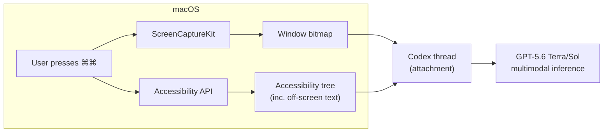
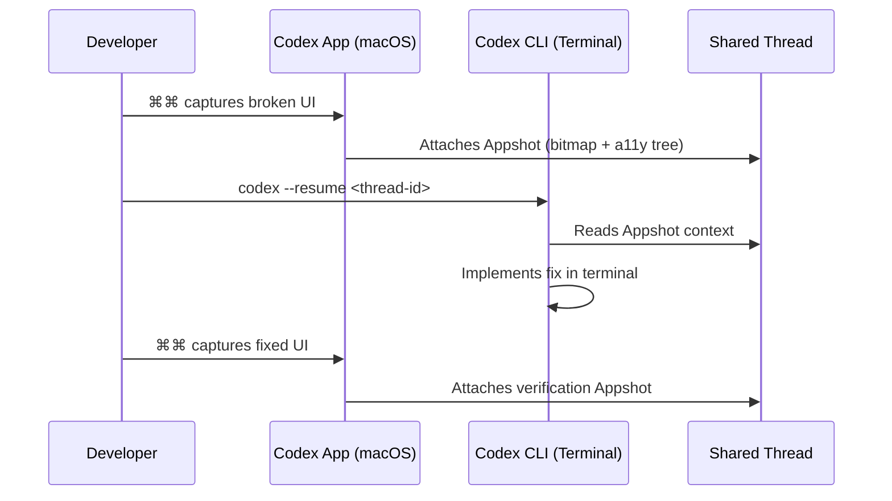

# Appshots: Context-Aware Screenshots and the Visual Context Primitive That Changes How Codex Sees Your Work


---

When OpenAI shipped Appshots on 21 May 2026, the feature looked deceptively simple: press both Command keys, and the frontmost Mac window appears in your Codex thread [^1]. Underneath that two-keystroke interaction sits a hybrid capture system that fundamentally changes how coding agents consume context — and it raises questions every senior developer should be asking about security, workflow integration, and the gap between the App and the CLI.

## Beyond the Screenshot: How Appshots Actually Works

A naive screenshot gives a model pixels. Appshots gives it pixels *and* structured semantics.

The capture path has two halves [^2]:

1. **Visual capture** via Apple's `ScreenCaptureKit` — the modern per-window bitmap API that replaced the deprecated `CGWindowListCreateImage`. It captures the frontmost window only, not the entire desktop, with configurable resolution and quality.

2. **Semantic extraction** via the macOS Accessibility APIs — specifically `NSWorkspace.frontmostApplication` and `kAXFocusedWindowAttribute`. This retrieves the accessibility tree: labels, button titles, text fields, and — crucially — content that has scrolled out of view.

The off-screen extraction is the differentiator. If you take an Appshot of a Google Doc, Codex receives the entire document text, not just the visible viewport [^3]. If you capture an API reference page, it gets the methods you haven't scrolled to yet. The model sees your application state as structured data, not as an image recognition problem.



### Where Semantic Extraction Degrades

Not all applications expose their accessibility trees equally. Well-instrumented AppKit and WebKit applications — Safari, Xcode, Mail, most native Mac apps — provide rich structured text. Custom-rendered surfaces degrade: Electron apps vary by implementation, canvas-based editors (Figma, some game engines) yield little beyond window titles, and Google Docs in Chrome captures only the visible screenshot without off-screen text in some configurations [^2].

There are no published accuracy benchmarks for either capture path, which is worth noting for any workflow that depends on completeness.

## The CLI Gap: What Terminal Developers Cannot Do

Here is the uncomfortable truth for CLI-first developers: **the Codex CLI cannot create Appshots** [^2]. The operation requires full access to macOS graphics and Accessibility APIs — system-level permissions that a terminal process does not hold.

What the CLI *can* do is resume a thread that already contains Appshots. If you press ⌘⌘ in the Codex App to capture a broken UI, then switch to the terminal to work through the fix, the CLI session inherits the visual context from the shared thread.

This creates a two-surface workflow pattern:



There is no `take_appshot` endpoint in the Codex CLI, no SDK method, and no MCP tool for programmatic triggering [^2]. If you need visual context in a pure CLI workflow, you fall back to manual screenshots pasted as image attachments — losing the off-screen semantic data that makes Appshots distinctive.

## Appshots, Computer Use, and the Visual Context Stack

Appshots arrived five weeks after Computer Use Agent (CUA) shipped on 16 April 2026 [^4]. The two features serve different purposes but compose into a visual development stack:

| Feature | Trigger | Scope | Use Case |
|---------|---------|-------|----------|
| **Appshots** | User-invoked (⌘⌘) | Point-in-time snapshot | "Here is what I see — diagnose this" |
| **Computer Use** | Agent-initiated | Continuous interaction | "Click through this app and test it" |
| **Browser Use** | Agent-initiated | In-app browser | "Open localhost:3000 and verify the layout" |

The practical rule: start with Appshots for context injection, escalate to Computer Use only when the agent needs to interact with the GUI, and use Browser Use for frontend verification loops [^5].

### Locked Computer Use: The Overnight Pattern

On the same day Appshots shipped, OpenAI released Locked Computer Use: the agent continues operating your Mac after the screen locks, pausing automatically if local input is detected [^1]. Combined with Goal Mode (which graduated to GA in the same release), this enables a workflow where you capture context with Appshots, set a multi-step goal, lock the Mac, and monitor progress from the ChatGPT mobile app via Codex Remote.

## Security Model: What Appshots Expose

Appshots carry security implications that deserve explicit consideration:

**Mitigations:**
- User-invoked only — no background capture without human action
- Single frontmost window scope — the desktop, menubar, and other windows are excluded
- Local session storage with workspace-level encryption (AES-256 at rest, TLS 1.2+ in transit) [^2]

**Gaps:**
- No automatic PII detection or field masking before transmission
- Off-screen text capture means sensitive content you have not scrolled to — credentials in a config file, private messages below the fold — gets sent to the model without a preview step
- No Appshots-specific admin disable switch for managed deployments (unlike Computer Use, which has a dedicated toggle)
- Enterprise governance relies on workspace policies and user training rather than technical controls [^2]

For teams handling sensitive data, the off-screen capture behaviour is the critical risk. A developer capturing a Slack window might inadvertently send direct messages that are in the accessibility tree but not visible on screen. ⚠️ There are no published details on whether Appshots data is used for model training or how long it persists on OpenAI's servers beyond the session.

## Configuring Appshots for Your Workflow

### Permissions Setup (macOS)

Appshots requires two system permissions [^2]:

1. **Screen & System Audio Recording** — for the `ScreenCaptureKit` bitmap capture
2. **Accessibility** — for the structured UI text extraction

Both trigger standard macOS permission dialogs on first use. The hotkey defaults to pressing both Command keys simultaneously but is rebindable in Codex settings [^3].

### Voice Integration (July 2026)

Since 23 July 2026, ChatGPT Voice on macOS can share an Appshot of the frontmost window when Screen Context is enabled [^6]. This means you can describe a bug verbally while the model simultaneously sees the application state — a hands-free context injection pattern that pairs naturally with code review and debugging workflows.

### Disabling Appshots

For managed deployments, Appshots can be disabled via workspace policy. The exact configuration key is workspace-level rather than per-user `config.toml`, which limits individual developer control [^2]. ⚠️ The precise admin policy key and format have not been publicly documented beyond the statement that managed users can be restricted.

## How Codex Compares: Visual Context Across Coding Agents

The visual context story is not unique to Codex, but the approach differs materially across tools:

| Agent | Visual Input | Semantic Extraction | Off-Screen Content | Programmatic API |
|-------|-------------|---------------------|-------------------|-----------------|
| **Codex (Appshots)** | ⌘⌘ hotkey | Accessibility tree | Yes (app-dependent) | No |
| **Cursor** | Paste/drag image | Vision model OCR | No | Yes (Agent browser) |
| **Claude Code** | Paste image in terminal | Vision model OCR | No | Screenshot tool |

Codex's advantage is the semantic layer: structured text from the accessibility tree is more reliable than OCR for dense UIs with small fonts, overlapping elements, or custom typography. The disadvantage is platform lock-in (macOS only) and the absence of a programmatic API — you cannot script Appshot capture into a CI pipeline or automated test harness.

Cursor's Agent takes a different approach: it can control a browser to take screenshots and verify visual changes [^7], giving it a closed-loop visual testing capability that Appshots alone cannot match. Claude Code's screenshot tool provides basic image input but relies entirely on the vision model for text extraction.

## Practical Patterns for Senior Developers

### Pattern 1: Visual Bug Report to Fix

```
1. ⌘⌘ on the broken UI
2. "The sidebar is overlapping the main content area on viewport widths below 1024px.
    Fix the CSS and verify."
3. Codex reads the Appshot, identifies the layout issue, edits the stylesheet
4. Browser Use opens localhost:3000 to verify the fix
```

### Pattern 2: API Documentation Context Injection

```
1. Open the API reference in Safari
2. ⌘⌘ to capture (including off-screen endpoints)
3. "Implement the batch upload endpoint using the pagination pattern shown here"
4. Codex has the full API surface, not just the visible page
```

### Pattern 3: Cross-Surface Debugging

```
1. ⌘⌘ in the Codex App to capture the error state
2. Switch to terminal: codex --resume <thread-id>
3. Debug and fix in the CLI environment
4. Return to App, ⌘⌘ to verify the fix visually
```

## What Comes Next

The absence of a programmatic Appshot API is the most significant gap. When `take_appshot` ships as a CLI command or MCP tool, visual context moves from a manual UX convenience to an automatable primitive — usable in CI pipelines, scheduled quality checks, and multi-agent visual verification loops.

Until then, Appshots remain the strongest visual context mechanism available in any coding agent, limited primarily by its macOS exclusivity and the inconsistency of accessibility tree exposure across applications. For developers who work across the Codex App and CLI, the two-surface workflow pattern — capture in the App, fix in the CLI — is the pragmatic way to get structured visual context into terminal-native agent workflows.

---

## Citations

[^1]: OpenAI Developers, "Codex Thursday: Appshots, Goal Mode GA, Locked Computer Use", X post, 21 May 2026. [https://x.com/OpenAIDevs/status/2057530207976989179](https://x.com/OpenAIDevs/status/2057530207976989179)

[^2]: Kingy AI, "Appshots: Inside OpenAI Codex's New 'Command-Command' Trick for macOS", May 2026. [https://kingy.ai/news/appshots-inside-openai-codexs-new-command-command-trick-for-macos/](https://kingy.ai/news/appshots-inside-openai-codexs-new-command-command-trick-for-macos/)

[^3]: Anthony Kroeger, "Codex just launched one of the coolest features - Appshots", X post, May 2026. [https://x.com/kr0der/status/2057728283010306227](https://x.com/kr0der/status/2057728283010306227)

[^4]: OpenAI, "Codex for (almost) everything", April 2026. [https://openai.com/index/codex-for-almost-everything/](https://openai.com/index/codex-for-almost-everything/)

[^5]: 9to5Mac, "Codex for Mac updated with new Appshots feature that instantly gives chat context", 21 May 2026. [https://9to5mac.com/2026/05/21/codex-for-mac-updated-with-new-appshots-feature-that-instantly-gives-chat-context/](https://9to5mac.com/2026/05/21/codex-for-mac-updated-with-new-appshots-feature-that-instantly-gives-chat-context/)

[^6]: OpenAI, "ChatGPT & Codex Changelog — ChatGPT Voice Screen Context", 23 July 2026. [https://developers.openai.com/codex/changelog](https://developers.openai.com/codex/changelog)

[^7]: Builder.io, "Claude Code vs Cursor: What to Choose in 2026". [https://www.builder.io/blog/cursor-vs-claude-code](https://www.builder.io/blog/cursor-vs-claude-code)
