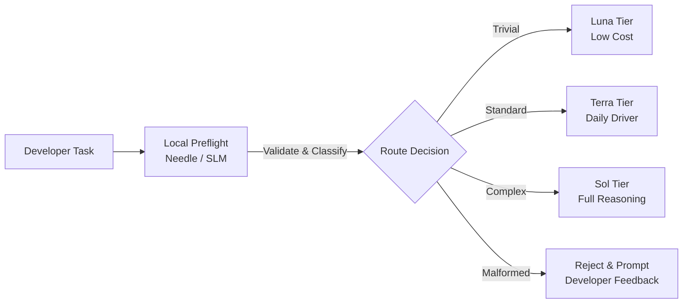
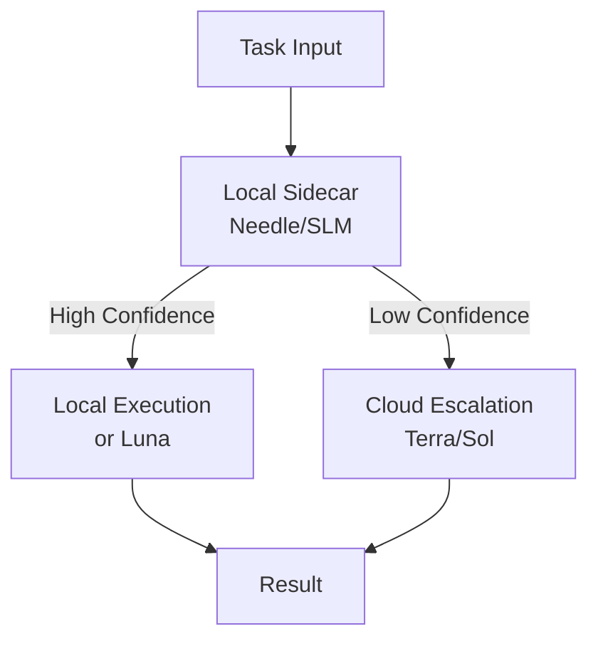
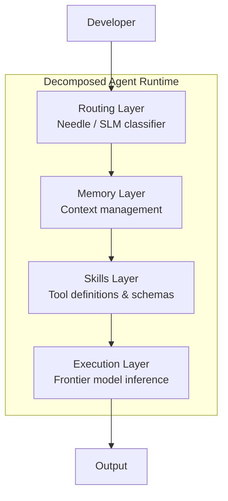

# Local Preflight for Cloud Agents: Small Models as Quality Gates for Codex CLI


---

Every `codex` invocation burns cloud tokens. A misspecified prompt, a task that should have been split, a request routed to Sol when Luna would suffice — these are all wasted inference cycles. The emerging answer is a **local preflight layer**: a small, fast model that sits between the developer and the cloud agent, validating, routing, and enriching tasks before they consume frontier compute.

This article examines the local preflight pattern, anchored by Cactus Compute's Needle model and the broader hybrid cloud-edge architecture trend shaping coding agent infrastructure in 2026.

## The Problem: Blind Dispatch

Without preflight, every task hits the cloud agent raw. Consider what goes wrong:

- **Ambiguous prompts** produce expensive clarification loops at Sol-tier pricing
- **Trivial tasks** (renaming a variable, adding a log statement) consume the same rate-limit budget as complex refactors
- **Malformed context** (wrong file paths, stale references) wastes an entire agent turn before failing
- **Over-specified routing** sends everything to the most capable tier by default

Research from Zylos AI's hybrid architecture study found that **70–80% of LLM queries in agent systems never need a frontier model** and can be handled by quantised local models instead [^1]. If even half that figure applies to coding agents, the implications for daily token budgets are significant.

## Needle: The 14 MB Preflight Engine

Cactus Compute's Needle model, released in May 2026, distils Gemini's tool-calling capability into a 26-million-parameter model weighing just 14 MB at INT4 quantisation [^2]. The architecture is deliberately minimal:

```mermaid
block-beta
  columns 1
  title["**Simple Attention Network**"]:::title
  enc["Encoder: 12 layers — GQA + RoPE"]
  dec["Decoder: 8 layers — cross-attention"]
  noff["No feed-forward layers anywhere"]
  vocab["Vocab: 8,192 BPE tokens"]
  norm["Norm: zero-centred RMSNorm"]
  res["Gated residual connections"]
  classDef title fill:#f0f0f0,stroke:#999
```

The key insight: **tool calling is fundamentally retrieval-and-assembly, not reasoning** [^3]. Needle does not need to understand code semantics — it needs to parse a task description, match it against available tool schemas, and emit a structured function call. By eliminating feed-forward layers entirely, the model achieves 6,000 tokens/second prefill and 1,200 tokens/second decode on consumer hardware [^2].

Training was remarkably efficient: 200 billion tokens of pretraining across 16 TPU v6e units in 27 hours, followed by 45 minutes of post-training on 2 billion tokens of synthesised function-call data covering 15 tool categories [^3].

### What Needle Can and Cannot Do

Needle beats FunctionGemma-270M, Qwen-0.6B, Granite-350M, and LFM2.5-350M on single-shot function calling [^2]. But its limitations are important to understand:

- **Single-shot only** — no multi-turn reasoning or conversational context
- **Always emits a call** — will produce a tool invocation even when no tool fits, requiring guard logic
- **English-dominant** — 8,192-token vocabulary limits multilingual coverage
- **Domain finetuning required** — approximately 120 examples per tool, completing in roughly ten minutes on standard hardware [^4]

## The Preflight Architecture Pattern

Sharan Babu demonstrated the pattern at OpenAI Build Week: a fine-tuned Needle model sits locally, intercepting tasks before they reach Codex [^5]. The architecture generalises into a three-stage pipeline:



### Stage 1: Task Validation

The preflight model checks whether the task is well-formed before dispatch:

- Does the referenced file exist in the current worktree?
- Is the task description specific enough to be actionable?
- Are there conflicting instructions that would cause the agent to loop?

A quantised 3B model (Llama 3.2 3B or Phi-4-mini) handles this effectively at sub-10ms time-to-first-token on a modern GPU [^1].

### Stage 2: Complexity Classification

The preflight layer classifies the task into a complexity tier. This directly maps to Codex CLI's model routing:

```toml
# config.toml — model routing informed by preflight classification
[model]
default = "terra"     # Standard tasks: daily driver

[model.overrides]
trivial = "luna"      # Rename, format, simple edits
complex = "sol"       # Architecture, security review, multi-file refactors
```

The classification does not need to be perfect — it needs to be directionally correct. Routing a complex task to Terra wastes one attempt before escalation; routing a trivial task to Sol wastes money but produces a correct result. The asymmetry favours conservative classification with cloud-side fallback.

### Stage 3: Context Enrichment

Before dispatch, the preflight layer can inject relevant context that the developer might have omitted:

- Relevant `AGENTS.md` sections for the target directory
- Recent git history for the affected files
- Related test file paths
- Active lint rules or type-checking configuration

This reduces the cloud agent's cold-start overhead and decreases the likelihood of a wasted first turn.

## Production Routing Patterns

The Zylos AI research identifies four production-grade routing patterns for hybrid architectures [^1]:

### Sidecar Model

The local model runs alongside the agent process. Every task passes through it; the cloud serves as fallback when confidence is low.



### Confidence Cascade

Models self-report uncertainty. If the local model's output confidence falls below a threshold, the request automatically escalates to the next tier. This proves particularly effective — practitioner reports put the share of tasks retained in the efficient local lane at **80–90%** [^6].

### Privacy-Tiered Routing

Data sensitivity determines routing regardless of task complexity. Code containing credentials, PII, or proprietary algorithms stays on local inference; everything else can use cloud tiers. This pattern gains urgency with the EU AI Act taking effect on 2 August 2026 [^1].

### Inference Gateway

A centralised routing service (LiteLLM or Bifrost) manages all tier decisions, adding unified logging and audit trails at the cost of a network hop.

## Cost Impact

The economics are straightforward. Zylos AI's research found that organisations processing 1 million monthly agent tasks save approximately 70% by routing 70% of calls locally — dropping from \$48K–\$240K/month to \$14K–\$72K/month [^1]. For individual developers, the maths scales proportionally: reclaiming rate-limit headroom for tasks that genuinely need frontier reasoning. Hardware breakeven occurs within 1–2 months; for developers already running Ollama or LM Studio, the marginal cost is effectively zero.

## Implementing a Preflight Layer for Codex CLI

A minimal preflight implementation using Needle and Codex CLI's exec mode:

```bash
#!/bin/bash
# preflight.sh — local task validation before codex dispatch

TASK="$1"
COMPLEXITY=$(needle classify --task "$TASK" --schema tools.json 2>/dev/null)

case "$COMPLEXITY" in
  trivial)
    codex exec --model luna --sandbox workspace-write "$TASK"
    ;;
  standard)
    codex exec --model terra --sandbox workspace-write "$TASK"
    ;;
  complex)
    codex exec --model sol --sandbox workspace-write "$TASK"
    ;;
  malformed)
    echo "Task rejected by preflight: $TASK"
    echo "Suggestion: $(needle suggest --task "$TASK")"
    exit 1
    ;;
esac
```

For tighter integration, wrap the preflight in a Python script that calls Needle's API directly:

```python
from needle import SimpleAttentionNetwork, load_checkpoint, generate

model = load_checkpoint("cactus-compute/needle")

def preflight(task: str, tools: list[dict]) -> dict:
    """Classify and validate a task before cloud dispatch."""
    result = generate(
        model,
        prompt=f"Classify this coding task: {task}",
        tools=tools,
        max_tokens=256,
    )
    # Guard: Needle always emits a call — validate the output
    if result.tool_name not in [t["name"] for t in tools]:
        return {"action": "reject", "reason": "No matching tool"}
    return result
```

⚠️ The Needle Python API shown above is illustrative. The actual API may differ — consult the [Needle repository](https://github.com/cactus-compute/needle) for current usage patterns.

## When Preflight Hurts

The pattern is not universally beneficial. Preflight adds overhead in interactive sessions (the classification step disrupts conversational flow), uniform-complexity workloads (the preflight becomes a no-op tax), and single-model configurations (classification without routing options is pointless). If fewer than 30% of your tasks are trivially classifiable, the overhead likely exceeds the savings.

## The Broader Pattern: Agent Runtime Decomposition

Needle is part of what the Agentic Digest calls the **agent runtime decomposition** pattern visible across 2026's trending projects [^4]. Rather than monolithic agents that handle everything, the stack is separating into specialised layers:



Each layer can be independently optimised, scaled, and — critically — **priced differently**. The routing layer runs locally for free. Memory can be local or cloud-synced. Skills are static definitions. Only the execution layer requires frontier inference, and even there, the preflight has already ensured it receives well-formed, correctly-routed input.

This mirrors a pattern familiar from distributed systems: the further you push validation toward the edge, the less wasted work happens at the centre.

## Practical Recommendations

1. **Start with classification, not generation.** A local model classifying tasks into three tiers (trivial/standard/complex) delivers 80% of the value with 20% of the complexity.

2. **Use Needle for tool routing, SLMs for validation.** Needle excels at matching tasks to tool schemas. For validating file references, checking prompt quality, or enriching context, a 3B model like Phi-4-mini or Llama 3.2 3B is more appropriate [^6].

3. **Implement the guard pattern.** Needle always emits a tool call. Your preflight wrapper must validate that the emitted call is sensible before dispatch.

4. **Measure your task distribution first.** Profile a week of Codex usage to understand your trivial/standard/complex split before investing in preflight infrastructure.

5. **Keep the preflight stateless.** The local model should not maintain conversation history — that is the cloud agent's job. The preflight is a pure function: task in, classification out.

## Citations

[^1]: Zylos AI Research, "Local-First AI Agents: Hybrid Cloud-Edge Architectures for Privacy, Latency, and Cost Optimization," May 2026. [https://zylos.ai/research/2026-05-10-local-first-ai-agents-hybrid-cloud-edge-architectures/](https://zylos.ai/research/2026-05-10-local-first-ai-agents-hybrid-cloud-edge-architectures/)

[^2]: Cactus Compute, "Needle: Foundation model for tiny devices," GitHub repository, May 2026. [https://github.com/cactus-compute/needle](https://github.com/cactus-compute/needle)

[^3]: Cactus Compute, "Needle: We Distilled Gemini Tool Calling into a 26M Model," Cactus Compute blog, May 2026. [https://cactuscompute.com/blog/needle](https://cactuscompute.com/blog/needle)

[^4]: Andrew.ooo, "Needle Review: 26M Function-Calling Model for Edge Devices," 2026. [https://andrew.ooo/posts/needle-26m-function-calling-model-review/](https://andrew.ooo/posts/needle-26m-function-calling-model-review/)

[^5]: Sharan Babu, "Before the Agent — A Local Preflight for Codex," OpenAI Build Week presentation, 2026. [https://www.youtube.com/watch?v=_K-tNvFSxKI](https://www.youtube.com/watch?v=_K-tNvFSxKI)

[^6]: Digital Applied, "Small Language Models for On-Device Agents in 2026," 2026. [https://www.digitalapplied.com/blog/small-language-models-on-device-agents-2026-guide](https://www.digitalapplied.com/blog/small-language-models-on-device-agents-2026-guide)
