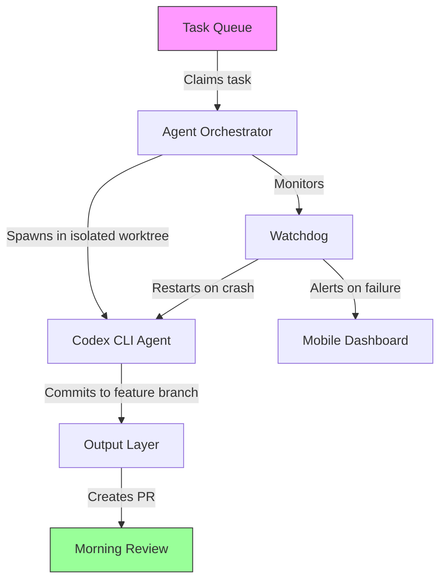

# The Overnight Agent Pattern: Infrastructure for Continuous Autonomous Development with Codex CLI


---

The idea is seductive: push a queue of tasks to your coding agent, close the laptop, and wake to a stack of pull requests. The "overnight agent" pattern — continuous, unsupervised agent execution on a remote server — has moved from novelty to production practice in 2026. Greptile's analysis of millions of merged PRs found that fully autonomous agents now author 27.6% of merged pull requests, up from 0.86% in February 2025 [^1]. That thirty-fold increase was not driven by better models alone. It was driven by infrastructure: the scheduling, isolation, monitoring, and safety tooling that makes unattended execution viable.

This article documents the overnight agent pattern as implemented with Codex CLI, covering the primitives (`codex exec`, Goal Mode, worktree isolation), the infrastructure layer (VPS provisioning, cron scheduling, fleet orchestration), and the safety guardrails that determine whether you wake to clean PRs or a repository fire.

## The Core Primitives

### codex exec: Headless Execution

The `codex exec` subcommand strips away the interactive TUI and runs the agent as a headless process [^2]. This is the atomic unit of overnight work:

```bash
codex exec "Add unit tests for auth/login.py — target 90% branch coverage" \
  --sandbox workspace-write \
  -o /tmp/result.md
```

Progress streams to `stderr`; only the final agent message reaches `stdout`. Key flags for overnight use:

| Flag | Purpose |
|------|---------|
| `--sandbox workspace-write` | Permits file edits within the repo only |
| `--json` | Emits JSONL event stream for machine parsing |
| `--ignore-user-config` | Prevents local dev config bleeding into automation |
| `--ephemeral` | Prevents persisting session rollout files |
| `-o <path>` | Writes final message to a file for review |

Exit codes carry semantic meaning: a non-zero exit signals task failure, making `codex exec` composable with shell scripts and CI runners [^2].

### Goal Mode: Long-Horizon Persistence

For tasks that span hours rather than minutes, Goal Mode (`/goal`) provides an autonomous loop: plan, act, test, review, iterate — repeating until the objective is met or the token budget is exhausted [^3]. Introduced in v0.128.0 (April 2026) and moved to GA on 21 May 2026, Goal Mode adds two properties that `codex exec` lacks:

1. **Session persistence** — a paused goal is persisted server-side, surviving terminal closure and laptop shutdown. Resume the next morning with `/goal resume`.
2. **Token budgets** — hard caps prevent runaway spending. Rough framework: small goals (single-module refactor, ~20 files) need 50K–150K tokens; medium goals (cross-module migration, ~50 files) need 150K–500K; large goals (codebase-wide, 100+ files) need 500K–2M+ [^3].

```toml
# config.toml — overnight goal profile
[profiles.overnight]
model = "gpt-5.6-terra"
approval_policy = "on-request"
sandbox_mode = "workspace-write"
```

### Worktree Isolation

Every overnight agent needs its own branch and working directory. Git worktrees provide this without duplicating the repository:

```bash
git worktree add ../myapp-auth-tests feature/auth-tests
git worktree add ../myapp-ts-migration feature/ts-migration
```

Each agent writes to an isolated worktree. The worst-case blast radius is "delete one branch," never "restore entire repository" [^4].

## Infrastructure Architecture

The overnight agent pattern follows a four-layer architecture:



### Layer 1: Task Queue

A SQLite-backed queue ensures atomic task claiming — no two agents pick the same work [^4]. Tasks follow the "sleeping test": *can I verify this task's output in under two minutes in the morning?* If not, the task is too vague.

Good overnight tasks are atomic and verifiable:

- "Add unit tests for `auth/login.py` — target 90% branch coverage"
- "Fix bug #142: login form double-submits on slow connections"
- "Migrate `utils/date.ts` from Moment.js to Temporal API"

Avoid open-ended prompts like "improve test coverage" or "refactor the codebase" — these invite agent drift [^4].

### Layer 2: Agent Orchestrator

Leon van Zyl's pattern — running Codex agents on a VPS with staggered cron jobs — has become the reference architecture [^5]. A minimal setup on a cloud VM:

```bash
#!/bin/bash
# overnight-run.sh — staggered agent launcher

TASKS=("auth-tests" "ts-migration" "api-docs" "dep-upgrade")
REPO_DIR="/home/dev/myapp"

for task in "${TASKS[@]}"; do
  WORKTREE="${REPO_DIR}-${task}"

  # Create isolated worktree if it doesn't exist
  if [ ! -d "$WORKTREE" ]; then
    git -C "$REPO_DIR" worktree add "$WORKTREE" -b "agent/${task}"
  fi

  # Launch agent in background
  cd "$WORKTREE"
  CODEX_API_KEY="$API_KEY" codex exec \
    "$(cat /home/dev/tasks/${task}.md)" \
    --sandbox workspace-write \
    --json \
    2>> "/var/log/codex/${task}.log" &

  # Stagger starts to avoid rate-limit cascades
  sleep 15
done

wait
```

Schedule via cron for overnight execution:

```bash
# Run at 11pm, Monday to Friday
0 23 * * 1-5 /home/dev/overnight-run.sh >> /var/log/codex/cron.log 2>&1
```

### Layer 3: Monitoring and Recovery

The self-healing watchdog handles three critical failure modes [^4]:

| Failure | Detection | Recovery |
|---------|-----------|----------|
| Context overflow | Token count exceeds limit | Auto-trigger compaction |
| Agent crash | Process exit with non-zero code | Restart session, replay last message |
| Stuck agent | No progress for N minutes | Kill and reschedule task |

### Layer 4: Output and Review

Morning review follows a triage pattern:

1. **Dashboard check** (2 min) — green/amber/red status per agent
2. **Quick-accept** (10 min) — run tests for simple tasks, merge if clean
3. **Deep review** (20–30 min) — read agent reasoning, review diffs, run full suite
4. **Cleanup** (5 min) — delete worktrees, mark tasks done

Total: 30–45 minutes to process 8–12 developer-hours of overnight output [^4].

## Fleet Sizing and Economics

| Environment | Agent Capacity | Primary Bottleneck |
|-------------|---------------|-------------------|
| Laptop (16 GB) | 5–7 agents | RAM, API rate limits |
| Cloud VM (4 cores, 16 GB) | 20–30 agents | API rate limits |
| Cloud VM (8+ cores, 32 GB) | 50+ agents | Cost |

Model routing matters for overnight economics. Use GPT-5.6 Luna for straightforward tasks (tests, documentation, dependency upgrades) and GPT-5.6 Terra or Sol for judgement-heavy work (migrations, security reviews, architecture changes) [^4].

```toml
# config.toml — model routing by task tier
[profiles.overnight-cheap]
model = "gpt-5.6-luna"
approval_policy = "unless-allow-listed"
sandbox_mode = "workspace-write"

[profiles.overnight-premium]
model = "gpt-5.6-terra"
approval_policy = "on-request"
sandbox_mode = "workspace-write"
```

## Safety Guardrails

Overnight agents without guardrails are a liability, not an asset. Greptile's data shows that while autonomous agents achieve lower revert rates than humans (Codex: 1.19 per 1K PRs vs human: 2.72), they exhibit specific failure signatures — elevated configuration bugs for Codex (1.35×) and missing tenant isolation checks for Claude (1.75×) [^1].

### AGENTS.md as Overnight Constitution

```markdown
# AGENTS.md — overnight safety rules

## Restrictions
- Do NOT modify files in `src/auth/`, `src/payments/`, or `infra/`
- Do NOT add or remove dependencies
- Do NOT modify CI/CD configuration
- All changes MUST pass `npm test` before committing

## Commit Behaviour
- Commit after each completed sub-task
- Use conventional commit format: `feat:`, `fix:`, `test:`
- Never force-push
```

### Pre-Commit Hooks as Safety Net

Pre-commit hooks enforce quality gates that the agent cannot bypass:

```bash
#!/bin/bash
# .git/hooks/pre-commit
npm test || exit 1
npm run lint || exit 1
npm run typecheck || exit 1
```

### Network Isolation

Overnight agents should never have unrestricted network access. The `workspace-write` sandbox mode combined with domain allowlisting restricts outbound connections:

```toml
[profiles.overnight]
sandbox_mode = "workspace-write"
# Network disabled by default in workspace-write mode
```

## The Karpathy Pattern: Metric-Driven Loops

Andrej Karpathy's AutoResearch project demonstrated a particularly powerful variant of the overnight pattern: give an agent an objective metric, a codebase, and boundaries for what it can change, then let it loop autonomously [^6]. His first session produced 89 experiments in 7.5 hours — 15 kept, 74 discarded, zero crashes. Over two days, 700 experiments yielded 20 optimisations that measurably improved training loss.

The pattern works because it eliminates the vagueness problem: the agent has a numeric objective (lower loss), an automatic verification gate (run training, measure loss), and a clear rollback mechanism (revert if worse).

⚠️ Note: Karpathy filed an issue noting that Codex "ignores instruction to never stop," making it less reliable than Claude Code for autoresearch-style indefinite loops [^6]. Goal Mode's token budget caps partially address this, but the underlying compliance gap remains a consideration for truly open-ended overnight work.

## What Goes Wrong

The failure modes of overnight agents are well-documented [^4]:

| Problem | Root Cause | Mitigation |
|---------|-----------|------------|
| Agent loops retrying same approach | Ambiguous task specification | Add fallback instructions; set max-iteration limits |
| Context exhaustion | Long-running task fills context window | Break into sub-tasks; commit frequently |
| Rate-limit cascades | Simultaneous API calls from fleet | Stagger agent starts by 15–30 seconds |
| Git conflicts | Overlapping file scope across agents | Assign non-overlapping file boundaries per worktree |
| "Confidently wrong" code | Insufficient edge-case testing | Require existing test suite to pass; review agent-written tests |
| Runaway costs | No budget enforcement | Use Goal Mode token budgets; set `--max-cost` flags |

## Codex-Action: The GitHub-Native Alternative

For teams already invested in GitHub Actions, `codex-action` provides overnight agent execution without managing VPS infrastructure [^7]:


```yaml
# .github/workflows/overnight-agents.yml
name: Overnight Agent Run
on:
  schedule:
    - cron: '0 23 * * 1-5'  # 11pm weekdays

jobs:
  agent-tasks:
    runs-on: ubuntu-latest
    strategy:
      matrix:
        task: [auth-tests, api-docs, dep-upgrade]
    steps:
      - uses: actions/checkout@v4
      - uses: openai/codex-action@v1
        with:
          prompt-file: .github/tasks/${{ matrix.task }}.md
          model: gpt-5.6-terra
          sandbox: workspace-write
```


This trades VPS operational burden for GitHub Actions minute costs and removes the need for custom watchdogs — GitHub handles retry, timeout, and logging natively.

## When Not to Use Overnight Agents

The pattern has clear boundaries. Do not delegate overnight:

- **Deployment pipelines** — the blast radius is production
- **Authentication or payment code** — security-critical paths require human review
- **Database migrations** — irreversible changes need interactive oversight
- **Architectural decisions** — multi-system trade-offs require context agents lack
- **Anything without automated tests** — if you cannot verify the output mechanically, you cannot verify it at 3am

The overnight agent pattern is infrastructure, not magic. It works when tasks are atomic, verifiable, and bounded. It fails when tasks require judgement, context, or access to systems where mistakes are expensive.

---

## Citations

[^1]: Greptile. "Rise of the Overnight Agents." Greptile Blog, 2026. [https://www.greptile.com/blog/rise-of-the-overnight-agents](https://www.greptile.com/blog/rise-of-the-overnight-agents)

[^2]: OpenAI. "Non-interactive mode." Codex CLI Documentation, 2026. [https://learn.chatgpt.com/docs/non-interactive-mode](https://learn.chatgpt.com/docs/non-interactive-mode)

[^3]: OpenAI. "Goal Mode: Persistent Objectives with Token Budgets." Codex Documentation, 2026. [https://developers.openai.com/codex/goal-mode](https://developers.openai.com/codex/goal-mode)

[^4]: amux. "The Complete Guide to Running AI Coding Agents Overnight." amux.io, 2026. [https://amux.io/guides/ai-coding-agents-overnight/](https://amux.io/guides/ai-coding-agents-overnight/)

[^5]: Leon van Zyl. "These AI Agents Improve My App Every 10 Minutes While I Sleep." YouTube, 2026. [https://www.youtube.com/watch?v=X_oW2ZNJfcM](https://www.youtube.com/watch?v=X_oW2ZNJfcM)

[^6]: Andrej Karpathy. "autoresearch." GitHub, 2026. See also: The New Stack, "Karpathy's autonomous experiment loop," 2026. [https://thenewstack.io/karpathy-autonomous-experiment-loop/](https://thenewstack.io/karpathy-autonomous-experiment-loop/)

[^7]: OpenAI. "codex-action." GitHub Actions for Codex CLI, 2026. [https://github.com/openai/codex-action](https://github.com/openai/codex-action)
