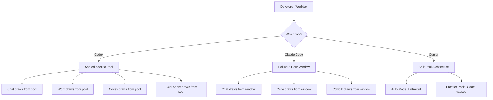

# Usage Pool Architecture as Competitive Advantage: Why Rate Limits Matter More Than Benchmarks for Daily Coding Agent Productivity


---

The coding agent discourse fixates on benchmarks. SWE-bench Verified scores, Terminal-Bench 2.0 rankings, and head-to-head comparisons dominate developer decision-making. But here is a claim that the data increasingly supports: **usage pool architecture — how your subscription allocates, shares, and resets capacity — determines daily productivity more than any model score.**

A developer who hits a rate limit at 2 p.m. produces zero output regardless of whether their agent scores 96% on SWE-bench. This article maps the usage pool architectures of Codex, Claude Code, and Cursor as of August 2026, identifies the structural trade-offs, and provides configuration strategies for sustained throughput.

## The Shared Pool Problem

Every major coding agent now runs on some form of usage-based billing. The architectural question is: **what shares a pool with what?**

### Codex: The Agentic Mega-Pool

Codex, ChatGPT Work, ChatGPT for Excel, and Workspace Agents all draw from a single metered usage pool [^1]. This is OpenAI's deliberate design: one subscription, one budget, all agentic surfaces. The rationale is simplicity — developers do not need to track separate quotas. The risk is contention.

On 12 July 2026, OpenAI temporarily removed the rolling 5-hour usage window for Plus, Pro, and Business plans [^2]. The weekly aggregate limit remained. The removal lasted seventeen days before being reinstated on 29 July, accompanied by an 18% efficiency improvement to GPT-5.6 Sol that stretches usage further within the same budget [^3].

Plan allocations differ dramatically:

| Plan | Monthly Cost | Weekly Multiplier | Pool Scope |
|------|-------------|-------------------|------------|
| Plus | \$20 | 1× | Shared across all agentic features |
| Pro 5× | \$100 | 5× | Same shared pool, higher ceiling |
| Pro 20× | \$200 | 20× | Same shared pool, highest ceiling |
| Business | \$20/seat | Per-workspace | Codex seats frozen since 24 June 2026 |
| Enterprise | Custom | Org-wide credit pool | Pay-per-use, no fixed caps |

The credit system, which replaced per-message billing on 2 April 2026 [^4], prices models by tier: Sol at 125 credits per million input tokens (12.5 cached), Terra at 62.5 (6.25 cached), and Luna at 25 (2.5 cached). A single Sol task can consume 5–40 credits depending on complexity. Five minutes of Sol in Ultra mode has been observed to drain a Plus account from 70% to fully depleted [^1].

### Claude Code: The Rolling Window

Anthropic takes a different approach. Claude Code shares a rolling 5-hour session limit with Claude.ai chat and Cowork [^5]. The key distinction: this is a **message-count window**, not a credit pool. Pro users get roughly 45 messages per window; Max 5× gets 225; Max 20× gets 900.

On 6 May 2026, Anthropic doubled these limits across Pro, Max, Team, and seat-based Enterprise plans, and removed peak-hour reductions [^5]. The practical effect: a Pro user now gets roughly 90 effective messages per 5-hour window when using Claude Code, but that same window serves chat, Code, and Cowork.

The rolling window creates a fundamentally different consumption dynamic. Where Codex's credit pool can be drained by a single expensive task, Claude Code's message-based system means each interaction costs roughly the same regardless of complexity. The downside: long, multi-step agent sessions can exhaust message counts quickly even on inexpensive tasks.

### Cursor: The Split Pool

Cursor introduced the most nuanced architecture in June 2026, splitting Teams usage into two separate pools [^6]:

1. **Composer and Auto pool** — draws on Cursor's first-party models (unlimited on all paid plans in Auto mode)
2. **Third-party API pool** — burns the dollar-denominated usage pool only when you manually select a frontier model (Claude Opus, GPT-5.6 Sol) or run Max Mode

This split is architecturally significant. Auto mode — which handles the majority of daily coding tasks — never touches the premium pool. Only explicit frontier model selection incurs costs. The result: Cursor users rarely hit limits during routine development.

| Plan | Monthly Cost | Auto Mode | Frontier Pool |
|------|-------------|-----------|---------------|
| Pro | \$20 | Unlimited | \$20 pool |
| Pro+ | \$60 | Unlimited | \$60 pool |
| Ultra | \$200 | Unlimited | \$200 pool |
| Teams | \$40/seat | Unlimited | Shared pool across seats |

## Why Architecture Matters More Than Price

The headline prices look comparable — \$20/month entry across all three tools. But the **effective throughput** varies enormously because of pool architecture:



**Codex's vulnerability** is contention. A team member using ChatGPT Work for document drafting in the morning can materially reduce the Codex budget available for afternoon coding sessions. This is particularly acute on Plus plans where the weekly multiplier is 1×.

**Claude Code's vulnerability** is the message-count ceiling. Complex agent sessions involving many tool calls burn through the rolling window faster than simple chat interactions, creating an inverse relationship between task complexity and available capacity.

**Cursor's advantage** is the unlimited Auto mode floor. For routine development — the bulk of any workday — capacity is effectively uncapped. The premium pool is reserved for tasks that genuinely require frontier reasoning.

## The Banked Reset Mechanism

OpenAI introduced a novel mechanism: **banked resets** — on-demand quota refreshes that users can deploy manually rather than waiting for automatic weekly resets [^1]. Each banked reset expires 30 days after grant and does not increase total quota; it only provides timing control.

This is a meaningful innovation. A developer facing a deadline can burn a banked reset at 3 p.m. on Tuesday rather than waiting for the natural Friday reset. The tactical value is real, though it encourages usage-burst patterns that may not represent sustainable throughput.

Neither Claude Code nor Cursor offers an equivalent mechanism. Claude Code's rolling window resets naturally every 5 hours. Cursor's unlimited Auto mode makes resets largely unnecessary.

## Configuration Strategies for Sustained Throughput

### Codex CLI: Model-Tier Routing

The most effective Codex strategy is aggressive model-tier routing. Luna's 80% price reduction on 30 July 2026 [^7] makes it viable for the majority of coding tasks, preserving Sol budget for complex architectural work.

```toml
# ~/.codex/config.toml — budget-conscious profile

[profile.daily]
model = "gpt-5.6-luna"

[profile.daily.agents]
default_subagent_model = "gpt-5.6-luna"

[profile.architecture]
model = "gpt-5.6-sol"
```

Luna at 25 credits per million input tokens consumes one-fifth of Sol's budget. A developer switching 80% of tasks to Luna extends their weekly allocation by roughly 4×.

The auto-review upgrade to GPT-5.6 Luna, announced in early August 2026, also reduces Guardian overhead by approximately 10× [^3], meaning the safety layer no longer disproportionately drains the shared pool.

### Claude Code: Window-Aware Task Batching

Claude Code users should batch complex agent sessions and schedule them to align with window boundaries. The rolling 5-hour reset means a developer who exhausts their window at 10 a.m. regains full capacity by 3 p.m. — enough for an afternoon session.

The Max 20× plan at \$200/month provides roughly 900 messages per window. For comparison, a typical multi-file refactoring session consumes 30–50 messages. This gives power users 18–30 substantial sessions per 5-hour window — generally sufficient for a full workday.

### Cursor: Staying in Auto

Cursor's optimal strategy is straightforward: **stay in Auto mode unless you have a specific reason to select a frontier model.** Auto mode handles the vast majority of coding tasks competently and never touches the premium pool. Reserve manual model selection for:

- Security-sensitive code review (where frontier reasoning justifies the cost)
- Complex architectural decisions requiring extended reasoning
- Debugging production incidents where accuracy outweighs speed

## The API Key Escape Hatch

All three tools offer an escape from subscription pools through direct API access. Codex CLI authenticated with an OpenAI API key bills through the OpenAI Platform rather than the ChatGPT subscription [^4]. Claude Code supports Anthropic API keys. Cursor supports BYOK (bring your own key) configurations.

API pricing removes the pool constraint entirely — you pay per token with no weekly ceiling. For heavy users, this can be more economical than subscription plans:

- A developer consuming \$150/month in API tokens pays less than Pro 20× (\$200) whilst facing no weekly limits
- API usage supports prompt caching (platform-wide cache hit rates have risen from 52% to 86% in 2026 [^8]), further reducing effective costs
- No contention with chat, Work, or other agentic surfaces

The trade-off: API billing lacks the predictability of fixed subscriptions, and costs can spike during intensive sessions. The `max_tokens` budget guard in Codex CLI's `config.toml` mitigates this risk.

## The Competitive Implication

Usage pool architecture is becoming a decisive factor in enterprise adoption. Gartner estimates the enterprise AI coding agents market at \$9.8–11.0 billion annualised as of April 2026 [^8], with average per-engineer costs of \$92/month. At those volumes, pool architecture determines whether an organisation's investment delivers sustained productivity or periodic blackouts.

Cursor's split-pool model currently offers the most sustainable architecture for daily throughput. Codex's shared mega-pool trades simplicity for contention risk, partially mitigated by model-tier routing and banked resets. Claude Code's rolling window offers natural recovery but penalises complex multi-step sessions.

The deeper strategic question: as coding agents absorb more of the development workflow — OpenAI reports 99.8% of internal output tokens now flow through Codex [^9] — the pool that runs dry first loses the developer for the rest of the day. Benchmarks measure capability. Usage pools measure availability. For daily productivity, availability wins.

## Citations

[^1]: ChatForest, "OpenAI Pulls the 5-Hour Wall: Codex Limit Temporarily Removed, But the Shared Agentic Credit Pool Problem Remains," July 2026. [https://chatforest.com/builders-log/openai-codex-5-hour-limit-removed-shared-agentic-credit-pool-builder-guide/](https://chatforest.com/builders-log/openai-codex-5-hour-limit-removed-shared-agentic-credit-pool-builder-guide/)

[^2]: Digital Trends, "OpenAI just took the handcuffs off your ChatGPT Work and Codex usage limits," July 2026. [https://www.digitaltrends.com/computing/openai-just-took-the-handcuffs-off-your-chatgpt-work-and-codex-usage-limits-at-least-for-now/](https://www.digitaltrends.com/computing/openai-just-took-the-handcuffs-off-your-chatgpt-work-and-codex-usage-limits-at-least-for-now/)

[^3]: Releasebot, "OpenAI Release Notes — August 2026 Latest Updates," August 2026. [https://releasebot.io/updates/openai](https://releasebot.io/updates/openai)

[^4]: OpenAI, "Codex rate card," 2026. [https://help.openai.com/en/articles/20001106-codex-rate-card](https://help.openai.com/en/articles/20001106-codex-rate-card)

[^5]: Morphllm, "Claude Code Usage Limits (2026): 5-Hour Caps Doubled May 6, Weekly Limits by Plan," 2026. [https://www.morphllm.com/claude-code-usage-limits](https://www.morphllm.com/claude-code-usage-limits)

[^6]: Cursor, "Cursor Usage Limits: Pro Plan & Rate Caps (2026)," 2026. [https://www.usecarly.com/blog/cursor-usage-limits/](https://www.usecarly.com/blog/cursor-usage-limits/)

[^7]: Digital Applied, "GPT-5.6 Week One: Usage Pools, Access Tiers, Rollout Fixes," July 2026. [https://www.digitalapplied.com/blog/gpt-5-6-week-one-usage-pools-access-rollout-2026](https://www.digitalapplied.com/blog/gpt-5-6-week-one-usage-pools-access-rollout-2026)

[^8]: Gartner, "Enterprise AI Coding Agents: 2026 Market Guide & Trends," 2026. [https://www.gartner.com/en/articles/enterprise-ai-coding-agent-market](https://www.gartner.com/en/articles/enterprise-ai-coding-agent-market)

[^9]: OpenAI, "How agents are transforming work," June 2026. [https://openai.com/index/how-agents-are-transforming-work/](https://openai.com/index/how-agents-are-transforming-work/)
