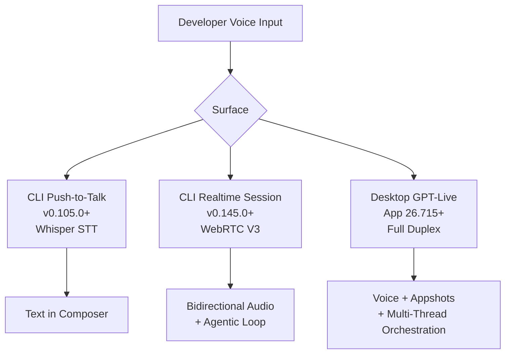
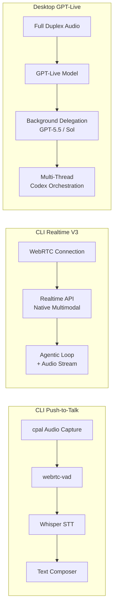

# Voice-Driven Development: From Push-to-Talk to Full-Duplex GPT-Live in Codex


---

Six months ago, voice input for coding agents meant holding the spacebar and hoping Whisper caught your variable names. Today, GPT-Live streams full-duplex audio through the Codex desktop app while simultaneously steering multi-threaded coding agents. The distance between those two points tells us something important about where the developer–agent interface is heading.

This article traces the voice stack from CLI transcription through Realtime V3, maps the three distinct voice surfaces now available to Codex developers, and examines where voice genuinely accelerates development — and where it remains a liability.

## The Three Voice Surfaces

Codex now exposes voice interaction through three architecturally distinct surfaces, each with different trade-offs.



### 1. CLI Push-to-Talk (February 2026)

Codex CLI gained native voice transcription in v0.105.0 on 26 February 2026 [^1]. The implementation is deliberately simple: hold the spacebar on an empty composer, speak, release. Whisper transcribes your speech into text that appears as though you had typed it.

Under the hood, the audio capture uses `cpal` (a Rust cross-platform audio crate) with `webrtc-vad` for voice activity detection in aggressive mode with 200ms padding [^1]. A one-second minimum clip duration prevents accidental triggers. The space-hold timeout was later increased to one second to avoid false starts when the composer already contains text.

Enable it in `config.toml`:

```toml
[features]
voice_transcription = true
```

This surface is pure dictation — voice-to-text, nothing more. The agent never hears your voice; it receives text. That constraint is also its strength: it works in headless environments, over SSH, and in containers where no speaker exists.

### 2. CLI Realtime Sessions (March–July 2026)

The `[realtime]` configuration block landed on 13 March 2026, introducing two modes [^2]:

```toml
[realtime]
type = "conversational"   # or "transcription"
```

**Transcription mode** is push-to-talk with server-side Whisper — useful when you want better transcription quality than the local path provides, at the cost of a network round trip.

**Conversational mode** opens a persistent bidirectional audio connection. The agent can speak back. Version 0.119.0 (10 April 2026) migrated the transport to WebRTC V2 as the default, and version 0.145.0 (21 July 2026) introduced streaming Realtime V3 conversations with audio inputs alongside tool outputs [^3]. This means the voice session now runs in parallel with the agentic tool-use loop — you can talk to the agent while it executes shell commands, and it can narrate what it is doing.

Audio device configuration persists under a top-level `[audio]` section:

```toml
[audio]
microphone = "MacBook Pro Microphone"
speaker = "MacBook Pro Speakers"
```

If a configured device becomes unavailable, Codex falls back to system defaults [^2].

### 3. Desktop GPT-Live (July 2026)

On 23 July 2026, OpenAI shipped ChatGPT Voice in the desktop app (build 26.715), wired directly into Codex and ChatGPT Work [^4]. This is architecturally different from the CLI's realtime sessions.

GPT-Live uses a continuous audio model capable of listening and speaking simultaneously — full-duplex, not turn-based [^5]. Complex reasoning is delegated to background models (currently GPT-5.5), while the voice model handles conversational flow. On macOS, the desktop app incorporates Appshots for screen context, meaning you can say "look at this error" and the voice model sees your frontmost window [^4].

The critical capability: you can speak a single instruction and watch multiple coding agents spin up, investigate, and report back while you keep talking [^5]. Voice becomes the orchestration layer for multi-threaded agent work.

## Where Voice Accelerates Development

Voice input at 150 words per minute versus typing at 40 represents a nearly fourfold throughput increase for natural-language instructions [^6]. But raw speed only matters for certain task shapes.

### High-Level Orchestration

Voice excels when you are directing work rather than specifying it precisely. "Run the authentication tests, and while those are running, start refactoring the payment module to use the new Stripe SDK" is faster spoken than typed, and the full-duplex desktop surface can act on both tasks simultaneously.

### Code Review and Debugging

Speaking through a bug report while the agent sees your screen (via Appshots) compresses the feedback loop. Instead of typing a description of the error, you narrate: "This endpoint returns a 500 when the user has no billing address — can you trace through the handler and find where we're not null-checking?" The voice model receives both your narration and the visual context.

### Architecture and Design Conversations

Conversational mode in the CLI turns the agent into a pair-programming partner you can talk to. Discussing architectural trade-offs verbally is natural; typing both sides of a design conversation is not.

## Where Voice Remains a Liability

### Precise Code Specifications

Voice input struggles with syntax. Homophones, missing punctuation, and misheard technical terms create problems that compound when the agent interprets intent from a malformed transcription [^1]. Saying "use a map of string to interface curly braces" is slower and less reliable than typing `map[string]interface{}`.

### Complex Technical Terminology

Domain-specific terminology — API names, configuration keys, package identifiers — often gets mangled by transcription. If your prompt contains `approval_policy = "on-request"`, typing it takes three seconds; correcting a voice transcription takes longer.

### Headless and CI Environments

Push-to-talk transcription works in containers via transcription mode (microphone-side WebSocket only), but conversational and GPT-Live surfaces require audio hardware [^2]. In CI pipelines and remote dev boxes, voice adds nothing.

### Self-Interruption and Token Loops

Rapid-fire voice inputs can cause the agent to abandon a partially-spoken response [^1]. In conversational mode, if transcription echoes the result back into the prompt, a transcript/input loop can consume usage limits rapidly. The queuing mechanism mitigates this for background progress but does not address direct conversational responses.

## The Architecture Stack

The three surfaces layer onto a unified model stack, but use different transport and inference paths:



The key architectural distinction: push-to-talk chains STT → LLM → text (three hops), while Realtime V3 and GPT-Live process audio natively without intermediate transcription [^3]. This is not merely a latency optimisation — it means the model receives prosodic information (emphasis, hesitation, questioning tone) that text transcription discards.

## Practical Configuration Patterns

### Pattern 1: Dictation-Only for Remote Development

When working over SSH or in a container, use transcription mode to get voice input without requiring audio output:

```toml
[features]
voice_transcription = true

[realtime]
type = "transcription"
```

### Pattern 2: Conversational Pair Programming

For local development where you want the agent to talk back, use conversational mode with your preferred model:

```toml
[realtime]
type = "conversational"
model = "gpt-5.6-terra"
```

### Pattern 3: Full-Duplex Orchestration

For the richest experience, use the desktop app with GPT-Live. This is the only surface that combines voice, Appshots visual context, and multi-thread orchestration. No `config.toml` is required — it is enabled through the desktop app's voice button [^4].

## What This Means for Developer Workflows

The progression from push-to-talk to full-duplex voice mirrors a broader shift in the developer–agent relationship. When voice was just dictation, it replaced typing. When voice became conversational, it replaced the inner monologue of rubber-duck debugging. When voice became full-duplex with screen context, it replaced the act of context-switching between windows to copy error messages into prompts.

The pattern is clear: each voice surface reduces a different friction cost. But the common thread is that voice works best as an orchestration layer — directing what agents should do — rather than as a specification layer — precisely defining how they should do it.

For senior developers managing multiple agent threads, the desktop GPT-Live surface is the most significant productivity shift since the introduction of `codex exec` for non-interactive batch work. For solo developers in a terminal, push-to-talk transcription remains the pragmatic choice: minimal configuration, no audio output required, and no risk of self-interruption loops.

The gap to watch is the CLI's Realtime V3 surface. With streaming audio alongside tool outputs landing in v0.145.0 [^3], the CLI is approaching the desktop's capabilities without requiring the desktop app. When V3 stabilises and gains feature parity with GPT-Live's background delegation, voice-driven development will be available everywhere the CLI runs — including remote servers, Coder workspaces, and CI-adjacent development environments.

## Citations

[^1]: OpenAI, "Codex CLI v0.105.0 Release Notes — Voice Transcription," GitHub, 26 February 2026. [https://github.com/openai/codex](https://github.com/openai/codex)

[^2]: D. Vaughan, "Codex CLI Realtime Sessions: Voice Pair Programming, Transcription Mode, and the [realtime] Config," Codex Knowledge Base, 31 March 2026. [https://codex.danielvaughan.com/2026/03/31/codex-cli-realtime-sessions-voice-transcription/](https://codex.danielvaughan.com/2026/03/31/codex-cli-realtime-sessions-voice-transcription/)

[^3]: OpenAI, "Codex CLI v0.145.0 Release Notes — Streaming Realtime V3 Conversations," GitHub / Codex Changelog, 21 July 2026. [https://learn.chatgpt.com/docs/changelog](https://learn.chatgpt.com/docs/changelog)

[^4]: OpenAI, "ChatGPT Desktop App 26.715 Release — ChatGPT Voice in Work and Codex," Codex Changelog, 23 July 2026. [https://learn.chatgpt.com/docs/changelog](https://learn.chatgpt.com/docs/changelog)

[^5]: VentureBeat, "Agentic coding goes hands-free as OpenAI brings GPT-Live's full duplex voice control to Codex and ChatGPT on the desktop," 23 July 2026. [https://venturebeat.com/orchestration/agentic-coding-goes-hands-free-as-openai-brings-gpt-lives-full-duplex-voice-control-to-codex-and-chatgpt-on-the-desktop](https://venturebeat.com/orchestration/agentic-coding-goes-hands-free-as-openai-brings-gpt-lives-full-duplex-voice-control-to-codex-and-chatgpt-on-the-desktop)

[^6]: Spokenly, "Voice Coding 2026: Speech-to-Text for AI Agents," 2026. [https://spokenly.app/blog/voice-coding](https://spokenly.app/blog/voice-coding)
