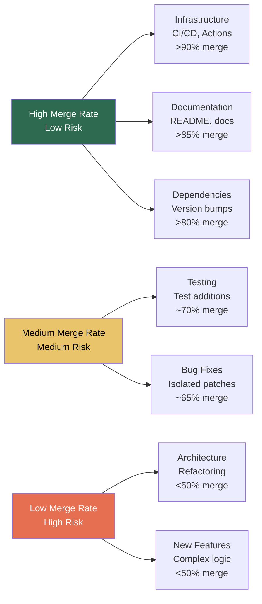

# What 220,000 Pull Requests Reveal About Where Coding Agents Actually Excel — and Where They Fall Short


---

Three empirical studies published in July 2026 — collectively analysing over 250,000 pull requests — paint the most detailed picture yet of what coding agents actually do in production repositories. The findings are uncomfortable: agents merge reliably on infrastructure and documentation but leave gaping test coverage holes, particularly around error handling. This article synthesises the key results and maps them to practical Codex CLI configuration patterns that play to agent strengths whilst defending against their documented weaknesses.

## The Data: Three Studies, One Consistent Signal

### Study 1 — Task-Level Merge Rates Across 220,612 PRs

Mazloomzadeh, Morovati, and Khomh (Polytechnique Montréal) examined 220,612 closed pull requests from 489 Python repositories, isolating 9,428 PRs generated by five coding agents: OpenAI Codex, GitHub Copilot, Claude Code, Cursor, and Devin [^1]. Their findings on merge rates by agent are striking:

| Agent | Merge Rate |
|-------|-----------|
| Claude Code | 84.3% |
| OpenAI Codex | 73.5% |
| GitHub Copilot | 68.1% |
| Cursor | 62.4% |
| Devin | 43.0% |

More revealing than the headline numbers is the task-level breakdown across 24 development categories. Infrastructure tasks — GitHub Actions workflows, CI/CD configuration, build system changes, asset management — achieved merge ratios exceeding 90% [^1]. Documentation improvements and dependency management performed similarly well. By contrast, semantically complex tasks — function implementation, LLM integration, architectural refactoring — showed substantially lower acceptance rates [^1].

The implication is clear: agents excel at structured, repetitive work requiring precise rule-following rather than contextual understanding.

### Study 2 — Test Coverage Gaps Across 4,882 Agentic PRs

Dipongkor, Baral, Lam, and Moran analysed 4,882 agent-generated PRs (532 Java, 4,350 Python) from the AIDev dataset to measure how well agents test their own code changes [^2]. The results expose a systematic testing deficit:

- Agents include test changes in only **49.6%** of PRs that modify code under test
- Existing tests cover **61.5%** of agent-changed executable lines in Java but only **27.0%** in Python
- **64.8%** of Python PRs have zero changed lines executed by any existing test
- Error-handling constructs (`try`/`catch` blocks) are missed at rates of **86.0%** (Java) and **81.0%** (Python) [^2]

Agent-written tests do improve coverage over existing tests, but only in a minority of PRs: 35.9% of Java and 22.5% of Python Code+Tests PRs show a coverage gain [^2].

### Study 3 — Adoption Remains Concentrated in Small Teams

Raida and Hou (KDD 2026 Workshop) examined 25,264 agentic PRs from 2,361 popular GitHub repositories and found that the median repository generates only one to two agentic PRs per quarter [^3]. Small projects (1–5 contributors) show higher agentic participation ratios than medium or large projects. The dominant collaboration pattern is single-developer oversight — one person reviews and modifies the agent's contributions — whilst multi-human review of agentic PRs remains uncommon [^3].

## The Pattern: A Task-Suitability Spectrum

Combining these findings reveals a clear task-suitability spectrum for coding agents:



The key insight is not that agents are "good" or "bad" — it is that their reliability varies dramatically by task type. A workflow that routes agent work by task category, rather than applying uniform trust, will capture the productivity gains whilst avoiding the quality traps.

## Mapping to Codex CLI: Task-Aware Configuration

### AGENTS.md Task Routing Rules

Use your `AGENTS.md` to encode the task-suitability spectrum directly. This steers agent behaviour before any code is written:

```markdown
## Task Routing

### Full-Auto Tasks (high agent reliability)
- CI/CD workflow updates (GitHub Actions YAML)
- Dependency version bumps (package.json, requirements.txt, go.mod)
- Documentation updates (README, JSDoc, docstrings)
- Linter/formatter configuration changes
- Asset management and build configuration

### Agent-Assisted Tasks (require human review)
- Bug fixes in isolated modules
- Test additions for existing code
- Migration scripts with clear specifications

### Human-Led Tasks (agent as advisor only)
- Architectural refactoring across module boundaries
- New feature implementation with complex business logic
- Security-critical code paths
- API contract changes
```

### Model Routing by Task Tier

Match model capability to task complexity. Luna handles the high-merge-rate structured work at a fraction of Sol's cost:

```toml
# config.toml — Named profiles for task-aware routing

[profile.infrastructure]
model = "gpt-5.6-luna"
approval_policy = "unless-allow-listed"
# CI/CD, deps, docs — high reliability, low cost

[profile.bugfix]
model = "gpt-5.6-terra"
approval_policy = "on-request"
# Isolated fixes — moderate complexity

[profile.architecture]
model = "gpt-5.6-sol"
approval_policy = "on-request"
# Complex work — maximum reasoning, human review
```

Invoke with `codex --profile infrastructure "update the GitHub Actions workflow to use Node 22"`.

### Closing the Test Coverage Gap with PostToolUse Hooks

The 49.6% test inclusion rate and 86% error-handling miss rate documented by Dipongkor et al. [^2] demand automated enforcement. Codex CLI's `PostToolUse` hooks provide deterministic verification after every tool call:

```toml
# config.toml — Enforce test coverage on agent PRs

[hooks.post_tool_use.coverage_check]
command = "python scripts/check_agent_coverage.py"
on_failure = "block"
description = "Verify agent changes have test coverage"
```

A practical coverage enforcement script:

```python
#!/usr/bin/env python3
"""PostToolUse hook: verify agent-changed lines have test coverage."""
import subprocess
import sys

def get_changed_lines():
    """Extract lines changed by the agent in the current diff."""
    result = subprocess.run(
        ["git", "diff", "--unified=0", "--name-only"],
        capture_output=True, text=True
    )
    return [f for f in result.stdout.strip().split("\n")
            if f.endswith((".py", ".java", ".ts"))
            and not f.startswith("test")]

def check_test_exists(source_file):
    """Verify a corresponding test file exists."""
    # Map source to expected test location
    test_candidates = [
        source_file.replace("src/", "tests/").replace(".py", "_test.py"),
        source_file.replace("src/", "test/").replace(".java", "Test.java"),
    ]
    for candidate in test_candidates:
        result = subprocess.run(["test", "-f", candidate])
        if result.returncode == 0:
            return True
    return False

changed = get_changed_lines()
untested = [f for f in changed if not check_test_exists(f)]

if untested:
    print(f"BLOCKED: {len(untested)} changed files lack test coverage:")
    for f in untested:
        print(f"  - {f}")
    sys.exit(1)

print(f"PASS: All {len(changed)} changed source files have tests")
```

### Error-Handling Coverage Enforcement

Given the 81–86% error-handling miss rate, add a targeted hook that specifically checks whether `try`/`except` and `try`/`catch` blocks in changed files have corresponding test assertions:

```toml
[hooks.post_tool_use.error_path_audit]
command = "python scripts/audit_error_paths.py"
on_failure = "warn"
description = "Flag untested error-handling paths in agent changes"
```

This converts the test coverage gap from a silent quality debt into a visible, addressable signal.

## The Single-Reviewer Problem

Raida and Hou's finding that agentic PRs are overwhelmingly reviewed by a single developer [^3] creates a concentration risk. Codex CLI's Guardian auto-review subagent provides a second pair of eyes, but the Cortex 2026 benchmark data (covered in a previous article) showed that AI-generated code carries 1.7× more issues than human code [^4]. The defence-in-depth pattern:

1. **Agent generates** the PR (Luna/Terra for structured tasks)
2. **Guardian auto-review** catches structural issues (runs automatically)
3. **PostToolUse hooks** enforce test coverage and linting (deterministic)
4. **Human reviewer** focuses on architectural and business logic concerns

```toml
[auto_review]
enabled = true
model = "gpt-5.6-luna"
# Low-cost structural review before human eyes
```

This four-layer pipeline addresses both the single-reviewer concentration risk and the test coverage deficit simultaneously.

## Practical Implications

The three studies converge on a straightforward operational principle: **delegate by task type, not by project**. Rather than deciding whether to "use agents" or "not use agents" on a repository, configure your workflow to route specific task categories to agents with appropriate guardrails:

| Task Category | Agent Mode | Model | Approval | Hook Enforcement |
|--------------|-----------|-------|----------|-----------------|
| CI/CD, deps, docs | Full-auto | Luna | unless-allow-listed | Lint only |
| Bug fixes, tests | Assisted | Terra | on-request | Coverage + lint |
| Architecture, features | Advisory | Sol | on-request | Full suite |

The data shows this is not premature optimisation — it is the configuration that matches measured agent reliability. Infrastructure PRs merge at >90%; function implementation PRs merge at <50%. Treating them identically wastes either agent capability or human review time.

## What This Means for the Trajectory

These studies capture a snapshot of mid-2026 agent capability. The trajectory is improving: Mazloomzadeh et al. found that agentic PR quality is "comparable or lower defect proneness than human PRs, with mostly non-significant differences" [^1]. The problem is not code quality per se — it is test quality and task selection. As models improve, the task-suitability spectrum will shift rightward, but the principle of task-aware routing will remain. The teams that build this configuration now will be ready to expand agent delegation as capability grows, rather than scrambling to add guardrails after quality incidents.

## Citations

[^1]: Mazloomzadeh, I., Morovati, M.M., & Khomh, F. (2026). "How Do AI Coding Agents Contribute to Software Development? An Empirical Study of Agentic Pull Requests." arXiv:2607.21832. [https://arxiv.org/abs/2607.21832](https://arxiv.org/abs/2607.21832)

[^2]: Dipongkor, A.K., Baral, T., Lam, W., & Moran, K. (2026). "Test Coverage Analysis of Agentic Pull Requests." arXiv:2607.18057. [https://arxiv.org/abs/2607.18057](https://arxiv.org/abs/2607.18057)

[^3]: Raida, M.N. & Hou, D. (2026). "Early Adoption of Agentic Coding Tools by GitHub Projects." arXiv:2607.14037. KDD 2026 Workshop on Agentic Software Engineering (SE 3.0). [https://arxiv.org/abs/2607.14037](https://arxiv.org/abs/2607.14037)

[^4]: CodeRabbit (2026). "State of AI vs Human Code Generation." 470 PRs analysed: AI PRs contain 10.83 issues vs 6.45 human (1.7×). Referenced in Cortex 2026 Benchmark article. [https://www.coderabbit.ai/blog/state-of-ai-code-generation-2026](https://www.coderabbit.ai/blog/state-of-ai-code-generation-2026) ⚠️ URL unverified

[^5]: OpenAI (2026). Codex CLI v0.146.0 Release Notes — PostToolUse hooks, auto-review configuration, named profiles. [https://github.com/openai/codex/releases/tag/rust-v0.146.0](https://github.com/openai/codex/releases/tag/rust-v0.146.0)

[^6]: OpenAI (2026). Codex CLI Documentation — AGENTS.md, config.toml, approval_policy, sandbox configuration. [https://learn.chatgpt.com/docs/codex](https://learn.chatgpt.com/docs/codex)
