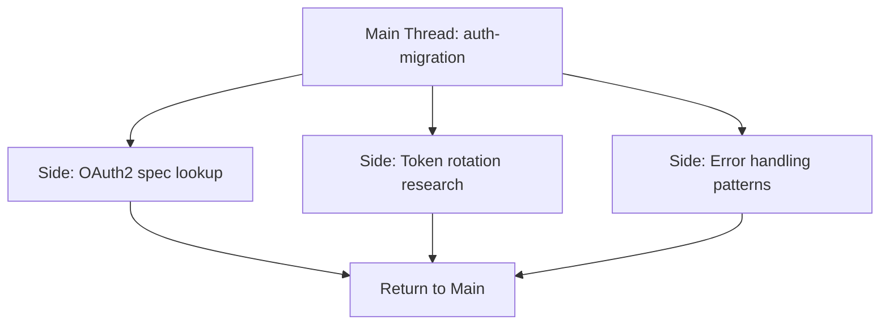
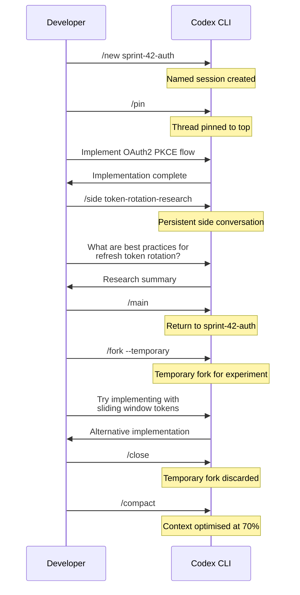

# Codex CLI v0.146 Session Orchestration: Named Threads, Pinning, Forking, and Side Conversations


---

## The Problem with Unnamed, Unstructured Sessions

Every engineer who has spent a full day inside Codex CLI knows the pattern: you start a session to fix a bug, get pulled into a refactoring question, then need to explore a third concern before returning to the original task. By late afternoon, your session history is a graveyard of timestamped JSONL files with no human-readable way to tell them apart.

Before v0.146.0, Codex CLI's session management amounted to `codex resume --last` and a date-sorted picker[^1]. You could fork a session with `/fork` and create ephemeral side chats with `/side`, but there was no way to name threads, pin the ones that mattered, or switch between parallel conversations without dropping to the shell.

Codex CLI v0.146.0, released on 29 July 2026, changes this[^2]. It ships a complete session orchestration toolkit that treats thread management as a first-class concern rather than an afterthought.

## What Shipped in v0.146.0

The release note lists 239 changes — 38 features, 102 improvements, 6 performance fixes, and 73 bug fixes[^2]. The session orchestration features cluster into four capabilities:

1. **Named sessions** via `/new` and `/clear`
2. **Pinned threads** with priority ordering
3. **Persistent side conversations** that survive context switches
4. **Thread forking with paginated history** and ephemeral forks

Each addresses a distinct workflow pain point.

## Named Sessions

### The Commands

```bash
# Start a named session from within the TUI
/new release-prep-v4.2

# Clear the current conversation and start a named session
/clear auth-migration
```

Both commands accept a free-text label. The label is persisted in `ThreadMetadata` alongside the existing `ThreadId` and becomes the primary display name in the session picker, the `/resume` list, and `codex session list` output[^3].

### Why It Matters

Named sessions transform the resume workflow. Instead of scanning timestamps and trying to remember which session at 14:37 was the one where you were debugging the OAuth flow, you see:

```
  auth-migration         (2h ago, 47 turns, 12k tokens)
  release-prep-v4.2      (4h ago, 83 turns, 28k tokens)
  perf-regression-fix    (yesterday, 22 turns, 6k tokens)
```

For headless `codex exec` workflows, named sessions also improve traceability in CI logs and overnight agent runs:

```bash
codex exec --name "nightly-lint-pass" --sandbox workspace-write \
  "Run eslint --fix across all TypeScript files and commit results"
```

### Architecture

Sessions are stored as JSONL rollout files at `~/.codex/sessions/YYYY/MM/DD/`[^4]. The name is written into the `SessionMetaLine` header at the start of the rollout file and indexed in the SQLite-backed `StateDbHandle` managed by the `codex-thread-store` crate[^3]. Name lookups are O(1) against the index — the system never needs to scan rollout files to resolve a session by name.

## Pinned Threads

### Usage

Pin a thread to keep it at the top of the session picker regardless of recency:

```
/pin
```

Unpin with:

```
/unpin
```

Pinned threads appear in a separate section above the chronological list in both the TUI session picker and the `codex session list` CLI output[^2].

### Practical Patterns

Pinning works best for long-running concerns that span days or weeks:

- **Architecture decision records** — a pinned session where you iterate on a design with the agent, compacting periodically to keep it within budget
- **Sprint-scoped task threads** — one pinned session per major deliverable, resumed daily
- **Debugging investigations** — complex bugs where you need to maintain context across multiple work sessions

The pin state is a boolean flag in `ThreadMetadata`, persisted in SQLite[^3]. It survives archival — `codex archive` preserves the pin flag, and `codex unarchive` restores it.

## Side Conversations That Persist

### Before v0.146

The `/side` command, introduced in v0.122.0, created an ephemeral in-memory fork[^5]. It was useful for quick questions — "What does this error code mean?" — but had a hard limitation: when you closed the side conversation, it vanished. There was no way to return to it.

### After v0.146

Side conversations are now persistent by default. The implementation writes a rollout file for each side thread, tagged with a `parent_thread_id` reference back to the main session[^3]. You can:

- Switch between side conversations without closing them
- Return to a previous side conversation from within the same parent thread
- Let side conversations inherit the parent's project context (AGENTS.md, model selection, file tree) while maintaining a separate transcript



The key architectural change is that `/side` now calls `thread/fork` with `ephemeral: false` (the new default) instead of `ephemeral: true`[^3]. Ephemeral forks remain available via `/side --ephemeral` for genuinely throwaway queries.

### Token Economics

Each side conversation maintains its own token budget. This is a feature, not a limitation — it means a deep research tangent in a side thread does not consume the compaction headroom of your main session. When you return to the main thread, its context window is exactly as you left it.

## Thread Forking with Paginated History

### The Problem with Full-Copy Forks

The original `/fork` command duplicated the entire rollout history into a new JSONL file. For short sessions this was fine. For sessions with hundreds of turns and tens of thousands of tokens, the fork could take several seconds and double storage consumption[^3].

### Paginated Forks

v0.146 introduces paginated forking. Instead of copying the complete rollout, the forked thread stores a `history_base` reference pointing to the parent's rollout file and retains only a suffix of recent turns[^3]. The `codex-thread-store` crate's `paginated_fork.rs` module handles resolution — when the fork needs to access earlier history, it reads through the `history_base` chain.

```toml
# config.toml — tune fork behaviour
[sessions]
fork_mode = "paginated"        # "paginated" (default) or "full"
fork_suffix_turns = 50         # number of recent turns to copy into the fork
```

### Temporary Forks

For exploratory work that you know is throwaway — testing whether a particular refactoring approach compiles, checking an alternative algorithm — temporary forks skip persistence entirely:

```
/fork --temporary
```

Temporary forks do not appear in thread listings, have no on-disk rollout file, and are garbage-collected when the session closes[^2]. They are the lightest-weight way to explore a dead end without polluting your session history.

### Goal Inheritance

Forked threads can inherit the parent's goal snapshot via the `inherit_thread_goal_snapshot` parameter[^3]. This is critical for Goal Mode workflows where a long-running objective needs to be explored from multiple angles — each fork inherits the goal state and can independently resume toward it.

## Putting It Together: A Workflow

Here is a realistic daily workflow that combines all four features:



The developer creates a named, pinned session for the sprint's main authentication work. When a research question arises, they open a persistent side conversation that will be available tomorrow if needed. An experimental approach gets a temporary fork — if it works, the code is already on disk; if it fails, the fork vanishes without trace.

## Configuration Reference

The session management features are configured in `config.toml` under the `[sessions]` section:

```toml
[sessions]
# Default fork mode: "paginated" or "full"
fork_mode = "paginated"

# Number of recent turns retained in a paginated fork
fork_suffix_turns = 50

# Whether /side creates persistent (true) or ephemeral (false) forks
side_persistent = true

# Maximum number of pinned threads (0 = unlimited)
max_pinned = 10
```

## Performance Considerations

Paginated forks reference parent rollout files through `history_base` chains. Deep chains — a fork of a fork of a fork — incur read amplification when the agent needs historical context[^3]. In practice, chains rarely exceed depth two or three, and the `codex-thread-store` crate caches resolved history in memory during a session. For overnight agent fleets that fork aggressively, setting `fork_mode = "full"` trades storage for read performance.

The SQLite index backing `ThreadMetadata` handles thousands of sessions without degradation[^3]. Name lookups, pin-state queries, and chronological sorting are all indexed operations.

## The Broader Trend

Session orchestration in v0.146 reflects a maturation pattern visible across coding agent tooling in 2026. As sessions grow longer — Goal Mode runs routinely span hundreds of turns[^6] — and as agents operate in parallel across worktrees[^4], the session itself becomes an engineering artefact that deserves the same discipline as source code: naming conventions, archival policies, and branching strategies.

The analogy to Git is deliberate and acknowledged in the Codex codebase. Threads have lineage (`forked_from_id`), they branch and merge conceptually, and they carry metadata that enables tooling[^3]. The difference is that Git tracks code state; Codex's session system tracks reasoning state. Both require structure to remain useful at scale.

## Citations

[^1]: OpenAI, "Codex CLI Session Management," *OpenAI Developer Documentation*, 2026. [https://developers.openai.com/codex/sessions](https://developers.openai.com/codex/sessions)

[^2]: OpenAI, "Release 0.146.0," *GitHub — openai/codex*, 29 July 2026. [https://github.com/openai/codex/releases/tag/rust-v0.146.0](https://github.com/openai/codex/releases/tag/rust-v0.146.0)

[^3]: DeepWiki, "Session Resumption and Forking — openai/codex," *DeepWiki*, 2026. [https://deepwiki.com/openai/codex/4.4-session-resumption-and-forking](https://deepwiki.com/openai/codex/4.4-session-resumption-and-forking)

[^4]: Daniel Vaughan, "Codex CLI Session Lifecycle: Archive, Resume, Fork, and Compact," *Codex Knowledge Base*, 5 June 2026. [https://codex.danielvaughan.com/2026/06/05/codex-cli-session-lifecycle-archive-resume-fork-compact-management/](https://codex.danielvaughan.com/2026/06/05/codex-cli-session-lifecycle-archive-resume-fork-compact-management/)

[^5]: Daniel Vaughan, "Codex CLI Side Conversations: Ephemeral Forks, Session Branching, and the /side vs /fork Decision Tree," *Codex Knowledge Base*, 4 June 2026. [https://codex.danielvaughan.com/2026/06/04/codex-cli-side-conversations-ephemeral-forks-session-branching-patterns/](https://codex.danielvaughan.com/2026/06/04/codex-cli-side-conversations-ephemeral-forks-session-branching-patterns/)

[^6]: OpenAI, "Codex CLI Changelog," *ChatGPT Learn*, August 2026. [https://learn.chatgpt.com/docs/changelog](https://learn.chatgpt.com/docs/changelog)
