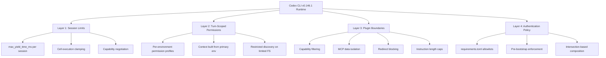
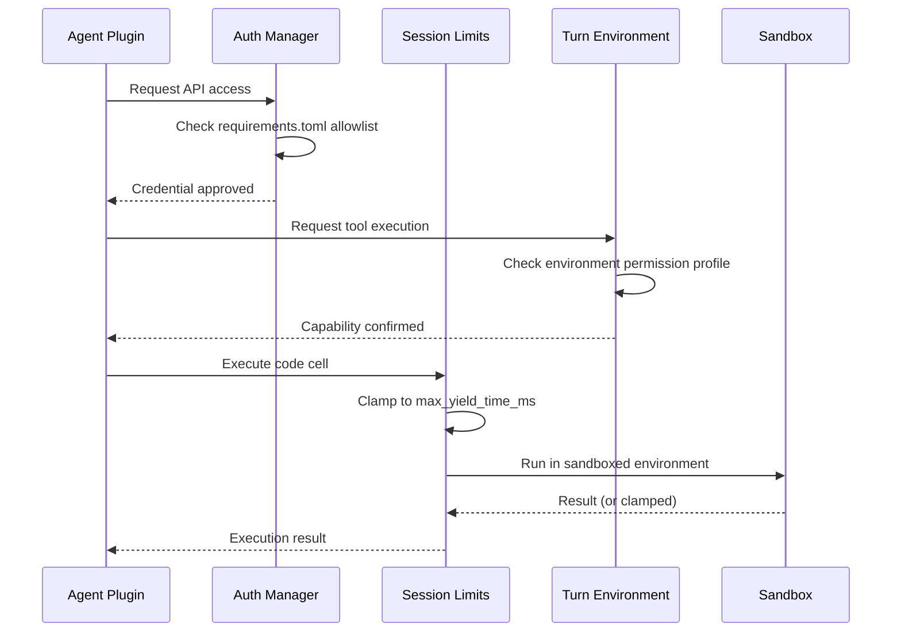

# Codex CLI v0.146.1 Least-Privilege Runtime: Per-Session Execution Limits, Agent Plugin Boundaries, and Turn-Scoped Permissions


---

On 5 August 2026, Codex CLI shipped v0.146.1 — a point release whose changelog entry reads innocuously: "safer automatic-review defaults for cyber-capable models and enhanced permission change visibility"[^1]. Beneath that single line sit six merged pull requests that, taken together, represent the most significant tightening of Codex CLI's runtime isolation model since permission profiles landed in v0.129. This article unpacks each change, shows how they compose into a coherent least-privilege stack, and walks through the configuration you need to adopt them.

## Why a Least-Privilege Wave Now?

Three pressures converged in July 2026. First, Wiz Research's GhostApproval disclosure demonstrated that symlink-based sandbox escapes could trick six major coding assistants — including some of Codex CLI's competitors — into writing outside their declared workspace[^2]. Second, the Agent Plugins manifest shipped in v0.146.0, giving third-party code a first-class execution surface inside the agent loop[^3]. Third, the GPT-5.6 Sol model's "High cybersecurity capability" classification under OpenAI's Preparedness Framework mandated stricter guardrails for models that could, in theory, assist offensive operations[^4].

The result is a coordinated set of changes that enforce isolation at four distinct layers: session, turn, plugin, and authentication.

## The Four Isolation Layers



### Layer 1: Per-Session Code-Mode Execution Limits

Pull request #37114 introduces `create_session_with_limits`, a new API that attaches execution constraints to each code-mode session[^5]. The key parameter is `max_yield_time_ms`, which caps how long any single cell execution can yield to the runtime before the session clamps it — crucially, without terminating the running cell. The distinction matters: previous approaches either let cells run unbounded or killed them outright, losing partial results.

The implementation uses a capability-negotiation protocol. When the CLI opens a session against a remote code-mode host, it advertises limit support in `session/open`. Hosts that understand limits honour them; hosts that do not continue to operate as unlimited sessions. This means upgrading the CLI does not break existing integrations with older code-mode providers.

```toml
# config.toml — set a default execution ceiling
[code_mode]
max_yield_time_ms = 30000   # 30-second ceiling per cell
```

For teams running Codex CLI against shared compute (CI runners, cloud sandboxes, paired remote-control sessions), this is the first mechanism for preventing a single runaway cell from monopolising resources without losing its output.

### Layer 2: Turn-Scoped Permissions

Before v0.146.1, permission profiles applied at the thread level. If you switched environments mid-conversation — say, from a read-only documentation context to a writable workspace — the permission profile for the entire thread determined what the agent could see and do. Pull requests #37038 and #37040 change this: permissions now anchor to the individual **turn environment**[^6].

Concretely, the CLI now constructs filesystem and permission context from the primary turn environment's permission profile, working directory, and workspace roots. When no primary environment is set, it falls back to thread-level context — preserving backward compatibility. Capability discovery (which tools the agent can see and invoke) also builds its sandbox context from each environment's profile. If any selected environment has restricted filesystem access, the agent's discovery status reflects that restriction.

The practical effect: a single conversation can span multiple security postures. You might start a turn in `:read-only` mode to analyse production logs, then switch to `:workspace` for the fix, with each turn's capabilities precisely matching its environment.

Pull request #37031 ensures that when you update a permission profile mid-session, the change propagates to all **future** turn environments — not retroactively to turns already in flight[^7]. This prevents the unsettling scenario where tightening permissions mid-conversation could invalidate work the agent has already completed.

### Layer 3: Agent Plugin Runtime Boundaries

Agent Plugins, introduced in v0.146.0, let third-party developers package skills, MCP servers, and configuration into a single installable manifest[^3]. Pull request #37027 adds the guardrails that were conspicuously absent from the initial release[^8]:

**Capability filtering.** Only direct-child skills are discovered; app and hook capabilities are excluded. This prevents a plugin from injecting hooks that run outside its declared scope.

**MCP data isolation.** MCP metadata from one plugin cannot leak into another plugin's context. Each plugin's MCP bindings are scoped to its own namespace.

**Instruction and schema caps.** The implementation bounds model-visible skill instructions, plugin instructions, MCP descriptions, schemas, individual tools, and the aggregate Agent Plugin MCP tool set. A plugin cannot flood the context window with unbounded instruction text — a vector that prompt-injection researchers have repeatedly flagged[^9].

**Redirect security.** MCP and OAuth redirects are blocked when an Agent Plugin provides configured or authorisation headers. This closes a class of credential-exfiltration attacks where a malicious plugin could redirect authenticated requests to an attacker-controlled endpoint. Legacy MCP servers without plugin manifests retain their existing redirect behaviour.

**Configuration validation.** Plugin configuration files must be regular files that resolve within the plugin root. Symlinks, path traversals, and references outside the plugin directory are rejected — a direct response to the GhostApproval disclosure[^2].

### Layer 4: Managed Authentication Enforcement

Pull request #37132 addresses a subtle but critical gap: authentication restrictions were not applied before stored or environment-provided credentials could be used, including during bootstrap[^10]. This meant that in the window between process start and policy load, a credential that should have been denied could be hydrated and used for API calls.

The fix centralises enforcement in the authentication manager and reads allowlists from local `requirements.toml` files:

```toml
# requirements.toml — enterprise authentication policy
[authentication]
allowed_login_methods = ["chatgpt", "api_key"]
allowed_workspaces = ["acme-corp"]
```

When managed workspace allowlists intersect with existing restrictions, the most restrictive policy wins. If the intersection eliminates all viable login methods, the system fails closed — denying access rather than falling back to a permissive default. Policy checks run identically across CLI, TUI, app-server, external-auth, and credential-loading pathways.

## The Cyber-Model Auto-Review Tightening

Pull request #37057 backports safer auto-review defaults specifically for models classified as cyber-capable under the Preparedness Framework[^4]. When using GPT-5.6 Sol or other high-capability models, the auto-review subagent now applies stricter scrutiny by default — a change that #37103 extends by routing API-key Guardian reviews through GPT-5.6 Luna, the fastest and cheapest tier in the GPT-5.6 family[^1].

The economics are notable: Luna-based auto-review costs roughly 10x less than the previous default, which means teams can afford to run review on every command without the cost pressure that previously led some organisations to relax approval policies[^11].

## How the Layers Compose

The isolation layers are not alternatives — they compose multiplicatively. A request from an Agent Plugin must satisfy:

1. **Authentication policy** — the credential must be allowed by `requirements.toml` before any API call occurs
2. **Session limits** — the code execution must complete within the session's `max_yield_time_ms`
3. **Turn permissions** — the action must be permitted by the current turn environment's profile
4. **Plugin boundaries** — the plugin's capabilities must fall within its declared scope, with no data leaking across plugin namespaces



## Configuration Checklist for Teams

If you are running Codex CLI in a team or enterprise environment, the v0.146.1 changes introduce several configuration points worth auditing:

| Setting | File | Purpose |
|---------|------|---------|
| `max_yield_time_ms` | `config.toml` | Cap per-cell execution time |
| `default_permissions` | `config.toml` | Set the baseline permission profile |
| `allowed_login_methods` | `requirements.toml` | Restrict authentication pathways |
| `allowed_workspaces` | `requirements.toml` | Limit to approved ChatGPT workspaces |
| `allowed_permission_profiles` | `requirements.toml` | Restrict which profiles users may select |
| Plugin manifest validation | Automatic | Enforced for all Agent Plugins |

For most individual developers, the defaults are sensible. The changes primarily affect teams that have adopted Agent Plugins or run Codex CLI against shared infrastructure where resource contention or credential leakage are operational risks.

## What This Signals

The v0.146.1 release is architecturally significant because it shifts Codex CLI's security model from "trust the sandbox" to "enforce least privilege at every layer." Previous releases focused on the outer boundary — the macOS Seatbelt, Linux Landlock, and network-level restrictions in `requirements.toml`. The new changes push isolation inward: into individual sessions, turns, plugin namespaces, and authentication flows.

This is the direction the industry is moving. The GhostApproval disclosure showed that sandbox-only defences fail when the agent itself is tricked into operating outside boundaries it technically has permission to access. The v0.146.1 response — constraining what the agent can do at each layer, rather than relying solely on what the OS prevents — is the more defensible architecture.

## Citations

[^1]: "Codex CLI Changelog," OpenAI, August 2026. [https://learn.chatgpt.com/docs/changelog](https://learn.chatgpt.com/docs/changelog)

[^2]: "GhostApproval: A Trust Boundary Gap in AI Coding Assistants," Wiz Research, July 2026. [https://www.wiz.io/blog/ghostapproval-a-trust-boundary-gap-in-ai-coding-assistants](https://www.wiz.io/blog/ghostapproval-a-trust-boundary-gap-in-ai-coding-assistants)

[^3]: "Codex CLI v0.146.0 Release Notes — Session naming, thread pinning, Agent Plugins manifest support," OpenAI, 29 July 2026. [https://learn.chatgpt.com/docs/changelog](https://learn.chatgpt.com/docs/changelog)

[^4]: "Cyber Safety," OpenAI Codex Documentation, 2026. [https://learn.chatgpt.com/docs/cyber-safety](https://learn.chatgpt.com/docs/cyber-safety)

[^5]: "Add per-session code-mode execution limits," Pull Request #37114, openai/codex, merged 5 August 2026. [https://github.com/openai/codex/pull/37114](https://github.com/openai/codex/pull/37114)

[^6]: "Use turn environment permissions for context and discovery," Pull Request #37040, openai/codex, merged 5 August 2026. [https://github.com/openai/codex/pull/37040](https://github.com/openai/codex/pull/37040)

[^7]: "Apply permission profile updates to future turn environments," Pull Request #37031, openai/codex, merged 5 August 2026. [https://github.com/openai/codex/pull/37031](https://github.com/openai/codex/pull/37031)

[^8]: "Enforce Agent Plugin runtime boundaries," Pull Request #37027, openai/codex, merged 5 August 2026. [https://github.com/openai/codex/pull/37027](https://github.com/openai/codex/pull/37027)

[^9]: "Top AI Coding Agent Security Resources — August 2026," Adversa AI, August 2026. [https://adversa.ai/blog/top-ai-coding-agent-security-resources-august-2026/](https://adversa.ai/blog/top-ai-coding-agent-security-resources-august-2026/)

[^10]: "Enforce managed authentication requirements locally," Pull Request #37132, openai/codex, merged 5 August 2026. [https://github.com/openai/codex/pull/37132](https://github.com/openai/codex/pull/37132)

[^11]: "Managed Configuration," OpenAI Codex Enterprise Documentation, 2026. [https://developers.openai.com/codex/enterprise/managed-configuration](https://developers.openai.com/codex/enterprise/managed-configuration)
