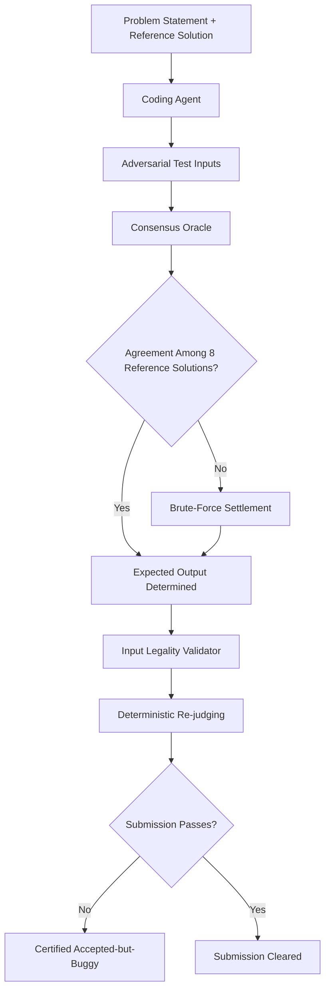

# Coding Agents as Test-Suite Auditors: What 906 Accepted-but-Buggy Submissions Reveal About Your Test Coverage — and How to Build Adversarial Test Pipelines with Codex CLI


---

## The Problem: Your Tests Pass, but Your Code Is Wrong

Every developer has experienced the false comfort of a green test suite. A new paper by Xie et al. — *Coding Agents as Test-Suite Auditors* (arXiv:2608.01715, 3 August 2026) — quantifies exactly how dangerous that comfort is [^1]. The researchers audited 20,375 accepted submissions across 106 AtCoder problems and found that **2.9% of officially accepted submissions contain verified logic bugs** that the platform's own test suites fail to catch. One agent alone — Codex CLI on GPT-5.4 — identified 589 of these, and the union across five agents reached a floor of 906.

The implications extend well beyond competitive programming. If curated, high-stakes test suites on platforms like AtCoder harbour measurable blind spots, what does that say about your project's test coverage?

## How the Auditing Framework Works

The paper's design is elegantly constrained. Each agent receives only the problem statement and a single reference solution — never the official tests or any verdicts being audited. This **target-blind** approach prevents the auditor from gaming the suite it is evaluating [^1].



The certification chain has four layers [^1]:

1. **Consensus oracle** — eight independently written accepted solutions vote on expected outputs (three for Codeforces problems)
2. **Brute-force settlement** — algorithmic solvers arbitrate disagreements between reference solutions
3. **Input legality validation** — statement-derived validators reject malformed or out-of-constraint inputs
4. **Deterministic re-judging** — isolated Linux environments re-run submissions against the certified inputs

## The Numbers That Matter

### AtCoder Audit

| Metric | Value |
|---|---|
| Submissions audited | 20,375 |
| Problems covered | 106 |
| Codex-certified bugs | 589 |
| Five-agent union floor | 906 |
| Problems affected | 74 of 106 |
| False discovery rate | ≤ 1.87% (Wilson 95% CI) |
| Official-suite coverage gap | ≤ 1.7 pp per agent [^1] |

### Codeforces Post-Cutoff (41 Fresh Problems, March–June 2026)

The researchers also tested on 41 Codeforces problems created *after* the models' training cutoffs, eliminating memorisation concerns [^1]:

| Generator | cov@50 | Median inputs needed |
|---|---|---|
| Agent (best) | 0.952 | 43.8 |
| CodeContests+ baseline | 0.809 | — |
| Random generation | — | (trailed by 10.9 pp) |

The agent advantage of 0.143 (95% CI: [0.028, 0.331]) is statistically significant and practically meaningful — catching 95.2% of confirmed bugs with fewer than 50 inputs [^1].

## Five Agents, Five Perspectives

The study evaluated five off-the-shelf coding agent engines [^1]:

- **Codex** — OpenAI Codex CLI on GPT-5.4
- **Claude** — Claude Code on Claude Opus 4.8
- **Agy** — Antigravity CLI on Gemini 3.1 Pro
- **OpenCode** — OpenCode CLI on DeepSeek V4 Pro
- **Mini** — mini-SWE-agent on DeepSeek V4 Pro

Each agent generated test inputs independently, and no single agent dominated across all problem types. The union of all five yielded 906 certified bugs — 54% more than the best individual agent — reinforcing a theme familiar to anyone running multi-model workflows: **diverse reasoning strategies catch diverse failure modes**.

## Quality Controls Worth Stealing

The paper's rigour offers a template for production test-validation pipelines:

- **Zero wrong expected outputs** across 1,795 agent-generated inputs when independently verified by LLM judges [^1]
- **354 structurally illegal mutations rejected** with zero false accepts during malformed-input testing [^1]
- **62 format-valid-but-semantically-illegal inputs rejected** — also zero false accepts [^1]
- **Input overlap with official suites**: at most 5.5%, confirming the agents generate genuinely novel test cases rather than reconstructing known ones [^1]
- **529 agent runs audited for filesystem contamination**: zero instances of accessing held-out materials [^1]

## Mapping This to Codex CLI

The paper used Codex CLI directly as one of its five agents. Here is how you can replicate and extend this pattern in your own projects.

### Pattern 1: Adversarial Test Generation via `codex exec`

Use `codex exec` in headless mode to generate adversarial inputs against your own code [^2]:

```bash
codex exec --approval-mode full-auto \
  --output-schema '{"type":"object","properties":{"inputs":{"type":"array","items":{"type":"string"}}}}' \
  "Generate 50 adversarial test inputs for the function in src/parser.py. \
   Focus on boundary conditions, malformed input, and edge cases \
   that the existing test suite in tests/ might miss. \
   Return them as a JSON array."
```

The `--output-schema` flag constrains the output to machine-parseable JSON, making it straightforward to pipe into your test harness [^2].

### Pattern 2: PostToolUse Hooks for Certification

The paper's certification chain maps directly onto Codex CLI's PostToolUse hook architecture. A hook that validates generated test inputs against problem constraints prevents the agent from producing illegal inputs [^3]:

```json
{
  "hooks": [
    {
      "event": "PostToolUse",
      "matcher": {
        "tool_name": "^shell$",
        "command": "python.*generate_tests"
      },
      "command": "python validate_inputs.py --constraints constraints.json",
      "on_failure": "inject_feedback"
    }
  ]
}
```

When `validate_inputs.py` exits non-zero, Codex CLI replaces the tool result with your stderr feedback, steering the agent to regenerate compliant inputs without manual intervention [^3].

### Pattern 3: Multi-Agent Consensus in CI

The paper's consensus oracle — multiple independent solutions voting on expected outputs — translates to a multi-profile `codex exec` pipeline [^4]:

```bash
#!/bin/bash
# Run three model profiles as independent oracles
for profile in luna terra sol; do
  codex exec --profile "$profile" \
    --approval-mode full-auto \
    --output-schema '{"type":"object","properties":{"outputs":{"type":"array"}}}' \
    "Given these test inputs, compute expected outputs for src/solver.py" \
    > "/tmp/oracle_${profile}.json" &
done
wait

# Majority vote across oracle outputs
python consensus.py /tmp/oracle_*.json --threshold 2
```

Named profiles (available since v0.133.0) route each oracle run to a different model tier, providing the diversity of reasoning that the paper shows catches more bugs [^4] [^5].

### Pattern 4: AGENTS.md Test-Audit Workflow

Encode the adversarial-testing discipline directly in your project's `AGENTS.md` [^3]:

```markdown
## Test Quality Gates

- After writing any new function, generate at least 10 adversarial inputs
  targeting boundary conditions before writing the happy-path tests
- Run the existing test suite against adversarial inputs to check for
  accepted-but-buggy behaviour
- Never treat a passing test suite as proof of correctness — verify
  edge cases independently
- When modifying code that has existing tests, generate counter-examples
  that test the modification boundary
```

## Why This Matters Beyond Competitive Programming

The paper's findings have direct consequences for three areas of professional software engineering:

**Training data quality.** Code model training pipelines frequently treat platform-accepted solutions as ground truth. The 906-entry ledger of accepted-but-buggy submissions is a concrete dataset of label noise that contaminates training [^1]. If you are fine-tuning on competitive programming data, filter against this ledger.

**Benchmark reliability.** SWE-bench, Terminal-Bench, and similar benchmarks rely on test suites to define correctness. The paper demonstrates that test-suite adequacy is an auditable property, not an assumption. Codex CLI's `codex exec` with `--output-schema` provides the infrastructure to run these audits as part of your evaluation pipeline [^2].

**Production test coverage.** The consensus-oracle pattern — multiple independently generated solutions agreeing on expected outputs — is a practical technique for catching logic bugs in business-critical code where traditional coverage metrics (line, branch) provide false confidence.

## Practical Recommendations

1. **Treat test-suite audit as a CI stage.** Run `codex exec` adversarial generation against your test suite on a schedule or pre-merge. The paper shows 50 inputs are sufficient to catch 95.2% of bugs [^1].

2. **Use multi-model consensus for expected outputs.** A single model can be confidently wrong. The paper's consensus oracle with eight reference solutions achieved zero wrong expected outputs across 1,795 inputs [^1].

3. **Validate input legality deterministically.** Agent-generated test inputs can violate problem constraints. Use PostToolUse hooks to enforce validators before inputs reach your test harness [^3].

4. **Track the false discovery rate.** The paper's Wilson-interval bound of 1.87% is achievable with proper certification. Monitor your own adversarial pipeline's false positive rate over time.

5. **Diversify your agents.** The 54% improvement from five agents over the best single agent is a strong argument for multi-provider test generation [^1].

## Citations

[^1]: Xie, S., Xie, S., Zhu, F., Ji, Y. & Zuo, W. (2026). *Coding Agents as Test-Suite Auditors: Finding What Official Suites Miss While Approaching What They Catch*. arXiv:2608.01715. [https://arxiv.org/abs/2608.01715](https://arxiv.org/abs/2608.01715)

[^2]: OpenAI. (2026). *Codex CLI Documentation: codex exec and Non-Interactive Mode*. [https://developers.openai.com/codex](https://developers.openai.com/codex)

[^3]: OpenAI. (2026). *Codex CLI Hooks Reference: PreToolUse and PostToolUse Events*. [https://developers.openai.com/codex/hooks](https://developers.openai.com/codex/hooks)

[^4]: OpenAI. (2026). *Codex CLI Configuration: Named Profiles and Model Routing*. [https://developers.openai.com/codex/configuration](https://developers.openai.com/codex/configuration)

[^5]: OpenAI. (2026). *Codex CLI Changelog*. [https://developers.openai.com/codex/changelog](https://developers.openai.com/codex/changelog)
