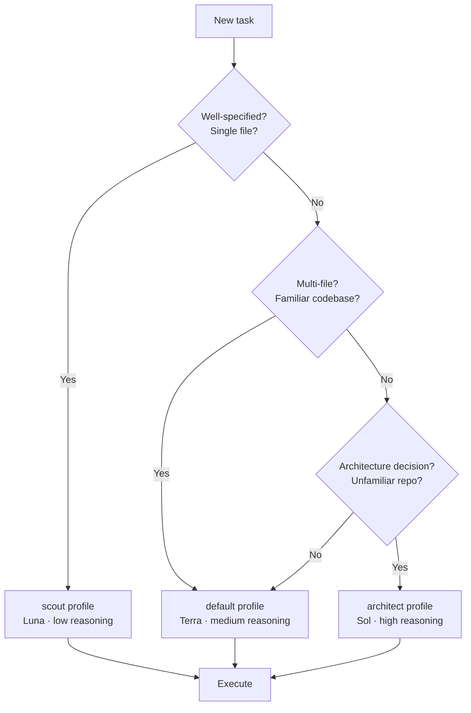
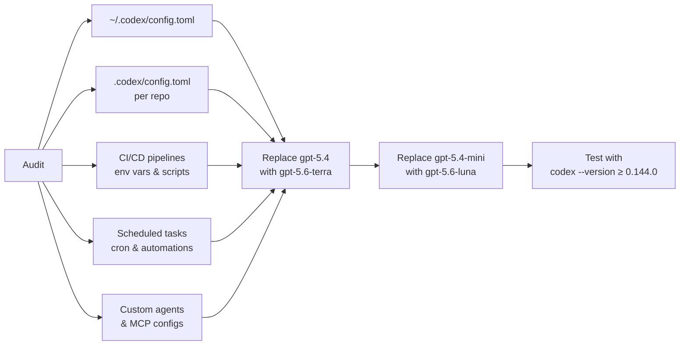

# The GPT-5.6 Migration Playbook: Configuring Codex CLI for Luna, Terra and Sol Before the August Deadline


---

GPT-5.4 and GPT-5.4 mini retire from Codex on 31 August 2026[^1]. If your `config.toml` still references either model — or if you have scheduled tasks, custom agents, or CI pipelines that hardcode the model string — you have roughly three weeks to migrate. This article walks through the GPT-5.6 family, shows you how to configure Codex CLI for each tier, and sets up named profiles so you can route tasks to the right model automatically.

## What Changed: The Three-Tier Naming Convention

On 9 July 2026 OpenAI released GPT-5.6 as a three-tier family[^2]:

| Tier | Model string | Input / Output per 1M tokens | Sweet spot |
|------|-------------|------------------------------|------------|
| **Sol** | `gpt-5.6-sol` | \$5 / \$30 | Ambiguous changes, unfamiliar repos, architecture decisions |
| **Terra** | `gpt-5.6-terra` | \$2 / \$12 | Everyday implementation, investigation, refactoring |
| **Luna** | `gpt-5.6-luna` | \$0.20 / \$1.20 | Well-specified fixes, transformation, classification, volume work |

> **Note:** These prices reflect the 30 July 2026 price cut. At launch on 9 July 2026, Terra was \$2.50 / \$15 and Luna was \$1 / \$6. Sol pricing is unchanged[^6].

All three share a 1 million token context window, a 128,000 token maximum output, and a knowledge cutoff of 16 February 2026[^2]. The naming convention is deliberate: the numeral identifies the generation; the name identifies a durable capability tier that advances on its own cadence[^3].

### Where the Models Land on Benchmarks

The numbers worth knowing for a coding-agent context:

- **SWE-bench Pro**: Sol 64.6%, Terra 63.4%[^4]. The gap is narrow enough that cost-sensitive teams can default to Terra without a meaningful accuracy penalty on production-grade software engineering tasks.
- **Terminal-Bench 2.1**: Sol 88.8% (91.9% in ultra mode); Luna 82.5% — within a point of GPT-5.5[^4].
- **Artificial Analysis Coding Agent Index**: Sol sets the state of the art at 80[^4].

Luna scoring 82.5% on Terminal-Bench at a fraction of the price of Sol is the key figure for migration planning: many tasks that previously ran on GPT-5.4 mini can move to Luna with better results and lower cost.

## The Migration Map

The official guidance[^1]:

| Old model | New model |
|-----------|-----------|
| `gpt-5.4` | `gpt-5.6-terra` |
| `gpt-5.4-mini` | `gpt-5.6-luna` |

If you were already using GPT-5.5, no action is required — it remains available. Sol is the upgrade path for teams that need the highest capability tier.

## Updating config.toml

Codex CLI loads configuration from three layers, in ascending priority[^5]:

1. **Project config** — `.codex/config.toml` in the repo root
2. **Profile config** — `$CODEX_HOME/<profile-name>.config.toml`
3. **CLI flags** — `codex -m gpt-5.6-sol`

### Minimum Change

If your global config currently reads:

```toml
model = "gpt-5.4"
```

Replace it with:

```toml
model = "gpt-5.6-terra"
model_reasoning_effort = "medium"
```

For the mini replacement:

```toml
model = "gpt-5.6-luna"
model_reasoning_effort = "low"
```

### Version Gate

GPT-5.6 requires Codex CLI 0.144.0 or later[^3]. Verify and update:

```bash
codex --version
npm install -g @openai/codex@latest
```

As of this writing, the latest release is 0.146.0 (29 July 2026)[^1].

## Named Profiles for Task-Aware Routing

A profile is a named bundle of settings — model, sandbox, approval, auth, and MCP overrides — that activates as a single unit[^5]. Rather than switching models manually, define profiles in `~/.codex/config.toml` that match the shape of work you do:

```toml
# Default: Terra for everyday work
model = "gpt-5.6-terra"
model_reasoning_effort = "medium"

[profiles.scout]
# Luna for quick, well-specified tasks
model = "gpt-5.6-luna"
model_reasoning_effort = "low"

[profiles.architect]
# Sol for complex, multi-file changes
model = "gpt-5.6-sol"
model_reasoning_effort = "high"

[profiles.ci]
# Luna for CI pipelines — fast, cheap, deterministic
model = "gpt-5.6-luna"
model_reasoning_effort = "low"
approval_policy = "full-auto"
```

Activate with `--profile` or the environment variable:

```bash
# Quick lint fix — Luna is sufficient
codex --profile scout "Fix the eslint warnings in src/utils/"

# Architecture decision — Sol with high reasoning
codex --profile architect "Refactor the auth module to use the strategy pattern"

# CI pipeline
CODEX_PROFILE=ci codex "Run the test suite and fix any failures"
```

The flow for choosing the right profile:



## Reasoning Effort and Model Selection Are Independent

A common mistake during migration is conflating model tier with reasoning effort. They are orthogonal controls[^3]:

- **Model tier** determines the base capability ceiling.
- **Reasoning effort** (`low`, `medium`, `high`) determines how much of that ceiling the model uses on a given turn.

Sol at `low` reasoning can be cheaper per turn than Terra at `high` reasoning for certain task shapes, though the per-token rate remains higher. The practical rule: keep reasoning effort constant when comparing models so you isolate which improvements come from capability rather than budget[^3].

```toml
# Anti-pattern: Sol with low reasoning for everything
# You're paying Sol prices for Luna-level reasoning
model = "gpt-5.6-sol"
model_reasoning_effort = "low"  # Wasteful

# Better: match the model to the reasoning budget
model = "gpt-5.6-luna"
model_reasoning_effort = "low"  # Aligned cost and capability
```

## Project-Level Overrides

For repositories with specific model requirements, commit a `.codex/config.toml` at the repo root:

```toml
# .codex/config.toml — monorepo with complex dependency graph
model = "gpt-5.6-terra"
model_reasoning_effort = "high"

[profiles.hotfix]
model = "gpt-5.6-luna"
model_reasoning_effort = "medium"
```

This ensures every developer and CI runner on the project uses the same model configuration without relying on individual `~/.codex/config.toml` files.

## Updating AGENTS.md for Model-Aware Guidance

If your `AGENTS.md` includes model-specific instructions, update the references:

```markdown
## Model Routing

- **Architecture and design tasks**: Use `codex --profile architect` (Sol)
- **Implementation and refactoring**: Default profile (Terra)
- **Formatting, linting, boilerplate**: Use `codex --profile scout` (Luna)
- **CI/CD automation**: Use `CODEX_PROFILE=ci` (Luna, full-auto)
```

## Migration Checklist

Before the 31 August deadline, audit every location where a model string appears:



1. **Global config** — `~/.codex/config.toml`
2. **Project configs** — `.codex/config.toml` in every repo
3. **CI pipelines** — environment variables, shell scripts, GitHub Actions
4. **Scheduled tasks** — cron jobs, Automations templates
5. **Custom agents** — any wrapper that passes `--model` or sets `model` in config
6. **Managed workspace defaults** — organisation-level Codex settings

Use `grep -r "gpt-5.4" ~/.codex/ .codex/ .github/` as a starting point.

## Plan Availability

Not all tiers are available on all plans[^3]:

| Plan | Available models |
|------|-----------------|
| Free / Go | Terra only |
| Plus / Pro | Sol, Terra, Luna |
| Business / Enterprise | Sol, Terra, Luna |

If you are on the Free or Go plan, your only migration path is `gpt-5.4` → `gpt-5.6-terra`. Luna and Sol require Plus or higher.

## What to Do If You Cannot Migrate Yet

If you have a hard dependency on GPT-5.4 behaviour — for example, a fine-tuned evaluation pipeline calibrated to its output distribution — note that GPT-5.4 and GPT-5.4 mini will remain available via the OpenAI API with an API key after 31 August[^1]. The retirement only affects Codex sessions authenticated with ChatGPT sign-in. Switch your Codex authentication to API-key mode to retain access past the deadline, but treat this as a temporary measure.

## Conclusion

The GPT-5.6 migration is less about swapping one model string for another and more about adopting the tiered model as a routing strategy. Luna at \$0.20/\$1.20 per million tokens covers the volume work that previously required GPT-5.4 mini. Terra at \$2/\$12 matches or exceeds GPT-5.4 at a competitive price point. Sol is there for the tasks where capability matters more than cost. Named profiles make the routing explicit and repeatable. Update your configs, grep for stale model strings, and test before the deadline.

## Citations

[^1]: OpenAI, "ChatGPT & Codex Changelog — July 31, 2026: GPT-5.4 retirement notice," [https://learn.chatgpt.com/docs/changelog](https://learn.chatgpt.com/docs/changelog)

[^2]: Simon Willison, "The new GPT-5.6 family: Luna, Terra, Sol," 9 July 2026, [https://simonwillison.net/2026/Jul/9/gpt-5-6/](https://simonwillison.net/2026/Jul/9/gpt-5-6/)

[^3]: Yunosuke Naito, "GPT-5.6 in Codex: Sol vs. Terra vs. Luna," 2026, [https://ynaito.dev/en/writing/codex-gpt-5-6-sol-terra-luna/](https://ynaito.dev/en/writing/codex-gpt-5-6-sol-terra-luna/)

[^4]: BuildFastWithAI, "GPT-5.6 Review: Sol, Terra, Luna Tested (2026)," [https://www.buildfastwithai.com/blogs/gpt-5-6-sol-terra-luna-review-2026](https://www.buildfastwithai.com/blogs/gpt-5-6-sol-terra-luna-review-2026)

[^5]: Majestic Labs, "Codex CLI config.toml Guide 2026," [https://majesticlabs.dev/blog/202607/codex-cli-configuration-guide](https://majesticlabs.dev/blog/202607/codex-cli-configuration-guide)

[^6]: OpenAI, "Advancing the price-performance frontier with GPT-5.6," 30 July 2026. [https://openai.com/index/advancing-the-price-performance-frontier-with-gpt-5-6/](https://openai.com/index/advancing-the-price-performance-frontier-with-gpt-5-6/)
