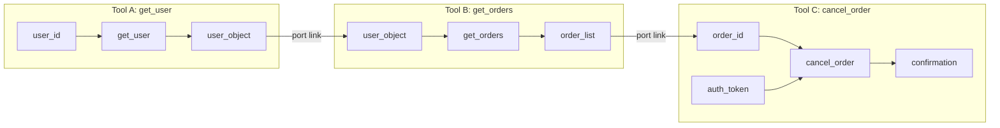
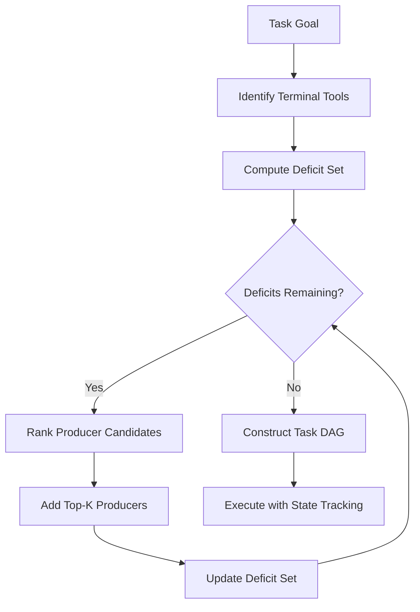

# HyperAgent and the Tool-Schema Hypergraph: What Deficit-Oriented Planning Means for Codex CLI Tool Discovery


---

Your Codex CLI session connects to six MCP servers, exposes 140 tools, and burns tokens loading definitions the agent never calls. The model picks the wrong tool, retries, picks another wrong tool, and eventually stumbles into the right one three API calls later. You have a tool-selection problem — and a research group at UNSW just published a framework that treats it as a graph problem instead.

HyperAgent, published 31 July 2026 (arXiv:2608.02650), models tool relationships as a directed hypergraph where tools are hyperedges connecting input-schema nodes to output-schema nodes [^1]. On the AppWorld benchmark it hit 67.1% task-goal completion versus ReAct's 48.8%, while reducing redundant API calls and token consumption [^1]. The approach is directly relevant to anyone running tool-heavy Codex CLI sessions — and several of its ideas already have partial equivalents in Codex's own tool-discovery stack.

## The Tool-Selection Tax

Every tool definition injected into an agent's system prompt costs input tokens. Anthropic's internal testing showed 58 tools consuming roughly 55,000 tokens [^2]. At GPT-5.6 Sol's input rate, a 140-tool MCP session burns credits before the agent writes a single line of code.

The cost is not merely financial. Research on tool-calling accuracy consistently shows that as the number of available tools increases, the model's selection precision drops [^2]. The agent calls `get_user_by_id` three times with the same argument across different reasoning steps, or issues semantically identical search queries from separate planning branches. Each redundant call adds latency, consumes API quota, and risks side effects in stateful tools.

Codex CLI v0.142.2 introduced tool search by default for MCP connections, replacing the load-everything-upfront approach with on-demand BM25-based retrieval [^3]. This was a significant improvement — but it addresses discovery, not planning. The agent still decides which tools to compose and in what order through implicit reasoning in the prompt, with no structural awareness of how tool outputs feed into other tools' inputs.

## How HyperAgent Models Tool Relationships

HyperAgent's core contribution is representational. Instead of treating tools as independent functions with text descriptions, it constructs a **Tool-Schema Hypergraph** where:

- Each **tool** is a directed hyperedge from its required input-schema nodes to its output-schema nodes
- **Port links** capture schema dependencies — where one tool's output satisfies another tool's input
- **Effect and precondition nodes** encode state changes extracted from documentation [^1]



This representation makes tool composition explicit. The graph encodes that `get_orders` requires a `user_object` that only `get_user` produces, and that `cancel_order` needs both an `order_id` from the order list and an `auth_token` from a separate authentication tool. An LLM reasoning over text descriptions might eventually figure this out; the hypergraph makes it structurally obvious.

## Deficit-Oriented Expansion

The planning algorithm operates through iterative deficit resolution. Given a task goal, HyperAgent:

1. **Identifies terminal tools** whose outputs match the task's required deliverables
2. **Computes the deficit set** — input schemas that no currently-selected tool produces
3. **Ranks producer candidates** by overlap with the deficit set, scoring tools that resolve multiple unmet dependencies simultaneously
4. **Expands** by adding the top-K producers and updating the deficit set
5. **Repeats** until all input requirements are satisfied or resource limits hit [^1]

The algorithm uses beam search (top-B candidates at each depth) to maintain multiple promising subgraph candidates. Ablation studies showed optimal performance at hop count 2 and top-K 3 — further expansion produced negligible gains while substantially increasing token consumption [^1].



The result is a schema-aware Task DAG that the agent follows during execution, with state-conditioned re-planning when actual outputs diverge from expected schemas.

## AppWorld Results

On the AppWorld benchmark — a realistic multi-app environment requiring composition of dozens of API tools — HyperAgent achieved [^1]:

| Split | Task Goal Completion | Scenario Goal Completion |
|-------|---------------------|------------------------|
| Test-Normal | 67.1% | 55.9% |
| Test-Challenge | 40.2% | 26.1% |
| ReAct baseline (Test-N) | 48.8% | — |

The efficiency gains were equally significant: fewer API calls, fewer LLM interactions, and lower token consumption per completed task. Removing graph context or support subgraphs consistently degraded performance, confirming the structural information was doing real work rather than merely prompting the model more verbosely [^1].

## What This Means for Codex CLI

Codex CLI's tool-discovery architecture has evolved through three phases:

1. **Upfront loading** (pre-v0.142): All MCP tool definitions injected into the system prompt
2. **BM25 tool search** (v0.142.2+): On-demand retrieval when the model needs a tool [^3]
3. **Executor-provided skill discovery** (v0.146.0): Secure discovery of skills and their associated resources from the execution environment [^4]

HyperAgent suggests a fourth phase: **schema-aware tool planning** where the agent constructs a composition graph before making its first tool call.

### Where Codex Already Aligns

Several Codex CLI features already implement fragments of the HyperAgent approach:

**Tool search as demand-driven discovery.** The BM25 index in v0.142.2 is conceptually similar to HyperAgent's context graph extraction — both avoid loading irrelevant tools. The difference is that BM25 matches on text similarity, while HyperAgent matches on schema compatibility [^3].

**MCP output schemas.** Since v0.119.0, Codex CLI supports MCP `outputSchema` declarations, enabling tools to advertise the structure of their return values [^5]. These are precisely the output-schema nodes in HyperAgent's hypergraph.

**Plugin capability filtering.** The v0.146.1 Agent Plugin runtime boundaries include capability filtering, which restricts which tools a plugin can access based on declared capabilities [^6]. This is a coarser version of HyperAgent's precondition nodes — both gate tool access on structural requirements rather than relying on the model's judgement alone.

### Where Codex Could Benefit

**Schema-level dependency tracking.** Codex CLI does not currently model how one MCP tool's output feeds into another's input. If you connect a GitHub MCP server and a Jira MCP server, the agent must infer through reasoning that a GitHub PR number can be passed to the Jira issue-linking tool. A tool-schema hypergraph would make this dependency explicit.

**Deficit-oriented planning in AGENTS.md.** HyperAgent's deficit resolution maps naturally to AGENTS.md planning rules. You could encode tool-composition patterns as explicit instructions:

```toml
# .codex/config.toml - hypothetical schema-aware tool routing
[mcp.tool_composition]
enable_schema_matching = true
max_expansion_depth = 2
beam_width = 3
```

In the absence of native support, AGENTS.md can approximate the approach:

```markdown
## Tool Composition Rules

When a task requires data from multiple MCP servers:
1. Identify the final deliverable and which tool produces it
2. Trace input requirements backwards — do not call tools speculatively
3. Prefer tools whose outputs satisfy multiple downstream inputs
4. Maximum two hops of dependency chaining before re-planning
```

**PostToolUse schema validation.** HyperAgent's state-conditioned execution verifies that actual tool outputs match expected schemas before proceeding. Codex CLI's PostToolUse hooks can implement the same pattern — validating that a tool's JSON response conforms to the expected schema before passing it downstream.

### Practical Configuration for Tool-Heavy Sessions

For sessions connecting many MCP servers, current Codex CLI configuration can mitigate the tool-selection tax:

```toml
# .codex/config.toml
[mcp]
# Tool search is on by default since v0.142.2
# Ensure it stays enabled for large tool sets
tool_search = true

[mcp.servers.github]
type = "stdio"
command = "npx"
args = ["-y", "@modelcontextprotocol/server-github"]

[mcp.servers.jira]
type = "stdio"
command = "npx"
args = ["-y", "@modelcontextprotocol/server-jira"]
```

Combine with AGENTS.md rules that encode tool-ordering preferences:

```markdown
## MCP Tool Usage

- Always retrieve context before mutating state
- Validate API responses before using them as inputs to other tools
- If a tool call returns an error, do not retry with identical arguments
- Prefer batch endpoints over repeated single-item calls
```

## The Broader Pattern

HyperAgent is part of a broader 2026 trend treating tool composition as a first-class engineering problem rather than something the model should figure out through chain-of-thought reasoning. AutoTool uses historical tool-usage graphs to predict likely next tools [^2]. Codex CLI's own BM25 tool search indexes tool descriptions for semantic retrieval [^3]. The research on tool-call dependency structure in LLM residual streams suggests models already encode composition patterns internally — the question is whether making those patterns explicit in the infrastructure produces better results [^7].

The answer from HyperAgent is clearly yes: explicit schema-level modelling outperforms implicit reasoning, especially as tool counts grow. For Codex CLI practitioners, the immediate takeaway is that tool-heavy sessions benefit from any structural guidance you can provide — whether through AGENTS.md composition rules, carefully scoped MCP server configurations, or PostToolUse validation hooks that enforce schema contracts between tool calls.

The deficit-oriented expansion algorithm offers a useful mental model even without framework support: start from what the task needs, work backwards to identify which tools produce those inputs, and call nothing speculatively. It is planning by absence rather than planning by abundance — and in token-constrained agent sessions, that distinction pays for itself.

## Citations

[^1]: Zhai, Z., Tan, X., Zou, G., Wang, X., & Zhang, W. (2026). HyperAgent: Planning and Acting over Tool-Schema Hypergraphs for Tool-Use LLM Agents. arXiv:2608.02650. [https://arxiv.org/abs/2608.02650](https://arxiv.org/abs/2608.02650)

[^2]: Composio. (2026). Tool Calling Explained: The Core of AI Agents (2026 Guide). [https://composio.dev/content/ai-agent-tool-calling-guide](https://composio.dev/content/ai-agent-tool-calling-guide)

[^3]: Codex Releases. (2026). Codex CLI 0.142.2 release notes — MCP tools use tool search by default. [https://x.com/CodexReleases/status/2070049358851011045](https://x.com/CodexReleases/status/2070049358851011045)

[^4]: OpenAI. (2026). Codex CLI Changelog — v0.146.0 (29 July 2026): executor-provided skill discovery with secure resource access. [https://learn.chatgpt.com/docs/changelog](https://learn.chatgpt.com/docs/changelog)

[^5]: OpenAI. (2026). MCP Maturation in Codex CLI: Resource Reads, OutputSchema, Elicitations, and the Full Tool Surface. Codex Knowledge Base. [https://codex.danielvaughan.com/2026/04/11/codex-cli-mcp-maturation-resource-reads-outputschema/](https://codex.danielvaughan.com/2026/04/11/codex-cli-mcp-maturation-resource-reads-outputschema/)

[^6]: OpenAI. (2026). Codex CLI Changelog — v0.146.1 (5 August 2026): safer automatic-review defaults for cyber-capable models. [https://learn.chatgpt.com/docs/changelog](https://learn.chatgpt.com/docs/changelog)

[^7]: Baas, S. et al. (2026). Tool-Call Dependency Structure is Linearly Decodable in LLM Agent Residual Streams. arXiv:2605.25310. [https://arxiv.org/abs/2605.25310](https://arxiv.org/abs/2605.25310)
