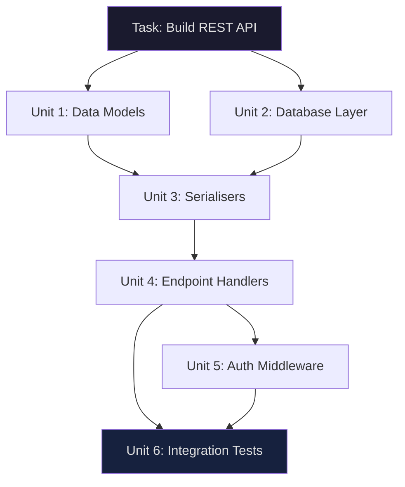
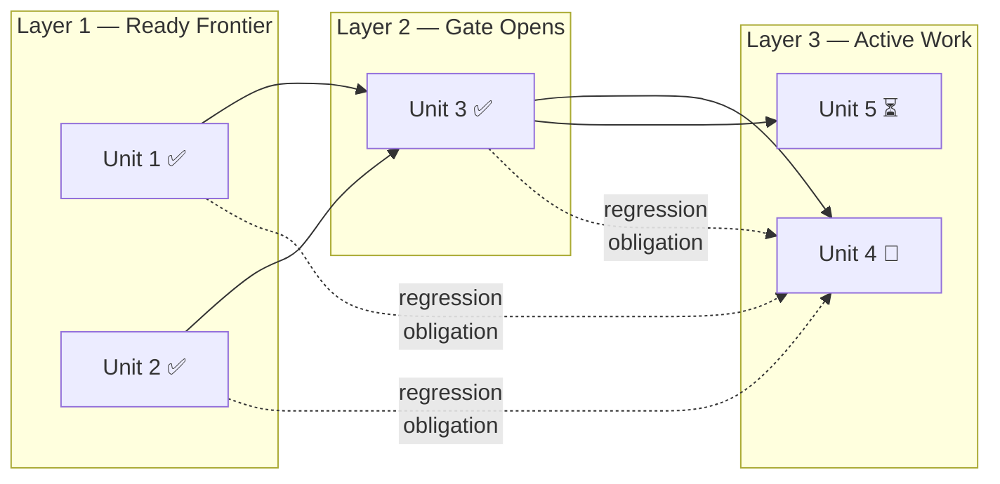
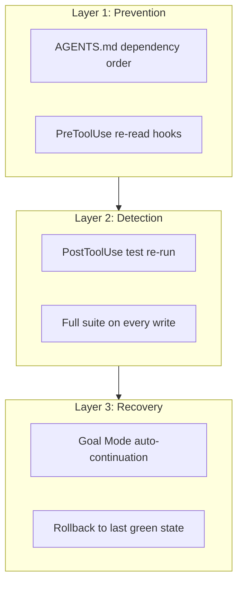

# LoopsBench and the DAG-Shaped Future of Loop Engineering: What the First Dependency-Aware Long-Horizon Benchmark Reveals About Codex CLI Session Strategy


---

Loop engineering — the discipline of designing systems that prompt agents on your behalf rather than prompting them yourself — has been the dominant architectural theme of 2026 [^1]. But until now, we have lacked a rigorous way to measure whether an agent can actually sustain multi-step development work across dependency chains without regressing previously completed work. LoopsBench, published by Microsoft Research on 31 July 2026, fills that gap [^2].

The headline finding is sobering: even the strongest configuration — Claude Opus 4.7 with Claude Code and outer continuation — resolves just 25% of tasks [^2]. The benchmark exposes three systemic failure modes that every Codex CLI practitioner running long-horizon sessions should understand and defend against.

## From Harness Engineering to Loop Engineering

The shift matters because it reframes where complexity lives. Harness engineering focuses on the execution environment: sandboxing, tool integration, permission boundaries. Loop engineering adds persistent control mechanisms above the harness — objectives, progress tracking, verification gates, and work distribution across extended execution [^2] [^3].

LoopsBench formalises this shift. Where SWE-bench evaluates single-shot bug fixes and SWE-bench Verified adds human validation, LoopsBench structures tasks as **dependency DAGs** — directed acyclic graphs where each node is a separately testable development unit and each edge encodes a prerequisite relationship [^2].



This structure mirrors how real software is built: you cannot write the serialisers until the data models exist, and you cannot write integration tests until the endpoints and auth middleware are in place.

## The Benchmark Architecture

LoopsBench comprises 112 tasks drawn from three authentic source categories spanning 8 programming languages and 9 domains [^2]:

| Source Category | Tasks | Description |
|---|---|---|
| PR Sequences | 29 | Merged pull request chains from open-source repositories |
| Course Labs | 57 | Released modules from structured programming courses |
| Research Evolutions | 26 | Methodological increments from computational research |

Each task decomposes into development units — more than 5,300 across the benchmark — with a median dependency depth of 6 [^2]. A materialised development unit is defined as a tuple containing a requirement, file/symbol scope, prerequisite set, reference patch, and standard tests.

### The Ready Frontier and Regression Obligations

The benchmark's **flow-aware runtime** is the key innovation. Rather than releasing all tests at once and scoring the final state, it releases tests layer by layer along the dependency DAG [^2]:

1. **Ready frontier**: at any checkpoint, the set of nodes whose predecessors have all passed their tests
2. **Gate nodes**: multi-predecessor nodes that join the ready frontier only after all dependencies are satisfied
3. **Regression obligations**: once a unit's tests pass, those tests remain enforced on every subsequent layer

This last point — regression obligations — is what makes LoopsBench fundamentally different from existing benchmarks. An agent cannot simply hack its way to passing later tests at the expense of breaking earlier work. Every edit is scored against both new objectives and all previously completed obligations [^2].



## What the Results Reveal

The evaluation covered five models across multiple agent harnesses. The resolve rates tell a clear story [^2]:

| Model | Resolve Rate (with continuation) |
|---|---|
| Claude Opus 4.7 | 25.00% |
| GPT-5.5 | 21.43% |
| Claude Opus 4.5 | 17.86% |
| Claude Sonnet 4.5 | 12.50% |
| Qwen3.6-Plus | 9.82% |

Three findings stand out for practitioners:

### 1. Outer Continuation Is Not Optional

Without outer continuation — an external loop that attempts residual work after the agent's primary run — Claude Opus 4.7's resolve rate drops from 25.00% to 16.96% [^2]. This 8-percentage-point gap demonstrates that long-horizon tasks require restart-and-resume infrastructure around the agent, not just a longer context window.

For Codex CLI, this maps directly to Goal Mode. The `/goal` command, shipped in v0.128.0, persists objectives as first-class runtime entities that survive compaction, terminal crashes, and machine reboots [^4]. The continuation mechanism injects a `goals/continuation.md` template at the end of each turn, evaluating whether to schedule another continuation [^4].

### 2. Planning Recovers Only Partial Structure

When evaluated on plan quality, the Claude Code loop achieved an edge F1 of 0.71 and a layer correlation (ρ) of 0.65 against the source-derived prerequisite DAG [^2]. In practical terms, agents recover roughly two-thirds of the dependency structure that humans encode in their PR sequences — enough to make progress, but prone to ordering errors that cascade into later failures.

### 3. Regression Events Persist Across All Configurations

The regression rate for the best configuration (Claude Opus 4.7 with Claude Code) was 7.11% [^2]. Dynamic workflow patterns showed 0.36 regression events per run, whilst goal-based loops showed 0.13 [^2]. Zero regression was never achieved. This confirms what practitioners have observed anecdotally: long-running agents break things they previously fixed.

## Configuring Codex CLI for Loop Engineering

LoopsBench's findings map to five concrete Codex CLI configuration decisions.

### 1. Enable Goal Mode for Outer Continuation

```toml
# ~/.codex/config.toml
[goal]
enabled = true
token_budget = 500000
continuation_policy = "auto"
```

Goal Mode provides the outer continuation that LoopsBench showed is worth 8 percentage points of resolve rate [^2] [^4]. The token budget prevents runaway costs whilst allowing enough headroom for multi-unit development loops.

### 2. Enforce Regression Testing via PostToolUse Hooks

LoopsBench's regression obligation concept should be enforced in practice. Configure a PostToolUse hook to re-run the full test suite after every write operation [^5]:

```json
{
  "event": "PostToolUse",
  "tool": "write",
  "command": "npm test -- --bail",
  "on_failure": "report"
}
```

The `--bail` flag exits on first failure, keeping feedback loops tight. This approximates LoopsBench's regression obligation model: previously passing tests remain enforced across every subsequent edit.

### 3. Structure AGENTS.md as a Dependency Guide

LoopsBench shows that agents recover only partial prerequisite structure autonomously. Compensate by encoding dependency order explicitly in AGENTS.md:

```markdown
## Development Order

1. **Data layer first**: models/ and migrations/ must compile and pass
   unit tests before touching any handler code.
2. **Serialisers depend on models**: never modify serialisers/ without
   first verifying model tests pass.
3. **Integration tests last**: do not write or modify tests/integration/
   until all unit test suites are green.
4. **Regression rule**: after every change, run the full test suite.
   Do not proceed if any previously passing test fails.
```

This effectively gives the agent a human-authored prerequisite DAG — precisely the structure LoopsBench shows agents fail to reconstruct independently.

### 4. Use Compaction-Aware Session Budgets

LoopsBench's dynamic workflows consumed an average of 97.96 context rounds, compared with 32.76–34.69 for goal-based loops [^2]. Longer sessions trigger more compaction events, which risk losing critical dependency context. Configure compaction to preserve structural information:

```toml
# ~/.codex/config.toml
[context]
compaction_strategy = "preserve_structure"
max_rounds_before_compact = 40
```

### 5. Route by Dependency Depth

LoopsBench tasks with deeper dependency chains demand stronger reasoning. Configure model routing to escalate based on task complexity [^6]:

```toml
# ~/.codex/config.toml
[model.profiles.loop-shallow]
model = "gpt-5.6-luna"
description = "Single-unit tasks, leaf nodes"

[model.profiles.loop-deep]
model = "gpt-5.6-sol"
description = "Multi-dependency tasks, gate nodes"
```

Use the shallow profile for independent units and the deep profile for gate nodes where multiple dependencies converge.

## The Regression Defence Stack

The 7.11% regression rate is LoopsBench's most actionable finding. A three-layer defence reduces regression risk in practice:



**Prevention**: encode dependency constraints in AGENTS.md and use PreToolUse hooks to force the agent to re-read affected files before editing them.

**Detection**: PostToolUse hooks running the test suite after every tool call catch regressions within the same turn, before compaction loses the context of what changed.

**Recovery**: Goal Mode's continuation mechanism retries failed units, and git-based rollback to the last passing commit provides a hard reset when the agent enters a regression loop.

## What LoopsBench Does Not Measure

Two limitations are worth noting. First, LoopsBench evaluates single-agent loops. Real-world Codex CLI deployments increasingly use multi-agent patterns — an orchestrator delegating to specialist subagents via worktree isolation [^7]. The interaction between loop engineering and multi-agent coordination remains uncharted benchmarking territory.

Second, the benchmark's DAGs are derived from human development sequences. Whether agents would benefit from different decomposition strategies — flatter graphs with more independent units, for instance — is an open question that LoopsBench's fixed structure cannot answer.

## Practical Takeaways

LoopsBench crystallises three lessons for Codex CLI practitioners:

1. **Outer continuation is not optional** — Goal Mode's auto-continuation provides the restart-and-resume infrastructure that LoopsBench shows is worth 8 percentage points of resolve rate.

2. **Regression obligations must be enforced externally** — agents do not maintain regression discipline autonomously. PostToolUse test hooks and AGENTS.md constraints are load-bearing infrastructure, not optional documentation.

3. **Dependency structure must be human-authored** — agents recover roughly two-thirds of prerequisite DAG structure. The remaining third must come from explicit AGENTS.md rules and project conventions.

The 25% resolve rate ceiling is not a model problem alone — it is a loop engineering problem. The teams that close the gap will be those who design their Codex CLI configurations to enforce the dependency awareness and regression discipline that LoopsBench proves agents cannot yet maintain on their own.

## Citations

[^1]: Osmani, A. "Loop Engineering," *Elevate* (Substack), June 2026. Defined the five-component loop architecture: discovery, task decomposition, orchestration, verification, and persistent memory. <https://addyo.substack.com/p/loop-engineering>

[^2]: Li, H., Fang, Z., Feng, R., Zhao, Y., Liu, J., Gao, P., Ye, H., Lin, D., Lin, Q., Rajmohan, S. & Zhang, D. "LoopsBench: From Harness Engineering to Loop Engineering in Benchmarking Coding Agent," arXiv:2608.00267, July 31, 2026. 112 tasks, 5,300+ development units, 8 languages, 9 domains; best resolve rate 25.00% (Opus 4.7/Claude Code/outer continuation); regression rate 7.11%; edge F1 0.71 for plan quality; open-sourced at microsoft/Loopsbench. <https://arxiv.org/abs/2608.00267>

[^3]: Macedo, S. "Stop Hand-Holding Your Coding Agent: Engineering the Loops that Replace Step-by-Step Prompting," arXiv:2607.00038, July 2026. Framework for designing feedback mechanisms and iterative patterns enabling autonomous agent iteration. <https://arxiv.org/abs/2607.00038>

[^4]: OpenAI. "Codex CLI /goal command," Codex CLI v0.128.0 release, April 30, 2026. Persistent objective storage, continuation template injection, and token budget enforcement for long-horizon agentic loops. <https://learn.chatgpt.com/docs/changelog>

[^5]: OpenAI. "Codex CLI Hooks Reference — hooks.json, PreToolUse & PostToolUse," Codex CLI documentation, 2026. PostToolUse event fires after every tool call for audit and verification; PreToolUse for pre-edit validation. <https://agenticcontrolplane.com/blog/codex-cli-hooks-reference>

[^6]: OpenAI. "Codex CLI Changelog — GPT-5.6 Sol, Terra, and Luna model support," July 2026. Named model profiles for task-tier routing with first-class max reasoning effort support. <https://developers.openai.com/codex/changelog>

[^7]: Codex Knowledge Base. "Running Multiple Codex Agent Instances: Parallel Orchestration Patterns," April 2026. Worktree isolation, tmux-based orchestration, and native subagent delegation patterns. <https://codex.danielvaughan.com/2026/04/18/running-multiple-codex-agents-parallel-orchestration/>
