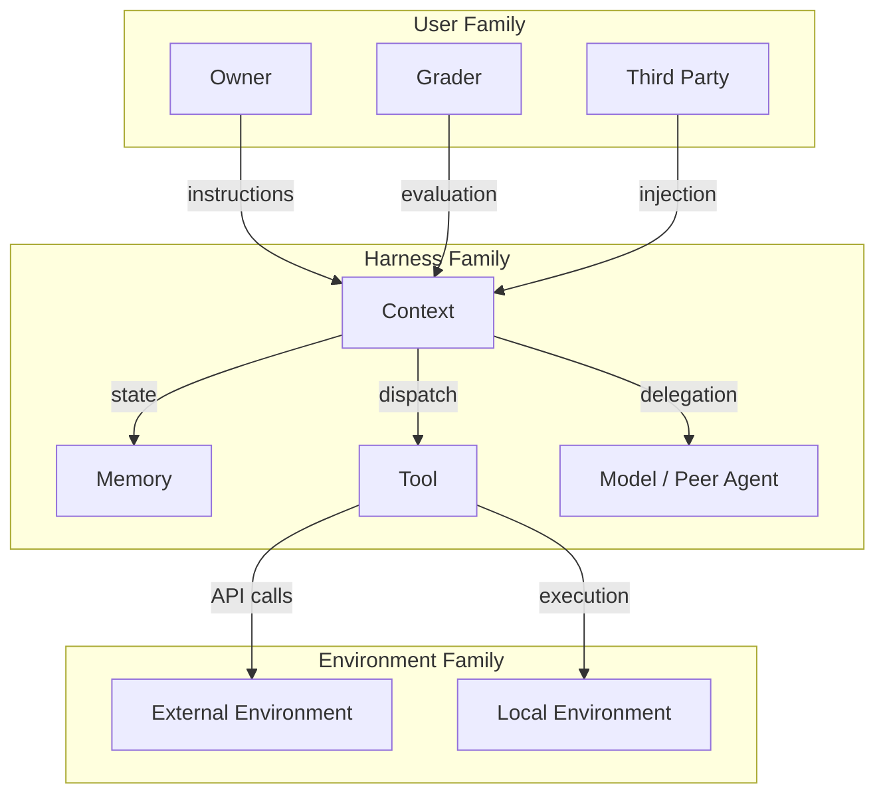
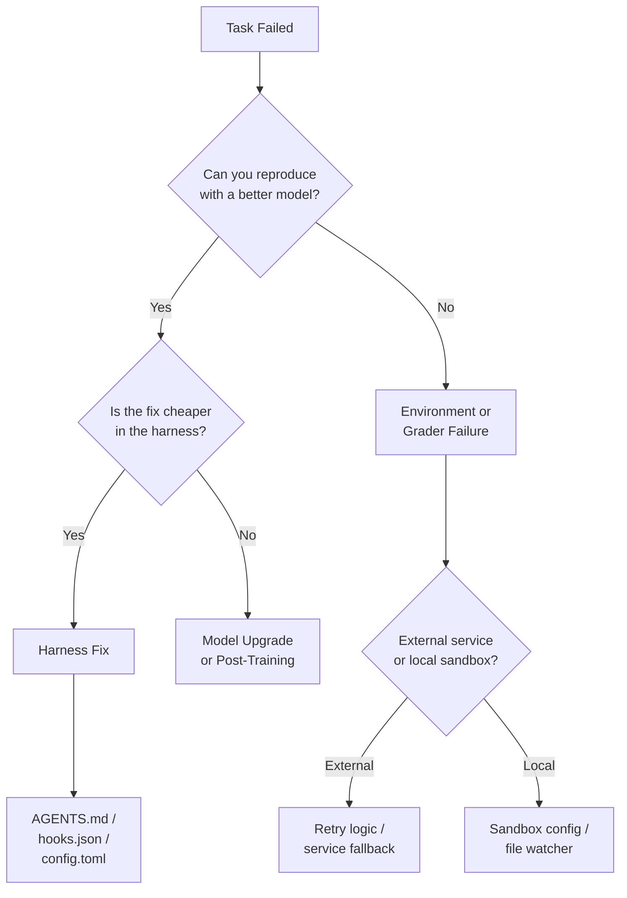

# Model or Harness? Using the Interaction-Centric Failure Taxonomy to Debug Your Codex CLI Workflows


---

When a Codex CLI session goes sideways — hallucinated tool calls, ignored AGENTS.md rules, context drift mid-task — the instinctive response is to blame the model. Swap in a higher tier. Throw more context at it. Retry. But a growing body of research suggests that most agent failures originate outside the model itself, in the scaffolding, tool integration, and environment configuration that wrap it. A new taxonomy published on 28 July 2026 gives practitioners a structured vocabulary for localising those failures — and, crucially, for choosing the right fix.

## The Attribution Problem

A coding agent is not a model. It is a composite system: model, harness (context management, memory, tool dispatch, hooks), and environment (sandbox, filesystem, network). When a task fails, the visible symptom — wrong file edited, test not run, linter ignored — tells you almost nothing about which component broke down [^1].

Previous failure taxonomies, including the MAST framework's 14 failure modes derived from 1,642 execution traces [^2] and the 20,574-session developer–agent misalignment study [^3], classified failures by their *form* (what went wrong) rather than their *origin* (where to fix it). This left teams in a loop: observing symptoms, guessing at causes, and applying scattergun interventions.

## The Interaction-Centric Taxonomy

Raj et al.'s "Model or Harness?" paper [^1] reframes agent failures as interaction failures. Rather than asking "what broke?", it asks "which interaction between which components broke, and which side is at fault?"

The taxonomy identifies 41 distinct failure modes, each assigned to:

- An **interaction edge** between two of nine system components
- A **fault side** indicating where the repair belongs

The nine components are organised into three families:



### The 36/5 Split

Of the 41 failure modes, 36 are attributed to the model — defined by the rule that "a failure is model-side when a more capable model could have prevented it or recovered from it" [^1]. Only five failures are harness-side or environment-side, identifying cases where no amount of model capability can compensate for a broken scaffold.

This asymmetry sounds like it validates the "just upgrade the model" instinct. It does the opposite. The five non-model failures — things like stale state delivery from the environment, service failures, and observation failures — are precisely the ones that upgrading from Luna to Sol will never fix. And in practice, many of the 36 "model-side" failures are far more cheaply addressed by harness improvements than by model upgrades.

## Mapping Failures to Codex CLI Components

The taxonomy maps cleanly onto Codex CLI's architecture. Here is how the three failure families correspond to configuration you can actually change:

### User–Model Failures (10 modes)

These include over-initiative, under-initiative, instruction-following failure, and sycophancy. In Codex CLI terms, they trace to:

- **AGENTS.md quality** — vague or contradictory rules cause instruction-following failures
- **`approval_policy` settings** — overly permissive policies enable over-initiative; overly restrictive ones cause under-initiative and satisficing [^4]
- **Model selection** — domain knowledge deficits point to using the wrong tier (Luna for a task that needs Terra-level reasoning)

### Harness–Model Failures (24 modes)

The largest category, covering context, memory, tool, and multi-agent interactions:

| Failure Mode | Codex CLI Root Cause | Fix Layer |
|---|---|---|
| State Tracking Failure | Context compaction discarding relevant state | `compaction_strategy` in config.toml |
| Goal Drift | Long sessions without goal anchoring | `/goal` mode with success criteria |
| Context Rationale Erosion | Compaction removing reasoning chain | PostToolUse hooks to checkpoint rationale |
| Incorrect Tool Selection | Ambiguous tool names in MCP servers | Tool descriptions in MCP manifests |
| Tool Hallucination | Model inventing tools that do not exist | `allowed_tools` in AGENTS.md |
| Malformed Arguments | Schema mismatch between model expectation and tool | MCP input schema validation |
| Missed Write (Memory) | Facts not persisted across sessions | `~/.codex/memory/` markdown files |
| State Staleness | Reading cached file content after external edit | PreToolUse re-read hooks [^5] |
| Delegation Failure | Subagent receiving insufficient context | Custom agent definitions in config.toml |

### Environment Failures (7 modes)

These are the failures no model upgrade can fix:

- **Recovery Failure** — sandbox crashes or network timeouts where the agent cannot retry. Fix: configure `sandbox_mode` appropriately and set timeouts in hooks.json
- **Service Failure** — external API outages. Fix: PostToolUse hooks that detect HTTP errors and inject retry guidance
- **Stale State Delivery** — the file watcher missing an external edit. Fix: the `codex-file-watcher` crate's workspace drift detection [^5]
- **Observation Failure** — tool output truncated or malformed. Fix: increase `max_tool_output_tokens` or post-process output in PostToolUse

## Practical Debugging with the Taxonomy

Here is a diagnostic flow for applying the taxonomy when a Codex CLI task fails:



### Step 1: Reproduce with a Higher Tier

Run the same task with `--model gpt-5.6-sol`. If it succeeds, the failure is model-side — but that does not mean upgrading is the right fix. Check whether an AGENTS.md rule, a hook, or a tool schema change would prevent the failure at the current tier.

### Step 2: Check the Interaction Edge

Examine the session transcript in `~/.codex/sessions/`. Identify the first divergence point. Was it:

- A tool call with wrong arguments? → Tool interaction, likely fixable with schema
- A rule violation? → User–model interaction, fixable with clearer AGENTS.md
- A stale file read? → Environment interaction, fixable with PreToolUse hooks

### Step 3: Apply the Fault-Side Rule

If a harness change (hook, config, AGENTS.md rule) can prevent the failure without changing the model, it is a harness fix regardless of the taxonomy's formal attribution. The paper's own validation shows that LIFE-Harness, evolved from training-trajectory failures of a single 4B model, improved 116 out of 126 model–environment settings with an average 88.5% relative improvement when reused unchanged across 17 other model backbones [^6].

## Configuring Codex CLI as a Failure-Aware Harness

The taxonomy's practical value lies in treating your Codex CLI configuration as harness engineering. Here are concrete patterns:

### PostToolUse Hooks for Observation Failures

```json
{
  "hooks": {
    "PostToolUse": [
      {
        "matcher": "Bash",
        "hooks": [
          {
            "type": "command",
            "command": "python3 ~/.codex/hooks/check_exit_code.py",
            "statusMessage": "Verifying tool execution",
            "timeout": 10
          }
        ]
      }
    ]
  }
}
```

A PostToolUse hook fires after each tool call returns, with stdout, stderr, and exit code available. It cannot undo side effects, but it can inject a `systemMessage` into the conversation to steer recovery — addressing the "Recovery Failure" mode at the harness level [^7].

### AGENTS.md Rules for Instruction-Following Failures

When the taxonomy identifies instruction-following failure, the fix is almost never a model change. It is a clearer rule:

```markdown
## Constraints (non-negotiable)

- NEVER delete files without explicit user confirmation
- ALWAYS run `pnpm test` after modifying any `.ts` file
- If a tool call fails twice, STOP and ask the user for guidance
```

Specificity matters. The 20,574-session study found that constraint violations grew as a share of failures over time even as overall failure rates declined [^3] — suggesting that models get better at tasks but not at following ambiguous rules.

### Config.toml for Context Erosion

```toml
[model]
name = "gpt-5.6-terra"

[context]
compaction_strategy = "aggressive"
max_tool_output_tokens = 4096

[sandbox]
mode = "workspace-write"
```

Context rationale erosion — where compaction strips the reasoning chain that justified earlier decisions — is a harness-side failure. Adjusting `compaction_strategy` or switching to `/goal` mode with explicit success criteria anchors the conversation against drift.

## Validation: Can LLMs Self-Diagnose?

The paper tested whether frontier models could apply the taxonomy as independent judges. GPT-5.5 achieved Cohen's κ = 0.76 against human category labels; inter-judge agreement across four models reached κ = 0.84. Selective voting with three-judge consensus achieved 0.83 precision at 90% coverage [^1].

This suggests a practical workflow: after a failed session, feed the transcript to a separate model with the taxonomy as a system prompt and ask it to classify the failure mode and fault side. Codex CLI's `codex exec` could automate this as a post-mortem step.

## The Harness Engineering Mindset

The deeper lesson from the taxonomy — and from the complementary "Inside the Scaffold" study of 13 open-source coding agent architectures [^8] — is that agent performance is a function of the entire system, not just the model. The scaffold study found that 11 of 13 agents compose multiple loop primitives (ReAct, generate-test-repair, plan-execute) rather than relying on a single control structure.

Codex CLI gives you the levers to engineer that harness: hooks.json for tool-level policy, AGENTS.md for instruction anchoring, config.toml for model routing and context management, and the sandbox for environment isolation. The taxonomy tells you which lever to pull.

Stop blaming the model. Start debugging the system.

---

## Citations

[^1]: Raj, H., Gupta, V., Mahmoud, A., Dumitru, R.-G., Yi, D., Sabharwal, A., & He, Y. (2026). "Model or Harness? An Interaction-Centric Taxonomy for Localizing Agent Failures." arXiv:2607.28802. [https://arxiv.org/abs/2607.28802](https://arxiv.org/abs/2607.28802)

[^2]: Li, Z. et al. (2026). "Silent Failure in LLM Agent Systems: The Entropy Principle and the Inevitable Disorder of Autonomous Agents." arXiv:2606.08162. MAST taxonomy: 14 failure modes across Specification Issues (41.77%), Inter-Agent Misalignment (36.94%), and Task Verification (21.30%). [https://arxiv.org/abs/2606.08162](https://arxiv.org/abs/2606.08162)

[^3]: Tang, N., Chen, C., Xu, G., Shi, Y., Huang, Y., McMillan, C., Dong, T., & Li, T. J.-J. (2026). "How Coding Agents Fail Their Users: A Large-Scale Analysis of Developer-Agent Misalignment in 20,574 Real-World Sessions." arXiv:2605.29442. [https://arxiv.org/abs/2605.29442](https://arxiv.org/abs/2605.29442)

[^4]: OpenAI. (2026). "Agent Approvals & Security." Codex Developer Documentation. [https://developers.openai.com/codex/agent-approvals-security](https://developers.openai.com/codex/agent-approvals-security)

[^5]: OpenAI. (2026). "Hooks." Codex Developer Documentation. Hook event types include PreToolUse and PostToolUse for file-watcher integration and workspace drift detection. [https://developers.openai.com/codex/hooks](https://developers.openai.com/codex/hooks)

[^6]: Cobus Greyling. (2026). "The Four-Layer Agent Failure Taxonomy." LIFE-Harness improved 116/126 model–environment settings with 88.5% average relative improvement across 17 model backbones. [https://cobusgreyling.medium.com/the-four-layer-agent-failure-taxonomy-0183920998ed](https://cobusgreyling.medium.com/the-four-layer-agent-failure-taxonomy-0183920998ed)

[^7]: OpenAI. (2026). "Hooks — PostToolUse Reference." Codex CLI hooks support systemMessage injection and continue/stopReason control after tool execution. [https://developers.openai.com/codex/hooks](https://developers.openai.com/codex/hooks)

[^8]: "Inside the Scaffold: A Source-Code Taxonomy of Coding Agent Architectures." arXiv:2604.03515. Analysis of 13 open-source coding agent scaffolds across 12 architectural dimensions. [https://arxiv.org/abs/2604.03515](https://arxiv.org/abs/2604.03515)
