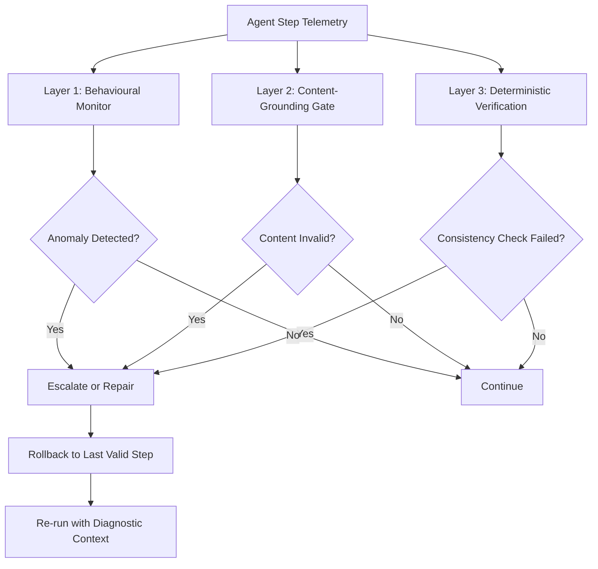
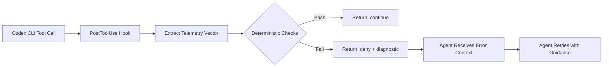

# Real-Time Failure Detection for Coding Agents: What Ultra-Lightweight Monitors Mean for Codex CLI Session Reliability


---

LLM coding agents fail in predictable ways — looping on the same command, cascading tool errors, drifting off the original goal, fabricating results that look plausible but are wrong. The standard remedy is a second LLM acting as judge, but that doubles latency and cost. New research by Dubey (August 2026) demonstrates that ultra-lightweight telemetry monitors running at approximately 200 microseconds per step can detect 71% of agent failures at a 5% false-alarm budget, and that rolling back flagged episodes recovers 45% of them — lifting overall task success from 52% to 73% [^1]. This article examines what those findings mean for Codex CLI practitioners building reliable autonomous workflows.

## The Failure Taxonomy

Dubey's work identifies five dominant failure classes observed across 2,823 agent episodes spanning three frameworks (bespoke harnesses, LangGraph, AutoGen) and four model families [^1]:

| Failure Class | Description | Detection Difficulty |
|---|---|---|
| **Looping** | Agent repeats the same action or action sequence | Easy — high behavioural signal |
| **Tool cascade** | One tool error triggers a chain of dependent failures | Moderate — signal depends on cascade length |
| **Goal drift** | Agent gradually abandons the original objective | Hard — subtle trajectory divergence |
| **Context corruption** | Wrong document or data injected into reasoning | Very hard — content looks structurally valid |
| **Fabrication** | Agent invents results rather than computing them | Very hard — output format is correct |

The critical insight is that different detection mechanisms excel at different failure classes. No single monitor catches everything, which is why the paper's layered architecture matters.

## The Three-Layer Detection Architecture

The research proposes three complementary detection layers, each with different strengths and zero dependency on model internals [^1].



### Layer 1: Behavioural Statistical Monitor

A one-class echo-state-network (ESN) ensemble with CUSUM alarms, trained exclusively on healthy episodes. The telemetry vector spans 43–60 dimensions covering semantic embeddings (via deterministic character trigram hashing — no encoder download required), token-uncertainty aggregates, and action metadata [^1].

Key performance characteristics:

- **AUROC:** 0.777–0.885 depending on model family and horizon length
- **Fitting time:** 1.7 seconds on healthy-only data
- **Per-step cost:** ~200 microseconds
- **Horizon advantage:** +0.09 at ≤3 steps post-onset, +0.40 at ≥9 steps [^1]

That horizon scaling property is significant for Codex CLI users. Long-running Goal Mode sessions — the exact scenario where failures are most costly — are precisely where the monitor becomes most effective.

### Layer 2: Content-Grounding Gate

Addresses the behavioural monitor's blind spot on content corruption. Computes query-result dissimilarity, validates JSON structure, and flags character-level anomalies in tool outputs [^1].

Impact on detection rates:

- Content corruption detection: 0.27 → 0.58 (gaining 96 detections, losing none)
- Malformed JSON detection: 0.07 → 0.90
- Existing behavioural detection preserved: 0.74 → 0.79 [^1]

### Layer 3: Deterministic Verification

Three checks requiring no statistical training, no healthy baseline, and no calibration:

1. **Total consistency:** Recomputes the run's stated total from actual tool results received
2. **Required coverage:** Confirms all mandatory tool calls were made
3. **Tool contract validation:** Verifies result shapes against tool specifications [^1]

Performance: 60% failure detection at **zero** false positives. With the coverage check enabled, detection rises to 96% [^1]. The deterministic layer transfers unchanged across different models without retraining — a property the statistical monitors lack.

## The Calibration Non-Transfer Problem

One finding demands particular attention. When the ESN monitor was calibrated on Qwen 2.5 7B and deployed against Llama 3.1 8B on matched tasks with matched tool configurations, performance collapsed to chance level (AUROC 0.527, false-alarm rate 0.75). Recalibrated on its own healthy runs, the same target reached 0.885 [^1].

This means deployment-specific calibration is mandatory. You cannot train a monitor on one model and deploy it against another — the healthy-run distribution shifts enough to invalidate thresholds entirely.

For Codex CLI users who switch between GPT-5.6 Sol, Terra, and Luna via model routing [^2], this implies that any monitor-style hook logic needs separate calibration data per model tier. The deterministic verification layer sidesteps this constraint entirely, making it the more robust starting point for most teams.

## The Repair Mechanism

When a check fires, the system rolls back to the last fact-gathering step and re-runs the episode. Results across 55 genuinely-wrong episodes [^1]:

| Repair Strategy | Recovery Rate | Statistical Significance |
|---|---|---|
| Untouched baseline | 0% | — |
| Resampling control (re-run without guidance) | 16% | — |
| Located (check name only) | **45%** | p=0.0005 |
| Generic re-check instruction | 36% | p=0.035 |
| Specific finding with values | 36% | p=0.019 |

The "located" strategy — telling the agent *which* check failed but not providing the specific values — proved most effective. Net task success across 120 episodes rose from 52% to 73%, at a cost of approximately one extra model call per run. Critically, zero correct runs were broken by the repair process [^1].

## Mapping to Codex CLI's Hook Architecture

Codex CLI's PostToolUse hook system fires after every tool call, passing a JSON payload on stdin and reading a JSON response from stdout [^3]. This is architecturally equivalent to the per-step telemetry tap that Dubey's monitors require.



A practical PostToolUse hook implementing the deterministic verification layer:

```bash
#!/usr/bin/env bash
# hooks/verify-tool-output.sh
# Deterministic verification for PostToolUse

INPUT=$(cat)
TOOL_NAME=$(echo "$INPUT" | jq -r '.tool_name // empty')
TOOL_OUTPUT=$(echo "$INPUT" | jq -r '.output // empty')

# Tool contract validation: check output shape
if [ "$TOOL_NAME" = "shell" ]; then
  EXIT_CODE=$(echo "$INPUT" | jq -r '.exit_code // 0')

  # Detect looping: compare with last N outputs
  HASH=$(echo "$TOOL_OUTPUT" | sha256sum | cut -d' ' -f1)
  HISTORY_FILE="/tmp/codex-hook-history-$$"

  if grep -q "$HASH" "$HISTORY_FILE" 2>/dev/null; then
    REPEAT_COUNT=$(grep -c "$HASH" "$HISTORY_FILE")
    if [ "$REPEAT_COUNT" -ge 3 ]; then
      echo '{"status":"deny","reason":"Loop detected: identical output seen '"$REPEAT_COUNT"' times. Try a different approach."}'
      exit 0
    fi
  fi
  echo "$HASH" >> "$HISTORY_FILE"
fi

# Required coverage: track which tools have been called
COVERAGE_FILE="/tmp/codex-coverage-$$"
echo "$TOOL_NAME" >> "$COVERAGE_FILE"

echo '{"status":"continue"}'
```

### The Hook Coverage Gap

⚠️ A known limitation bears mentioning: Codex CLI's hook system currently has incomplete coverage. Only `shell` (Bash), `unified_exec`, `apply_patch`, and MCP tools emit hook events. Other tool handlers fall back to trait defaults that skip hooks entirely [^4]. This means any monitoring strategy built on PostToolUse hooks silently loses visibility over a portion of the agent's tool surface.

Until this gap is closed, the deterministic verification layer's advantage — zero dependence on telemetry completeness for the checks it *can* run — becomes even more valuable. Monitor what you can; verify what you must.

## Configuring Observability for Monitor-Ready Sessions

Codex CLI's native OpenTelemetry integration provides the telemetry substrate that statistical monitors require [^5]. A configuration that exposes the necessary signals:

```toml
# config.toml — monitor-ready observability
[telemetry]
enabled = true
export_format = "otlp"    # OpenTelemetry Protocol
endpoint = "http://localhost:4317"

[hooks]
post_tool_use = ["bash hooks/verify-tool-output.sh"]

[sandbox]
# Workspace-write sandbox for Goal Mode sessions
writable_roots = ["."]
network_access = true
```

For headless `codex exec` sessions — the overnight agent pattern where failures are costliest — the `--json` flag streams JSONL telemetry that can feed an external monitor process:

```bash
codex exec \
  --model gpt-5.6-terra \
  --sandbox workspace-write \
  --json \
  "Refactor the authentication module" \
  2>&1 | tee /tmp/session.jsonl | python3 monitor.py
```

## The Judge Calibration Warning

A sobering secondary finding: Dubey measured the actual detection performance of an LLM judge (Gemini 2.5 Flash) rather than assuming its reliability. The stipulated rates were p_detect=0.90 and p_false=0.02. The measured rates were p_detect=0.548 and p_false=0.052 [^1].

When substituting measured rates into the escalation strategy, detection recovery fell from 82% to 43%. The judge and the statistical monitor fail on *different* classes: the judge is perfect on goal drift (21/21) but nearly blind on context corruption (0.18); the monitor pattern is reversed [^1].

This has a direct implication for teams using LLM-as-judge in their Codex CLI verification pipelines. If your PostToolUse hooks delegate to a second model for verification, measure its actual detection rate on your failure distribution rather than assuming it works. The deterministic checks — which require no model at all — may outperform your judge on precisely the failure classes that matter most.

## Practical Recommendations

**Start with deterministic verification.** The zero-false-positive, zero-calibration, cross-model-transferable deterministic layer catches 60% of failures immediately. Implement tool-output consistency checks and required-coverage tracking in PostToolUse hooks today.

**Add behavioural monitoring for long sessions.** If you run Goal Mode sessions exceeding 9 steps, the ESN monitor's +0.40 horizon advantage justifies the calibration investment. Collect healthy-run telemetry per model tier and fit the reservoir offline.

**Implement the "located" repair strategy.** When a check fires, tell the agent *which* check failed but let it determine the fix. This 45% recovery rate at one extra model call is the best cost-reliability trade-off in the paper.

**Measure your judges.** If you use LLM-as-judge verification in hooks or CI pipelines, instrument the judge's actual detection rate against known-bad episodes. The 40-percentage-point gap between assumed and measured performance should make every team uncomfortable.

**Watch the hook coverage gap.** Track issue #20204 for expanded PostToolUse coverage across all tool handlers [^4]. Until resolved, supplement hook-based monitoring with `--json` JSONL streaming for complete visibility.

## Citations

[^1]: Dubey, S. (2026). "Real-Time Detection and Repair of LLM Agent Failures." arXiv:2608.02464. [https://arxiv.org/abs/2608.02464](https://arxiv.org/abs/2608.02464)

[^2]: OpenAI. (2026). "Models — Codex." ChatGPT Learn documentation. [https://learn.chatgpt.com/docs/models](https://learn.chatgpt.com/docs/models)

[^3]: OpenAI. (2026). "Hooks — Codex." ChatGPT Learn documentation. [https://developers.openai.com/codex/hooks](https://developers.openai.com/codex/hooks)

[^4]: GitHub Issue #20204. "Inconsistent PreToolUse hook coverage across tool handlers." openai/codex. [https://github.com/openai/codex/issues/20204](https://github.com/openai/codex/issues/20204)

[^5]: OpenAI. (2026). "Codex CLI OpenTelemetry: Observability and Metrics in Production." Codex Knowledge Base. [https://codex.danielvaughan.com/2026/03/28/codex-cli-opentelemetry-observability/](https://codex.danielvaughan.com/2026/03/28/codex-cli-opentelemetry-observability/)
