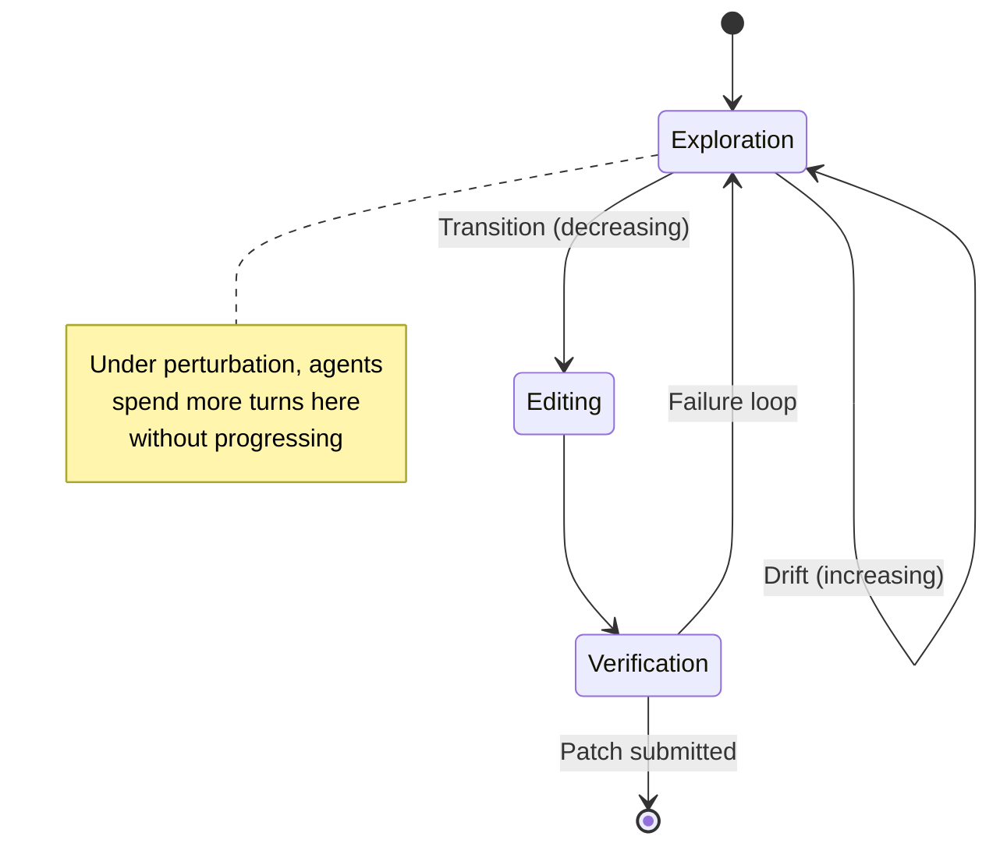
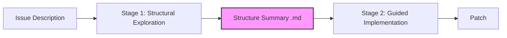

# RepoMirage and the Repository Context Reasoning Gap: Why Your Coding Agent Explores Everything and Understands Nothing


---

Your coding agent can resolve single-file bugs with impressive accuracy. Hand it a stack trace pointing to one method in one file and it will nail the fix. But what happens when the bug lives at the intersection of three modules, two proxy layers and an externalised configuration file? Performance craters — not because the model lacks capability, but because the *harness* never taught the agent how to reason about repository structure.

That is the core finding of **RepoMirage**, a perturbation-based evaluation suite published by Li et al. in May 2026 [^1]. The paper introduces a diagnostic framework built on SWE-Bench Verified that systematically stresses repository context reasoning — the ability to identify task-relevant information across multiple files and reason over cross-file relationships — by applying semantics-preserving transformations to the repository itself. The results are sobering: average resolve rates collapsed from **66.8% to 25.3%** on the most demanding tasks, exposing a structural blind spot in how every major coding agent navigates real-world codebases.

## What RepoMirage Measures

RepoMirage operates in two stages, each designed to isolate a different dimension of context reasoning failure.

### Stage 1: RepoMirage-Perturb

Three semantics-preserving perturbations are applied to SWE-Bench Verified repositories. The code still compiles, passes tests and behaves identically — but the *structural layout* changes:

| Perturbation | What It Does | Why It Matters |
|---|---|---|
| **Dependency-path indirection** | Replaces direct imports with four-layer proxy chains | Forces multi-hop dependency tracing |
| **Runtime-target masking** | Renames target files, wraps them in module directories, places decoy files nearby | Requires distinguishing real targets from plausible fakes |
| **Local-value externalisation** | Moves constant definitions into external JSON resource files | Demands cross-file data-flow reasoning |

On the same issue-resolution task, average resolved rates dropped from **66.8% to 49.78%** [^1]. Individual model degradation ranged from 15.96% (Claude Sonnet 4.6, the most resilient) to a striking 52.6% (GPT-4.1). File access increased from 4.77 to 13.24 files on average — agents searched harder but solved less.

### Stage 2: RepoMirage-Extend

The second stage converts the structural bottlenecks from Stage 1 into four explicit task families that go beyond issue resolution:

- **Multi-file issue resolution** — gold patches spanning multiple files (17.86% success)
- **Proxy chain completion** — restoring missing intermediate imports (17.19% success)
- **Runtime target identification** — distinguishing actual runtime files from decoys
- **Missing-constant recovery** — reconstructing key-value mappings from externalised resources

Average performance across these tasks fell to **25.25%** [^1], confirming that the context reasoning deficit is not a minor edge case but a fundamental capability gap.

## Exploration Drift: The Behavioural Signature

The most actionable finding from RepoMirage is the identification of **exploration drift** — a measurable behavioural pattern where agents respond to increased repository complexity by accessing more files but failing to convert that exploration into structural understanding.



Analysis of agent trajectories revealed that the transition probability from exploration-to-exploration *increased* under perturbation, whilst exploration-to-editing transitions *decreased* [^1]. The agent gathers context voraciously but never crystallises it into a coherent structural model that would guide editing decisions. It is the coding agent equivalent of reading every page of a textbook without ever taking notes.

## Eight Frontier Models, One Shared Weakness

RepoMirage evaluated eight frontier models: GPT-4.1, GPT-5, DeepSeek-V3.2, Gemini 3.1 Pro, Claude Sonnet 4.6, MiniMax-M2.7, Qwen3-Coder-Next and Qwen3.6-35B-A3B [^1]. Every model suffered degradation under perturbation. The variation in *degree* of degradation suggests that some models have better implicit structural reasoning, but none exhibited the explicit structure-first behaviour needed to handle complex repository topologies reliably.

This finding aligns with two complementary 2026 benchmarks:

- **SWE-Explore** (Zhang et al., June 2026) isolates repository exploration as a standalone capability, scoring agents on ranked, line-level context selection across 848 instances in 10 languages and 203 repositories [^2]. By decoupling exploration from patch generation, it demonstrates that exploration quality is a distinct, measurable skill — and one that current agents under-invest in.

- **Probe-and-Refine Tuning** (Shepard & Albrecht, June 2026) shows that iteratively optimising a repository's guidance file (analogous to AGENTS.md) using synthetic bug-fix probes raises resolve rates from 25.5% (unguided) to 33.0% — a gain driven by *coverage* rather than precision [^3]. More instances become solvable because the refined guidance helps agents locate relevant code, not because the patches themselves improve.

## RepoAnchor: The Structure-First Fix

The RepoMirage authors propose **RepoAnchor**, a two-stage workflow that directly addresses exploration drift by separating structural understanding from implementation:

**Stage 1 — Structural Exploration:** The agent examines the codebase and writes a structured summary into an intermediate Markdown file. This summary records potential editing locations, runtime relations, relevant files and cross-file dependencies.

**Stage 2 — Guided Implementation:** The agent receives this structural summary alongside the task description and focuses exclusively on implementation, editing and patch generation.



RepoAnchor consistently improved performance across all evaluated models and all RepoMirage-Extend task types [^1]. The insight is deceptively simple: make structural understanding an *explicit artefact* rather than an implicit byproduct of the agent loop.

## Mapping to Codex CLI: Practical Defences Against Exploration Drift

RepoMirage's findings translate directly into Codex CLI configuration patterns. Here are four concrete strategies for hardening your workflows against repository context reasoning failures.

### 1. Structure-First AGENTS.md Conventions

Encode explicit structural navigation rules in your `AGENTS.md`:

```markdown
## Repository Navigation Rules

1. Before editing ANY file, produce a dependency map covering:
   - Direct imports of the target module
   - Reverse dependencies (files that import the target)
   - Configuration files that supply runtime values
2. Write findings to `_exploration_notes.md` before proceeding
3. Never edit a file you have not traced at least one import chain for
```

This mirrors RepoAnchor's separation of exploration from implementation. The `_exploration_notes.md` file acts as the structural summary, forcing the agent to crystallise its understanding before acting. ⚠️ Note: there is no native Codex CLI mechanism to *enforce* this sequencing — compliance depends on model instruction-following.

### 2. Explorer Subagent for Structural Mapping

Codex CLI ships three built-in agent roles: `default`, `worker` and `explorer` [^4]. The `explorer` role is read-heavy by design, making it ideal for the structural exploration phase:

```toml
# config.toml — dedicated exploration subagent
[agents.structure-mapper]
role = "explorer"
model = "gpt-5.6-terra"
instructions = """
Map the dependency structure of the target module.
Output a structured summary including:
- import chains (up to 4 hops)
- runtime configuration sources
- files with similar names that are NOT direct dependencies
Do NOT make any edits.
"""
```

By routing structural exploration to a dedicated subagent before handing off to a `worker` for implementation, you replicate RepoAnchor's two-stage architecture within the native Codex CLI multi-agent framework.

### 3. PostToolUse Hooks for Drift Detection

Exploration drift manifests as repeated file reads without corresponding edits. A `PostToolUse` hook can detect this pattern and inject a course correction:

```toml
# .codex/hooks.toml
[[hooks]]
event = "PostToolUse"
tool = "read_file"
command = """
READS=$(grep -c 'read_file' /tmp/codex-tool-log 2>/dev/null || echo 0)
EDITS=$(grep -c 'write_file\\|apply_patch' /tmp/codex-tool-log 2>/dev/null || echo 0)
if [ "$READS" -gt 15 ] && [ "$EDITS" -eq 0 ]; then
  echo "DRIFT_WARNING: $READS reads with 0 edits. Pause exploration and summarise findings before continuing."
fi
"""
```

⚠️ This is a heuristic — the threshold will need tuning for your codebase size. The key principle is making drift *visible* rather than letting it silently consume your token budget.

### 4. Structural Context in MCP Knowledge Graphs

For large repositories, pre-computed structural indexes delivered via MCP servers can short-circuit the exploration phase entirely. Tools like SymDex and CodeGraph MCP servers [^5] expose dependency graphs, call hierarchies and module boundaries as queryable resources. When the agent can *ask* for the import chain rather than *discovering* it through sequential file reads, the exploration-to-editing transition happens faster.

```toml
# config.toml — structural MCP server
[mcp_servers.codegraph]
command = "npx"
args = ["-y", "@codegraph/mcp-server", "--repo", "."]
```

## The Broader Lesson

RepoMirage joins a growing body of 2026 research — SWE-Explore [^2], Probe-and-Refine [^3], Code Isn't Memory [^6] — that collectively argues for a paradigm shift in how we think about coding agent capability. Raw model intelligence is necessary but insufficient. The *harness* must provide structural scaffolding: explicit navigation strategies, intermediate artefacts that capture structural understanding, and feedback mechanisms that detect when exploration becomes unproductive.

For Codex CLI users, the practical takeaway is this: if your agent is burning tokens exploring your repository without making progress, the problem is rarely the model. It is almost certainly the absence of structural guidance in your AGENTS.md, the lack of pre-computed dependency information via MCP, or a workflow that conflates exploration with implementation. Fix the harness, and the model will follow.

---

## Citations

[^1]: Li, H., Zhang, Y., Zhu, S., Su, H., Zhu, J. & Dong, Y. (2026). *RepoMirage: Probing Repository Context Reasoning in Code Agents with Perturbations*. arXiv:2605.26177. [https://arxiv.org/abs/2605.26177](https://arxiv.org/abs/2605.26177)

[^2]: Zhang, S., Wang, Y., Liang, J., Shi, Y., Zeng, W., Wang, M., He, S., Xu, N., Ye, S., Cai, K. & Gu, X. (2026). *SWE-Explore: Benchmarking How Coding Agents Explore Repositories*. arXiv:2606.07297. [https://arxiv.org/abs/2606.07297](https://arxiv.org/abs/2606.07297)

[^3]: Shepard, A. & Albrecht, J. (2026). *Probe-and-Refine Tuning of Repository Guidance for Coding Agents*. arXiv:2606.20512. [https://arxiv.org/abs/2606.20512](https://arxiv.org/abs/2606.20512)

[^4]: OpenAI. (2026). *Codex CLI Multi-Agent Orchestration v2*. ChatGPT Learn. [https://developers.openai.com/codex/changelog](https://developers.openai.com/codex/changelog)

[^5]: OpenAI. (2026). *Codex CLI v0.146.0 Release Notes*. [https://developers.openai.com/codex/changelog](https://developers.openai.com/codex/changelog)

[^6]: Wang, Z. et al. (2026). *Code Isn't Memory: A Structural Codebase Index Inside a Coding Agent*. arXiv:2606.22417. [https://arxiv.org/abs/2606.22417](https://arxiv.org/abs/2606.22417)
