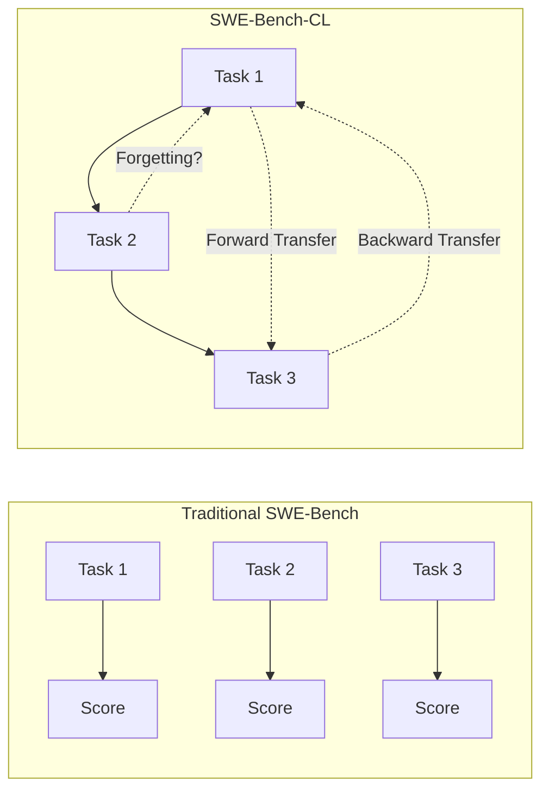
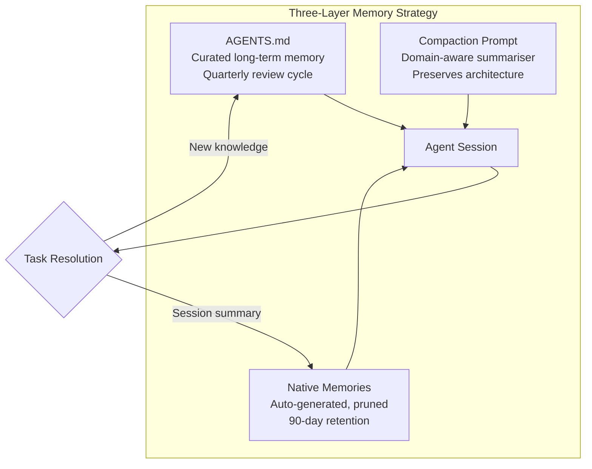

# SWE-Bench-CL and the Continual Learning Gap: Why Your Coding Agent Forgets What Your Repository Learned Last Month


---

Every coding agent benchmark you have seen — SWE-bench, Terminal-Bench, DeepSWE — treats tasks as independent snapshots. The agent receives a repository at a fixed commit, resolves an issue, and the harness scores the patch. Nothing carries forward. That assumption made benchmarking tractable, but it ignores the way real repositories actually evolve: APIs deprecate, dependencies upgrade, architectural decisions compound, and the fix you shipped last Tuesday constrains the fix you need this Thursday.

SWE-Bench-CL, introduced by Joshi, Chowdhury and Uysal (arXiv:2507.00014), is the first benchmark to confront this gap head-on [^1]. It reorganises the human-verified SWE-Bench Verified dataset into chronologically ordered issue sequences — and in doing so, exposes a class of failures that no static benchmark can detect.

## What SWE-Bench-CL Measures

The benchmark comprises 273 tasks drawn from eight major Python repositories [^1]:

| Repository | Tasks |
|---|---|
| django/django | 50 |
| sympy/sympy | 50 |
| sphinx-doc/sphinx | 44 |
| matplotlib/matplotlib | 34 |
| scikit-learn/scikit-learn | 32 |
| astropy/astropy | 22 |
| pydata/xarray | 22 |
| pytest-dev/pytest | 19 |

The critical difference from standard SWE-bench is **temporal ordering**. Tasks within each repository are presented in the order they were filed and resolved. An agent working on task *t₅* should, in principle, benefit from having resolved tasks *t₁* through *t₄* — or at least not be harmed by the accumulated context.

### The Metrics That Matter

SWE-Bench-CL introduces a suite of continual learning metrics borrowed from the machine learning literature and adapted for agentic software engineering [^1]:

- **Average Accuracy (ACC)** — resolve rate across the full task sequence
- **Forgetting (F)** — performance degradation on earlier task types as new tasks accumulate
- **Forward Transfer (FT)** — whether experience on earlier tasks improves performance on later ones
- **Backward Transfer (BWT)** — whether later experience retroactively improves earlier-style tasks
- **Tool-Use Efficiency (TUE)** — how economically the agent uses its available tools
- **CL-F₁ Score** — a composite score capturing the stability-plasticity trade-off



## Two Early Findings That Should Worry You

While full experimental results remain in progress, the authors report two preliminary findings that have immediate practical relevance.

### Low Structural Overlap Between Tasks

The average Jaccard similarity between task patches is 0.1114 and the average cosine similarity is 0.1792 [^1]. This means sequential tasks within a single repository rarely touch the same files or code regions. An agent's memory of *how* it fixed an earlier issue is unlikely to provide a direct template — but the *architectural context* it accumulated (module boundaries, test conventions, internal API idioms) should still help. This is precisely the kind of tacit project knowledge that gets lost when context windows are compacted.

### Prompt Poisoning Vulnerability

When unrelated contextual information was injected into the agent's memory, the authors observed an average semantic drift of approximately 0.45 [^1]. Memory-augmented agents are vulnerable to accumulated noise: irrelevant memories from earlier tasks can actively mislead the agent on later ones. This is not catastrophic forgetting — it is catastrophic *remembering*.

## The Continual Learning Problem in Codex CLI Sessions

If you are running Codex CLI against a repository that evolves over weeks or months, you are already facing the continual learning problem — whether you have named it or not.

### Compaction Erases Project Knowledge

Codex CLI triggers automatic context compaction when the conversation approaches the context window limit (approximately `context_window - 13,000` tokens) [^2]. The compaction summariser inevitably loses fine-grained project knowledge: the reason a particular API was deprecated, the edge case that drove an architectural decision, the test pattern the team agreed on three sprints ago. Each compaction cycle is a small act of forgetting.

```toml
# config.toml — customise what the compactor retains
compact_prompt = """
Retain:
- All architectural decisions and their rationale
- API deprecation notices and migration paths
- Test conventions and coverage requirements
- Module boundary contracts
Summarise aggressively:
- File listing outputs
- Build log noise
- Redundant tool call sequences
"""
```

### Memories Accumulate Noise

Codex CLI's native memory system (introduced in v0.128) writes session summaries to `~/.codex/memories/` and retrieves them via usage-aware lookup [^3]. The diff-based forgetting algorithm prunes stale facts automatically, but the SWE-Bench-CL prompt poisoning finding suggests that even well-intentioned memories can drift. A memory from a January session that records "the auth module uses JWT with RS256" becomes actively harmful if the team migrated to PASETO in April.

### Forward Transfer Requires Explicit Context

The SWE-Bench-CL forward transfer metric measures whether earlier experience helps with later tasks. In practice, this maps directly to AGENTS.md — the persistent instruction file that encodes project-specific knowledge [^4]. Without it, every new session starts from zero. With a well-maintained AGENTS.md, you are manually encoding the forward transfer that a continual learning system would provide automatically.

## A Practical Memory Strategy for Evolving Repositories

The SWE-Bench-CL findings suggest a three-layer approach to managing coding agent context across a repository's lifecycle.

### Layer 1: AGENTS.md as Curated Long-Term Memory

Treat AGENTS.md not as a static configuration file but as a living document that evolves with the repository. Schedule quarterly reviews (or use a PostToolUse hook to flag when agent behaviour diverges from documented conventions) [^4].

```markdown
<!-- AGENTS.md — versioned knowledge section -->
## Architecture Decisions (last reviewed: 2026-08-01)

- Auth: PASETO v4 tokens (migrated from JWT RS256, April 2026)
- ORM: SQLAlchemy 2.1 async sessions only — no legacy Session()
- Tests: pytest-asyncio strict mode; every new endpoint needs
  integration test in tests/integration/
```

### Layer 2: Memory Hygiene via Scheduled Pruning

Run periodic memory audits to remove stale entries. The SWE-Bench-CL prompt poisoning results (0.45 semantic drift) demonstrate that accumulated noise degrades performance more than missing context [^1].

```bash
# List all memories for the current project
codex --print-memories

# Remove memories older than 90 days that reference deprecated APIs
codex --forget "JWT" --project ./my-repo
```

### Layer 3: Compaction Prompts That Preserve Architectural Context

The default compaction summariser optimises for brevity. Override it with a domain-aware prompt that explicitly preserves the categories of knowledge most relevant to forward transfer [^2].



## What This Means for Benchmark-Driven Development

SWE-Bench-CL joins a growing body of work — including LoopsBench (arXiv:2608.00267) for DAG-structured long-horizon tasks and the Continual Learning Bench (arXiv:2606.05661) for stateful environments — arguing that static, snapshot-based benchmarks systematically overestimate agent capability in production settings [^5] [^6].

For Codex CLI practitioners, the implications are concrete:

1. **Do not trust single-task resolve rates.** An agent that scores 40% on SWE-bench Verified may score substantially lower when tasks are sequenced and context accumulates.

2. **Memory is a liability as well as an asset.** The SWE-Bench-CL prompt poisoning finding validates aggressive memory pruning over unlimited retention.

3. **Forward transfer is manual today.** Until agents can autonomously curate their own context (the promise of frameworks like ACE from Stanford and SambaNova [^7]), AGENTS.md and disciplined memory hygiene are your primary tools for encoding project evolution.

4. **Backward transfer barely exists.** No current coding agent revises its understanding of earlier patterns when it encounters contradicting evidence in later tasks. If your team changes a convention, you must update AGENTS.md and prune stale memories explicitly.

## Conclusion

SWE-Bench-CL does not yet have full experimental results comparing memory-enabled and memory-disabled agents across frontier models. What it does have is a benchmark design that asks the right question: can your coding agent learn from experience without being poisoned by it? The preliminary findings — low task overlap, high susceptibility to memory noise — suggest that the answer, for current systems, is *not yet*.

The practical response is not to wait for better models. It is to treat your agent's memory the way you treat your codebase: version it, review it, prune it, and never assume that what was true last month is still true today.

---

## Citations

[^1]: Joshi, T., Chowdhury, S., & Uysal, F. (2026). "SWE-Bench-CL: Continual Learning for Coding Agents." arXiv:2507.00014. [https://arxiv.org/abs/2507.00014](https://arxiv.org/abs/2507.00014)

[^2]: OpenAI. (2026). "Codex CLI Configuration Reference — Context Window and Compaction Settings." [https://developers.openai.com/codex/config-reference](https://developers.openai.com/codex/config-reference)

[^3]: OpenAI. (2026). "Codex CLI Memory Internals." Codex Knowledge Base. [https://codex.danielvaughan.com/2026/04/08/codex-cli-memory-internals/](https://codex.danielvaughan.com/2026/04/08/codex-cli-memory-internals/)

[^4]: Augment Code. (2026). "How to Build Your AGENTS.md (2026): The Context File That Makes AI Coding Agents Actually Work." [https://www.augmentcode.com/guides/how-to-build-agents-md](https://www.augmentcode.com/guides/how-to-build-agents-md)

[^5]: Li, X. et al. (2026). "LoopsBench: A Benchmark for Loop Engineering in Long-Horizon Agentic Coding." arXiv:2608.00267. [https://arxiv.org/abs/2608.00267](https://arxiv.org/abs/2608.00267)

[^6]: Wang, Y. et al. (2026). "Continual Learning Bench: Evaluating Frontier AI Systems in Real-World Stateful Environments." arXiv:2606.05661. [https://arxiv.org/abs/2606.05661](https://arxiv.org/abs/2606.05661)

[^7]: Padmanabhan, S. et al. (2025). "Agentic Context Engineering: Evolving Contexts for Self-Improving Language Models." arXiv:2510.04618. ICLR 2026. [https://arxiv.org/abs/2510.04618](https://arxiv.org/abs/2510.04618)
