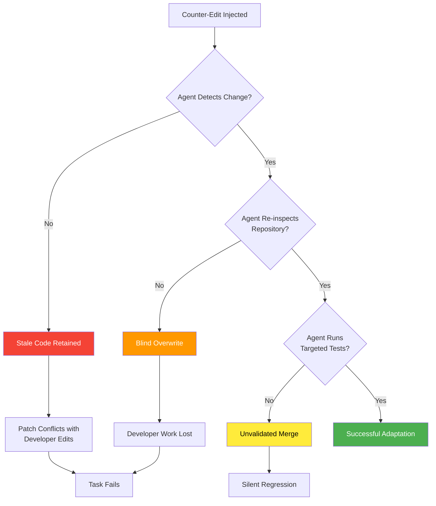
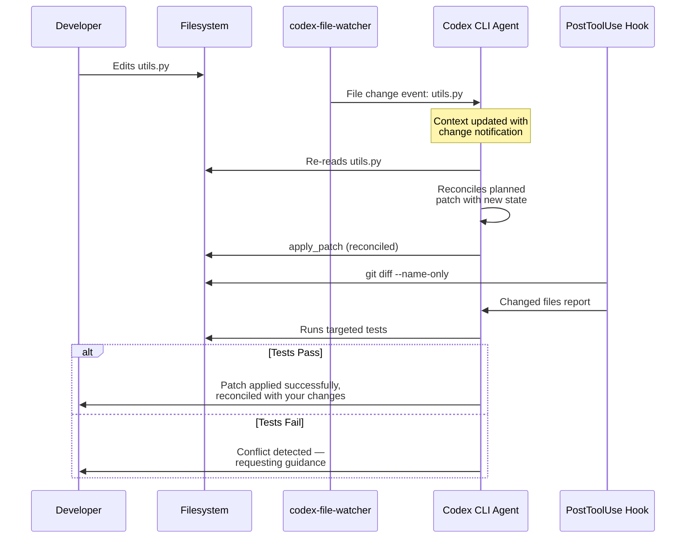

# SWE-Touch and the Workspace State Awareness Gap: Why Your Coding Agent Breaks When You Touch the Code — and How to Harden Codex CLI for Shared-Workspace Collaboration


---

## The Solo-Agent Assumption

Every major coding agent benchmark — SWE-bench, Terminal-Bench, EvoCode-Bench — tests agents in isolation. The agent receives a task, works alone, and is judged on final output correctness. This evaluation paradigm has produced impressive headline numbers: resolve rates north of 60% on SWE-bench Verified for frontier models. But it hides a critical fragility: **what happens when a developer touches the code while the agent is working?**

SWE-Touch, published on 3 August 2026 by Tan et al. (arXiv:2608.02499), provides the first systematic answer[^1]. The results are uncomfortable. Counter-edits — plausible developer modifications to task-relevant code — lower average resolve rates by 7.7 percentage points on SWE-bench Verified, with degradation persisting on longer-horizon benchmarks[^1]. Trajectory analysis reveals agents retaining conflicting code, overwriting developer changes without re-inspecting the repository, and failing to validate revised code with targeted tests[^1].

For Codex CLI practitioners, this is not an abstract benchmark problem. Real development is collaborative. You edit a file while the agent refactors another. A colleague merges a PR that touches the same module the agent is patching. A CI hook reformats code the agent just wrote. The workspace is a living, mutable surface — and if your agent cannot detect, reconcile, and verify changes to it, you are building on sand.

---

## What SWE-Touch Actually Measures

### The Counter-Edit Framework

SWE-Touch does not simply inject random noise into the workspace. Its methodology is deliberate and grounded[^1]:

1. **Mining task-critical regions** — Multiple repair trajectories are generated for each SWE-bench task. The framework identifies code regions that appear across successful patches, isolating the files and functions that are structurally necessary for resolution.

2. **User Patch Generator** — A separate model constructs plausible edits to these critical regions: variable renames, logic restructures, formatting changes, or semantic modifications. These are not adversarial attacks — they are the kinds of changes a developer would make whilst reviewing or working in parallel.

3. **Contextual injection** — Counter-edits are injected with accompanying user messages (e.g., "I've refactored the validation logic in `utils.py` — please work with the updated version") when the agent reaches the relevant code section.

This design mirrors a realistic scenario: you are working alongside the agent, and you make a change. The question is whether the agent notices, adapts, and verifies.

### The Results

Across nine coding models evaluated on SWE-bench Verified, counter-edits produce a consistent 7.7 percentage point average resolve rate drop[^1]. The degradation is not uniform — it is worse on longer-horizon tasks from SWE-Bench Pro and DeepSWE, where the agent has more opportunities to accumulate stale assumptions about workspace state[^1].

Trajectory analysis identifies three failure modes[^1]:



**Failure Mode 1: Stale Code Retention** — The agent holds an earlier version of a file in its context window and patches against that stale snapshot. The resulting diff either fails to apply or silently conflicts with the developer's changes.

**Failure Mode 2: Blind Overwrite** — The agent detects that the file has changed but replaces the developer's edit entirely, restoring its own preferred version without reconciliation. The developer's work is discarded.

**Failure Mode 3: Unvalidated Merge** — The agent incorporates the developer's changes but does not run tests or re-read dependent files, producing a patch that appears correct but introduces silent regressions.

---

## The Broader Interactive Benchmark Convergence

SWE-Touch joins a wave of mid-2026 research demonstrating that autonomous benchmark performance does not predict collaborative capability:

- **SWE-Together** (arXiv:2606.29957) curated 109 real user-agent sessions, revealing that agents need corrective feedback turns from users to reach final correctness — and that the number of turns required does not correlate with autonomous resolve rate[^2].

- **SWE-Interact** (arXiv:2606.30573) reconstructs multi-turn user-driven workflows where requirements evolve over the session, finding that "strong performance on single-turn SWE tasks does not reliably transfer to multi-turn, user-driven workflows"[^3].

- **Dialogue-SWEBench** (arXiv:2606.13995) demonstrates that better coding models do not always make better dialogue models — the conversation axis is orthogonal to the code-generation axis[^4].

SWE-Touch adds a new dimension to this picture: it is not just about conversation and evolving requirements, but about **physical workspace state** — the files on disc changing beneath the agent's execution context.

---

## Why This Matters for Codex CLI

Codex CLI operates in a shared filesystem. When you run `codex` in a terminal, both you and the agent have write access to the same directory tree. Consider these everyday scenarios:

| Scenario | SWE-Touch Failure Mode |
|----------|----------------------|
| You fix a typo in a config file while the agent refactors the module that reads it | Stale Code Retention |
| A `git pull --rebase` updates dependencies the agent is patching | Blind Overwrite |
| A pre-commit hook reformats the agent's output before the agent's next tool call | Unvalidated Merge |
| A colleague's PR merge changes the API surface the agent is integrating against | Stale Code Retention |
| You edit AGENTS.md to add a new constraint mid-session | Agent ignores updated rules |

Each of these represents a workspace state change that the agent must detect and reconcile. SWE-Touch's 7.7pp degradation is measured under controlled conditions with explicit user messages announcing changes — in real workflows, changes often happen silently.

---

## Hardening Codex CLI for Shared-Workspace Collaboration

### 1. The codex-file-watcher Infrastructure

Codex CLI's architecture already includes a file-watching layer. The `codex-file-watcher` crate, extracted from core in May 2026 (PR #21290), provides filesystem event monitoring to the app-server[^5]. This infrastructure detects when files change outside the agent's own tool calls — exactly the signal SWE-Touch identifies as missing.

The key configuration surfaces:

```toml
# config.toml — workspace awareness settings
[sandbox]
# workspace-write grants the agent filesystem access
# but the file watcher monitors external changes too
default_permissions = ":workspace"

[session]
# Multi-folder projects (v0.145.0+) widen the watch surface
# to include all folders in the project
primary_folder = "/path/to/main-repo"
```

Multi-folder project support, shipped in v0.145.0 (July 2026), extends workspace awareness across multiple repositories — critical for monorepo and polyrepo workflows where changes in one folder affect another[^6].

### 2. PostToolUse Hooks for Workspace Drift Detection

The most direct defence against SWE-Touch failure modes is a PostToolUse hook that checks for external workspace changes after every tool call. This hook fires after shell commands, `apply_patch` edits, and MCP tool calls[^7]:

```json
{
  "hooks": [
    {
      "event": "PostToolUse",
      "matcher": {
        "tool_name": "apply_patch"
      },
      "command": "git diff --name-only --diff-filter=AM HEAD 2>/dev/null | head -20",
      "description": "Report files changed since last commit to detect workspace drift"
    },
    {
      "event": "PostToolUse",
      "matcher": {
        "tool_name": "shell"
      },
      "command": "git status --porcelain 2>/dev/null | grep -v '^??' | head -20",
      "description": "Surface tracked file changes after shell execution"
    }
  ]
}
```

This pattern ensures that every tool invocation is followed by a workspace state check. The agent sees the output in its context, forcing it to acknowledge any files that have changed externally.

### 3. AGENTS.md Workspace Reconciliation Rules

SWE-Touch's trajectory analysis shows that agents fail not because they *cannot* re-read files, but because they do not *choose* to[^1]. AGENTS.md is the mechanism for making that choice mandatory:

```markdown
## Workspace Reconciliation Rules

### Before Patching
- ALWAYS re-read any file you intend to modify immediately before writing.
  Do not rely on file contents from earlier in the conversation.
- If a file has changed since you last read it, acknowledge the change
  and reconcile your planned edit with the current state.

### After External Changes
- When informed that files have been modified externally (by the user,
  by git operations, or by CI hooks), re-read ALL affected files and
  their direct dependents before proceeding.
- Do NOT overwrite external changes without explicit user approval.

### Validation After Edits
- After every apply_patch, run the relevant test suite for the modified
  files. Do not proceed to the next file until tests pass.
- If a test fails after reconciliation, stop and ask the user whether
  to revert, adapt, or proceed.
```

These rules address all three SWE-Touch failure modes directly: stale code retention (mandatory re-read), blind overwrite (require user approval), and unvalidated merge (mandatory test execution).

### 4. Approval Policy as a Collaboration Gate

The `approval_policy` configuration provides a structural safeguard against blind overwrites[^7]:

```toml
[approval_policy]
# 'on-request' forces the agent to seek approval before writes
# This gives you a chance to review changes that conflict with your edits
default = "on-request"

# Auto-approve reads but gate writes
[approval_policy.overrides]
read = "unless-allow-listed"
write = "on-request"
```

In a shared-workspace scenario, `on-request` for writes means the agent must present its intended change to you before applying it. If you have modified the target file since the agent's last read, you will see the conflict in the approval dialog.

### 5. The Re-Read-Before-Write Pattern

The simplest and most effective pattern for preventing stale code retention is to instruct the agent to re-read files immediately before writing. This can be enforced through a PreToolUse hook:

```json
{
  "hooks": [
    {
      "event": "PreToolUse",
      "matcher": {
        "tool_name": "apply_patch"
      },
      "command": "echo 'REMINDER: Re-read the target file before applying this patch. Verify no external changes have occurred.'",
      "description": "Prompt agent to verify file currency before patching"
    }
  ]
}
```

This is a lightweight intervention — it does not block execution, but it injects a reminder into the agent's context at exactly the moment when stale reads cause the most damage.

---

## Architecture of a Workspace-Aware Agent Session

The following diagram shows how these defences layer together in a Codex CLI session:



---

## Practical Recommendations

Based on SWE-Touch's findings and Codex CLI's current tooling:

1. **Enable workspace write mode with approval gates** — Use `:workspace` permission profile with `on-request` approval for writes. This is the minimum viable configuration for shared-workspace safety.

2. **Add PostToolUse workspace drift hooks** — The `git diff` and `git status` patterns above cost negligible latency but provide critical visibility into external changes.

3. **Write explicit AGENTS.md reconciliation rules** — Do not assume the model will re-read files on its own. SWE-Touch proves it will not[^1].

4. **Use multi-folder project configuration** — If your work spans multiple repositories, configure them as a multi-folder project so the file watcher covers the full surface area[^6].

5. **Run tests after every patch, not just at the end** — Unvalidated merges are the most insidious failure mode because they produce patches that *look* correct. Incremental testing catches regressions at the point of introduction.

6. **Prefer `on-request` over `unless-allow-listed` for write operations in collaborative workflows** — The approval step is your last-line defence against blind overwrites.

---

## What Comes Next

SWE-Touch, SWE-Together, and SWE-Interact collectively signal a maturation in how the research community evaluates coding agents. The solo-agent benchmark era is ending. The next generation of evaluations will measure agents on their ability to **collaborate**: detecting workspace changes, adapting to evolving requirements, reconciling conflicting edits, and maintaining coherence across multi-turn sessions with active human participants.

For Codex CLI, this means the tool's existing infrastructure — file watcher, PostToolUse hooks, approval policies, AGENTS.md governance, and multi-folder project support — positions it well for the collaborative future. But the infrastructure must be *configured*. Out of the box, no coding agent today demonstrates the workspace state awareness that SWE-Touch demands. The gap between autonomous performance and collaborative performance is a configuration problem, and configuration is where senior developers earn their keep.

---

## Citations

[^1]: Tan, Y., Meng, J., Lei, F., Wang, M., He, S., Zhao, J. & Liu, K. (2026). "SWE-Touch: Benchmarking Coding Agents When Users Touch the Code." arXiv:2608.02499. [https://arxiv.org/abs/2608.02499](https://arxiv.org/abs/2608.02499)

[^2]: SWE-Together benchmark. (2026). "SWE-Together: Evaluating Coding Agents in Interactive User Sessions." arXiv:2606.29957. [https://arxiv.org/abs/2606.29957](https://arxiv.org/abs/2606.29957)

[^3]: Raghavendra, M., Gunjal, A., Sabharwal, A. & He, Y. (2026). "SWE-Interact: Reimagining SWE Benchmarks as User-Driven Long-Horizon Coding Sessions." arXiv:2606.30573. [https://arxiv.org/abs/2606.30573](https://arxiv.org/abs/2606.30573)

[^4]: Dialogue-SWEBench. (2026). "Dialogue-SWEBench: Can LLMs Solve Real-World Software Engineering Tasks Through Dialogue?" arXiv:2606.13995. [https://arxiv.org/abs/2606.13995](https://arxiv.org/abs/2606.13995)

[^5]: OpenAI. (2026). "Move file watcher out of core." GitHub Pull Request #21290. [https://github.com/openai/codex/pull/21290](https://github.com/openai/codex/pull/21290)

[^6]: OpenAI. (2026). "Multi-Folder Projects — ChatGPT & Codex changelog." ChatGPT Learn. [https://learn.chatgpt.com/docs/changelog](https://learn.chatgpt.com/docs/changelog)

[^7]: OpenAI. (2026). "Codex CLI Permissions and Hooks." ChatGPT Learn. [https://developers.openai.com/codex/permissions](https://developers.openai.com/codex/permissions)
