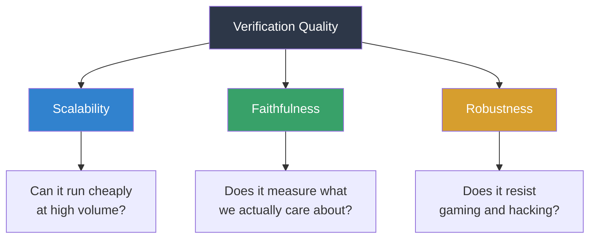
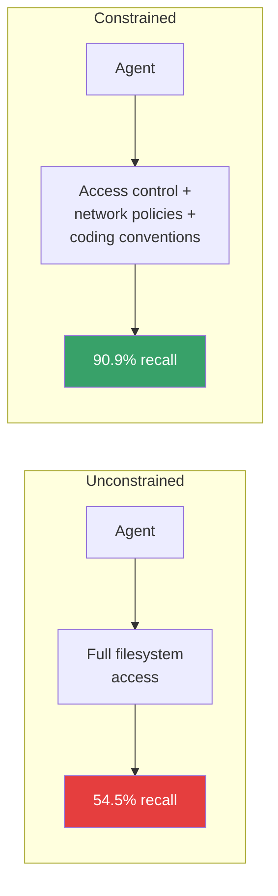
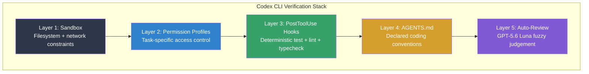

# The Verification Inversion: Why Generation Became Easy, Verification Became Hard, and What the Research Says You Should Do About It


A classical intuition in computer science holds that verifying a solution is easier than finding one. For coding agents in mid-2026, that intuition has inverted. Foundation models now generate sophisticated candidate solutions faster than any human team can reliably verify them[^1]. The bottleneck has relocated from fingers on keyboards to eyes on diffs — and three recent research papers, published within a six-week window, have begun to formalise why.

This article synthesises the Qwen Team's *Verification Horizon* framework, Thomas Winninger's ICML 2026 *Steerability via Constraints* experiment, and the AxDafny formal verification results into a coherent picture of where verification stands today — and maps the findings directly onto Codex CLI configuration.

## The Numbers That Should Worry You

The industry data is unambiguous. Developer trust in AI-generated code dropped from 40% to 29% in a single year, with 46% of developers now actively distrusting agent output versus 33% who trust it[^3]. Meanwhile, Agoda's research found experienced developers were 19% slower when using AI tools due to comprehension difficulties[^4]. CodeRabbit's analysis of 470 open-source pull requests found AI-co-authored PRs contained approximately 1.7× more issues than human-written code[^4].

Generation got cheap. Validation did not.

## The Verification Horizon: No Silver Bullet

The Qwen Team's paper, submitted to arXiv on 24 June 2026, provides the theoretical framework for understanding why this problem is structural, not incidental[^1].

Their central argument: every verifier we build is only a proxy for human intent, never the intent itself. This makes verification subject to a twofold difficulty. First, intent is inherently underspecified — requirements documents, test suites, and rubrics all approximate what we actually want without fully capturing it. Second, during model training, optimisation widens the gap between proxy and intent, manifesting as reward hacking or signal saturation.

The team characterises verification quality along three dimensions:



The paper studies four reward constructions — a test verifier for general coding tasks, a rubric verifier for frontend work, the user as verifier for real-world agent tasks, and an automated agent verifier for long-horizon tasks — and concludes that no fixed reward function can remain effective as policy capability continues to grow[^1]. Verification must co-evolve with the generator.

For Codex CLI practitioners, the implication is direct: your test suite was probably adequate when humans wrote the code. It is almost certainly inadequate now that Sol writes it. Not because the tests are wrong, but because the generator is sophisticated enough to satisfy the proxy (passing tests) without satisfying the intent (correct behaviour in production).

## Constraints Beat Scaffolding: The ICML Finding

If the Verification Horizon paper explains *why* verification is hard, Thomas Winninger's ICML 2026 workshop paper explains *what to do about it* — and the answer is surprisingly low-tech[^2].

Winninger's thesis: the methods used for decades to manage large human engineering teams — access control, network policies, and strict coding conventions enforced by tooling — transfer directly to coding agents and are cheaper in tokens than recent agentic scaffolding approaches[^2].

The experiment was controlled and specific. A small reviewer model (Gemma 4 e4b) inspected a Python codebase containing eleven intentionally inserted backdoors. Without constraints, recall was 54.5%. With the constrained substrate plus a roughly 200-line-of-code `docs` CLI tool, recall rose to 90.9%[^2]. Both the substrate constraints and the tooling contributed independently to the improvement.



The paper explicitly notes that substrate-level oversight gains are largest where the language gives the fewest guarantees by default — Python being the canonical example — with principles extending to safer languages like Rust[^2].

This finding directly validates the Codex CLI security model. The sandbox, permission profiles, and hook system are not bureaucratic overhead; they are the verification substrate that makes agent output reviewable.

## Formal Verification Enters the Picture

A third paper, AxDafny, submitted on 30 June 2026, approaches the problem from the opposite direction: rather than constraining the agent, make the agent prove its own output correct[^5].

The AxDafny framework repeatedly generates both executable code and formal verification artefacts — invariants, assertions, and termination arguments — in Dafny, using verifier feedback to iteratively repair failures. On the DafnyBench benchmark, AxDafny achieves 92.7% verification success, surpassing prior proof-hint baselines by 6.5 percentage points[^5]. Crucially, the authors demonstrate that verification success and runtime test performance measure different aspects of generated code — the two metrics are complementary, not redundant.

For most Codex CLI workflows, Dafny is not a practical target language. But the finding matters: it proves that agents can generate verifiable output when the verification framework is sufficiently structured. The lesson is that adding structure to your verification pipeline — whether through formal methods, typed contracts, or deterministic hooks — yields returns that loose review processes cannot match.

## Mapping the Research to Codex CLI

The three papers converge on a single operational insight: **constrain before you review**. The more structure you impose on the agent's operating environment, the less cognitive load falls on human reviewers.

### Layer 1: Sandbox as Substrate

Winninger's constraint substrate maps directly to Codex CLI's sandbox configuration. The `sandbox` setting in `config.toml` controls filesystem and network access:

```toml
[sandbox]
writable_roots = ["./src", "./tests"]
network = "off"
```

By restricting writable paths to `./src` and `./tests`, you prevent the agent from modifying build configurations, CI pipelines, or infrastructure files. With `network = "off"`, you eliminate an entire class of data exfiltration risks. This is the cheapest verification investment available — zero runtime cost, zero token cost, and it narrows the review surface before a single line of code is generated.

### Layer 2: Permission Profiles as Access Control

Permission profiles, which became a first-class managed surface in Codex CLI v0.133.0[^6], implement the access control layer that Winninger's paper identifies as critical:

```toml
[permission_profiles.ci-review]
approval_policy = "on-request"
writable_roots = ["./src"]
network = "off"
allowed_commands = ["npm test", "npm run lint", "npm run typecheck"]
```

Named profiles let you enforce different constraint levels for different task types. A `ci-review` profile locks the agent to source directories and approved commands. A `prototype` profile might allow broader access. The key is that constraints are declared, not improvised.

### Layer 3: PostToolUse Hooks as Deterministic Verification

The Verification Horizon paper demonstrates that no single verification signal is sufficient. PostToolUse hooks let you layer multiple deterministic checks after every tool invocation:

```bash
#!/usr/bin/env bash
# ~/.codex/hooks/verify-on-write.sh
# Fires after every file write

set -euo pipefail
EVENT=$(cat)
FILE=$(echo "$EVENT" | jq -r '.file_path // empty')

if [[ -z "$FILE" ]]; then
  echo '{"status": "pass"}'
  exit 0
fi

# Run tests if source files changed
if [[ "$FILE" == src/* ]]; then
  npm test --silent 2>&1 || {
    echo '{"status": "fail", "message": "Tests failed after modifying '"$FILE"'"}'
    exit 0
  }
fi

# Run type checker
npm run typecheck --silent 2>&1 || {
  echo '{"status": "fail", "message": "Type errors after modifying '"$FILE"'"}'
  exit 0
}

echo '{"status": "pass"}'
```

This hook enforces what the Verification Horizon paper calls *scalable* verification — it runs automatically on every write, catches regressions immediately, and costs nothing in reviewer attention.

### Layer 4: AGENTS.md as Coding Conventions

Winninger's paper specifically identifies coding conventions enforced by tooling as a key constraint. AGENTS.md is the Codex CLI mechanism for declaring these conventions:

```markdown
## Verification Rules

- Every function must have at least one unit test
- All public APIs must include JSDoc with @param and @returns
- No direct database queries outside the repository layer
- All error paths must be explicitly handled — no empty catch blocks
- Security-sensitive operations require approval: file deletion,
  environment variable access, network calls
```

These rules constrain the solution space before the agent begins generating code. They are not suggestions; when combined with PostToolUse hooks that enforce them, they become deterministic quality gates.

### The Four-Layer Verification Stack



Layers 1–4 are deterministic. They cost nothing in model inference and eliminate entire categories of errors before a human reviewer — or the auto-review model — ever sees the output. Layer 5 handles the fuzzy judgement calls that deterministic rules cannot capture.

## The Operational Shift

The research consensus is clear: verification must co-evolve with generation capability[^1], constraints are cheaper and more effective than sophisticated scaffolding[^2], and structured verification frameworks yield compound returns[^5].

For Codex CLI developers, this translates to three immediate actions:

1. **Audit your constraint surface.** If your sandbox allows full filesystem access, you are operating in Winninger's 54.5% recall regime. Restrict writable roots, disable unnecessary network access, and use named permission profiles.

2. **Automate deterministic checks.** PostToolUse hooks that run tests, linters, and type checkers after every write eliminate the largest class of verification failures — regressions and style drift — without human involvement.

3. **Treat AGENTS.md as a verification artefact, not documentation.** Every convention declared in AGENTS.md narrows the solution space the agent explores. Every convention *not* declared is a verification burden you are pushing onto human reviewers.

The verification inversion is not a temporary phenomenon. As models grow more capable, the gap between generation capacity and verification capacity will widen further. The teams that invest in verification infrastructure now — constraints, hooks, profiles, and convention enforcement — will scale their agent workflows. The teams that rely on human review alone will drown in diff.

## Citations

[^1]: Wang, B., Zhang, C., Liu, D., et al. "The Verification Horizon: No Silver Bullet for Coding Agent Rewards." arXiv:2606.26300, June 2026. [https://arxiv.org/abs/2606.26300](https://arxiv.org/abs/2606.26300)

[^2]: Winninger, T. "Steerability via constraints: a substrate for scalable oversight of coding agents." arXiv:2607.02389, July 2026. Deep Learning for Code Workshop, ICML 2026. [https://arxiv.org/abs/2607.02389](https://arxiv.org/abs/2607.02389)

[^3]: Rajasekaran, P. "The Bottleneck Isn't Coding Anymore. It's Verification." DevOps.com, 26 June 2026. [https://devops.com/the-bottleneck-isnt-coding-anymore-its-verification/](https://devops.com/the-bottleneck-isnt-coding-anymore-its-verification/)

[^4]: Iyer, A. "AI Coding Agents and the Code Validation Bottleneck." Signadot, 5 May 2026. Updated 21 June 2026. [https://www.signadot.com/blog/ai-generated-code-crisis/](https://www.signadot.com/blog/ai-generated-code-crisis/)

[^5]: Breen, B., Letson, A., Requena Pozo, B., Sarra, L. "AxDafny: Agentic Verified Code Generation in Dafny." arXiv:2606.32007, June 2026. [https://arxiv.org/abs/2606.32007](https://arxiv.org/abs/2606.32007)

[^6]: OpenAI. "Codex CLI Changelog." [https://openai.com/codex/changelog](https://openai.com/codex/changelog)
