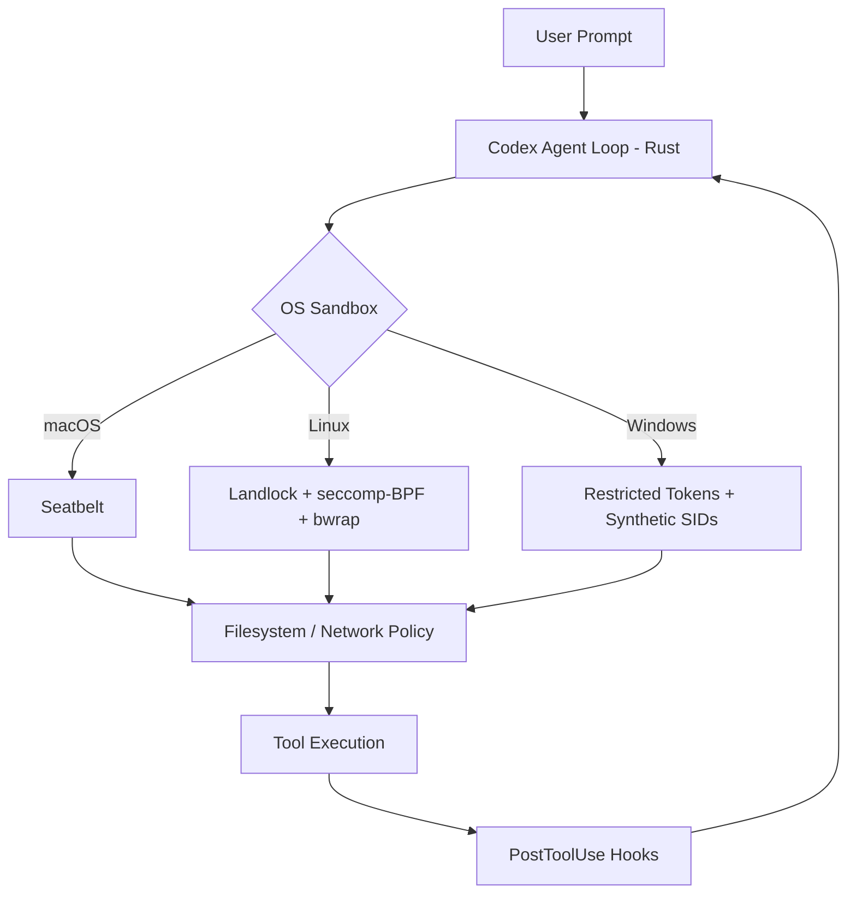
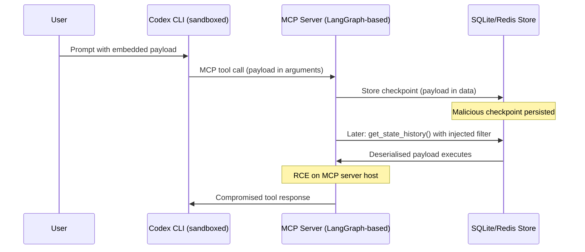

# Black Hat 2026: Eleven Agent Framework CVEs and Why Codex CLI's Sandbox-First Architecture Dodges the Worst of Them


---

On 5 August 2026, Check Point researchers Yarden Porat and Shahar Tal took the stage at Black Hat USA with a briefing titled *"No Tools Required: Post-Injection Exploitation Across AI Agent Frameworks"* [^1]. Their headline finding reframes how senior developers should think about agent security: **prompt injection is not the bug — the agent framework itself is**. Over a year of research, the pair disclosed eleven vulnerabilities across LangChain, LangGraph, CrewAI, AutoGen, Microsoft Agent Framework, and Google ADK [^2]. The bugs are not exotic model-level attacks. They are insecure deserialization, SSRF, path traversal, and use-after-free — vulnerability classes the industry learned to fix twenty years ago, now sitting underneath agents that read inboxes and update databases [^1].

This article maps the disclosed vulnerabilities to Codex CLI's architecture, explains why the sandbox-first design sidesteps most of the attack surface, and identifies the gap that remains: your MCP server dependencies.

## The Vulnerability Landscape

### What Was Found

The eleven vulnerabilities span six frameworks [^2]. Two received CVEs with patches already shipped; others were disclosed through vendor bounty programmes.

| Framework | Vulnerability Class | Impact | Bounty / CVE |
|---|---|---|---|
| LangGraph (SQLite checkpointer) | SQL injection in `get_state_history()` | Checkpoint manipulation → RCE chain | CVE-2025-67644 [^3] |
| LangGraph (msgpack deserialisation) | Insecure deserialisation of checkpoint data | Remote code execution | CVE-2026-28277 [^3] |
| LangGraph (Redis checkpointer) | Redis injection | Similar to SQLite vector | CVE-2026-27022 [^3] |
| Microsoft Agent Framework | Checkpoint deserialisation | Cross-session RCE via prompt injection | \$10,000 bounty, no CVE [^2] |
| Google ADK | Hidden dev assistant with unauthenticated API | File write → import-time code execution | \$3,133.70 bounty [^2] |
| CrewAI / AutoGen / Semantic Kernel | Memory stores, planning loops, serialisation | Various RCE and data exfiltration vectors | Disclosed, details pending [^1] |

Total bounties awarded: \$17,133.70 [^2].

### Three Attack Techniques

The research introduces three exploitation techniques that work *without the agent having any tool access* [^1]:

1. **Delayed-execution injection** — malicious payload is planted in one conversation turn but triggers only when a different user rewinds or restores a checkpoint in a later session.
2. **Cross-agent propagation** — in multi-agent setups, a compromised agent's output becomes trusted input for sibling agents, spreading the payload laterally.
3. **Persistent memory poisoning** — attacker-controlled content is written into the framework's long-term memory store, persisting across restarts and infecting future sessions.

The common thread: **prompt-controlled content crosses the boundary into trusted framework logic** [^1]. The model is not the vulnerability; the orchestration layer is.

## Why Codex CLI's Architecture Is Different

Codex CLI does not use LangChain, CrewAI, or any third-party orchestration framework. Its agent loop is implemented in Rust (the `codex-rs` crate), and isolation is enforced at the operating-system level [^4]:



### No Framework Deserialisation Surface

The LangGraph CVEs (CVE-2025-67644, CVE-2026-28277, CVE-2026-27022) all exploit deserialisation of checkpoint data stored in SQLite or Redis [^3]. Codex CLI's session state is managed by the `codex-thread-store` crate using a local `StateDbHandle` — a purpose-built Rust store with no generic deserialisation of user-controlled blobs [^4]. There is no msgpack, no pickle, no arbitrary object hydration. Checkpoint data is structured Rust types serialised through known schemas.

### Sandbox-Before-Execution

The Microsoft Agent Framework vulnerability works because a prompt injection can cause the framework to write and import a Python file at runtime — the framework executes code in the same process space as its orchestration logic [^2]. Codex CLI inverts this: tool execution happens inside the Landlock/Seatbelt sandbox, and the sandbox is applied *before* the first tool call [^5]. Even if a model generates malicious code, the sandbox constrains:

- **Filesystem access** — workspace-write mode restricts writes to the project directory by default [^5]
- **Network access** — disabled by default; when enabled, limited to an explicit domain allowlist via `network_proxy` [^5]
- **System calls** — seccomp-BPF on Linux blocks dangerous syscalls regardless of what the model asks for [^4]

### No Hidden Development Endpoints

The Google ADK vulnerability exploited a hidden HTTP-accessible development assistant that could write files and trigger import-time code execution [^2]. Codex CLI's `app-server` component listens on a Unix domain socket, not an HTTP port, and only accepts connections from the local TUI or authenticated remote sessions via WebSocket relay [^4]. There is no hidden admin surface.

## The Gap: Your MCP Server Stack

Codex CLI's own runtime is well-isolated. But the moment you connect an MCP server, you inherit that server's dependency chain. If your MCP server is built on LangChain, uses a LangGraph checkpointer, or delegates to CrewAI — you are exposed to every vulnerability Check Point disclosed.

### The Attack Path



The Codex CLI sandbox protects the *agent process* — but the MCP server runs outside that sandbox, typically as a separate process on the developer's machine or a remote host.

### Practical Defences

**1. Audit your MCP server dependencies**

```bash
# Check if any MCP server uses vulnerable LangGraph versions
cd your-mcp-server/
pip list | grep -E "langgraph|langchain"
# Patched versions:
#   langgraph >= 1.0.10
#   langgraph-checkpoint-sqlite >= 3.0.1
#   langgraph-checkpoint-redis >= 1.0.2
```

**2. Pin MCP server frameworks in your lockfile**

```toml
# requirements.txt or pyproject.toml
langgraph>=1.0.10
langgraph-checkpoint-sqlite>=3.0.1
langgraph-checkpoint-redis>=1.0.2
```

**3. Use Codex CLI's MCP allowlisting**

Restrict which MCP servers can be loaded via `requirements.toml` for fleet-wide enforcement [^5]:

```toml
[mcp]
allowed_servers = ["filesystem", "github", "your-audited-server"]
```

**4. Apply PreToolUse hooks for MCP output sanitisation**

```toml
# config.toml
[hooks.pre_tool_use]
command = "python3 scripts/sanitise-mcp-output.py"
```

A deterministic hook can scan tool arguments for known injection patterns — serialised Python objects, SQL fragments, or msgpack blobs that should never appear in legitimate MCP traffic.

**5. Run MCP servers in their own sandbox**

Docker Sandboxes or a dedicated container isolates the MCP server process, preventing a compromised server from accessing the host filesystem or network [^6]:

```bash
docker run --rm --network=none \
  -v /project:/workspace:ro \
  your-mcp-server:latest
```

## The Wider Black Hat Signal

The Check Point briefing was not an isolated talk. Black Hat USA 2026 featured an entire track on agent exploitation [^7]:

- **"Trusted Enough to Run"** (Novee Security) — demonstrated vulnerabilities in GitHub, Slack, and Jira integrations with agents from OpenAI, Anthropic, and Google [^7]
- **"Promptware EOD"** (Zenity) — introduced a malware analysis framework for AI agent supply chains, open-sourcing a detonation toolkit [^7]
- **"Caging the Agent"** (Roblox) — documented a multi-layer sandbox architecture for securing Claude Code at enterprise scale, with filesystem virtualisation, network policies, and behavioural monitoring [^7]
- **WASP-OS** (NVIDIA) — a fine-tuned 30B open-source model achieving 56% exploit success rate against AI agents at 70–125× lower cost than frontier models [^8]

The collective message: **agent exploitation has become its own infrastructure discipline** [^8]. The attack surface is not the model — it is the orchestration layer, the memory store, the serialisation format, and the tool-call boundary.

## What This Means for Codex CLI Developers

Codex CLI's Rust-native, sandbox-first architecture gives it a structural advantage over framework-based agents. You do not need to worry about LangGraph checkpoint deserialisation or hidden Google ADK development endpoints in your Codex CLI process.

But you *do* need to worry about:

1. **MCP servers built on vulnerable frameworks** — audit dependencies, pin versions, and run MCP servers in containers
2. **Cross-agent propagation** — if you use Codex CLI's multi-agent v2 alongside external agents, sanitise inter-agent messages
3. **Persistent memory stores** — if you use third-party memory MCP servers, ensure they do not blindly deserialise stored data
4. **Supply chain of agent plugins** — the Codex marketplace plugin ecosystem inherits whatever dependencies each plugin bundles

The security perimeter of a coding agent is not the agent binary. It is the entire tool-call graph.

## Citations

[^1]: Y. Porat and S. Tal, "No Tools Required: Post-Injection Exploitation Across AI Agent Frameworks," Black Hat USA 2026, 5 August 2026. Reported in *The Register*: [https://www.theregister.com/security/2026/08/05/prompt-injection-isnt-the-bug-ai-agent-frameworks-are/5283585](https://www.theregister.com/security/2026/08/05/prompt-injection-isnt-the-bug-ai-agent-frameworks-are/5283585)

[^2]: Check Point Research, "When Your AI Agent's Memory Becomes a Security Liability," Check Point Blog, August 2026. [https://blog.checkpoint.com/research/when-your-ai-agents-memory-becomes-a-security-liability/](https://blog.checkpoint.com/research/when-your-ai-agents-memory-becomes-a-security-liability/)

[^3]: LangGraph security patches: `langgraph-checkpoint-sqlite` 3.0.1+, `langgraph` 1.0.10+, `langgraph-checkpoint-redis` 1.0.2+. CVE-2025-67644 (SQLite injection), CVE-2026-28277 (msgpack deserialisation RCE), CVE-2026-27022 (Redis injection). Coordinated disclosure with LangChain team.

[^4]: OpenAI Codex CLI source, `codex-rs` crate. Sandboxing implementation documented at DeepWiki: [https://deepwiki.com/openai/codex/5.6-sandboxing-implementation](https://deepwiki.com/openai/codex/5.6-sandboxing-implementation)

[^5]: Codex CLI sandbox and network security configuration. Official documentation: [https://developers.openai.com/codex/concepts/sandboxing/auto-review](https://developers.openai.com/codex/concepts/sandboxing/auto-review)

[^6]: Docker Sandboxes for AI coding agents, GA January 2026. Lightweight VM isolation with hypervisor boundary.

[^7]: Straiker, "AI Agents Take Center Stage at Black Hat USA 2026," Straiker Blog, August 2026. [https://www.straiker.ai/blog/black-hat-usa-2026-ai-security-talks](https://www.straiker.ai/blog/black-hat-usa-2026-ai-security-talks)

[^8]: Forkast, "Black Hat USA 2026 Signals Agent Exploitation Has Become Its Own Infrastructure Discipline," August 2026. [https://forkast.news/black-hat-usa-2026-signals-agent-exploitation-has-become-its-own-infrastructure-discipline/](https://forkast.news/black-hat-usa-2026-signals-agent-exploitation-has-become-its-own-infrastructure-discipline/)
