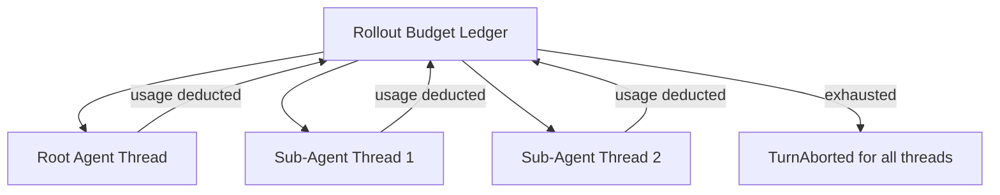
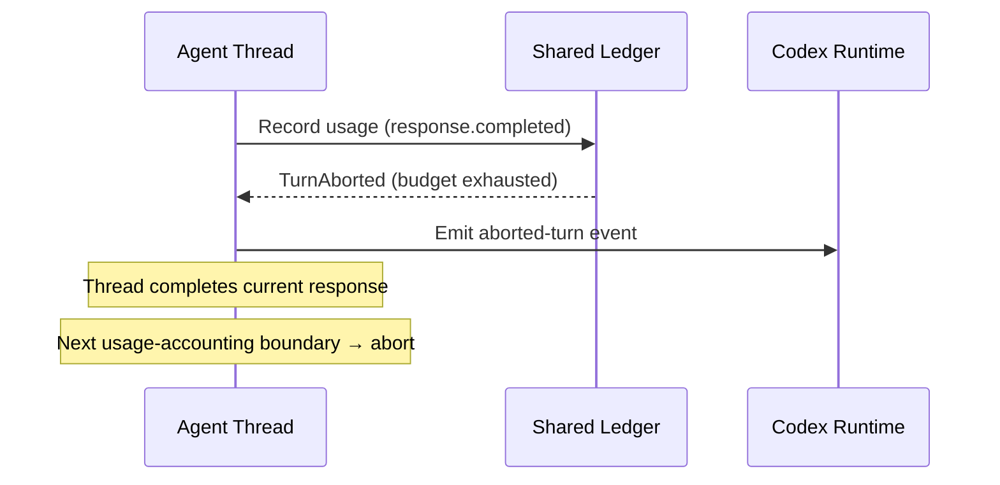

# Codex CLI Rollout Token Budgets: Shared Accounting, Weighted Limits, and Graceful Turn Abortion


---

Until now, Codex CLI's cost controls have been blunt instruments: a monthly spend cap in the OpenAI dashboard, per-model token pricing visible through `/usage`, and the informal discipline of choosing smaller models for cheaper tasks [^1]. What has been conspicuously absent is a *session-level* budget that spans every thread in a rollout — root agent and sub-agents alike — and gracefully stops work before the bill surprises you.

Four pull requests landing in the v0.147 alpha line change that. Together they introduce **rollout token budgets**: a shared ledger, configurable reminder thresholds, weighted token accounting, and soft turn abortion when the budget runs dry [^2][^3][^4][^5].

## The Problem: Unbounded Multi-Thread Spend

A single Codex CLI session can spawn sub-agents, fork conversations, and run parallel threads against the same rollout. Each thread independently calls the Responses API, and until now nothing aggregated their consumption. A `codex exec` pipeline running five parallel sub-agents against GPT-5.6 Sol could easily burn through thousands of tokens before the operator noticed — and there was no mechanism to halt the work programmatically [^1].

The community had been asking for this. Issue #5085 — an RFC for a full cost-and-usage module with real-time cost display, budgets, and per-project attribution — was closed without shipping [^1]. The rollout budget feature is OpenAI's narrower, more pragmatic answer: budget enforcement at the rollout level, baked into the agent runtime itself.

## Architecture: The Shared Ledger

The rollout budget sits in `AgentControl`, the component that already manages rollout-level features. A single **token ledger** is shared across all threads in a rollout. When any thread's `response.completed()` fires, the runtime calculates weighted usage from the Responses API usage carrier and subtracts it from the ledger [^3].



The key design decision: the rollout budget operates **independently** from the existing `token_budget` feature. This maintains backward compatibility — existing per-thread budgets continue to work — whilst adding the new cross-thread ceiling [^2].

## Configuration

The budget is defined under `[features.rollout_budget]` in your `config.toml`:

```toml
[features.rollout_budget]
enabled = true
limit_tokens = 100000
reminder_at_remaining_tokens = [65_536, 32_768, 16_384, 8_192, 4_096, 2_048, 1_024, 512]
sampling_token_weight = 1.0
prefill_token_weight = 0.1
```

### Configuration Parameters

| Parameter | Purpose | Default |
|-----------|---------|---------|
| `enabled` | Activates the rollout budget feature | `false` |
| `limit_tokens` | Maximum weighted tokens available for the entire rollout | Required when enabled |
| `reminder_at_remaining_tokens` | Explicit remaining-token thresholds that trigger reminders | 10% of `limit_tokens` interval |
| `sampling_token_weight` | Weight multiplier for sampling (output) tokens | `1.0` |
| `prefill_token_weight` | Weight multiplier for prefill (non-cached input) tokens | `0.1` |

The **weighted accounting** is particularly useful. Output tokens are typically 3-4x more expensive than input tokens across GPT-5.6 variants [^6]. By setting `sampling_token_weight = 1.0` and `prefill_token_weight = 0.1`, you can make the budget track approximate *cost* rather than raw token count, giving a more accurate picture of actual spend.

### Reminder Thresholds

The original implementation used a simple interval (`reminder_interval_tokens`), but PR #29423 replaced this with explicit threshold values [^5]:

```toml
# Old approach — fixed interval
reminder_interval_tokens = 10000

# New approach — explicit thresholds (recommended)
reminder_at_remaining_tokens = [65_536, 32_768, 16_384, 8_192, 4_096, 2_048, 1_024, 512]
```

Each value represents a remaining-token count. When the ledger crosses a threshold, a developer message is injected before the thread's next request:

> "You have weighted 16384 tokens left in the shared session token budget."

This approach lets you cluster reminders more densely as the budget shrinks — useful because the final few thousand tokens are where decisions about wrapping up matter most.

## Reminder Delivery Mechanics

The reminder system has several carefully considered behaviours [^3]:

1. **Initial reminder**: Appears with the first request in each thread, so the model is immediately aware of budget constraints.
2. **Periodic reminders**: Trigger when aggregate weighted usage crosses a configured threshold.
3. **Coalesced delivery**: If multiple thresholds are crossed between requests, only a single reminder with the latest balance is injected — avoiding noisy context pollution.
4. **Post-compaction placement**: After context compaction, the reminder appears after the compaction summary, preserving initial context stability.

This is a model-visible signal, not just a UI notification. The LLM itself sees the budget constraint and can adjust its behaviour — writing more concise responses, skipping optional elaboration, or proactively suggesting it wrap up.

## Graceful Turn Abortion

When the ledger hits zero, PR #28707 handles the shutdown [^4]:



The approach is deliberately **soft**:

- There is no cross-thread `Op::Interrupt` fanout. An in-flight thread finishes its current response before observing the exhausted ledger [^4].
- Every thread aborts at its *next* usage-accounting boundary, using the existing `CodexErr::TurnAborted` task result.
- Compaction operations encountering budget exhaustion abort without retrying or emitting generic errors, preventing cascading failures [^4].
- Sub-agents draw from the identical shared ledger, ensuring unified budget accounting across the entire session hierarchy [^4].

This soft-boundary design avoids the data-loss risk of hard interrupts — the agent completes its current thought, writes any pending files, and then stops cleanly.

## Practical Configuration Patterns

### Conservative: Exploratory Sessions

For ad-hoc exploration where you want a hard ceiling but generous reminders:

```toml
[features.rollout_budget]
enabled = true
limit_tokens = 50000
reminder_at_remaining_tokens = [40_000, 30_000, 20_000, 10_000, 5_000, 2_000]
sampling_token_weight = 1.0
prefill_token_weight = 0.5
```

### Production: CI/CD Pipeline Runs

For automated `codex exec` pipelines where predictability matters:

```toml
[features.rollout_budget]
enabled = true
limit_tokens = 200000
reminder_at_remaining_tokens = [50_000, 20_000, 10_000, 5_000]
sampling_token_weight = 1.0
prefill_token_weight = 0.1
```

Higher `limit_tokens` accommodates multi-file refactoring, but the tight reminder clustering at the bottom ensures the agent prioritises completing critical changes before the budget expires.

### Cost-Weighted: Mixed Model Routing

If you use named profiles to route tasks across GPT-5.6 Luna, Terra, and Sol [^7], the weight parameters let you approximate real cost differences:

```toml
# Sol is roughly 6x the cost of Luna for output tokens
# Adjust weights to make the budget reflect actual spend
[features.rollout_budget]
enabled = true
limit_tokens = 100000
sampling_token_weight = 1.0
prefill_token_weight = 0.15
```

⚠️ The weights apply uniformly across the rollout — there is no per-model weight configuration yet. If your rollout mixes models with very different pricing, the budget will be an approximation rather than an exact cost ceiling.

## What Is Not Yet Covered

Three areas are flagged for follow-up in the implementation [^3]:

1. **Resume seeding**: When resuming an existing rollout that already has `TokenCount` usage, the budget is not pre-seeded with prior consumption. A resumed session starts with a fresh budget.
2. **Rollback re-arming**: If a turn is rolled back after a reminder was delivered, the reminder is not re-armed for the original threshold.
3. **Legacy compaction charging**: Non-V2 remote compaction paths do not charge against the shared budget.

These are edge cases, but worth knowing if you rely on session resumption or are running older compaction configurations.

## Availability

The rollout token budget feature is currently shipping in the **v0.147.0 alpha** line, with alpha.13 released on 6 August 2026 [^8]. It has not yet reached stable release. To test it today:

```bash
# Install the latest alpha
codex update --channel alpha

# Verify the version
codex --version
```

Given the pace of the alpha releases (thirteen point releases in three days), expect this to land in stable within the next few weeks.

## Citations

[^1]: Codex CLI cost tracking limitations and community feature requests. [Agentic Control Plane — Codex CLI Cost Tracking](https://agenticcontrolplane.com/blog/codex-cli-cost-tracking); [OpenAI Codex Pricing 2026](https://www.cloudzero.com/blog/openai-codex-pricing/)
[^2]: PR #28746 — Add rollout token budget configuration (1/N). [GitHub — openai/codex#28746](https://github.com/openai/codex/pull/28746)
[^3]: PR #28494 — Rollout budget implementation: shared accounting and model-visible reminders (2/N). [GitHub — openai/codex#28494](https://github.com/openai/codex/pull/28494)
[^4]: PR #28707 — Abort turns when rollout budgets expire (3/3). [GitHub — openai/codex#28707](https://github.com/openai/codex/pull/28707)
[^5]: PR #29423 — Configure rollout budget reminder thresholds. [GitHub — openai/codex#29423](https://github.com/openai/codex/pull/29423)
[^6]: OpenAI token pricing for GPT-5.6 model family. [OpenAI Release Notes — August 2026](https://releasebot.io/updates/openai)
[^7]: GPT-5.6 Migration Playbook — Codex Knowledge Base. [codex.danielvaughan.com — GPT-5.6 Migration](https://codex.danielvaughan.com/2026/08/05/gpt-5-6-model-migration-codex-cli-luna-terra-sol-config-profiles-task-routing/)
[^8]: Codex CLI GitHub Releases — v0.147.0-alpha.13. [GitHub — openai/codex releases](https://github.com/openai/codex/releases)
