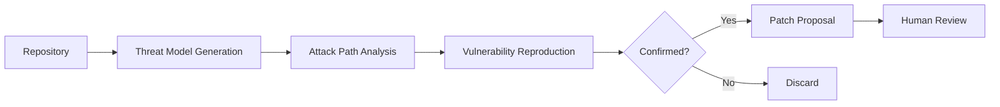
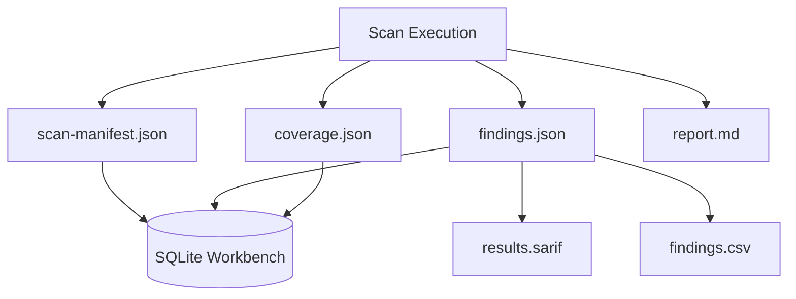
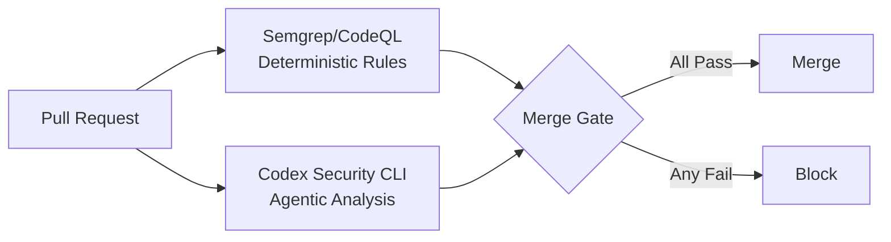

# Codex Security CLI Goes Open Source: Building Agentic SAST into Your Merge Path


In late July 2026 OpenAI published `@openai/codex-security` — a command-line interface and TypeScript SDK for agentic security scanning — under the Apache 2.0 licence[^1]. The release marks a deliberate shift: rather than confining security analysis to the cloud-hosted Codex Security plugin, teams can now embed the same scanning workflow directly into local development loops and CI pipelines. The client code, schemas, plugin skills, and workbench are all inspectable; the inference backend remains an OpenAI service dependency[^2].

This article examines what the open-source release actually contains, how its agentic scanning model differs from pattern-based SAST, and how to integrate it into a merge-path gate that blocks high-severity findings before code reaches `main`.

## What Ships in the Package

The npm package `@openai/codex-security` (currently v0.1.1) requires Node.js 22+ and Python 3.10+[^3]. It bundles:

- **CLI binary** — six primary commands: `scan`, `bulk-scan`, `scans` (history management), `export`, `validate`/`patch`, and `install-hook`[^3].
- **TypeScript SDK** — typed findings and coverage data, preflight validation, progress callbacks, cancellation support, and estimated cost tracking[^2].
- **Plugin skills** — the same security skill definitions used by the cloud-hosted Codex Security plugin, ensuring identical scan semantics across both surfaces[^2].
- **Local SQLite workbench** — tracks scan history, false-positive feedback, and cross-scan comparisons on the developer's machine[^3].

Every scan must produce four artefacts: `scan-manifest.json`, `findings.json`, `coverage.json`, and `report.md`[^2]. This contract is enforced regardless of whether the scan runs locally, in CI, or via the cloud plugin.

## Open Client, Closed Scanner

The Apache 2.0 licence covers the workflow orchestration, CLI, SDK, schemas, and plugin skills. The model inference — the actual vulnerability reasoning — remains a proprietary OpenAI service[^1]. As Mitch Ashley of Futurum Group put it: "OpenAI open-sourced the client and kept the scanner. That is distribution, not openness"[^1].

Practically, this means:

- Teams **can** inspect and modify the CLI, adapt scan workflows, and build custom integrations.
- Teams **cannot** self-host the scanning engine or run scans in air-gapped environments.
- Authentication requires either a ChatGPT account (interactive) or an OpenAI API key (CI)[^3].

For enterprises evaluating this against fully self-hosted tools like Semgrep or CodeQL, the distinction matters. You gain semantic depth; you trade away offline capability.

## Agentic Scanning vs Pattern Matching

Traditional SAST tools (Semgrep, CodeQL, Checkmarx) operate on deterministic pattern rules: define a query, run it against the AST, get reproducible results. Codex Security takes a fundamentally different approach[^4]:



The agent:

1. **Builds a threat model** for the repository, reasoning about data flows and trust boundaries across files.
2. **Examines attack paths** through multi-file analysis — something single-file pattern matchers struggle with.
3. **Attempts reproduction** of suspected vulnerabilities in an isolated environment.
4. **Proposes patches** for confirmed findings and validates fixes across subsequent runs[^1].

This contextual analysis catches vulnerability classes that pattern-based tools miss — particularly business logic flaws, multi-step injection chains, and authentication bypass paths that span service boundaries. The trade-off is non-determinism: OpenAI's own documentation warns that "AI scans can produce different results even when the configuration remains unchanged"[^1].

## CLI Command Reference

### Authentication

```bash
# Interactive login (local development)
npx @openai/codex-security login

# Headless CI authentication
npx @openai/codex-security login --device-auth

# Or set environment variable
export OPENAI_API_KEY="sk-..."
```

Authentication priority: explicit `--auth` flag → environment API key → stored ChatGPT session → interactive prompt[^3].

### Scanning

```bash
# Full repository scan
npx @openai/codex-security scan .

# Diff-scoped scan (recommended for PRs)
npx @openai/codex-security scan . --diff origin/main --head HEAD

# Staged changes only (pre-commit)
npx @openai/codex-security scan . --working-tree --base HEAD

# Deep mode with cost cap
npx @openai/codex-security scan . --mode deep --max-cost 5.00

# Specific subdirectory with custom model
npx @openai/codex-security scan . --path src/auth --model gpt-5.6-terra --effort high
```

The default model is `gpt-5.6-sol` with `xhigh` reasoning effort — the most capable but most expensive configuration. For PR-scoped scans, `gpt-5.6-terra` at `high` effort offers a reasonable cost-quality balance[^3].

### Scan History and Comparison

```bash
# List previous scans
npx @openai/codex-security scans list my-repo

# Compare two scans (regression detection)
npx @openai/codex-security scans compare scan-abc scan-def

# Re-run with original configuration
npx @openai/codex-security scans rerun scan-abc

# Mark false positive with reason
npx @openai/codex-security findings false-positive occ-123 \
  --reason "Test fixture, not production code"
```

### Export

```bash
# SARIF for GitHub code scanning
npx @openai/codex-security export sarif scan-abc > results.sarif

# CSV for spreadsheet triage
npx @openai/codex-security export csv scan-abc > findings.csv
```

## Wiring It into CI/CD

The recommended CI pattern uses diff-scoped scans to keep cost and noise proportional to the change set rather than the entire monorepo[^3]. Here is a GitHub Actions workflow:


```yaml
name: Security Gate
on:
  pull_request:
    branches: [main]

jobs:
  codex-security:
    runs-on: ubuntu-latest
    steps:
      - uses: actions/checkout@v4
        with:
          fetch-depth: 0

      - uses: actions/setup-node@v4
        with:
          node-version: '22'

      - uses: actions/setup-python@v5
        with:
          python-version: '3.12'

      - name: Install Codex Security CLI
        run: npm install -g @openai/codex-security

      - name: Run diff-scoped scan
        env:
          OPENAI_API_KEY: ${{ secrets.OPENAI_API_KEY }}
        run: |
          npx @openai/codex-security scan . \
            --diff origin/main --head HEAD \
            --output-dir /tmp/security-results \
            --model gpt-5.6-terra \
            --effort high \
            --max-cost 3.00 \
            --fail-on-severity high

      - name: Upload SARIF
        if: always()
        uses: github/codeql-action/upload-sarif@v3
        with:
          sarif_file: /tmp/security-results/results.sarif
```


Exit codes drive the gate decision: `0` means clean, `1` means the severity policy was breached, `2` means the scan failed or was incomplete[^3].

### Cost Control

Agentic scanning is not cheap. A full-repository scan with `gpt-5.6-sol` at `xhigh` effort on a medium-sized codebase can cost several dollars. The `--max-cost` flag provides a hard ceiling, and diff-scoped scanning dramatically reduces token consumption by limiting the analysis surface to changed files and their immediate dependency graph[^2].

## Pre-Commit Hook

For shift-left workflows, the CLI ships with a built-in Git hook installer:

```bash
npx @openai/codex-security install-hook
```

This adds a pre-commit check that scans staged and unstaged changes before each commit[^3]. It is deliberately lightweight — scanning only the working tree delta — but still requires network access to the OpenAI API.

## Scan Artefact Architecture



The four mandatory artefacts serve distinct consumers:

| Artefact | Consumer | Purpose |
|----------|----------|---------|
| `scan-manifest.json` | Audit trail | Target, scope, model config, sealed hashes |
| `findings.json` | CI gates, dashboards | Severity, confidence, locations, evidence, remediation |
| `coverage.json` | Risk assessment | Reviewed surfaces, deferred areas, completeness metrics |
| `report.md` | Human reviewers | Narrative summary with context |

The local SQLite workbench tracks these across runs, enabling `scans compare` for regression detection and `findings false-positive` for feedback that persists across team members[^3].

## Bulk Scanning

For organisations managing hundreds of repositories, the `bulk-scan` command discovers repos via the GitHub CLI and processes them in parallel:

```bash
# Interactive discovery
npx @openai/codex-security bulk-scan

# From CSV inventory with parallel workers
npx @openai/codex-security bulk-scan repos.csv \
  --output-dir /tmp/bulk-results \
  --workers 4 \
  --max-attempts 3
```

This supports resumable campaigns — interrupted bulk scans pick up where they left off using the SQLite workbench state[^3].

## Limitations and Caveats

**Non-determinism.** The same codebase scanned twice may produce different findings. This is inherent to LLM-based analysis and complicates compliance workflows that demand reproducibility[^1].

**Access restrictions.** The CLI remains in limited beta. Full repository scans may require Trusted Access for Cyber verification depending on account type[^3]. ⚠️ Availability outside Pro, Business, Enterprise, and Edu tiers is unconfirmed.

**No offline mode.** Every scan requires API connectivity. Air-gapped environments cannot use this tool.

**Cost unpredictability.** While `--max-cost` sets a ceiling, actual costs vary with repository complexity and the number of attack paths the agent explores. Budget carefully for large monorepos.

**Complementary, not replacement.** Codex Security excels at semantic, cross-file vulnerability reasoning but lacks the deterministic guarantees of pattern-based SAST. The pragmatic approach: run Semgrep or CodeQL for known vulnerability patterns, layer Codex Security on top for contextual analysis of high-risk services[^4].

## Practical Recommendation

The strongest deployment pattern combines both approaches:



Pattern-based tools catch the known classes cheaply and reproducibly. Codex Security catches the novel, cross-boundary vulnerabilities that rules cannot express. Together, they close more of the vulnerability surface than either tool alone.

## Citations

[^1]: DevOps.com, "OpenAI Open Sources Codex Security CLI for the Merge Path," July 2026. [https://devops.com/openai-open-sources-codex-security-cli-for-the-merge-path/](https://devops.com/openai-open-sources-codex-security-cli-for-the-merge-path/)

[^2]: TrilogyAI, "OpenAI Open-Sourced the Codex Security CLI," July 2026. [https://trilogyai.substack.com/p/openai-codex-security-cli](https://trilogyai.substack.com/p/openai-codex-security-cli)

[^3]: OpenAI, "CLI quickstart — Codex Security," ChatGPT Learn, 2026. [https://learn.chatgpt.com/docs/security/cli](https://learn.chatgpt.com/docs/security/cli)

[^4]: explainx.ai, "Codex Security CLI Open Source — July 2026," July 2026. [https://www.explainx.ai/blog/openai-codex-security-cli-sdk-open-source-july-2026](https://www.explainx.ai/blog/openai-codex-security-cli-sdk-open-source-july-2026)
