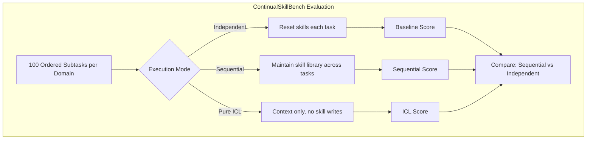
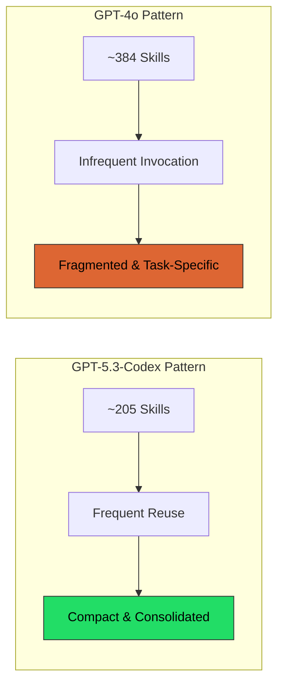
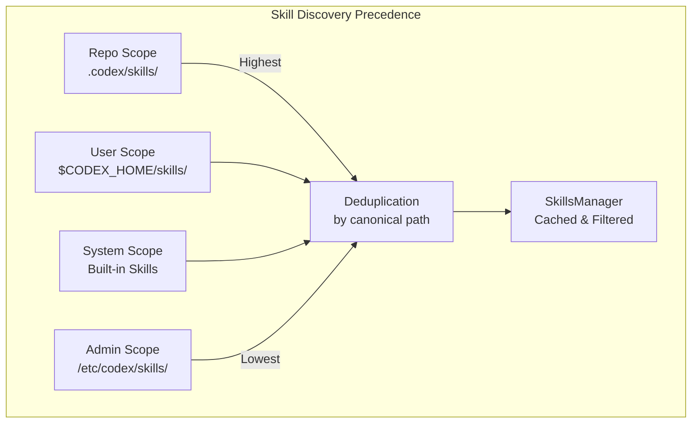

# ContinualSkillBench: Can Your Coding Agent Actually Learn From Experience — and What Codex CLI's Skill Architecture Gets Right


---

The promise of agentic coding is that your agent gets better the more you use it. Skills accumulate, workflows solidify, and the agent gradually learns the idioms of your codebase. That is the promise. ContinualSkillBench, published on 4 August 2026 by Guan et al., tests whether any of it is true [^1].

The answer is uncomfortable: current skill-evolution mechanisms support adaptation but "still struggle to consistently consolidate experience into robust and transferable skills" [^1]. The implications for every developer maintaining a `.codex/skills/` directory are immediate and practical.

## What ContinualSkillBench Actually Measures

ContinualSkillBench is the first dynamic evaluation framework designed specifically for **in-context continual skill learning** [^1]. It constructs ordered task sequences across five domains — healthcare, law, mathematics, finance, and office automation — each containing 100 interconnected subtasks arranged by increasing difficulty with explicit opportunities for cross-task skill reuse.

The benchmark compares three execution modes:

1. **Independent** — each task completed in isolation, skill repository reset before every task
2. **Sequential** — the agent maintains and updates its skill library across all 100 tasks
3. **Pure in-context learning (ICL)** — retains prior context and feedback but cannot create or modify explicit skills

Three frontier models were evaluated: GPT-4o, GPT-5.3-Codex, and Claude 4.7 Opus [^1].



## The Consolidation Gap

Sequential execution improved performance in 14 of 15 model–domain combinations, with an aggregate relative gain of 16.9% over independent execution [^1]. Healthcare showed the largest average gain (+0.149 normalised reward), whilst mathematics showed the smallest (+0.052) [^1].

The striking finding was what happened when explicit skill maintenance was compared to pure in-context learning. Across law, finance, and healthcare, the average normalised rewards were [^1]:

| Mode | Average Normalised Reward |
|------|--------------------------|
| Independent | 0.466 |
| Pure ICL | 0.605 |
| Sequential (with skills) | 0.602 |

In-context learning performed **comparably to explicit skill maintenance on average** [^1]. Much of the sequential–independent gain came from retained context and feedback rather than from reusable skill abstraction. The skills themselves were not reliably consolidating into transferable knowledge.

## The Repository Bloat Problem

The paper exposes a second failure mode that every Codex CLI practitioner should recognise: **repository fragmentation**. Less capable models accumulated larger, more fragmented skill collections specific to individual tasks [^1].

GPT-5.3-Codex constructed compact libraries of approximately 205 skills with frequent downstream reuse, suggesting genuine consolidation into generalisable procedures. GPT-4o accumulated roughly 384 skills with infrequent invocation — a bloated repository where entries existed but did not meaningfully contribute to subsequent tasks [^1].

This maps directly to a real-world problem. An uncurated `.codex/skills/` directory with dozens of auto-generated skills becomes noise rather than signal. The skills exist; they simply are not transferable.



## How Codex CLI's Skill Architecture Addresses This

Codex CLI's skill system was not designed with ContinualSkillBench in mind, but its architecture turns out to be well-suited to mitigating the consolidation gap — provided practitioners use it intentionally rather than relying on automatic accumulation.

### Two-Phase Loading Prevents Context Bloat

Codex CLI implements a two-phase skill loading mechanism [^2]. During the metadata phase, only the `name`, `description`, `path`, and optional `agents/openai.yaml` are read for all discovered skills. The full SKILL.md body is loaded only when the model decides a skill matches the current task [^2].

This means a repository with fifty skills does not consume fifty skills' worth of context tokens [^2]. The architecture inherently avoids the failure mode ContinualSkillBench exposes: even if your skill library grows, the context cost scales with relevance, not with repository size.

```toml
# .codex/skills/refactor-extract-method/SKILL.md frontmatter
---
name: "Extract Method Refactoring"
description: "Identifies long functions and extracts cohesive blocks into named methods with proper parameter threading"
---
```

### Four-Scope Precedence Prevents Fragmentation

The skill discovery system scans four hierarchical scopes: Repository, User, System, and Admin [^2]. Repository-scoped skills take the highest precedence, followed by user-installed, system (built-in), and admin (organisation-wide) skills [^2].

Deduplication happens by canonicalised path — identical skills discovered from multiple roots retain only the highest-precedence instance [^2]. This prevents the fragmentation problem ContinualSkillBench identifies, where multiple near-duplicate task-specific skills accumulate without consolidation.



### BFS Discovery With Safety Limits

The `discover_skills_under_root()` function performs breadth-first search with a maximum scan depth of 6 levels and a directory limit of 2,000 per root [^2]. Symlinks are not followed for system skills, and visited-set tracking prevents loops [^2]. These constraints are engineering guardrails against precisely the kind of unbounded skill accumulation ContinualSkillBench shows degrades performance.

### SKILL.md as a Human-Curated Format

Critically, Codex CLI skills are authored in SKILL.md — a human-readable markdown format with YAML frontmatter, now an open standard maintained at agentskills.io and supported across Codex CLI, Claude Code, Gemini CLI, Cursor, and 30+ other tools [^3]. The format originates from Anthropic and was standardised for cross-tool interoperability [^3].

This is the decisive architectural choice. ContinualSkillBench demonstrates that agent-generated skills fragment and fail to consolidate. Codex CLI sidesteps this by making skills a **human-curated artefact** version-controlled alongside the codebase, rather than an automatically accumulated library.

## Practical Implications for Your Skill Library

ContinualSkillBench suggests a clear set of practices for maintaining effective Codex CLI skills:

### 1. Curate Aggressively

The benchmark shows that smaller, frequently-reused skill libraries (the GPT-5.3-Codex pattern at ~205 skills) outperform larger, fragmented ones (GPT-4o at ~384 skills) [^1]. Review your `.codex/skills/` directory regularly. If a skill has not been invoked in the past month, it is likely task-specific noise rather than transferable knowledge.

### 2. Write Composable Skills, Not Task Scripts

Skills that encode **reusable procedures** — extract-method refactoring, test-fixture generation, migration-file scaffolding — align with the consolidation pattern ContinualSkillBench identifies as effective. Skills that encode single-task solutions ("fix the authentication bug in `auth.rs`") are the fragmentation anti-pattern.

### 3. Leverage Scope Separation

Place team-shared, well-tested skills in the repository scope (`.codex/skills/`). Keep experimental or personal skills in user scope (`$CODEX_HOME/skills/`). This mirrors the benchmark's finding that skill quality matters more than skill quantity [^1].

### 4. Use Description Fields Properly

The two-phase loading mechanism means the `description` field in your SKILL.md frontmatter is the primary signal the model uses to decide whether to load the full skill [^2]. A vague description ("useful utility") wastes the metadata phase. A precise one ("Generates pytest fixtures with factory_boy for Django models with foreign key relationships") enables targeted retrieval.

### 5. Version-Control Skills

ContinualSkillBench evaluated skills accumulated during a single run. Real-world skill libraries evolve over weeks and months. Version-controlling skills in your repository ensures that skill quality is subject to the same review process as production code, and that regressions can be reverted.

## The Broader Skill-Learning Research Landscape

ContinualSkillBench joins a growing body of work questioning whether agents genuinely learn transferable skills. SkillLearnBench (COLM'26) evaluated continual learning methods for agent skill generation across 20 real-world tasks and found that "no method leads across all tasks and LLMs, and scaling to stronger LLMs does not reliably help" [^4]. SkillRevise explored trace-conditioned skill revision as a post-hoc improvement mechanism [^5].

The convergent finding is that **skill curation remains a human responsibility**. Agents can adapt to context, feedback, and prior experience — the pure ICL baseline in ContinualSkillBench demonstrates this convincingly — but consolidating that adaptation into durable, transferable knowledge is a design problem, not an inference problem.

## Conclusion

ContinualSkillBench quantifies what experienced Codex CLI users already suspect: dumping auto-generated skills into a directory and hoping the agent gets smarter does not work. The 16.9% sequential gain is real, but it comes primarily from retained context, not from skill abstraction [^1].

Codex CLI's architecture — two-phase loading, four-scope precedence, human-curated SKILL.md, and BFS discovery with safety limits — provides the right primitives for building effective skill libraries. But the primitives only work if practitioners treat skills as engineered artefacts rather than accumulated debris.

The question ContinualSkillBench poses is not whether your agent can evolve its capabilities. It is whether you are willing to curate the evolution.

---

## Citations

[^1]: Guan, T., Wang, Y., Yang, H., Cao, S., Liu, S., Hu, Y., Li, J., & Zhang, M. (2026). "ContinualSkillBench: Can LLM Agents Truly Evolve Their Capabilities?" arXiv:2608.03874. [https://arxiv.org/abs/2608.03874](https://arxiv.org/abs/2608.03874)

[^2]: DeepWiki. "Skill Discovery and Loading — yulin0629/codex." [https://deepwiki.com/yulin0629/codex/7.1-skill-discovery-and-loading](https://deepwiki.com/yulin0629/codex/7.1-skill-discovery-and-loading)

[^3]: agentskills.io. "SKILL.md Specification — Open Standard for Agent Skills." [https://agentskills.io](https://agentskills.io)

[^4]: Zhong, S., Lu, Y., Ning, J., Wan, Y., Feng, L., Ao, Y., Ribeiro, L.F.R., Dreyer, M., Ammirati, S., & Xiong, C. (2026). "SkillLearnBench: Benchmarking Continual Learning Methods for Agent Skill Generation on Real-World Tasks." COLM'26. arXiv:2604.20087. [https://arxiv.org/abs/2604.20087](https://arxiv.org/abs/2604.20087)

[^5]: Li, Z. et al. (2026). "SkillRevise: Improving LLM-Authored Agent Skills via Trace-Conditioned Skill Revision." arXiv:2606.01139. [https://arxiv.org/abs/2606.01139](https://arxiv.org/abs/2606.01139)
