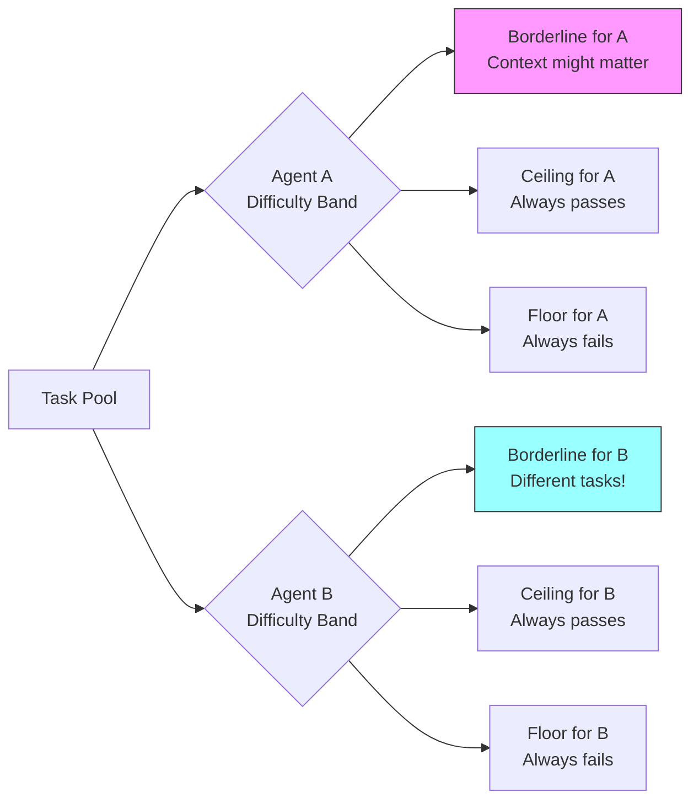
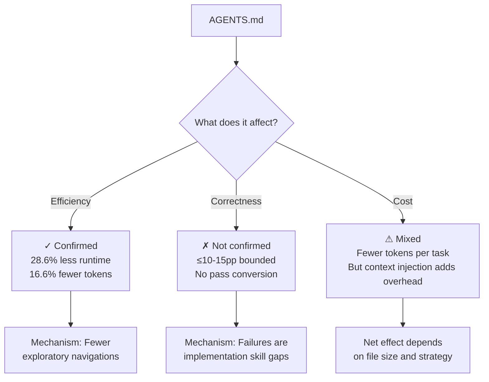

# Do Context Files Actually Help? What a 288-Run Ablation Study Reveals About AGENTS.md, Correctness, and Your Codex CLI Workflow


---

Every serious Codex CLI user has an `AGENTS.md` file. Many have dozens — OpenAI's own Codex repository ships 88 of them across its directory tree[^1]. The prevailing wisdom, reinforced by tooling defaults and official documentation, is that a well-crafted `AGENTS.md` makes your agent faster, cheaper, and more accurate. Earlier this year, Lulla et al. published the first empirical evidence: 28.6% lower runtime, 16.6% fewer output tokens[^2]. The community treated it as validation.

Then, on 28 July 2026, Prakhar Khatri posted a controlled ablation study that complicates the picture considerably[^3]. Across 288 evaluated runs, two frontier agents, and three real Python repositories, the finding is blunt: **context-injection strategy does not measurably move correctness**. Agents fail on implementation skill — feature design, pattern selection, exact wiring — not on missing repository knowledge that a context file could supply.

This article unpacks the three major studies, maps their findings to Codex CLI configuration, and proposes a practical framework for deciding what belongs in your `AGENTS.md` and what does not.

## Three Studies, Three Conclusions

The empirical literature on `AGENTS.md` effectiveness now comprises three significant papers. Their findings appear contradictory until you read the fine print.

### Lulla et al. (January 2026): Efficiency Gains

The first controlled study analysed 10 repositories and 124 pull requests, running agents with and without `AGENTS.md` files[^2]. The headline finding: a 28.64% reduction in median runtime and a 16.58% reduction in output token consumption. Task completion behaviour remained comparable.

The critical detail: this study measured **efficiency** — wall-clock time and token spend — not **correctness**. The authors hypothesised that agents spend less time on exploratory navigation when given project context upfront. Fewer planning iterations, fewer repeated model calls. The work was presented at the Journal Ahead Workshop at ICSE 2026[^2].

### Gloaguen et al. (February 2026): Quality Matters

The ETH Zurich team ran four coding agents — Claude Code with Sonnet 4.5, Codex with GPT-5.2 and GPT-5.1 Mini, and Qwen Code with Qwen3-30B — across SWE-bench tasks and a novel collection of repositories with developer-committed context files[^4]. Their findings:

- LLM-generated context files **reduced** success rates by approximately 3%
- Human-written files **improved** success by approximately 4%
- Both increased inference costs by over 20%

The take-away: **context quality is a stronger variable than context presence**. Auto-generated `AGENTS.md` files actively hurt because agents follow instructions literally, even when doing so is counterproductive[^4].

### Khatri (July 2026): Correctness Is Unmoved

The most recent and methodologically rigorous study used a within-task paired ablation design across three context-injection strategies: none, always-on, and selective[^3]. Key design choices:

- **Two frontier agents**: Claude Code (claude-sonnet-4-6) and Codex CLI (gpt-5.5)
- **17 real tasks** from 3 Python repositories (pdm, firebase-admin-python, opshin)
- **Gold-test evaluation**: original PR test diffs applied to agent workspaces
- **3 repeats per cell**: 288 total evaluated runs

The pass-rate results are striking in their flatness:

| Agent | No Context | Always-On | Selective | Omnibus *p* |
|-------|-----------|-----------|-----------|-------------|
| Claude Code (15 tasks) | 53.3% | 55.6% | 55.6% | 1.000 |
| Codex CLI (17 tasks) | 58.8% | 56.9% | 52.9% | 0.66 |

All pairwise differences fall within 2.3 percentage points (Claude) and 5.9 percentage points (Codex)[^3]. Equivalence testing (TOST with task-clustered bootstrap) bounded the maximum plausible effect to under 10pp for Claude and under 15pp for Codex.

## Why Context Files Do Not Fix Correctness

The failure-mode analysis is where the paper earns its weight. Khatri inspected near-miss failures — tasks where only 1–4 gold tests failed — and found failures clustered around:

1. **Implementation precision**: getting the exact behavioural specification right
2. **Architectural pattern selection**: choosing the correct design pattern for the task
3. **Type-system reasoning**: deep inference about types and generics
4. **Exact wiring**: connecting components in precisely the right way

None of these are problems that an `AGENTS.md` file — however well-written — can solve. They are problems of **model capability**, not **contextual knowledge**[^3].

A manipulation-validity probe confirmed this: the two convention-most-relevant near-miss tasks were re-run across all strategies with 3 repeats each. The real `AGENTS.md` never converted a failure to a pass on either agent[^3].

## The Agent-Specific Difficulty Problem

Perhaps the study's most underappreciated finding: **borderline task difficulty is agent-specific**. Across 15 shared tasks, per-task pass rates between Claude Code and Codex CLI showed a Spearman correlation of ρ = 0.75 (*p* = 0.001) — positive but far from perfect[^3].

Roughly 40% of tasks occupied different difficulty bands by agent. A task might be trivially solvable for Claude Code yet consistently failed by Codex CLI, or vice versa. This explains why single-agent studies reach contradictory conclusions: they sample from different agents' informative difficulty ranges.



This has a direct practical implication: if you are benchmarking your `AGENTS.md` against a single agent, your results may not transfer when you switch models in `config.toml`.

## What This Means for Codex CLI Users

### Stop Optimising AGENTS.md for Correctness

The evidence is now clear across three studies: `AGENTS.md` does not reliably improve whether your agent gets the right answer. If you are spending hours crafting context files to improve correctness, redirect that effort to task decomposition, test scaffolding, or model selection.

### Keep Optimising for Efficiency

The Lulla et al. findings on efficiency remain valid and are corroborated by a narrow signal in Khatri's data: on one repository (opshin), the `AGENTS.md` warning about slow full-suite tests prompted agents to use targeted testing instead, reducing blind full-suite invocations from 3.67 to 1.67 per cell and cutting wall-clock time by approximately 24%[^3].

The lesson: `AGENTS.md` is most effective when it encodes **operational shortcuts** — which tests are slow, which directories to skip, which build commands to use — rather than conceptual guidance about architecture or coding style.

### Practical AGENTS.md Template

Based on the combined evidence, here is what belongs in your `AGENTS.md` and what does not:

```markdown
<!-- AGENTS.md — evidence-based template -->

## Build & Test (KEEP — efficiency gains confirmed)
- Run `make test-unit` for fast feedback; full suite takes 12+ minutes
- Lint with `ruff check --fix` before committing
- Integration tests require `docker compose up -d` first

## Directory Map (KEEP — reduces exploratory navigation)
- src/core/ — domain logic, no framework imports
- src/adapters/ — external service integrations
- tests/unit/ — fast, no I/O
- tests/integration/ — requires running services

## Conventions (TRIM — minimal effect on correctness)
- Use British English in user-facing strings
- Error types in src/core/errors.rs

<!-- REMOVE: architectural philosophy, coding style guides,
     design rationale, "how we think about X" sections -->
```

### Configure Model Routing, Not Just Context

Given the agent-specific difficulty finding, the highest-leverage configuration in Codex CLI is model selection per task, not context file engineering. Use named profiles in `config.toml` to route tasks by complexity:

```toml
[profiles.scout]
model = "gpt-5.6-luna"
# Fast exploration, file discovery, simple edits

[profiles.default]
model = "gpt-5.6-terra"
# Standard implementation tasks

[profiles.hard]
model = "gpt-5.6-sol"
reasoning_effort = "xhigh"
# Complex refactors, deep type reasoning
```

The Khatri data suggests that model capability is the binding constraint on correctness — not contextual knowledge. A more capable model on a hard task will outperform a less capable model with a perfect `AGENTS.md`[^3].

## Study Limitations Worth Noting

The Khatri study is methodologically sound but has acknowledged constraints[^3]:

- **Small sample**: 17 tasks with a minimum detectable effect of ~30pp; a 10pp effect would require ~120–200 tasks to detect
- **Python only**: three repositories in one language
- **Snapshot in time**: claude-sonnet-4-6 and gpt-5.5; behaviour may differ with current models (gpt-5.6 family, Claude Opus 5)
- **Injection asymmetry**: Claude Code receives context via system prompt; Codex CLI receives it prepended to the user prompt

⚠️ The power limitation is particularly important: the study cannot rule out effects smaller than 30 percentage points. A modest 5–10pp improvement from context files is theoretically possible but would require a substantially larger study to detect.

## The Emerging Consensus

Across three studies and hundreds of experimental runs, the evidence converges on a nuanced position:



Context engineering matters — but not in the way the community assumed. Your `AGENTS.md` is a **process optimiser**, not a **capability amplifier**. It makes your agent navigate faster and waste fewer tokens on blind exploration. It does not make your agent smarter at solving hard problems.

For Codex CLI users, the practical upshot is clear: keep your `AGENTS.md` lean, operational, and focused on build/test shortcuts. Invest your optimisation budget in model routing, task decomposition, and the emerging plugin ecosystem — the levers that actually move correctness.

## Citations

[^1]: OpenAI, "Codex CLI Repository — AGENTS.md files across directory tree," GitHub, 2026. [https://github.com/openai/codex](https://github.com/openai/codex)

[^2]: J. L. Lulla, S. Mohsenimofidi, M. Galster, J. M. Zhang, S. Baltes, and C. Treude, "On the Impact of AGENTS.md Files on the Efficiency of AI Coding Agents," arXiv:2601.20404, January 2026. Presented at JAWs @ ICSE 2026. [https://arxiv.org/abs/2601.20404](https://arxiv.org/abs/2601.20404)

[^3]: P. Khatri, "Do Context Files Help Coding Agents? A Two-Agent Ablation Study on Real Repositories," arXiv:2607.27250, July 2026. [https://arxiv.org/abs/2607.27250](https://arxiv.org/abs/2607.27250)

[^4]: T. Gloaguen, N. Mündler, M. Müller, V. Raychev, and M. Vechev, "Evaluating AGENTS.md: Are Repository-Level Context Files Helpful for Coding Agents?" arXiv:2602.11988, February 2026. ETH Zurich / SRI Lab. [https://arxiv.org/abs/2602.11988](https://arxiv.org/abs/2602.11988)

[^5]: I. Woszapar, "Context Engineering Research: Papers & Benchmarks (2026)," 2026. [https://www.iwoszapar.com/p/context-engineering-research-2026](https://www.iwoszapar.com/p/context-engineering-research-2026) — Background survey referenced during research.
