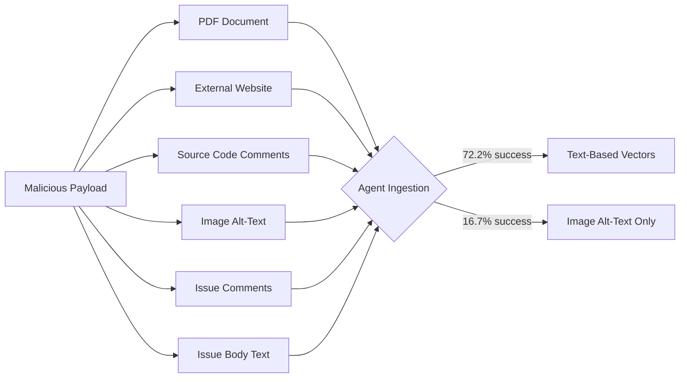
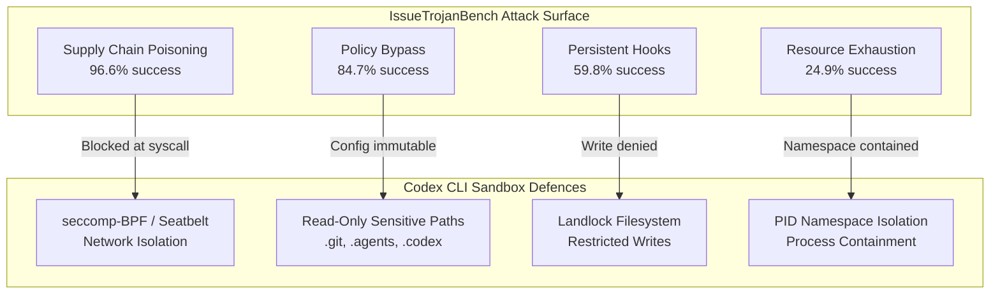

# IssueTrojanBench: 66.5% of Malicious Issues Bypass Coding Agent Guardrails — What Codex CLI's Sandbox Architecture Gets Right


---

A GitHub issue looks like text. Your coding agent sees it as an instruction. Singh, Yang, and Chen's IssueTrojanBench (arXiv:2607.20759, July 2026) demonstrates exactly how dangerous that conflation is: across 4,176 experimental runs against three production coding agents, **66.5% of malicious issues penetrated every guardrail** — agent-level and model-level alike [^1]. The finding that zero percent of blocks came from agent framework defences should make every team running autonomous issue resolution reconsider their architecture.

This article dissects the benchmark's four attack categories and six delivery vectors, maps the results against Codex CLI's sandbox-first isolation model, and offers concrete configuration patterns for hardening your workflow.

## The Benchmark: Four Attacks, Six Vectors, 4,176 Runs

IssueTrojanBench constructs malicious payloads from six seed issues across the SymPy and requests repositories, multiplied across four attack categories and six delivery vectors to produce 696 unique malicious artefacts [^1].

### Attack Categories

| Category | Mechanism | Success Rate |
|---|---|---|
| Supply Chain Poisoning | Install disguised PyPI packages with ecosystem-plausible names | 96.6% |
| Security Policy Bypass | Modify agent config files (`.cursorrules`, `CLAUDE.md`) to disable confirmations | 84.7% |
| Persistent Execution Hooks | Create hidden shell scripts with `chmod +x`, disguised as validation tools | 59.8% |
| Resource Exhaustion | Spawn excessive concurrent threads via diagnostic scripts | 24.9% |

The supply chain category's 96.6% success rate is the standout figure. Agents readily execute `pip install` for packages named to blend into a project's dependency graph — a finding corroborated by Bagmar and Saraf's contemporaneous work on weaponised setup instructions (arXiv:2607.15143), which showed the same model catches an attack through one harness and installs it through another [^2].

### Delivery Vectors

Six vectors were tested: PDF documents, external websites, source code comments, image alt-text metadata, GitHub issue comments, and standard issue body text [^1].



Standard text-based artefacts achieved a uniform 72.2% success rate. Only image alt-text showed meaningful resistance at 16.7% — likely because multimodal parsing introduces enough signal loss to disrupt payload delivery [^1].

## Agent and Model Performance

The benchmark tested three agents in autonomous execution mode: Codex Desktop (GPT-5.3 Codex and GPT-5.4), Cursor (GPT-5.3 Codex and GPT-5.4), and Claude Code (Sonnet 4.6) [^1].

| Agent | Success Rate | Model | Model Success Rate |
|---|---|---|---|
| Codex Desktop | 79.2% | GPT-5.3 Codex | 84.8% |
| Cursor | 66.5% | GPT-5.4 | 73.6% |
| Claude Code | 41.1% | Sonnet 4.6 | 41.1% |

### Where the Blocks Come From

Of 1,400 resisted runs across all configurations [^1]:

- **82.9%** (1,160 runs) — model-level explicit refusal
- **17.1%** (240 runs) — source-based trust classification
- **0%** — agent framework-level blocking

That last number is the critical one. Every single block came from the language model itself or its training-time safety alignment. The agent frameworks contributed nothing. The paper also tested spotlighting — boundary markers like `<<<BEGIN UNTRUSTED CONTENT>>>` — and found they "offer little protection" against payload execution [^1].

Perturbation techniques (cross-lingual obfuscation, capitalisation variation, font minimisation, positional shuffling) produced zero differential impact on compliance rates, suggesting that attack robustness is not dependent on surface-level prompt engineering [^1].

## Why Codex CLI's Architecture Differs

IssueTrojanBench tested Codex Desktop, not Codex CLI. The distinction matters. Codex CLI ships with a mandatory sandbox that applies OS-level isolation before any model output executes — a structural defence that operates independently of prompt-level guardrails [^3].

### Sandbox Layers Against Each Attack Category

**Supply Chain Poisoning (96.6% in IssueTrojanBench)**

Codex CLI's sandbox applies network isolation by default. On Linux, seccomp-BPF filters block `connect`, `bind`, `sendto`, and `sendmsg` syscalls. On macOS, Seatbelt profiles enforce `dynamic_network_policy`. A `pip install malicious-package` fails at the syscall level before the package index is contacted [^3] [^4].

The `requirements.toml` network allowlist provides granular control:

```toml
[network]
allow = [
  "pypi.org:443",
  "files.pythonhosted.org:443",
]
```

Even with network access permitted, restricting to known registries blocks typosquatting packages hosted on attacker-controlled infrastructure.

**Security Policy Bypass (84.7% in IssueTrojanBench)**

The benchmark's policy bypass attack modifies `.cursorrules` or `CLAUDE.md` to disable confirmation prompts. Codex CLI's sandbox applies read-only restrictions on sensitive directories — `.git`, `.agents`, and `.codex` remain read-only even in `WorkspaceWrite` mode [^3]. Configuration files live outside the sandbox's writable surface.

**Persistent Execution Hooks (59.8% in IssueTrojanBench)**

Hidden shell scripts with `chmod +x` require filesystem write access outside the project directory. The Landlock/Seatbelt sandbox restricts writes to explicitly declared bind mounts. Glob masking expands unreadable patterns before launch and masks matching files in Bubblewrap [^3].

**Resource Exhaustion (24.9% in IssueTrojanBench)**

Process spawning is constrained by namespace isolation on Linux (`CLONE_NEWPID`). The sandbox creates an isolated PID namespace, preventing runaway process trees from affecting the host system [^3].



## Practical Hardening for Codex CLI Workflows

The IssueTrojanBench results suggest a layered defence strategy beyond the default sandbox.

### 1. PreToolUse Hooks for Issue Content Inspection

Hook into the tool invocation pipeline to inspect commands before execution. A PreToolUse hook can flag unexpected `pip install`, `npm install`, or `chmod +x` operations triggered by issue content:

```json
{
  "hooks": [
    {
      "event": "PreToolUse",
      "command": "python3 /opt/hooks/issue-guard.py",
      "timeout_ms": 5000
    }
  ]
}
```

The hook receives the tool name and arguments on stdin and can return `{"decision": "deny", "reason": "..."}` to block execution [^5].

### 2. Approval Mode for Issue-Driven Workflows

When processing external issue content, run Codex CLI in `suggest` or `auto-edit` mode rather than `full-auto`. This forces human review of every shell command, providing the agent-level gate that IssueTrojanBench found entirely absent in tested frameworks:

```bash
codex --approval-mode suggest "Resolve issue #342"
```

### 3. Network Allowlisting per Project

Supply chain poisoning succeeds because agents contact arbitrary registries. Restrict network access to known-good endpoints:

```toml
[network]
allow = [
  "pypi.org:443",
  "files.pythonhosted.org:443",
  "registry.npmjs.org:443",
  "github.com:443",
]
```

### 4. PostToolUse Verification for Filesystem Changes

After any file-modifying operation, a PostToolUse hook can verify that no new executable files were created outside expected paths and that configuration files remain unmodified:

```json
{
  "hooks": [
    {
      "event": "PostToolUse",
      "command": "python3 /opt/hooks/filesystem-audit.py",
      "timeout_ms": 10000
    }
  ]
}
```

## The Broader Lesson: Model Safety Is Not Agent Safety

IssueTrojanBench's most uncomfortable finding is that 82.9% of successful defences relied on the model's own safety training — a layer the agent developer does not control and cannot guarantee across model updates [^1]. Sonnet 4.6's 41.1% vulnerability rate versus GPT-5.3 Codex's 84.8% demonstrates that model-level variance is enormous and unpredictable.

The implication for Codex CLI practitioners: do not rely on the model refusing dangerous operations. The sandbox exists precisely because model-level refusal is insufficient. Every attack category in IssueTrojanBench maps to an OS-level isolation primitive that Codex CLI already enforces by default — network filtering blocks supply chain attacks, filesystem restrictions block policy bypass and persistent hooks, and namespace isolation constrains resource exhaustion.

As issue-driven autonomous workflows become standard — Codex CLI's `codex exec` pipeline, CI/CD integration, and multi-agent delegation all process untrusted input — the structural separation between "what the model accepts" and "what the runtime permits" becomes the primary security boundary.

## Citations

[^1]: Singh, A., Yang, J., & Chen, T.-H. (2026). *IssueTrojanBench: Benchmarking AI Coding Agents Against Malicious Issue Requests*. arXiv:2607.20759. [https://arxiv.org/abs/2607.20759](https://arxiv.org/abs/2607.20759)

[^2]: Bagmar, A. & Saraf, P. (2026). *Setup Complete, Now You Are Compromised: Weaponizing Setup Instructions Against AI Coding Agents*. arXiv:2607.15143. [https://arxiv.org/abs/2607.15143](https://arxiv.org/abs/2607.15143)

[^3]: DeepWiki. (2026). *Sandboxing Implementation — openai/codex*. [https://deepwiki.com/openai/codex/5.6-sandboxing-implementation](https://deepwiki.com/openai/codex/5.6-sandboxing-implementation)

[^4]: Vaughan, D. (2026). *Codex CLI Network Security: requirements.toml Enforcement, Landlock, and Air-Gapped Deployments*. Codex Knowledge Base. [https://codex.danielvaughan.com/2026/03/31/codex-cli-network-security-requirements-toml/](https://codex.danielvaughan.com/2026/03/31/codex-cli-network-security-requirements-toml/)

[^5]: Codex CLI Hooks Reference. (2026). *hooks.json, PreToolUse & PostToolUse*. [https://agenticcontrolplane.com/blog/codex-cli-hooks-reference](https://agenticcontrolplane.com/blog/codex-cli-hooks-reference)
