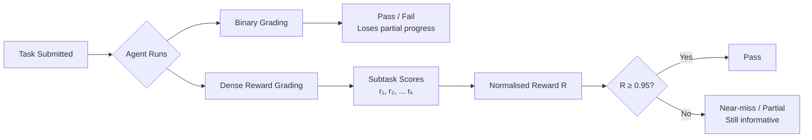
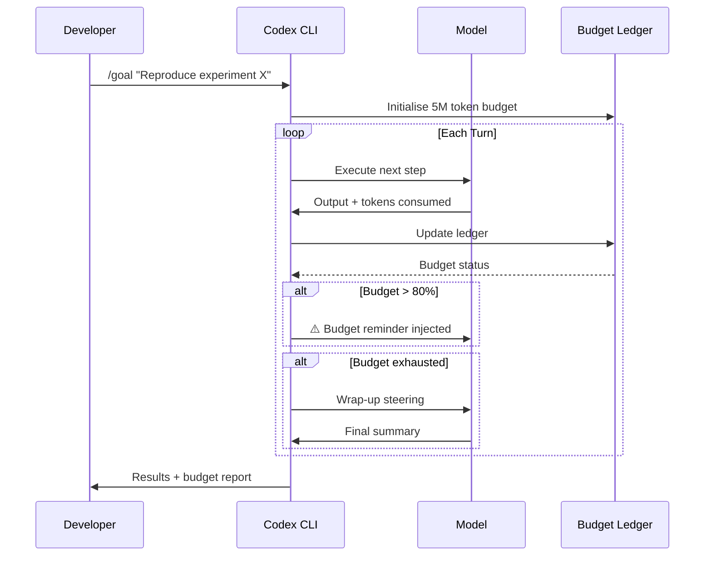

# Long-Horizon-Terminal-Bench: What Dense Reward Grading Reveals About Your Codex CLI Session Strategy


---

Most coding agent benchmarks measure binary success on tasks that finish in minutes. Long-Horizon-Terminal-Bench (LHTB) deliberately breaks that mould: 46 tasks spanning experiment reproduction, software engineering, scientific computing, and even interactive games, where the average run consumes 9.8 million tokens across 239 episodes and 88.9 minutes of wall-clock execution [^1]. Even the strongest frontier model tested — Grok 4.5 — manages only 28.3% pass@0.95 [^1]. GPT-5.6 Sol and GPT-5.5 sit at 15.2% [^1].

The headline numbers are sobering, but the real value lies in what the benchmark's dense reward methodology exposes about *how* agents fail on extended tasks — and what Codex CLI practitioners can do about it.

## Why Binary Grading Hides the Story

Traditional benchmarks like SWE-Bench and Terminal-Bench 2.0 grade on final outcome: pass or fail [^2]. LHTB decomposes each task into semantically meaningful subtasks with individual checks and assigns a normalised reward:

```
R = (Σ wₖ · rₖ) / (Σ wₖ)
```

where each `rₖ ∈ [0,1]` represents a subtask score — binary, continuous/thresholded, or episode-aggregating [^1].

The result is revealing. Across all models, 62.8% of runs land in the partial-progress zone (0.05 < R < 0.95), and near-misses (0.75 ≤ R < 0.95) occur nearly twice as frequently as outright passes [^1]. Kimi K2.6, for instance, records zero passes at the 0.95 threshold yet achieves a mean reward of 0.25 across five near-miss attempts — invisible under binary scoring.



## The Three Failure Modes That Matter

LHTB's failure analysis identifies patterns directly relevant to anyone running long Codex CLI sessions:

### 1. Timeout Exhaustion (79% of Failures)

The dominant failure mode. Agents hit the 90-minute budget with mean rewards between 0.10 and 0.35 [^1]. They are making progress but not fast enough. The implication: the agent's planning horizon is misaligned with the task's actual complexity.

### 2. False Finishes (14 Runs Identified)

Agents declare success at R ≥ 0.75 despite incomplete verification. Kimi K2.7 Code stops on `duckdb-optimizer-closure` at R = 0.92, tantalisingly close but objectively wrong [^1]. The agent's self-assessment of "done" diverges from reality.

### 3. Weak Self-Verification

Early exits show wildly variable stopping judgement. Kimi K2.7 Code averages R = 0.51 on early exits; MiniMax M3 averages R = 0.42; Kimi K2.6 averages R = 0.11 [^1]. Agents lack reliable internal signals for when to keep going versus when to stop.

## Model Performance and Cost Efficiency

LHTB tests 17 frontier models. The cost-performance spread is striking:

| Model | Pass@0.95 | Mean Reward | Avg Cost/Task |
|-------|-----------|-------------|---------------|
| Grok 4.5 | 28.3% | 0.51 | ~\$11 |
| GPT-5.6 Sol | 15.2% | — | ~\$21 |
| GPT-5.5 | 15.2% | — | ~\$21 |
| MiniMax M3 | 6.5% | 0.27 | — |
| DeepSeek V4 Pro | 6.5% | — | — |
| GPT-5.3 Codex | 4.3% | — | — |
| GPT-5.4 | 2.2% | 0.27 | — |

*Selected results from LHTB evaluation [^1]*

GPT-5.4 requires 302 episodes per task on average versus 208 for GPT-5.6 Sol — a weaker model burning more tokens to accomplish less [^1]. The inverse relationship between capability and resource consumption matters directly when configuring Codex CLI token budgets.

## Mapping LHTB Lessons to Codex CLI Configuration

### Goal Mode as the Long-Horizon Harness

Codex CLI's `/goal` command transforms the CLI into a long-horizon autonomous agent [^3]. The agent plans, executes, self-corrects, and persists state in the app-server across session breaks. This is precisely the operational model LHTB evaluates — but with controls that the benchmark's agents lacked.

Configure Goal Mode with explicit verification checkpoints:

```toml
# config.toml — long-horizon session settings
[goal]
auto_approve = true
verification_interval = 5    # force verification every 5 steps

[sessions]
auto_persist = true
```

### Token Budgets Against Timeout Exhaustion

LHTB's 79% timeout failure rate argues for explicit budget management. Codex CLI v0.147's rollout token budgets [^4] let you set hard limits with graceful degradation:

```toml
[features.rollout_budget]
enabled = true
max_tokens = 5000000          # 5M token ceiling
soft_threshold_pct = 80       # start budget reminders at 80%
abort_strategy = "wrap_up"    # graceful turn abortion
```

When the budget hits 80%, Codex injects model-visible reminders — steering the agent toward completing the highest-value remaining subtasks rather than running blindly into a wall [^4].



### Multi-Agent Delegation for Task Decomposition

LHTB's dense reward structure decomposes tasks into subtasks — exactly the pattern Codex CLI's stabilised multi-agent V2 supports [^5]. Rather than one agent grinding through a monolithic 9.8M-token session, delegate subtasks to specialised sub-agents:

```bash
# Launch with multi-agent V2 and tiered model routing
codex --model gpt-5.6-sol \
      --subagent-model gpt-5.6-luna \
      --subagent-concurrency 3 \
      --sandbox workspace-write
```

The orchestrating Sol agent handles planning and coordination; Luna sub-agents handle narrower subtasks in parallel at a fraction of the per-token cost [^5]. This maps directly to LHTB's observation that the bottleneck is "not local execution correctness, but long-horizon completion" [^1].

### Self-Verification via PostToolUse Hooks

LHTB's false-finish problem — agents stopping at R = 0.92 thinking they are done — has a direct Codex CLI mitigation. PostToolUse hooks can enforce verification before the agent declares completion:

```toml
# requirements.toml — verification enforcement
[[post_tool_use]]
tool = "shell"
match_content = "Task complete|All done|Finished"
action = "inject_prompt"
prompt = "Before concluding, run the full test suite and verify all acceptance criteria. List any failing checks."
```

This pattern intercepts premature completion signals and forces a verification pass — precisely the self-verification discipline that LHTB shows agents lack natively.

### AGENTS.md as the Planning Scaffold

LHTB tasks span nine categories, each requiring domain-specific knowledge. Codex CLI's AGENTS.md provides the structural scaffolding that keeps agents oriented during extended sessions:

```markdown
<!-- AGENTS.md for long-horizon scientific computing tasks -->
## Session Discipline

For tasks exceeding 30 minutes:
1. Decompose into verifiable subtasks before executing
2. After each subtask, run verification and log the result
3. If a subtask fails twice, escalate to the user
4. Never declare completion without running the full verification suite

## Budget Awareness

Monitor token consumption. At 70% budget:
- Prioritise remaining subtasks by expected impact
- Skip exploratory work; focus on highest-reward items
- Document incomplete subtasks for future sessions
```

## The Dense Reward Mindset

LHTB's core insight extends beyond benchmarking. In production workflows, adopting a dense reward mindset means:

- **Decompose before executing.** Break `/goal` objectives into subtasks with explicit verification criteria, mirroring LHTB's subtask grading.
- **Budget for partial progress.** Configure token budgets assuming the agent will achieve 50-75% of the objective, not 100%. Design for graceful handoff.
- **Verify incrementally.** Use PostToolUse hooks and AGENTS.md instructions to enforce checkpoint verification, preventing false finishes.
- **Route models to task complexity.** LHTB shows GPT-5.6 Sol at \$21/task versus Hy3 at \$3.6/task [^1]. Use Sol for planning and coordination; delegate execution subtasks to cheaper models via multi-agent V2.

The benchmark's Spearman correlation of ρ = 0.74 between pass rate and mean reward [^1] confirms that dense progress tracking is a reliable proxy for eventual success. Agents that make steady partial progress are the ones that eventually pass — and Codex CLI's session management, token budgets, and hook system give you the controls to push your agents further along that curve.

## Citations

[^1]: Li, Z., Li, Z., Shi, Y., Wang, R., Yang, J., Liu, Z., Wu, X., Li, A., Yu, Y., Liu, N., Sun, L., Mi, H. & Liang, L. (2026). "Long-Horizon-Terminal-Bench: Testing the Limits of Agents on Long-Horizon Terminal Tasks with Dense Reward-Based Grading." arXiv:2607.08964. [https://arxiv.org/abs/2607.08964](https://arxiv.org/abs/2607.08964)

[^2]: Li, Z. et al. (2026). "Terminal-Bench: Benchmarking Agents on Hard, Realistic Tasks in Command Line Interfaces." Published at ICLR 2026. arXiv:2601.11868. [https://arxiv.org/abs/2601.11868](https://arxiv.org/abs/2601.11868)

[^3]: OpenAI. (2026). "Codex CLI Goal Mode." ChatGPT Learn Documentation. [https://learn.chatgpt.com/docs/changelog](https://learn.chatgpt.com/docs/changelog)

[^4]: OpenAI. (2026). "Codex CLI v0.147 — Rollout Token Budgets." GitHub openai/codex. [https://github.com/openai/codex](https://github.com/openai/codex)

[^5]: OpenAI. (2026). "Codex CLI v0.145.0 — Stabilised Multi-Agent V2." Codex Updates, Releasebot. [https://releasebot.io/updates/openai/codex](https://releasebot.io/updates/openai/codex)
