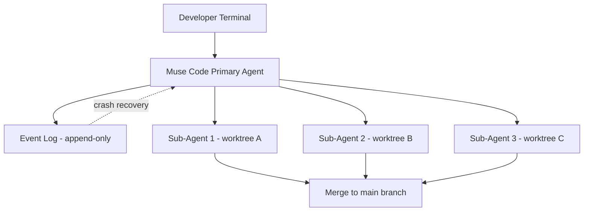
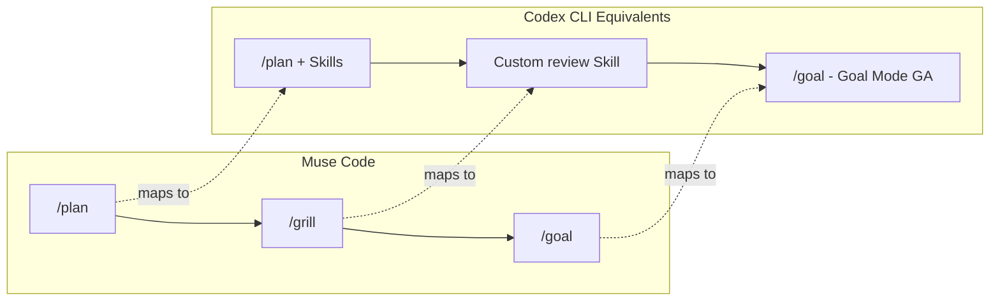

# Meta Muse Code Enters the Terminal Agent Wars: Persistent Background Agents, Replay-Safe Event Logs, and What It Means for Your Codex CLI Workflow

---

On 5 August 2026, Mark Zuckerberg announced the beta release of **Muse Code**, Meta's first terminal-based coding agent [^1]. Powered by the new **Muse Spark 1.2** model, Muse Code enters a market already contested by OpenAI's Codex CLI (v0.146.1), Anthropic's Claude Code, Google's Gemini CLI, and xAI's Grok Build. For teams that have standardised on Codex CLI, the arrival of a sixth credible terminal agent raises practical questions: does Muse Code introduce architectural ideas worth borrowing? Does its pricing model change the economics? And does it threaten the AGENTS.md-centred workflow you have already invested in?

This article breaks down Muse Code's architecture, benchmarks its claims against independent data, and maps its differentiators onto equivalent Codex CLI capabilities — so you can decide whether it warrants a slot in your toolchain or remains a spectator sport.

## The Architecture: Persistence as a First-Class Primitive

Muse Code's headline feature is **persistent background agents** [^2]. Unlike Codex CLI, which spawns subagents per turn and discards them when the task completes, Muse Code maintains a set of specialised agents that remain active for the entire session. When a new request arrives, these agents already hold repository context — skipping the cold-start information-gathering phase that typically consumes the first few turns of a Codex CLI session.

Backing this persistence is an **append-only local event log**. Every model call, tool execution, approval decision, and file edit is appended before it executes [^2]. Meta claims this makes the runtime "replay-exact and restart-safe": if Muse Code crashes twenty hours into a long-running task, it resumes precisely where it stopped, with no lost work and no re-prompting.

For complex work, the agent fans out into **parallel sub-agents**, each operating in its own isolated git worktree [^2]. The developer's working copy is never touched — a pattern Codex CLI users will recognise from the worktree isolation available since v0.115.0 [^3].

Three default slash commands ship with the agent [^4]:

- `/plan` — turns a task into an approval-gated plan
- `/grill` — stress-tests the plan until it holds up
- `/goal` — works towards successful completion of the specified objective

## Muse Spark 1.2: The Model Behind the Agent

Muse Code is powered by **Muse Spark 1.2**, a proprietary, closed-weights model released alongside the agent [^1]. This is a significant strategic departure from Meta's Llama lineage. Where Llama models are open-weight and community-driven, Muse Spark is fully proprietary and cloud-only [^5].

Key model characteristics:

- **Natively multimodal** — vision integrated from training, not bolted on
- **Tiered reasoning modes** — Instant (casual queries), Thinking (step-by-step), and Contemplating (parallel sub-agent orchestration) [^5]
- **1M-token context window** (inherited from Muse Spark 1.1)
- **Coding-focused fine-tuning** on code generation, debugging, codebase understanding, and end-to-end developer workflows [^4]

## Benchmarks: The Numbers and Their Caveats

Meta published benchmark scores alongside the launch. Here is how Muse Code stacks up on the major coding agent benchmarks, supplemented by independent leaderboard data:

| Benchmark | Muse Spark 1.2 | GPT-5.6 Sol (Codex) | Claude Opus 5 | Source |
|-----------|---------------|---------------------|---------------|--------|
| Terminal-Bench 2.1 | 82.9% | 89.5% (independent) / 81.8% (Meta's chart) | 89.1% (independent) / 86.7% (Meta's chart) | [^6] |
| DeepSWE 1.1 | 59.3% (3rd place) | — | — | [^6] |
| Meta Internal (440 PRs) | 70.6% | — | ~79% | [^6] |

⚠️ **Note on Meta's benchmark presentation**: Meta's own comparison chart showed GPT-5.6 Sol at 81.8% on Terminal-Bench 2.1, but independent data from the Terminal-Bench leaderboard places Sol at 89.5% [^6]. The discrepancy of 7.7 percentage points is significant. Against the independently verified Sol score, Muse Spark 1.2 trails by 6.6 points rather than leading by 1.1 points. Developers should rely on the independent leaderboard figures when making tooling decisions.

## The Pricing Gambit: Data for Discount

Muse Code's most provocative move is its two-tier pricing structure [^7]:

**Standard Tier:**

| Token Type | Price per 1M tokens |
|-----------|-------------------|
| Input | \$1.25 |
| Cached Input | \$0.15 |
| Output | \$4.25 |
| Rate limit | 3,000 RPM |

**Contributor Tier:**

| Token Type | Price per 1M tokens |
|-----------|-------------------|
| Input | \$0.10 |
| Cached Input | \$0.002 |
| Output | \$0.20 |
| Rate limit | 60 RPM |

The contributor tier offers a **12.5× discount on input** and **21.25× discount on output** in exchange for granting Meta permission to train future models on your prompts and completions [^7]. This is a land-and-expand play: acquire a large developer base at negligible cost, harvest agentic trajectory data — the planning, tool-use, and debugging sequences that are the most valuable training signal in 2026 — then compete on capability at scale.

For enterprise teams handling proprietary code, the contributor tier is likely a non-starter. For open-source maintainers and individual developers, the economics are compelling — but the 60 RPM rate cap makes it impractical for the kind of parallel sub-agent orchestration that Muse Code itself advertises.

## How Codex CLI Already Addresses These Patterns

Muse Code's architectural innovations are genuinely interesting, but most have Codex CLI equivalents — some mature, some emerging:

### Persistent Context

Codex CLI v0.146.0 introduced **named sessions** via `/new` and `/clear`, **pinned threads** with priority ordering, and **thread forking** with paginated history [^8]. While these are not persistent background agents in Muse Code's sense, they achieve a similar result: repository context survives across interactions. The `codex-thread-store` crate provides `LocalThreadStore` and `StateDbHandle` for durable session state.

### Crash Recovery

Codex CLI's **rollout recording** via the `RolloutRecorder` persists session telemetry, and `codex exec` in headless mode streams events as JSONL to stderr [^3]. However, Codex CLI does not currently offer Muse Code's automatic resume-from-crash behaviour. This is arguably Muse Code's strongest genuine differentiator.

### Worktree Isolation and Parallel Sub-Agents

Codex CLI has supported worktree-based parallel development since v0.115.0, with subagents inheriting sandbox and network rules from the parent session [^3]. Community multiplexers like **AMUX**, **dmux**, and **Emdash** make running 10+ parallel Codex agents practical. Muse Code's built-in parallelism is more tightly integrated, but the capability exists in the Codex ecosystem today.

### Slash Commands

Muse Code's `/plan`, `/grill`, and `/goal` map to Codex CLI's `/goal` (Goal Mode, GA since May 2026), the `/plan` command in the interactive TUI, and custom Skills that can implement adversarial plan review (analogous to `/grill`).

## The AGENTS.md Question

A critical practical concern: does Muse Code read AGENTS.md? Meta's documentation is currently behind a login wall, so this cannot be independently confirmed as of 6 August 2026 [^4]. However, the broader trend is clear: as of Q2 2026, all major AI coding tools — Codex CLI, Claude Code, Gemini CLI, Cursor, Cline, and Windsurf — read AGENTS.md from the repository root [^9]. If Muse Code does not, it would be a significant interoperability gap for teams that have invested in AGENTS.md as their universal agent instruction format. ⚠️ Confirmation pending once Meta opens its documentation.

## What Codex CLI Teams Should Do Now

1. **Do not migrate.** Muse Code is a beta with no public documentation, no Windows support, and benchmark scores that trail GPT-5.6 Sol by 6.6 points on the independent Terminal-Bench leaderboard.

2. **Watch the persistence model.** Muse Code's append-only event log and crash-safe resume are genuinely novel in the terminal agent space. If OpenAI adds similar crash recovery to Codex CLI — potentially extending the `RolloutRecorder` — it would close the one feature gap that matters.

3. **Audit your data governance.** The contributor tier's training-data clause will pressure other vendors to clarify their own data usage policies. Review your Codex CLI API key agreement and confirm that your `config.toml` model routing does not inadvertently send proprietary code through any provider's training pipeline.

4. **Test AGENTS.md compatibility.** When Meta opens its documentation, verify that Muse Code respects your AGENTS.md files. If it does, adding Muse Code to your CI as a secondary review agent becomes trivial — the same instructions that govern Codex CLI would govern Muse Code.

5. **Benchmark on your own codebase.** Public benchmarks tell you how agents perform on curated problem sets. What matters is how they perform on your monorepo, your build system, and your test suite. Run both agents against the same ten recent pull requests and compare.

## The Competitive Landscape in August 2026

Meta's entry brings the count of credible terminal coding agents to six:

| Agent | Model | Open Source | Persistent Agents | AGENTS.md |
|-------|-------|-------------|-------------------|-----------|
| Codex CLI | GPT-5.6 Sol/Terra/Luna | Yes (Apache 2.0) | No (named sessions) | Yes |
| Claude Code | Opus 5 | No | No | Yes |
| Gemini CLI | Gemini 3.1 Pro | Yes | No | Yes |
| Grok Build | Grok 4 | Yes (Apache 2.0) | No | Yes |
| Antigravity | Gemini 3.1 Pro | Yes | No | Yes |
| **Muse Code** | **Muse Spark 1.2** | **No** | **Yes** | **⚠️ Unconfirmed** |

The terminal agent market is fragmenting along two axes: **open vs. proprietary** and **stateless vs. persistent**. Codex CLI sits firmly in the open-and-stateless quadrant, with named sessions providing a stepping stone towards persistence. Muse Code occupies the proprietary-and-persistent corner — a bold architectural bet, but one that locks developers into Meta's cloud and, for the contributor tier, into a data-sharing arrangement that many enterprises will not accept.

## Conclusion

Muse Code is the most architecturally interesting new entrant in the terminal agent space since Grok Build launched in June. Its persistent background agents, append-only event log, and crash-safe resume represent genuine innovation. But innovation and production readiness are different things.

For Codex CLI teams, the practical takeaway is straightforward: the features that matter most — worktree isolation, parallel sub-agents, Goal Mode, AGENTS.md compatibility — are already available. The one gap worth watching is crash-safe session persistence. If that matters to your workflow, keep Muse Code on your radar. Otherwise, the beta label, closed documentation, and benchmark discrepancies suggest waiting for Meta to ship a production release before investing integration effort.

---

## Citations

[^1]: Bloomberg, "Meta Debuts AI Coding Agent in Race With OpenAI and Anthropic," 5 August 2026. [https://www.bloomberg.com/news/articles/2026-08-05/meta-debuts-ai-coding-agent-in-race-with-openai-and-anthropic](https://www.bloomberg.com/news/articles/2026-08-05/meta-debuts-ai-coding-agent-in-race-with-openai-and-anthropic)

[^2]: VentureBeat, "Meta enters the AI coding wars with Muse Spark 1.2 and Muse Code with persistent async background agents," 5 August 2026. [https://venturebeat.com/orchestration/meta-enters-the-ai-coding-wars-with-muse-spark-1-2-and-muse-code-with-persistent-async-background-agents](https://venturebeat.com/orchestration/meta-enters-the-ai-coding-wars-with-muse-spark-1-2-and-muse-code-with-persistent-async-background-agents)

[^3]: Codex Knowledge Base, "Worktree-Based Parallel Development with Codex CLI," March 2026. [https://codex.danielvaughan.com/2026/03/26/codex-cli-worktree-parallel-development/](https://codex.danielvaughan.com/2026/03/26/codex-cli-worktree-parallel-development/)

[^4]: 9to5Mac, "Meta launches Muse Code AI coding agent for macOS and Linux," 5 August 2026. [https://9to5mac.com/2026/08/05/meta-launches-muse-code-ai-coding-agent-for-macos-and-linux/](https://9to5mac.com/2026/08/05/meta-launches-muse-code-ai-coding-agent-for-macos-and-linux/)

[^5]: Vorp Labs, "Meta Muse Spark 1.2 and Muse Code model release review," August 2026. [https://vorplabs.com/models/releases/muse-spark-1-2](https://vorplabs.com/models/releases/muse-spark-1-2)

[^6]: Wall St Engine via X, "META RELEASES MUSE CODE IN BETA — Spark 1.2 scored 82.9% on Terminal-Bench 2.1," 5 August 2026; independent Terminal-Bench 2.1 leaderboard data from morphllm.com. [https://x.com/wallstengine/status/2085082333661864398](https://x.com/wallstengine/status/2085082333661864398)

[^7]: BigGo Finance, "Meta launches Muse Code: an AI coding agent with persistent background agents and a \$0.30/1M token data-sharing tier," 5 August 2026. [https://finance.biggo.com/news/202608052250_Meta_launches_Muse_Code_AI_coding_agent](https://finance.biggo.com/news/202608052250_Meta_launches_Muse_Code_AI_coding_agent)

[^8]: Codex Knowledge Base, "Codex CLI v0.146 Session Orchestration: Named Threads, Pinning, Forking, and Side Conversations," 5 August 2026. [https://codex.danielvaughan.com/2026/08/05/codex-cli-v0146-session-orchestration-named-threads-pinning-forking-side-conversations/](https://codex.danielvaughan.com/2026/08/05/codex-cli-v0146-session-orchestration-named-threads-pinning-forking-side-conversations/)

[^9]: Codex CLI Guide, "AGENTS.md — As of 2026 Q2 all major AI coding tools read AGENTS.md," 2026. [https://blakecrosley.com/guides/codex](https://blakecrosley.com/guides/codex)
