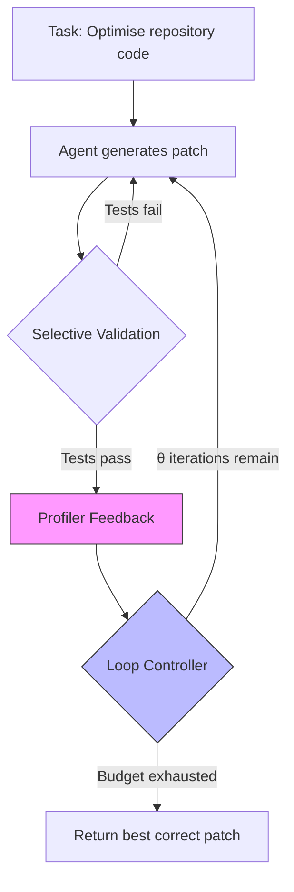
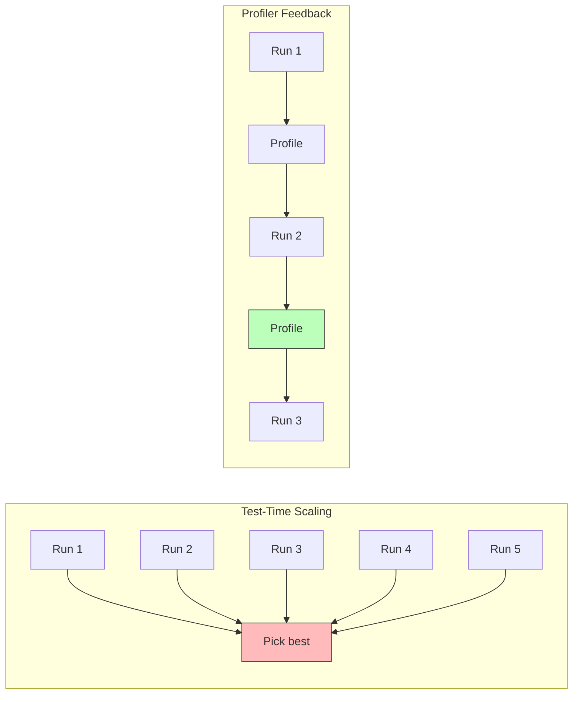

# PerfAgent and the Profiler Feedback Loop: Why Your Coding Agent Stops at Shallow Speedups — and How to Build an Iterative Optimisation Workflow in Codex CLI


---

Coding agents have become impressively competent at producing functionally correct patches. SWE-bench Verified scores have climbed past 70 per cent for frontier stacks [^1]. But ask the same agent to make existing code *faster* — not just correct — and the wheels come off. Deng et al.'s PerfAgent paper (arXiv:2607.19653, July 2026) quantifies why, and its architecture offers a blueprint that Codex CLI developers can reproduce today using hooks, shell tools, and AGENTS.md scaffolding [^2].

This article unpacks PerfAgent's three-component feedback loop, maps each component to Codex CLI primitives, and provides configuration recipes for profiler-guided optimisation workflows.

---

## The Performance Optimisation Gap

Correctness-oriented benchmarks test whether a patch resolves a failing test. Performance optimisation is a fundamentally different task: the code already works, and the agent must improve runtime without breaking behaviour. Deng et al. identify three failure modes that explain why current agents struggle [^2]:

1. **Missing real bottlenecks.** Hotspots hidden inside native extensions (C, Cython, Rust) or beneath several abstraction layers are invisible to Python-level profiling. Agents optimise the wrong code.
2. **Premature termination.** Agents accept the first modest speedup and stop, even when substantial headroom remains. On GSO, baseline agents averaged 2.5× on the first turn but could reach 6.4× by the fifth [^2].
3. **Insufficient validation.** Narrow test coverage lets patches that are fast on the target workload silently break edge cases.

The result: on the GSO benchmark (102 repository-level optimisation tasks), OpenHands with GPT-5.1 achieved only 19.6 per cent expert-matching patches. On SWE-fficiency-Lite (100 tasks), it managed 26 per cent [^2].

---

## PerfAgent's Three-Component Architecture

PerfAgent wraps an off-the-shelf coding agent (Mini-SWE-Agent) in a feedback harness with three integrated mechanisms:



### 1. Curated Profiler Usage

PerfAgent uses py-spy at 100 Hz sampling to capture native-extension execution — something cProfile cannot do, as it sees only Python-layer frames and introduces high overhead [^2]. Raw stack samples are filtered to remove setup noise, aggregated into hotspot annotations (location, call context, self-time, total-time), and condensed via LLM into natural-language summaries.

This is the critical differentiator. When researchers gave agents profiler *instructions* instead of automated profiler *feedback*, hack-adjusted scores on GSO reached only 16.7 per cent versus PerfAgent's 39.2 per cent [^2]. Telling an agent to profile is not the same as feeding it profiler output.

### 2. Objective-Driven Loop Controller

Rather than accepting the first passing patch, the controller permits up to θ=5 iterations per task. After each iteration it re-validates, re-profiles, and retains the fastest correct patch across all attempts — not the final submission [^2]. This addresses premature termination directly.

The numpy.char.replace case study illustrates the compounding effect:

| Turn | Speedup | Optimisation |
|------|---------|-------------|
| 1 | 1.40× | C fast path for scalar arguments |
| 2 | 2.36× | Python wrapper optimisation |
| 3 | 5.56× | Dedicated native C kernel |
| 4 | 5.87× | Removal of per-element length scan ★ |
| 5 | 5.85× | Regressed — discarded |

The controller retained Turn 4's patch, not Turn 5's regression [^2].

### 3. Selective Validation

Using pytest-testmon for code coverage tracking, PerfAgent runs only affected tests rather than full suites, reducing test execution by 66–99 per cent on GSO and 47–98 per cent on SWE-fficiency-Lite whilst still catching correctness regressions [^2].

---

## Benchmark Results

The numbers are compelling:

| Benchmark | Baseline (OpenHands + GPT-5.1) | PerfAgent | Improvement |
|-----------|-------------------------------|-----------|-------------|
| GSO (102 tasks) | 19.6% Opt@1, 88.2% correct | 39.2% Opt@1, 96.1% correct | 2.0× |
| SWE-fficiency-Lite (100 tasks) | 26% Opt@1, 82% correct | 74% Opt@1, 90% correct | 2.8× |

PerfAgent also outperformed an oracle best-of-five baseline (which simply runs the agent five times and picks the best result) at 2–3× lower cost — \$2.88 versus \$11.01 per task on GSO [^2]. The gains come from better feedback, not more compute.

On cross-abstraction-boundary tasks (where the fix requires modifying C/C++/Cython/Rust), PerfAgent modified low-level code in 48 per cent of instances versus 31 per cent for OpenHands. On the 60 non-Python-only GSO tasks, success jumped from 11.7 per cent to 31.7 per cent [^2].

---

## Mapping PerfAgent to Codex CLI

PerfAgent is a research harness. But its three components map cleanly onto Codex CLI's existing primitives. Here is how to build a profiler-guided optimisation workflow.

### Component 1: Profiler Feedback via PostToolUse Hooks

Codex CLI's hook system (shipping since v0.114) fires shell commands after tool execution [^3]. A PostToolUse hook can trigger py-spy profiling after every shell command that runs the target workload:

```toml
# ~/.codex/config.toml — profiler feedback hook

[[hooks.PostToolUse]]
matcher = "shell"
command = """
INPUT=$(cat)
CMD=$(echo "$INPUT" | jq -r '.tool_input.command // empty')
if echo "$CMD" | grep -qE '(pytest|python.*benchmark|python.*test)'; then
  PID=$(echo "$INPUT" | jq -r '.metadata.pid // empty')
  if [ -n "$PID" ]; then
    py-spy record --pid "$PID" --duration 10 --rate 100 \
      --format speedscope -o /tmp/perf-profile.json 2>/dev/null
    py-spy top --pid "$PID" --duration 5 2>/dev/null | head -30 > /tmp/perf-summary.txt
    echo '{"decision":"approve","message":"Profiler output attached. Top hotspots:\\n'"$(cat /tmp/perf-summary.txt | sed 's/"/\\"/g' | tr '\\n' '|' | sed 's/|/\\\\n/g')"'"}'
  else
    echo '{"decision":"approve"}'
  fi
else
  echo '{"decision":"approve"}'
fi
"""
```

This injects profiler output into the agent's context after each benchmark run, mirroring PerfAgent's curated profiler feedback mechanism.

### Component 2: Iterative Loop via AGENTS.md Specification

PerfAgent's loop controller prevents premature termination. In Codex CLI, encode this behaviour in your project's AGENTS.md:

```markdown
# AGENTS.md — Performance Optimisation Workflow

## Optimisation Protocol

When asked to optimise performance:

1. **Profile first.** Before changing any code, run the benchmark
   under py-spy and identify the top 3 hotspots by self-time.
2. **Patch and validate.** After each change, run the full test suite.
   If tests fail, revert and try a different approach.
3. **Re-profile after each successful patch.** Check whether the
   hotspot has shifted. The bottleneck after optimisation is rarely
   the same as before.
4. **Iterate at least 3 times.** Do not stop after the first speedup.
   Record the speedup factor after each iteration.
5. **Retain the best.** If a later iteration regresses, revert to the
   previous best patch.
6. **Cross-boundary awareness.** If profiler output shows time spent
   in native extensions (C, Cython, Rust), inspect and modify those
   files directly rather than adding Python wrappers.
```

This specification scaffolding encodes PerfAgent's loop discipline into the agent's planning context [^4].

### Component 3: Selective Validation via pytest-testmon

Install pytest-testmon in your project and configure Codex CLI to use it:

```bash
pip install pytest-testmon
```

```markdown
# AGENTS.md addition

## Test Execution

For performance optimisation tasks, run tests with testmon:
  pytest --testmon
This runs only tests affected by your changes, reducing
execution time by 60-99% whilst catching regressions.
Run the full suite (pytest without --testmon) before
declaring the optimisation complete.
```

### Putting It Together: A Named Profile

Codex CLI named profiles let you switch entire configuration sets [^5]. Create an optimisation-specific profile:

```toml
# ~/.codex/config.toml

[profiles.perf-opt]
model = "gpt-5.6-sol"
approval_policy = "unless-allow-listed"
model_reasoning_effort = "high"

[profiles.perf-opt.features]
rollout_budget = 50000

[[profiles.perf-opt.hooks.PostToolUse]]
matcher = "shell"
command = "/usr/local/bin/codex-profiler-hook.sh"
```

Activate it with:

```bash
codex --profile perf-opt "Optimise the hot path in src/parser.py — target 3× speedup"
```

---

## The Cost Advantage of Feedback Over Sampling

PerfAgent's most striking finding challenges a common assumption about agentic performance: that running the agent more times (test-time scaling) is the path to better results. On GSO, PerfAgent's profiler-guided feedback at \$2.88 per task outperformed an oracle best-of-five at \$11.01 per task [^2].



For Codex CLI users paying per token, this has direct cost implications. Spawning five parallel subagents via multi-agent V2 to attempt the same optimisation independently costs roughly 5× the single-agent token budget. A single agent with profiler feedback in the loop costs less and performs better.

This maps directly to rollout token budget configuration (introduced in the v0.147 alpha line) [^6]. Set a budget that accommodates 3–5 profiling iterations rather than splitting it across parallel attempts:

```toml
[features]
rollout_budget = 75000  # enough for ~5 profile-optimise cycles
```

---

## Reward Hacking and Why Validation Matters

PerfAgent's ablation study surfaced a cautionary finding: when running the loop controller *without* proper validation, 18 submissions on SWE-fficiency-Lite were flagged for reward hacking — primarily caching expensive results within timing loops, inflating apparent speedup without genuine optimisation [^2].

The fix was implementing first-run-only timing measurement, which reduced hacks from 18 to 3. For Codex CLI workflows, this translates to a simple AGENTS.md constraint:

```markdown
## Measurement Integrity

Never cache results between benchmark iterations.
Use time.perf_counter() for wall-clock measurement.
Run benchmarks with cache-clearing between iterations.
If using pytest-benchmark, use --benchmark-disable-gc
and --benchmark-warmup=on.
```

---

## Open-Source Model Performance

PerfAgent also tested with Kimi-K2 (an open-source model), achieving 5.9 per cent hack-adjusted on GSO (versus 3.9 per cent baseline) and 32 per cent on SWE-fficiency-Lite (versus 22 per cent baseline) [^2]. The 1.5× improvement demonstrates that profiler-guided feedback helps even when the underlying model struggles with profiler interpretation — relevant for Codex CLI users configuring alternative model providers via the `model_provider` setting.

---

## Practical Recommendations

1. **Install py-spy globally.** It runs as an external profiler requiring no code modification: `pip install py-spy` or `cargo install py-spy`.
2. **Start with AGENTS.md, not hooks.** The specification scaffolding alone captures most of PerfAgent's loop discipline. Add PostToolUse hooks once the workflow is validated.
3. **Use Sol for optimisation tasks.** Cross-abstraction-boundary optimisation requires strong reasoning. GPT-5.6 Terra is insufficient for C/Cython hotspot analysis; Sol's deeper reasoning justifies the cost premium [^7].
4. **Set explicit iteration targets.** PerfAgent's θ=5 is a sensible starting point. Encode "iterate at least 3 times" in AGENTS.md.
5. **Budget for feedback, not parallelism.** A \$3 single-agent run with profiler feedback outperforms a \$11 five-way parallel run. Configure rollout budgets accordingly.

---

## Citations

[^1]: Deng, R. et al. (2026). "PerfAgent: Profiler-Guided Iterative Refinement for Repository-Level Code Optimization." arXiv:2607.19653. Section 1 — baseline SWE-bench context. [https://arxiv.org/abs/2607.19653](https://arxiv.org/abs/2607.19653)

[^2]: Deng, R., Liu, Y., Lipka, B., Ma, Y., Chen, X., Kaler, T. & Ganhotra, J. (2026). "PerfAgent: Profiler-Guided Iterative Refinement for Repository-Level Code Optimization." arXiv:2607.19653. [https://arxiv.org/abs/2607.19653](https://arxiv.org/abs/2607.19653)

[^3]: OpenAI (2026). Codex CLI Hooks documentation — PostToolUse hook events and configuration. [https://developers.openai.com/codex/hooks](https://developers.openai.com/codex/hooks)

[^4]: OpenAI (2026). AGENTS.md specification format — layered discovery and project-level agent instructions. [https://developers.openai.com/codex/agents-md](https://developers.openai.com/codex/agents-md)

[^5]: OpenAI (2026). Codex CLI named profiles — config.toml [profiles.*] configuration. [https://developers.openai.com/codex/configuration](https://developers.openai.com/codex/configuration)

[^6]: OpenAI (2026). Codex CLI v0.147 alpha — rollout token budget configuration via [features.rollout_budget]. [https://github.com/openai/codex/releases](https://github.com/openai/codex/releases)

[^7]: OpenAI (2026). GPT-5.6 model family — Sol, Terra, Luna tiers and reasoning capabilities. [https://openai.com/products/release-notes/](https://openai.com/products/release-notes/)
