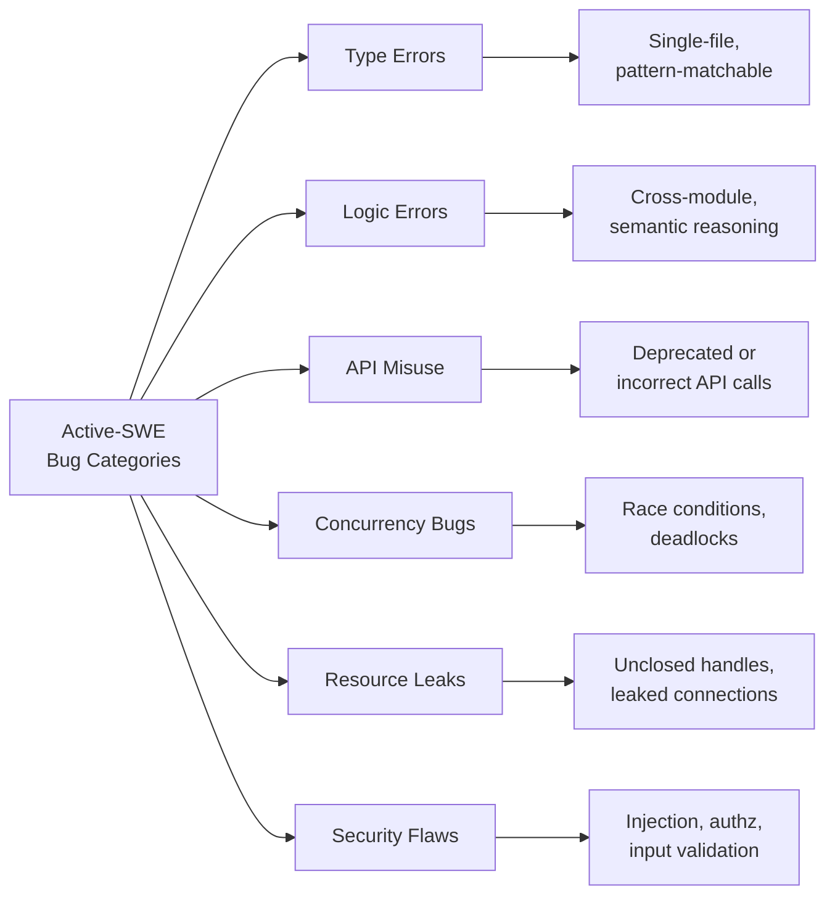

# Active-SWE: Why Your Coding Agent Waits for Bug Reports — and How to Build a Proactive Discovery Workflow in Codex CLI


---

Every mainstream coding agent — Codex CLI included — operates in *reactive* mode by default. You file an issue, paste a stack trace, or describe a symptom; the agent localises the fault and proposes a patch. But real software maintenance is not exclusively reactive. Seasoned engineers routinely scan unfamiliar codebases for latent defects, review pull requests for potential regressions, and audit dependencies for silent breakage. Can today's coding agents do the same?

A new benchmark from Sichuan University, published on 5 August 2026, answers that question with uncomfortable clarity: **no, not yet** [^1].

## What Active-SWE Measures

Active-SWE shifts the evaluation paradigm from *fixing a specific recorded bug* — the model that underpins SWE-bench and its derivatives — to **proactive bug fixing without issue reports** [^1]. The benchmark comprises 1,663 tasks across six bug categories and eight programming languages, making it the first large-scale evaluation of whether agents can discover and resolve defects when nobody tells them where to look [^1].

The study introduces two key innovations:

1. **A difficulty-aware task formulation pipeline** that categorises tasks by the cognitive effort required — from straightforward type errors to cross-module logic flaws that demand whole-repository reasoning [^1].
2. **A dual-track evaluation framework** that scores agents on both *recorded bug resolution* (can you fix known defects without the issue text?) and *potential bug discovery* (can you find defects that haven't been reported yet?) [^1].

### The Six Bug Categories

Active-SWE organises defects into six families, each demanding different agent capabilities:



## Results: Agents Struggle Without Issue Reports

The headline finding is blunt: **most state-of-the-art coding agents show limited performance across all three evaluation axes** — locating recorded bugs, handling multiple-bug scenarios, and discovering potential bugs [^1]. When agents cannot rely on a natural-language description of the symptom, their localisation accuracy collapses.

This aligns with ChainSWE (July 2026), which found that **performance drops by up to 70%** when agents must fix multiple sequential bugs rather than isolated single-issue tasks [^2]. In ChainSWE's evaluation of seven frontier models — including GPT-5.5, Claude Opus 4.7, and DeepSeek-V4-Pro — per-bug accuracy declined from 58.9% in isolated settings to 36.5% under sequential execution [^2]. Nearly half (48%) of downstream failures resulted from accumulated agent mistakes rather than intrinsic bug difficulty [^2].

The developer-agent misalignment study by Tang et al. (May 2026), covering 20,574 real-world sessions, adds a crucial data point: **wrong project diagnosis accounts for 11.56% of all misalignment episodes**, and CLI sessions show broader damage scope than IDE sessions (31.03% vs 12.70% of episodes affecting project state) [^3]. When agents misdiagnose — and proactive bug-fixing *requires* accurate diagnosis without hints — the consequences in CLI workflows are materially worse.

## Why This Matters for Codex CLI Practitioners

If you are using Codex CLI for anything beyond reactive issue-fixing — code audits, pre-merge quality gates, dependency reviews, technical debt triage — you are asking the agent to operate in the proactive mode that Active-SWE benchmarks. The research tells us three things:

1. **Don't assume the agent will find what you haven't described.** Without explicit issue context, agents miss defects that a careful human reviewer would catch.
2. **Multi-bug scenarios compound errors.** Each unfixed or misfixed defect degrades the agent's ability to handle subsequent ones [^2].
3. **CLI workflows amplify damage scope.** The autonomy that makes Codex CLI powerful also means proactive misdiagnosis can modify project state, external systems, or CI pipelines before you notice [^3].

## Building a Proactive Discovery Workflow in Codex CLI

Codex CLI already ships with several features that, when composed deliberately, approximate the proactive bug-finding capability that Active-SWE measures. Here is a practical workflow.

### Step 1: Scope the Scan with AGENTS.md

Your `AGENTS.md` file should include explicit proactive review directives. Rather than relying on the agent's general reasoning, narrow the search space:

```markdown
## Code Quality Directives

When asked to scan or review the codebase:
- Focus on files changed in the last 30 days (`git log --since="30 days" --name-only`)
- Prioritise: resource leaks, unclosed database connections, error-swallowing catch blocks
- Check for deprecated API usage against CHANGELOG.md
- Flag any `TODO` or `FIXME` comments older than 90 days
- Do NOT modify files unless explicitly asked — report findings only
```

This exploits the finding from the Lulla et al. study that structured agent context files reduce exploration waste by 28.64% in median runtime [^4]. By constraining the search space, you reduce the probability of the wrong-project-diagnosis failures that Active-SWE exposes.

### Step 2: Use `/review` for Structured Discovery

The `/review` command launches a read-only sub-turn that examines diffs and reports prioritised findings without modifying your working tree [^5]. For proactive scanning, combine it with a custom review prompt:

```bash
# Review recent changes for latent bugs
codex --approval-mode suggest \
  "Scan files changed in the last 2 weeks. For each file, check for: \
   1. Resource leaks (unclosed handles, connections, streams) \
   2. Error-swallowing (empty catch blocks, ignored return values) \
   3. Concurrency issues (shared mutable state without synchronisation) \
   4. Security flaws (unsanitised input, hardcoded credentials) \
   Report findings as a prioritised list with file paths and line numbers."
```

### Step 3: Chain with Static Analysis via MCP

Codex CLI does not replace your existing static analysis tools — it consumes their output and adds exploitability analysis, deduplication, and concrete fix generation [^5]. Wire up your linter or SAST scanner as an MCP server so the agent can cross-reference its own findings against tooling output:

```toml
# config.toml — MCP server for SonarQube integration
[mcp_servers.sonarqube]
command = "sonarqube-mcp-server"
args = ["--project-key", "my-project"]

[mcp_servers.semgrep]
command = "semgrep-mcp-server"
args = ["--config", "p/default"]
```

```mermaid
flowchart TD
    A[Codex CLI<br/>Proactive Scan] --> B{AGENTS.md<br/>Scope Constraints}
    B --> C[Agent explores<br/>recent changes]
    C --> D[/review findings]
    C --> E[MCP: SonarQube<br/>cross-reference]
    C --> F[MCP: Semgrep<br/>pattern matching]
    D --> G[Unified<br/>findings report]
    E --> G
    F --> G
    G --> H{Developer<br/>triage}
    H -->|Fix| I[Codex CLI<br/>targeted patch]
    H -->|Defer| J[Issue tracker]
```

### Step 4: PostToolUse Hooks for Verification Gates

Active-SWE's dual-track framework distinguishes between finding bugs and correctly fixing them. You can enforce this separation with PostToolUse hooks that verify any proposed fix before it lands:

```markdown
## PostToolUse Verification (AGENTS.md)

After proposing a bug fix:
- Run the existing test suite (`make test` or `pytest`)
- If no tests cover the fix, write a regression test first
- Run the linter (`just fix -p <project>`) before finalising
- Never mark a fix as complete without passing verification
```

This addresses ChainSWE's finding that 48% of downstream failures stem from accumulated agent mistakes [^2]. By gating each fix on verification, you prevent the error-compounding cascade that degrades multi-bug performance.

### Step 5: Scheduled Proactive Scans via CI

For continuous proactive scanning, integrate Codex CLI into your CI pipeline using `codex exec` in non-interactive mode:

```bash
# .github/workflows/proactive-scan.yml
- name: Weekly proactive code audit
  run: |
    codex exec --approval-mode full-auto \
      --output-format json \
      "Scan the entire codebase for latent bugs following \
       the directives in AGENTS.md. Output findings as \
       structured JSON with severity, file, line, category, \
       and description fields."
```

This transforms the reactive agent into a scheduled proactive scanner — precisely the capability gap that Active-SWE identifies.

## The Proactive Frontier

Active-SWE joins a growing body of evidence — alongside ChainSWE [^2], VulnGym [^6], and the developer-agent misalignment study [^3] — that the next capability frontier for coding agents is not faster single-issue resolution but **autonomous quality discovery**. The agents that will matter in 2027 are the ones that can scan a repository they have never seen and surface defects nobody has reported yet.

For Codex CLI users today, the practical takeaway is architectural: compose `/review`, AGENTS.md directives, MCP-backed static analysis, and PostToolUse verification into a pipeline that compensates for the agent's current limitations in unsupervised discovery. The research says agents cannot yet do this alone. But a well-scaffolded workflow — human judgement at the triage gate, agent muscle for exploration and patching — can get you meaningfully closer.

---

## Citations

[^1]: Li, H., Deng, P., Qian, W., Jiang, L., Huang, Z., Yang, M. & Peng, X. (2026). "Active-SWE: Benchmarking Coding Agents for Proactive Bug Fixing without Issue Reports." *arXiv:2608.04682*. [https://arxiv.org/abs/2608.04682](https://arxiv.org/abs/2608.04682)

[^2]: Jin, Q., Tung, L., Li, K. et al. (2026). "ChainSWE: Benchmarking Coding Agents on Multi-Bug Software Maintenance." *arXiv:2607.02606*. [https://arxiv.org/abs/2607.02606](https://arxiv.org/abs/2607.02606)

[^3]: Tang, Z. et al. (2026). "How Coding Agents Fail Their Users: A Large-Scale Analysis of Developer-Agent Misalignment in 20,574 Real-World Sessions." *arXiv:2605.29442*. [https://arxiv.org/abs/2605.29442](https://arxiv.org/abs/2605.29442)

[^4]: Lulla, J.L., Mohsenimofidi, S., Galster, M., Zhang, J.M., Baltes, S. & Treude, C. (2026). "On the Impact of AGENTS.md Files on the Efficiency of AI Coding Agents." *arXiv:2601.20404*. [https://arxiv.org/abs/2601.20404](https://arxiv.org/abs/2601.20404)

[^5]: OpenAI. (2026). "Codex CLI Features." *ChatGPT Learn*. [https://developers.openai.com/codex/cli/features](https://developers.openai.com/codex/cli/features)

[^6]: Ji, T. et al. (2026). "VulnGym: Repository-Level Vulnerability Detection Benchmark." *arXiv:2608.02001*. [https://arxiv.org/abs/2608.02001](https://arxiv.org/abs/2608.02001)
