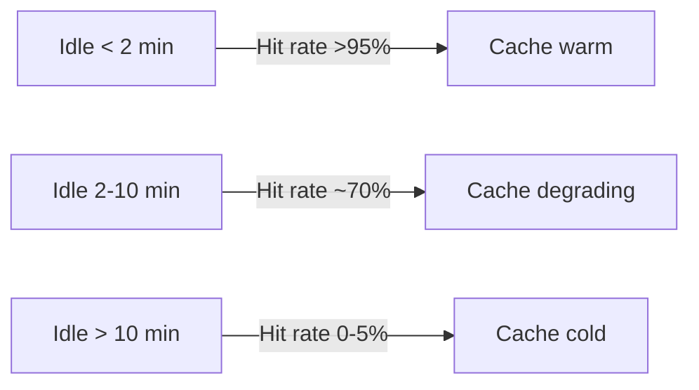
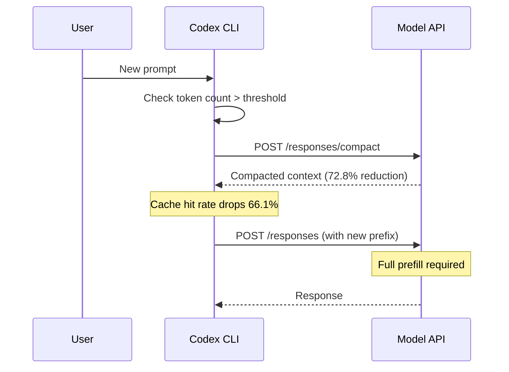

# Agentic Coding in the Wild: What 13.5 Million Production Sessions Reveal About Your Codex CLI Session Strategy


---

Liu et al.'s "Agentic Coding in the Wild" (arXiv:2608.00101) [^1] is the first production-scale characterisation of coding agent workloads, drawing on a full week of GitHub Copilot telemetry from June 2026: 3.2 million users, 13.5 million sessions, 761 million LLM calls, and 95 trillion prompt tokens. The paper quantifies behaviours that every Codex CLI practitioner intuits but rarely measures — and several that will surprise you.

This article distils the findings that matter most for your daily Codex CLI workflow: KV cache lifecycle, context compaction costs, failure-driven compute amplification, and the user archetypes that determine whether your sessions are cheap or ruinous.

## The Shape of an Agentic Session

The paper confirms what the Codex CLI agent loop makes obvious: agentic coding is fundamentally different from chat. Each user turn triggers an autonomous loop of LLM calls interleaved with tool invocations in a tight observe–reason–act cycle [^1].

The headline statistics:

| Metric | Median | Mean | P90 |
|---|---|---|---|
| Turns per session | 3 | 6.1 | 15 |
| LLM calls per session | 15 | 40.6 | 100.5 |
| Tool invocations per session | 13 | 43.6 | 111.4 |
| Session duration | 4.2 min | 62.6 min | 177.8 min |

The 14.9× mean-to-median ratio for session duration tells you everything: distributions are heavily tailed [^1]. A handful of complex sessions consume orders of magnitude more resources than the typical interaction. If you are running Codex CLI with rollout token budgets, this skew is why they exist.

Critically, 87% of LLM calls are agent-initiated — autonomous continuation rather than user-triggered [^1]. Each user prompt generates a median of 6.6 autonomous LLM calls. When you type a prompt in Codex CLI, you are launching a machine, not asking a question.

## The 275:1 Ratio and Why Input Tokens Dominate Everything

Each LLM call consumes a median of 68,000 prompt tokens but produces only 247 completion tokens — a 275:1 input-to-output ratio [^1]. The token composition breaks down as:

- **Conversation history:** 48%
- **Function-call messages (tool schemas and results):** 28%
- **System prompts:** 14%
- **Repository instructions / context files:** 10%

Over 75% of your token budget goes to history and tool traces [^1]. This has direct implications for Codex CLI configuration:

```toml
# codex.toml — keep the input budget under control
[model]
model = "gpt-5.6-terra"

[session]
# Compaction threshold: trigger before the cache becomes unmanageable
context_compaction_threshold = 150000

# Limit tool output size to reduce history bloat
max_tool_output_tokens = 4096
```

Your `AGENTS.md` files, skill definitions, and MCP server schemas all land in that 14% system prompt slice. Every unnecessary tool definition from an MCP server with 93 tools burns roughly 55,000 tokens per turn before you type a character [^2]. The paper's data validates the case for MCP tool search (enabled by default since v0.146) over eager tool loading.

## KV Cache: The 10-Minute Cliff

The paper's most actionable finding for Codex CLI practitioners concerns the KV cache lifecycle across turn boundaries.

**Within a turn**, prefix cache hit rates are excellent: 45% on the first call (cold start), climbing to 92–94% by the third call and plateauing there [^1]. The agent loop's append-only conversation structure is a natural fit for prefix caching, and Codex CLI's fixed-prefix convention exploits this [^3].

**Across turn boundaries**, the picture changes sharply:



The median cross-turn idle time is **25.2 minutes** [^1] — comfortably past the cliff edge. Every time you pause to review output, check documentation, or take a coffee break, you are likely returning to a cold cache.

**Practical implication:** when you know you will return to a task within a few minutes, keep the session active. When the gap will be longer, the cache is already gone — this is when `codex resume --last` buys you the fixed-prefix cache benefit rather than paying full prefill on a fresh session [^3].

## Context Compaction: The Hidden 22% Tax

Context compaction triggers in 7.8% of sessions but those sessions account for 44.2% of total token consumption [^1]. When it fires:

- It drops a median of **72.8%** of prompt tokens (P25–P75: 58–81%)
- It consumes a median of **22% of turn execution time** (P90: 34%)
- It reduces post-compaction cache hit rates by a median of **66.1%**
- In 34.3% of events, it erases more than 90% of the cache hit rate [^1]

Compaction is expensive twice over: once for the summarisation inference itself, and again through the cache invalidation it triggers. The compacted output creates a new, shorter prefix that cannot match the original cached prefix [^3].



The strategic response is to compact proactively at natural milestones — after completing a feature, before switching context — rather than letting automatic compaction trigger mid-flow. In Codex CLI, you can use `/compact` manually or configure the threshold:

```bash
# Compact at a milestone, then archive
codex --model gpt-5.6-terra
> /compact
> /archive
```

## Failure-Driven Compute Amplification: The 4× Multiplier

Nine percent of turns involve tool failures, and those turns generate a median of **36 LLM calls** — four times the normal median [^1]. Each retry iteration adds 80,000+ tokens of error output to the context. Failed builds inject 7–8× more tokens than successful ones because error diagnostics are verbose [^1].

This finding validates the Codex CLI pattern of using `PreToolUse` and `PostToolUse` hooks to catch failures early before the retry loop spirals:

```toml
# AGENTS.md hook example — fail fast on known error patterns
## PostToolUse: run_command
- If the command fails with a compilation error, do NOT retry the same approach
- Instead, read the relevant source file and identify the root cause before attempting a fix
- Maximum 3 retry attempts for any single compilation error
```

The paper also found that `run_command` and `run_build` have approximately 73% success rates [^1]. The remaining 27% failure rate is where your token budget goes to die. Investing in reliable build configurations and test harnesses pays compound dividends through reduced retry amplification.

## Five User Archetypes and What They Mean for Your Config

The paper identifies five distinct user archetypes through clustering [^1]:

| Archetype | % Users | Tools/Turn | Tokens/Turn | Profile |
|---|---|---|---|---|
| **Readers** | 41.7% | 4.8 | 203K | File exploration, API lookups |
| **Coders** | 30.4% | 6.2 | 417K | Balanced read/edit/execute |
| **Terminal users** | 11.0% | 4.0 | 213K | Command execution focused |
| **Deep-loop users** | 9.2% | 20.0 | 1.1M | Complex multi-step tasks |
| **Chat-only users** | 7.6% | 0.0 | 23K | Question-answer only |

Token consumption spans a **50× range** from chat-only (23K per turn) to deep-loop (1.1M per turn) [^1]. This maps directly onto Codex CLI's named profile system — different workflows warrant different model tiers and token budgets:

```toml
# ~/.codex/profiles/explore.toml — Reader archetype
[model]
model = "gpt-5.6-luna"  # Cheaper model for exploration
max_tokens = 2048

# ~/.codex/profiles/deep.toml — Deep-loop archetype
[model]
model = "gpt-5.6-sol"   # Full reasoning for complex tasks
max_tokens = 16384

[session]
context_compaction_threshold = 200000
```

If you are a "Coder" who occasionally does "Deep-loop" work, switching profiles at the point of intent change — rather than running everything on Sol — saves substantially. The paper shows that cache miss cost varies 50× across archetypes [^1]; a cache miss for a deep-loop user forces re-prefill of 1.1M tokens versus 23K for a chat-only query.

## Model Switches: The Nuclear Option

Model switches affect 6.4% of sessions and are predominantly reactive — triggered by errors 36% of the time versus an 8% baseline [^1]. Post-switch cache hit rates average just 8%, a 67 percentage point drop, because different models have incompatible KV cache representations [^1].

In Codex CLI terms: if you switch from `gpt-5.6-terra` to `gpt-5.6-sol` mid-session because a task is harder than expected, you pay full prefill on the entire conversation history. The better strategy is to assess task difficulty upfront and select the right model from the start, or use a scout/fix workflow where a cheaper model does initial exploration in one session and hands off structured findings to a more capable model in a fresh session [^4].

## Parallelism: Less Than You Think

Despite 63.3% of turns showing some LLM call overlap, actual concurrency is modest: median 1.15, P90 of 1.4 [^1]. Tool parallelism is even sparser — 93% of tool batches invoke a single tool, with read-only operations (`get_file`, `get_symbols`) the only tools frequently batched [^1].

For Codex CLI's Multi-Agent V2 and subagent delegation, this suggests that parallelism gains come not from within a single agent's loop but from distributing independent tasks across separate agents with isolated worktrees — precisely the architecture Codex CLI's multi-agent system implements [^5].

## Practical Takeaways

1. **Mind the 10-minute cliff.** If you will be idle for more than 10 minutes, your cache is gone. Plan your interaction cadence accordingly, or accept the prefill cost when you return.

2. **Compact proactively.** Automatic compaction costs 22% of turn time and destroys cache hit rates. Compact manually at natural breakpoints to control when the penalty lands.

3. **Fail fast, not often.** Tool failures trigger 4× compute amplification. Invest in reliable build tooling, limit retry attempts in `AGENTS.md`, and use `PostToolUse` hooks to break retry loops early.

4. **Match your model to your archetype.** Use named profiles to avoid paying Sol prices for Luna-class work. The 50× token range across archetypes means model selection is your highest-leverage cost control.

5. **Avoid mid-session model switches.** A model switch is a cache nuke. If you need a different model, start a fresh session with structured context handoff rather than switching in place.

6. **Trim your tool surface.** MCP tool schemas consume system prompt tokens on every call. Use tool search rather than eagerly loading every server's full schema.

## Citations

[^1]: Liu, B., Qiu, H., Goiri, Í., Fonseca, R., Bianchini, R. & Choukse, E. (2026). "Agentic Coding in the Wild: Characterizing GitHub Copilot Traces at Production Scale." arXiv:2608.00101. [https://arxiv.org/abs/2608.00101](https://arxiv.org/abs/2608.00101)

[^2]: Codex CLI documentation — MCP tool search and schema loading. [https://developers.openai.com/codex/models](https://developers.openai.com/codex/models)

[^3]: "Prompt Caching in Codex CLI: How the Agent Loop Stays Linear and How to Maximise Cache Hits." Codex Knowledge Base, April 2026. [https://codex.danielvaughan.com/2026/04/21/codex-cli-prompt-caching-maximise-cache-hits-cost-reduction/](https://codex.danielvaughan.com/2026/04/21/codex-cli-prompt-caching-maximise-cache-hits-cost-reduction/)

[^4]: Bhola, S., Krishnan, P. & NS, A. (2026). "Scrouting: Cost-Aware Repository Scouting for Coding Agents." arXiv:2608.04804. [https://arxiv.org/abs/2608.04804](https://arxiv.org/abs/2608.04804)

[^5]: Zhu, K. et al. (2026). "TraceLab: Characterizing Coding Agent Workloads for LLM Serving." arXiv:2606.30560. [https://arxiv.org/abs/2606.30560](https://arxiv.org/abs/2606.30560)

[^6]: "Context Compaction Deep Dive: How Codex CLI, Claude Code, and OpenCode Manage Long Sessions." Codex Knowledge Base, April 2026. [https://codex.danielvaughan.com/2026/04/14/context-compaction-deep-dive-codex-cli-claude-code-opencode/](https://codex.danielvaughan.com/2026/04/14/context-compaction-deep-dive-codex-cli-claude-code-opencode/)
