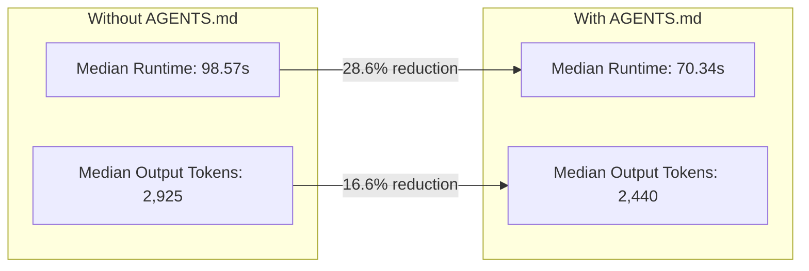
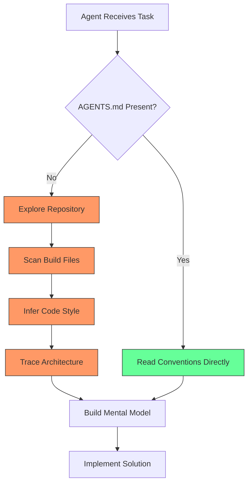

# AGENTS.md Pays for Itself: What the ICSE 2026 JAWs Efficiency Study Means for Your Codex CLI Token Budget


---

Every Codex CLI user has an AGENTS.md opinion. Some swear by three-line files; others maintain multi-kilobyte governance documents. Until now, the efficiency argument rested on anecdote. Lulla et al.'s study — presented at the Journal Ahead Workshop (JAWs) co-located with ICSE 2026 — provides the first controlled, quantitative evidence that AGENTS.md files measurably reduce both runtime and token consumption [^1].

The headline numbers: **28.6% median runtime reduction** and **16.6% median output-token reduction**, with statistical significance confirmed by Wilcoxon signed-rank tests (p < 0.05) [^1]. For teams running dozens of agent tasks daily, this is the difference between a comfortable token budget and one that bleeds.

## The Study Design

The researchers started from 132 repositories containing agent instruction files, filtered to 89 with root-only AGENTS.md, then narrowed to 26 whose files contained conventions, architecture descriptions, and project structure guidance. Ten repositories were randomly sampled, with up to 15 merged pull requests each, yielding **124 paired tasks** [^1].

Each task was run twice against the same repository snapshot: once with AGENTS.md present, once with it removed. The agent under test was OpenAI Codex running GPT-5.2-Codex — chosen because AGENTS.md originated within the Codex ecosystem [^1].

Task selection was deliberately conservative:

- Code changes capped at ≤100 lines (additions + deletions)
- Maximum 5 modified files
- Merged PRs only, post-dating the introduction of AGENTS.md
- Code-only modifications — no documentation or configuration changes

This scoping trades generalisability for internal validity: the study answers "does AGENTS.md help on small, well-defined tasks?" rather than "does it help everywhere?"

## The Numbers



| Metric | Without AGENTS.md | With AGENTS.md | Reduction |
|--------|-------------------|----------------|-----------|
| Mean runtime | 162.94s | 129.91s | 20.27% |
| Median runtime | 98.57s | 70.34s | 28.64% |
| Mean output tokens | 5,744 | 4,591 | 20.08% |
| Median output tokens | 2,925 | 2,440 | 16.58% |
| Mean input tokens | 353,010 | 318,651 | 9.73% |

The input-token and cached-input-token savings were more modest (~9.7–9.9% mean reduction, with unchanged medians), which makes sense: AGENTS.md adds context to the input but reduces the exploratory tool calls the agent would otherwise make to discover the same information [^1].

## Why It Works: The Exploration Tax

Without AGENTS.md, a coding agent arriving in an unfamiliar repository must reconstruct project conventions from first principles. That means:

1. **File-tree traversal** — reading `package.json`, `Makefile`, `pyproject.toml`, or whatever build artefacts exist
2. **Style inference** — scanning existing source files to deduce naming conventions, import patterns, and test framework choices
3. **Architecture discovery** — tracing directory structures, identifying modules, understanding boundaries

Each of these operations consumes tool calls, input tokens, and wall-clock time. AGENTS.md short-circuits this exploration by providing the answers directly [^2].



This aligns with the structural codebase indexing research from Bhola et al. (arXiv:2606.22417), which demonstrated a +39.6pp localisation accuracy improvement when agents had access to pre-built codebase indexes rather than relying on raw exploration [^3]. AGENTS.md serves a similar function — it is a human-curated index of project conventions that eliminates redundant discovery.

## What Belongs in an Effective AGENTS.md

The study retained AGENTS.md files that covered three content categories: conventions and best practices, architecture and project structure, and project descriptions [^1]. The broader literature identifies six core sections that correlate with effectiveness [^2]:

1. **Commands** — exact build, test, and lint invocations with flags
2. **Testing instructions** — unit test framework, E2E patterns, pre-commit requirements
3. **Project structure** — directory organisation and technology stack with version numbers
4. **Code style** — language conventions, frameworks, and concrete examples
5. **Git workflow** — branch naming, commit conventions, validation steps
6. **Boundaries** — what agents should and should not modify

### Codex CLI Configuration

In Codex CLI, AGENTS.md files participate in a hierarchical discovery chain. The agent concatenates `~/.codex/AGENTS.md` (global) with every AGENTS.md along the path from the Git root to the current working directory [^4]. Key configuration knobs:

```toml
# In .codex/config.toml
# Cap total AGENTS.md payload — default is 32 KiB
project_doc_max_bytes = 32768

# Cap individual tool outputs to force summarisation
tool_output_token_limit = 12000
```

The 32 KiB default cap is worth knowing about: Codex silently truncates beyond this limit [^4]. If your AGENTS.md approaches this boundary, you are almost certainly including material that should live in documentation rather than agent instructions.

### The Conciseness Principle

The most effective AGENTS.md files in the study were not the longest. The recommended starting point is **20–30 lines** of actionable, specific content [^2]. Every line should answer a question the agent would otherwise need tool calls to resolve:

```markdown
# AGENTS.md

## Build
- `pnpm install && pnpm build` — installs deps and builds all packages
- `pnpm test` — runs Vitest across all workspaces
- `pnpm test -- --run packages/api` — run tests for a single package

## Stack
- TypeScript 5.8, Node 24, pnpm 10 workspaces
- API: Hono 5.x on Cloudflare Workers
- Web: Next.js 16.1 with App Router
- Database: Drizzle ORM + Neon Postgres

## Style
- Strict TypeScript — no `any`, no `as` casts without justification
- Named exports only — no default exports
- Test files: `*.test.ts` co-located with source

## Boundaries
- Never modify `drizzle/migrations/` — migrations are generated, not hand-edited
- Never commit `.env` files or hardcoded credentials
```

This file is 22 lines. It eliminates the need for the agent to read `package.json`, `tsconfig.json`, the Drizzle config, and the Vitest config before starting work — exactly the exploration tax that the ICSE study measured.

## Applying This to Codex CLI Workflows

### Monorepo Patterns

For monorepos, Codex CLI supports nested AGENTS.md files. Place a root-level file for cross-cutting conventions and per-package files for service-specific guidance [^4]:

```bash
repo-root/
├── AGENTS.md              # Global: Git workflow, CI, shared style
├── packages/
│   ├── api/
│   │   └── AGENTS.md      # API-specific: Hono patterns, DB access
│   └── web/
│       └── AGENTS.md      # Web-specific: Next.js conventions, components
```

The agent walks up the directory tree and combines every AGENTS.md it encounters. The closest file wins on conflicts [^4].

### ROI Calculation

The study's numbers translate directly to cost savings. For a team of five developers, each running 20 agent tasks daily on GPT-5.6 Terra (\$2.50/\$15 per 1M input/output tokens) [^5]:

| Metric | Daily Without | Daily With | Daily Saving |
|--------|--------------|------------|-------------|
| Output tokens | 114,896 | 91,829 | 23,067 tokens |
| Output cost | \$1.72 | \$1.38 | \$0.35 |
| Input tokens | 7,060,200 | 6,373,020 | 687,180 tokens |
| Input cost | \$17.65 | \$15.93 | \$1.72 |
| Runtime | 54.3 min | 43.3 min | 11.0 min |

Over a year (250 working days), that is approximately **\$517 in token savings** and **45.8 hours of recovered agent runtime** — from a file that takes 15 minutes to write [^1] [^5].

⚠️ These projections extrapolate from the study's small-PR findings to a broader task mix. Larger, more complex tasks may show different efficiency profiles; the study explicitly acknowledges this limitation [^1].

## Limitations Worth Noting

The study tested a single agent (Codex with GPT-5.2-Codex) on small, well-scoped PRs. The authors performed a 50-task sanity check confirming non-trivial outputs rather than full correctness evaluation [^1]. Several questions remain open:

- **Model generalisability** — do the gains hold for Claude Sonnet 4.6, GPT-5.6 Sol, or other models?
- **Task scale** — what happens with multi-file refactors or architectural changes exceeding 100 lines?
- **Nested files** — the study used root-only AGENTS.md; monorepo hierarchies were not tested
- **Staleness** — how quickly do benefits decay as the codebase evolves and the AGENTS.md drifts?

The staleness problem is particularly relevant. As the broader ACF evolution research highlights, 67.4% of agent context files are revised across multiple commits, with changes driven by small, incremental content additions [^6]. Files that are not maintained become liability rather than asset.

## Practical Takeaways

1. **Write an AGENTS.md if you haven't.** The evidence shows a measurable return even for small tasks.
2. **Keep it under 30 lines.** Specificity beats comprehensiveness. Every line should eliminate a tool call.
3. **Include executable commands verbatim.** `pnpm test -- --run packages/api` is useful; "run the tests" is not.
4. **Name your stack precisely.** "Next.js 16.1 with TypeScript 5.8" gives the agent version-specific context; "React project" forces exploration.
5. **Set boundaries explicitly.** Tell the agent what not to touch — generated files, migrations, environment variables.
6. **Maintain it.** Treat AGENTS.md as a living configuration artefact, not a one-time setup document. Review it when you upgrade dependencies, change test frameworks, or restructure directories.
7. **Monitor the savings.** Use `codex --usage` or Codex CLI's `/usage` command to track token consumption before and after introducing or updating your AGENTS.md.

The Lulla et al. study confirms what experienced Codex CLI users have suspected: a well-crafted AGENTS.md is not just a convenience — it is a measurable efficiency lever. The 28.6% runtime reduction is not a marginal gain. It is nearly a third of every agent session, recovered by spending 15 minutes writing down what your project already knows about itself.

---

## Citations

[^1]: Lulla, J.L., Mohsenimofidi, S., Galster, M., Zhang, J.M., Baltes, S., and Treude, C. "On the Impact of AGENTS.md Files on the Efficiency of AI Coding Agents." *Journal Ahead Workshop (JAWs) 2026*, co-located with ICSE 2026. arXiv:2601.20404. [https://arxiv.org/abs/2601.20404](https://arxiv.org/abs/2601.20404)

[^2]: Context Studios. "AGENTS.md: The Research-Backed Guide to Making AI Agents 29% Faster." 2026. [https://www.contextstudios.ai/blog/agentsmd-the-research-backed-guide-to-making-ai-agents-29-faster](https://www.contextstudios.ai/blog/agentsmd-the-research-backed-guide-to-making-ai-agents-29-faster)

[^3]: Bhola, A. et al. "Code Isn't Memory: A Structural Codebase Index Inside a Coding Agent." arXiv:2606.22417, June 2026. [https://arxiv.org/abs/2606.22417](https://arxiv.org/abs/2606.22417)

[^4]: OpenAI. "Codex CLI — AGENTS.md." ChatGPT Learn Documentation, 2026. [https://developers.openai.com/codex/cli](https://developers.openai.com/codex/cli)

[^5]: OpenAI. "GPT-5.6: Frontier intelligence that scales with your ambition." June 2026. [https://openai.com/index/gpt-5-6/](https://openai.com/index/gpt-5-6/)

[^6]: Voria, G., Cannavale, A., De Lucia, A., Kashiwa, Y., Catolino, G., and Palomba, F. "How Do Developers Maintain and Evolve Their Agents' Instructions? An Empirical Study." arXiv:2606.25257, June 2026. [https://arxiv.org/abs/2606.25257](https://arxiv.org/abs/2606.25257)
