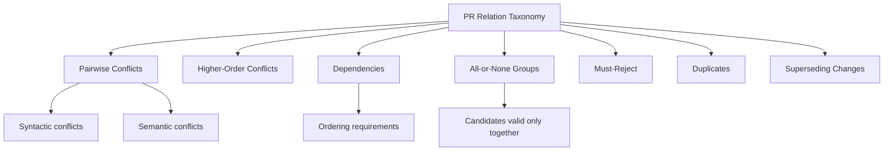
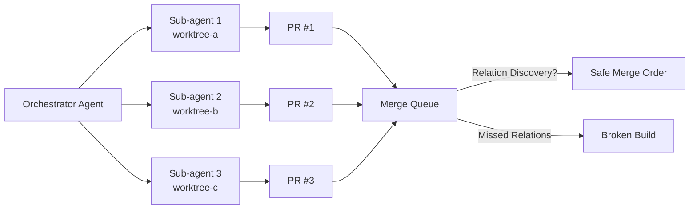

# BulkPR-Bench: Why Your Multi-Agent PR Queue Is a Governance Problem — and What Codex CLI Developers Should Do About It


---

## The Queue Problem Nobody Benchmarked

Every coding agent benchmark to date has evaluated the same unit of work: one issue, one agent, one patch. SWE-bench asks whether a model can fix a single GitHub issue. Terminal-Bench asks whether it can complete a single terminal task. Even the recent Long-Horizon-Terminal-Bench, which pushed agents to their limits with 9.8 million tokens per task, still measured isolated runs [^1].

Production reality looks nothing like this. Teams running Codex CLI's multi-agent V2 orchestration routinely spawn three, five, or ten sub-agents working in parallel git worktrees, each producing a pull request against the same repository. When those PRs land in a merge queue — whether GitHub's native merge queue, Mergify, or a custom CI gate — they interact. A dependency one PR introduces becomes a prerequisite another PR consumes. Two PRs touch the same configuration file without syntactic conflict but produce a semantically broken build when combined. A third PR supersedes a fourth, making the fourth's changes redundant.

BulkPR-Bench, published on 3 August 2026 by Xiong et al. at Baidu, is the first benchmark to evaluate this queue-level governance problem directly [^2]. Its findings are sobering: even the strongest frontier models complete a PR queue exactly right in only 2.5% of runs, and 69.8% of runs end with unsafe commits that violate hidden safety constraints.

## What BulkPR-Bench Measures

The benchmark constructs 581 independently authored candidate PRs across frozen snapshots of 18 real repositories spanning Python, Go, and TypeScript [^2]:

- **Python:** attrs, click, langgraph, networkx, openai-agents-python, packaging, rich
- **Go:** adk-go, chi, eino, gin, sqlc
- **TypeScript:** openclaw, opencode, vercel-ai, yaml, zod

Each repository pool contains 32–33 candidates. The agent's job is not to write code but to govern: given a batch of PRs, recover the dependency and conflict relations between them, then return a safe, executable merge order for the largest viable subset.

### The Rolling-Release Protocol

PRs arrive in consecutive batches of size K (the primary setting uses K=32, the maximum-information operating point). Under the buffered protocol, agents may defer up to B=4 candidates across batch boundaries, holding each for at most T=16 boundaries [^2]. At each step, the agent submits:

1. An ordered merge list
2. A defer set (candidates to reconsider later)
3. An updated relation ledger

The no-deferral variant forces every candidate to be merged or rejected in its arrival batch — a harder constraint that models real-world CI systems under pressure.

### Seven Relation Families

BulkPR-Bench models seven types of PR interaction [^2]:



This taxonomy maps closely to what Codex CLI developers encounter in practice when running parallel sub-agents. Two agents refactoring overlapping modules produce pairwise conflicts. A database migration PR that must land before the application code PR creates a dependency. Feature flag PRs that only make sense as a set form all-or-none groups.

## How Frontier Models Performed

All six models ran through the same frozen Claude Code v2.1.138 agent scaffold with a 150-turn interaction budget [^2]. The results:

| Model | RDS | Global-SGY | Critical Recall |
|-------|-----|-----------|----------------|
| Claude Opus 4.8 | 66.6% | 11.2% | 57.7% |
| GPT-5.4 | 62.0% | 13.0% | 52.3% |
| GLM-5.2 | 57.9% | — | — |
| Kimi-K3 | 49.4% | — | — |
| Qwen3.7-Max | 47.2% | — | — |
| DeepSeek-V4-Pro | 40.9% | — | — |

The headline metric, **Relational Delivery Score (RDS)**, measures safe delivery and correct rejections weighted by relation groups — the connected components of the gold constraint graph. The top model, Claude Opus 4.8, achieved 66.6%, whilst the strongest sequential baseline managed only 53.1% [^2].

**Global Safety-Gated Yield (Global-SGY)** tells the harsher story. This metric requires the entire queue plan to be valid, complete, prefix-safe, and executable. GPT-5.4 led with just 13.0% — meaning that in roughly seven out of eight runs, the delivered queue would have broken something in production [^2].

The most revealing statistic: only 8 of 324 model runs achieved Exact Completion, and no model completed all three repeats for any single repository [^2].

### The Relation Discovery Gap

Agents that recovered relations enforced them reliably — 98.1% to 100.0% compliance with their own discovered constraints [^2]. The bottleneck was discovering those relations in the first place. Critical-relation recall ranged from 35.2% to 57.7%, meaning agents missed between 42% and 65% of the relations whose omission would admit unsafe merge decisions.

When gold relations were provided directly in diagnostic runs, RDS improved by 22.3 to 50.2 percentage points, confirming that the problem is perception, not planning [^2].

## What This Means for Codex CLI Workflows

BulkPR-Bench is an academic benchmark, but its failure modes map directly to how Codex CLI developers orchestrate multi-agent work.

### Multi-Agent V2 and Worktree Isolation

Codex CLI v0.145.0 stabilised Multi-Agent V2 with configurable sub-agent models and reasoning levels [^3]. The standard pattern uses git worktree isolation: each sub-agent operates in its own worktree, producing changes independently. This eliminates syntactic merge conflicts during development but does nothing about semantic conflicts that emerge when PRs combine.



BulkPR-Bench's findings suggest that simply spawning parallel agents and relying on CI to catch problems is insufficient. The 69.8% unsafe-commit rate demonstrates that standard public CI — which tests each PR individually — misses interaction effects that only surface when changes combine [^2].

### Practical Mitigation: AGENTS.md as a Relation Specification

One immediate takeaway is that your `AGENTS.md` file should explicitly declare inter-task dependencies when decomposing work for multi-agent runs. Rather than treating task decomposition as an unordered list, specify:

```toml
# .codex/config.toml — example multi-agent task with explicit relations
[agents.migration]
model = "gpt-5.6-sol"
description = "Database schema migration"
priority = 1

[agents.application]
model = "gpt-5.6-terra"
description = "Application code consuming new schema"
depends_on = ["migration"]  # Explicit ordering dependency

[agents.tests]
model = "gpt-5.6-luna"
description = "Integration tests for new endpoints"
depends_on = ["migration", "application"]  # All-or-none group
```

This does not solve the full problem — BulkPR-Bench shows that even when models know about relations, they still miss 42–65% of them [^2] — but it reduces the search space.

### PostToolUse Hooks for Merge-Safety Validation

Codex CLI's `PostToolUse` hooks provide a mechanism to inject merge-safety checks after each sub-agent completes its PR. A hook could:

1. Run the candidate PR's tests against the combined diff of all pending PRs (not just its own base)
2. Check for file-overlap conflicts against other pending branches
3. Validate that no two pending PRs modify the same configuration keys with different values

This mirrors BulkPR-Bench's "hidden safety checks" — the verification layer that catches interaction effects invisible to per-PR CI [^2].

### GitHub Merge Queue Integration

GitHub's native merge queue already supports speculative execution and configurable batching [^4]. The BulkPR-Bench results suggest that teams running multi-agent workflows should configure their merge queue with:

- **Smaller batch sizes** to limit the blast radius of undetected interactions
- **Required status checks** that test the merged combination, not individual PRs
- **Priority lanes** that respect agent-declared dependency orderings

Research from July 2026 found that cross-agent PR pairs encounter textual conflicts at 41.7%, compared with 19.8% for intra-agent pairs [^5]. The semantic conflict rate — the kind BulkPR-Bench focuses on — is likely higher still.

## The Remaining Headroom

BulkPR-Bench's diagnostic runs — where gold relations were fed directly to agents — revealed 22.3 to 50.2 percentage points of headroom above current performance [^2]. This suggests three areas where tooling improvements could make a material difference:

1. **Relation-aware agent scaffolds**: purpose-built harnesses that maintain a persistent interaction graph across sub-agent runs, rather than treating each PR as independent
2. **Diff-level semantic analysis**: static analysis tools that detect semantic interactions between pending diffs before they reach the merge queue
3. **Value-aware merge ordering**: weighting PRs by importance and risk, so that high-value, low-conflict changes merge first whilst contested combinations queue for human review

For Codex CLI developers, the practical message is clear: multi-agent orchestration is a solved problem at the *execution* layer (worktrees, sub-agents, parallel runs) but remains an open problem at the *governance* layer (what to merge, in what order, and what to reject). BulkPR-Bench gives us the first rigorous way to measure progress on that governance gap.

## Citations

[^1]: Li et al., "Long-Horizon-Terminal-Bench: Evaluating Terminal Agents on Long-Horizon Tasks," arXiv:2607.08964, July 2026. [https://arxiv.org/abs/2607.08964](https://arxiv.org/abs/2607.08964)

[^2]: Xiong, Zhao, Zhang et al., "BulkPR-Bench: Benchmarking Queue-Level Governance of Interacting Pull Requests," arXiv:2608.02685, August 2026. [https://arxiv.org/abs/2608.02685](https://arxiv.org/abs/2608.02685)

[^3]: OpenAI, "Codex CLI Changelog — v0.145.0," July 2026. [https://learn.chatgpt.com/docs/changelog?type=codex-cli](https://learn.chatgpt.com/docs/changelog?type=codex-cli)

[^4]: GitHub, "Managing a merge queue," GitHub Docs, 2026. [https://docs.github.com/en/repositories/configuring-branches-and-merges-in-your-repository/configuring-pull-request-merges/managing-a-merge-queue](https://docs.github.com/en/repositories/configuring-branches-and-merges-in-your-repository/configuring-pull-request-merges/managing-a-merge-queue)

[^5]: Chen et al., "AI Agent Pull Requests on GitHub: Frequency, Structure, and Merge Conflict Rates," arXiv:2607.04697, July 2026. [https://arxiv.org/abs/2607.04697](https://arxiv.org/abs/2607.04697)
