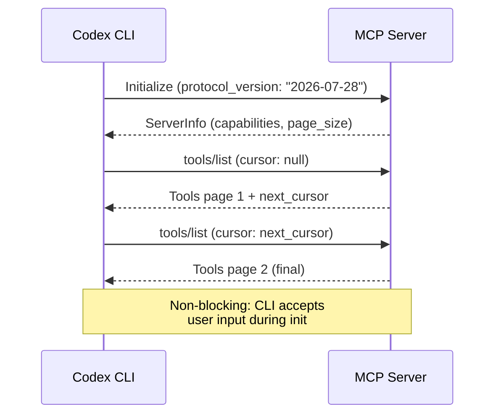
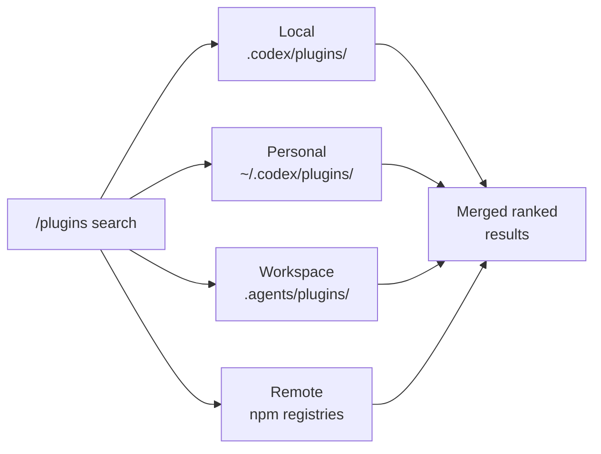

# Codex CLI v0.147.0: --approve-for-me, MCP 2026-07-28 Protocol, Project Trust Gates, and the End of --full-auto


Codex CLI v0.147.0 landed today — the first stable release since v0.146.1 on 5 August — and it is one of the meatiest drops of the year [^1]. Headlining the changelog are a new `--approve-for-me` CLI flag that delegates approval decisions to the auto-review subagent without touching `config.toml`, first-class support for the finalised MCP 2026-07-28 protocol with paginated tool discovery, a project-trust gate that blocks credential use in untrusted repositories, portable Agent Plugin search across four catalogue scopes, bearer-token redaction in conversation replays, and the formal removal of the long-deprecated `--full-auto` flag. Below is a practitioner-level walkthrough of each change and what it means for your workflows.

## The --approve-for-me Flag

Previous releases introduced the auto-review subagent — an independent LLM reviewer that evaluates each tool-call against a risk framework, escalating only genuinely dangerous operations to the human [^2]. Configuring it required three aligned settings: `approval_policy`, `approvals_reviewer`, and a feature flag in `config.toml`. Miss any one and you fell back to standard human-in-the-loop approval.

v0.147.0 collapses all of that into a single CLI flag:

```bash
codex --approve-for-me "refactor the auth module to use PASETO tokens"
```

Under the bonnet, `--approve-for-me` sets `approvals_reviewer = "auto_review"` for the session, enables the feature gate, and leaves your `approval_policy` intact — so granular rules you have already defined still apply [^1]. Critical-risk actions (network exfiltration, credential access, destructive file operations) are still denied or escalated; low-risk actions are auto-approved. The guardian reviewer catches 96.1% of malicious behaviour whilst reducing human interruptions by roughly 200× [^2].

This is particularly useful for CI/CD pipelines and overnight agent runs where no human is present to tap "approve":

```bash
# CI pipeline: run Codex in a sandboxed workspace with auto-review
codex --approve-for-me --sandbox workspace-write \
  "fix all lint errors and run the test suite"
```

## MCP 2026-07-28 Protocol Support

The MCP specification finalised on 28 July 2026, moving from the draft stateless protocol to a stable release [^3]. Codex CLI v0.147.0 ships with MCP SDK 3.0.0 and supports three key protocol additions [^1]:

1. **Paginated tool discovery** — servers with large tool catalogues no longer dump their entire schema on startup. The client requests pages of tool definitions, reducing initial handshake latency for servers exposing hundreds of tools.
2. **Multi-round requests** — a single tool invocation can now span multiple request-response rounds, enabling conversational tool interactions (e.g., clarification prompts from a database query tool before executing).
3. **Non-blocking server startup** — MCP servers initialise in the background. The CLI is responsive immediately; tool calls queue until the server signals readiness.

To opt in to the new protocol version for a specific server, update your MCP configuration:

```toml
# .codex/config.toml
[mcp_servers.my-server]
command = "npx"
args = ["-y", "@my-org/mcp-server"]
protocol_version = "2026-07-28"
```

Servers that have not upgraded continue to work — the CLI negotiates protocol version during the handshake and falls back to the previous version automatically [^3].



## Project Trust Gates

v0.147.0 hardens the trust boundary around unfamiliar repositories. When you `cd` into a directory Codex has not seen before, the CLI now presents a one-time trust prompt before loading any project-scoped configuration [^4]:

```
? Do you trust the contents of /home/dev/cloned-repo? (y/N)
```

If you decline, Codex skips **all** project-scoped `.codex/` layers — config, hooks, rules, skills, and MCP server entries [^4]. This directly addresses CVE-2025-61260, where a malicious repository could redirect `CODEX_HOME` to a project-local `.codex/` directory and silently load attacker-controlled MCP servers without an approval prompt [^5].

Trust state is persisted in your user-level config:

```toml
# ~/.codex/config.toml (written automatically)
[projects."/home/dev/cloned-repo"]
trust_level = "trusted"   # or "untrusted"
```

For teams managing fleets of repositories, you can pre-seed trust via glob patterns:

```toml
[projects."/home/dev/work/*"]
trust_level = "trusted"
```

Combined with the managed-authentication restrictions also shipped in v0.147.0 — which enforce credential isolation before any project config loads — this creates a two-layer defence: the trust gate blocks config injection, and managed auth blocks credential leakage [^1].

## Portable Agent Plugin Search

The plugin system, first introduced in v0.129 and expanded steadily since, gains cross-catalogue search in v0.147.0 [^1]. The `/plugins search` command now queries four scopes simultaneously:

```
/plugins search "database migration"
```



Results are merged and ranked, with local plugins surfaced first. Remote plugins from npm marketplace sources show both the remote and locally installed versions, making upgrade decisions straightforward [^1]. Installation remains explicit — `codex plugin add @org/plugin-name` — and plugin isolation is hardened in this release: network access is denied if a policy update fails, preventing a partially configured plugin from phoning home [^1].

## Secrets Redaction in Conversation Replay

A subtle but important security fix: v0.147.0 redacts secrets and complete bearer tokens from displayed commands and replayed conversation history [^1]. Previous versions would show full tokens in `/history` output or when resuming a named session — a risk if you share session logs or work on a shared machine.

The redaction covers:
- Bearer tokens in HTTP headers
- API keys matching known patterns (OpenAI, AWS, GCP service account keys)
- Environment variable values referenced in shell commands

Redacted values appear as `[REDACTED]` in the UI and in exported session JSON.

## The End of --full-auto

The `codex exec --full-auto` flag, deprecated since v0.138, is formally removed in v0.147.0 [^1]. The migration path is explicit permission profiles:

```bash
# Before (no longer works)
codex exec --full-auto "deploy to staging"

# After
codex --approve-for-me --sandbox workspace-write "deploy to staging"
```

The shift is philosophical as well as practical. `--full-auto` collapsed sandbox policy and approval policy into a single opaque flag. The replacement — `--sandbox` for what Codex *can technically do* and `--approve-for-me` (or explicit `approval_policy` settings) for *when it must ask first* — treats them as separate controls [^6]. This aligns with the two-layer security model that has been the direction of travel since the permission profiles beta in v0.141.

## Cursor Skills Import

If you have been using Cursor alongside Codex, v0.147.0 adds a `codex import cursor-skills` command that synchronises Cursor-managed skills into Codex's skill discovery system without creating duplicate conversations [^1]. Imported skills land in `~/.codex/skills/imported/` and are discoverable via the standard BFS skill loading path.

## Additional Fixes Worth Noting

- **Terminal stability**: focus-return events, MCP server initialisation, and Ghostty keyboard shortcuts no longer cause lost or stalled input [^1].
- **CJK and emoji rendering**: correct cursor positioning for Japanese characters, emoji, and hyperlinks near viewport boundaries [^1].
- **Windows**: proper interrupt handling for background processes and consistent filesystem path handling [^1].
- **Amazon Bedrock**: cached web search and remote conversation compaction now work with Bedrock providers [^1].
- **macOS notarisation**: signing moved to Azure Key Vault, eliminating private key export from the build pipeline [^1].

## Upgrading

```bash
# Homebrew
brew upgrade codex

# npm (global)
npm update -g @openai/codex

# Verify
codex --version
# 0.147.0
```

Check your `config.toml` for any references to `--full-auto` in aliases or scripts — they will fail with an unrecognised-flag error rather than silently degrading.

## What This Means for Your Workflow

v0.147.0 is a security-and-ergonomics release. The project trust gate and secrets redaction close real attack vectors. The `--approve-for-me` flag makes autonomous workflows accessible without a PhD in `config.toml` syntax. MCP 2026-07-28 support future-proofs your tool integrations. And the plugin search unification means you can finally discover what is available without checking four places manually.

The removal of `--full-auto` is the clearest signal yet that OpenAI wants explicit, auditable security postures rather than convenience flags that obscure what the agent can actually do.

## Citations

[^1]: OpenAI, "Codex CLI v0.147.0 Release Notes," GitHub, 7 August 2026. [https://github.com/openai/codex/releases/tag/rust-v0.147.0](https://github.com/openai/codex/releases/tag/rust-v0.147.0)

[^2]: D. Vaughan, "Codex CLI Granular Approval Policies and the Auto-Review Subagent," Codex Knowledge Base, 7 May 2026. [https://codex.danielvaughan.com/2026/05/07/codex-cli-granular-approval-policies-auto-review-subagent-autonomous-secure-workflows/](https://codex.danielvaughan.com/2026/05/07/codex-cli-granular-approval-policies-auto-review-subagent-autonomous-secure-workflows/)

[^3]: D. Vaughan, "MCP 2026-07-28 Final Specification," Codex Knowledge Base, 31 July 2026. [https://codex.danielvaughan.com/2026/07/31/mcp-2026-07-28-final-specification-stateless-core-tasks-apps-codex-cli-migration/](https://codex.danielvaughan.com/2026/07/31/mcp-2026-07-28-final-specification-stateless-core-tasks-apps-codex-cli-migration/)

[^4]: Codex Insider, "projects.<path>.trust_level — Codex config," 2026. [https://codexinsider.com/config/projects-trust-level/](https://codexinsider.com/config/projects-trust-level/)

[^5]: D. Vaughan, "The --full-auto Deprecation: Migrating to Codex CLI's Explicit Permission Profiles and Trust Flows," Codex Knowledge Base, 2 May 2026. [https://codex.danielvaughan.com/2026/05/02/codex-cli-full-auto-deprecation-permission-profiles-trust-flows/](https://codex.danielvaughan.com/2026/05/02/codex-cli-full-auto-deprecation-permission-profiles-trust-flows/)

[^6]: SmartScope, "Codex CLI approval_policy: Legacy Patterns vs Official 2026 Approval Settings," 2026. [https://smartscope.blog/en/generative-ai/chatgpt/codex-cli-approval-policy-implementation/](https://smartscope.blog/en/generative-ai/chatgpt/codex-cli-approval-policy-implementation/)
