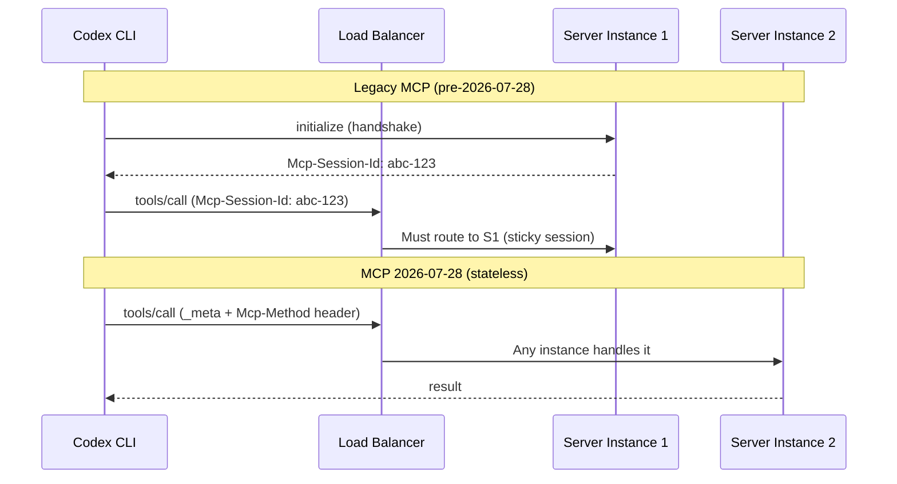
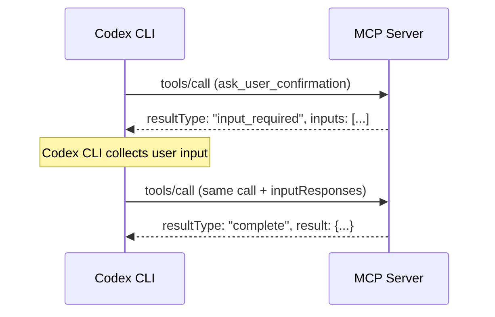

# MCP 2026-07-28: What the Stateless Protocol Overhaul Means for Your Codex CLI MCP Servers


---

The Model Context Protocol specification dated 2026-07-28 is the largest revision since MCP launched in November 2024[^1]. The protocol has shifted from a bidirectional stateful design to a request/response stateless architecture — and Codex CLI v0.147.0, released today, ships with opt-in support[^2]. If you run MCP servers alongside Codex CLI, this matters. Here is what changed, what breaks, and how to migrate.

## Why Stateless Matters

Legacy MCP required a two-step handshake: the client sent an `initialize` request, the server returned an `Mcp-Session-Id`, and every subsequent request carried that header[^1]. This created three practical problems for production deployments:

1. **Sticky sessions.** Load balancers needed session affinity or a shared session store to route requests back to the instance that handled the handshake.
2. **Cold-start latency.** Every new Codex CLI session paid the cost of a full round-trip before it could call any tool.
3. **Fragile reconnection.** If the server restarted or the session expired mid-task, the client had to re-initialise and replay context.

The 2026-07-28 specification eliminates all three. Every request is now self-contained — protocol version, client identity, and capabilities travel in a `_meta` field on each call[^1]. Any request can land on any server instance behind a plain round-robin load balancer.



## The Five Breaking Changes

### 1. Session Removal

The `Mcp-Session-Id` header and the `initialize`/`notifications/initialized` handshake are gone. Servers must read protocol version and capabilities from the `_meta` field on every incoming request[^1].

### 2. Mandatory Routing Headers

Streamable HTTP requests now require two headers[^1]:

- **`Mcp-Method`** — the JSON-RPC method name (e.g. `tools/call`, `resources/read`)
- **`Mcp-Name`** — the specific tool or resource name (required for `tools/call`, `resources/read`, `prompts/get`)

This is the change that enables gateway-level routing, rate limiting, and WAF rules without JSON body parsing.

### 3. Multi Round-Trip Requests (MRTR)

The old server-initiated patterns — `elicitation/create`, `sampling/createMessage`, and `roots/list` — are replaced by MRTR[^1]. When a server needs client input mid-call, it returns `resultType: "input_required"` with the requested inputs. The client retries the original call with `inputResponses` attached.



This maps cleanly to Codex CLI's approval mode. When a server returns `input_required`, the agent can present the request through the same approval UI developers already use for shell commands.

### 4. Cacheable List Responses

Responses from `tools/list`, `prompts/list`, `resources/list`, and `resources/read` now carry two new fields[^1]:

- **`ttlMs`** — cache time-to-live in milliseconds
- **`cacheScope`** — directs client caching strategy

Codex CLI can cache tool schemas across calls, reducing the overhead of repeated discovery in long sessions. Combined with deterministic ordering in list responses, this also stabilises upstream prompt caches — the tool schema block in the system prompt stays identical between turns, maximising cache hits on the model provider side[^3].

### 5. Discovery Replaces Handshake

A new `server/discover` RPC lets clients fetch server capabilities on demand[^1]. It is stateless and cacheable. Clients that already know what a server offers can skip it entirely and call tools directly.

## What Got Deprecated

Five features are formally deprecated with a twelve-month support window[^1]:

| Feature | Replacement |
|---|---|
| Roots | Pass root information as tool arguments |
| Sampling | MRTR with `input_required` |
| Logging | Extension-based logging |
| HTTP+SSE transport | Streamable HTTP |
| Dynamic Client Registration (DCR) | Client ID Metadata Documents (CIMD) |

The Tasks feature moves from experimental core to the `io.modelcontextprotocol/tasks` extension, with poll-based `tasks/get` replacing synchronous blocking[^1].

## Codex CLI v0.147.0 Implementation

Codex CLI v0.147.0 ships MCP 2026-07-28 as an opt-in protocol version[^2]. The implementation adds three capabilities:

**Paginated discovery.** When connecting to a server that exposes hundreds of tools (common with cloud provider MCP servers like AWS MCP), Codex CLI now pages through `tools/list` responses rather than loading the entire catalogue into a single system prompt turn. This directly addresses the tool-schema bloat problem — a 400-tool AWS MCP server previously consumed 40–60K tokens of context on first contact.

**Multi-round requests.** Codex CLI handles `input_required` responses by routing them through the existing approval and elicitation UI. Servers can request user confirmation, additional credentials, or clarifying input without breaking the agent loop.

**Non-blocking server startup.** MCP servers configured in `config.toml` now start concurrently with session initialisation rather than blocking the prompt[^2]. Combined with the elimination of the `initialize` handshake, first-tool-call latency drops measurably.

## Configuring MCP Servers for 2026-07-28

MCP server configuration in Codex CLI lives in `~/.codex/config.toml` (user-level) or `.codex/config.toml` (project-level, trusted projects only)[^4].

### Streamable HTTP Server (Recommended for 2026-07-28)

```toml
[mcp_servers.my-server]
url = "https://mcp.example.com/v1"
# Optional: OAuth authentication
auth = "oauth"
# Optional: bearer token from environment
# bearer_token_env_var = "MY_SERVER_TOKEN"
# Optional: static headers for routing
# http_headers = { "X-Team" = "platform" }
```

### STDIO Server (Local Process)

```toml
[mcp_servers.local-db]
command = "npx"
args = ["-y", "@example/db-mcp-server"]
env = { DATABASE_URL = "postgresql://localhost/mydb" }
```

### Managing Servers via CLI

```bash
# Add a streamable HTTP server
codex mcp add my-server --url https://mcp.example.com/v1

# Add a local STDIO server
codex mcp add local-db -- npx -y @example/db-mcp-server

# List configured servers
codex mcp list

# Remove a server
codex mcp remove my-server
```

## Migration Checklist for Custom MCP Servers

If you maintain MCP servers that Codex CLI connects to, here is what needs to change.

### Server-Side

1. **Read `_meta` on every request.** Extract protocol version and client capabilities from the `_meta` field instead of relying on the `initialize` handshake.
2. **Implement `server/discover`.** Return your server's capabilities, tool list metadata, and supported extensions.
3. **Add `ttlMs` and `cacheScope` to list responses.** This is optional but significantly improves client performance. A `ttlMs` of 300000 (five minutes) is a reasonable default for servers whose tool schemas rarely change.
4. **Set `Mcp-Method` and `Mcp-Name` on responses** if your server supports header-based routing.
5. **Replace server-initiated calls with MRTR.** If your server uses `sampling` or `elicitation`, return `input_required` instead and handle `inputResponses` on retry.

### Client-Side (Codex CLI Handles This)

Codex CLI v0.147.0 handles the client-side migration automatically when you opt in to 2026-07-28 support. It sends `_meta` on every request, includes the required headers, and processes `input_required` responses through the approval UI[^2].

## Authorization Hardening

The 2026-07-28 specification also tightens OAuth flows[^1]:

- **RFC 9207 issuer validation** via the `iss` parameter prevents authorisation server mix-up attacks
- **`application_type` parameter** eliminates localhost redirect rejection for CLI/desktop apps — directly relevant for Codex CLI's OAuth flow with remote MCP servers
- **Client credentials bound to issuing authority** — no cross-issuer reuse
- **Dynamic Client Registration deprecated** in favour of Client ID Metadata Documents (CIMD)

For Codex CLI users authenticating with `auth = "oauth"`, these changes happen transparently in v0.147.0.

## The Ecosystem Impact

Simon Willison's observation captures the shift well: stateless MCP is "a better fit for building scalable web applications, since now you don't need to maintain server-side state"[^5]. Within a week of the specification landing, three new implementations appeared — `mcp-explorer`, `datasette-mcp`, and `llm-mcp-client` — demonstrating the reduced implementation barrier.

All four Tier 1 SDKs (TypeScript, Python, Go, C#) already speak 2026-07-28, with the Rust SDK in beta[^1]. The MCP C# SDK v2.0 shipped same-day support[^6].

For Codex CLI developers, the practical impact is threefold:

1. **Remote MCP servers become viable at scale.** Without sticky sessions, you can deploy MCP servers behind standard load balancers and auto-scalers.
2. **Tool discovery is cheaper.** Paginated, cacheable `tools/list` responses mean large MCP servers no longer blow your context budget on first contact.
3. **The twelve-month deprecation window is generous but finite.** If your custom MCP servers rely on the `initialize` handshake, Sampling, or Roots, start migrating now.

## What to Do Today

1. Update Codex CLI to v0.147.0: `codex update`
2. Review your `config.toml` MCP server entries — Streamable HTTP servers benefit most from 2026-07-28
3. If you maintain custom MCP servers, implement `server/discover` and add `_meta` parsing
4. Test with `codex mcp list` to verify server connectivity under the new protocol
5. Monitor the [MCP specification changelog](https://modelcontextprotocol.io/specification/2026-07-28/changelog) for further revisions

---

## Citations

[^1]: "The 2026-07-28 Specification", Model Context Protocol Blog, 28 July 2026. [https://blog.modelcontextprotocol.io/posts/2026-07-28/](https://blog.modelcontextprotocol.io/posts/2026-07-28/)

[^2]: "Release 0.147.0", OpenAI Codex CLI GitHub Releases, 7 August 2026. [https://github.com/openai/codex/releases/tag/rust-v0.147.0](https://github.com/openai/codex/releases/tag/rust-v0.147.0)

[^3]: "Prompt Caching for AI Agents: How to Cut Cost and Latency Without Breaking Context", Medium / Toward Next AI, 2026. [https://medium.com/toward-next-ai/prompt-caching-for-ai-agents-how-to-cut-cost-and-latency-without-breaking-context-245dc2502b4b](https://medium.com/toward-next-ai/prompt-caching-for-ai-agents-how-to-cut-cost-and-latency-without-breaking-context-245dc2502b4b)

[^4]: "Model Context Protocol — Codex CLI Documentation", OpenAI, 2026. [https://learn.chatgpt.com/docs/extend/mcp?surface=cli](https://learn.chatgpt.com/docs/extend/mcp?surface=cli)

[^5]: Simon Willison, "Stateless MCP has recaptured my interest (and inspired mcp-explorer and datasette-mcp)", 31 July 2026. [https://simonwillison.net/2026/Jul/31/stateless-mcp/](https://simonwillison.net/2026/Jul/31/stateless-mcp/)

[^6]: "Announcing v2.0 of the official MCP C# SDK", Microsoft .NET Blog, July 2026. [https://devblogs.microsoft.com/dotnet/announcing-v20-of-the-official-mcp-csharp-sdk/](https://devblogs.microsoft.com/dotnet/announcing-v20-of-the-official-mcp-csharp-sdk/)
