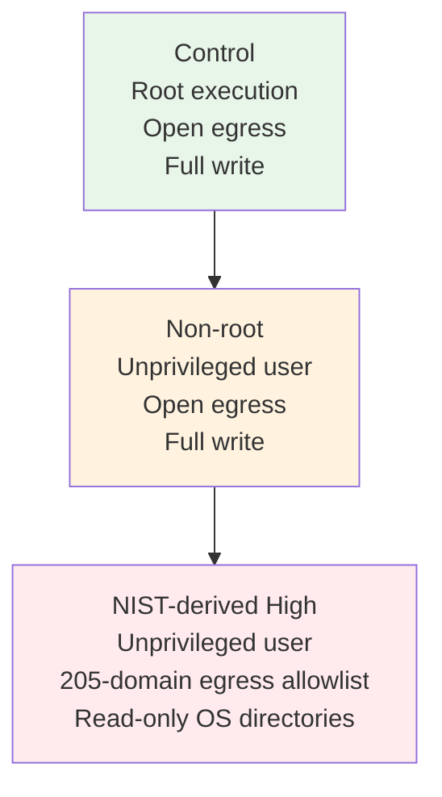
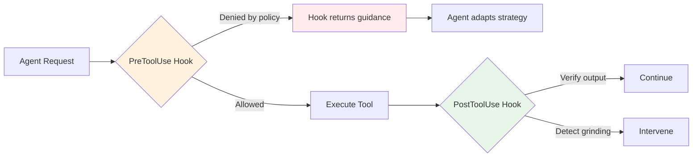

# Permission Denied: What Policy-Graded Benchmarking Reveals About Your Coding Agent in Hardened Environments — and How to Configure Codex CLI's Sandbox for the Real World


---

Every coding agent benchmark you have seen runs the agent as root, with unrestricted egress, on a fully writable filesystem. That is not where enterprise agents live. Davidovich, Amar, Rozencwajg, and Hiltch's *Permission Denied* study (arXiv:2608.02670, 2 August 2026) is the first systematic evaluation of what happens when you enforce real security policy on real agents — and the results should change how you choose models, size budgets, and configure Codex CLI for production[^1].

## The Gap: Benchmarks Test Capability, Not Deployability

Terminal-Bench 2.1 comprises 89 hand-crafted tasks spanning scientific computing, ML, system administration, security, and data science[^2]. Under the standard evaluation harness, agents run as root with open network access and full filesystem write. No scoped credentials. No egress restrictions. No read-only OS partitions.

Enterprise environments impose exactly these constraints. NIST SP 800-53 controls SC-7 (boundary protection), AC-6 (least privilege), and AC-3 (access enforcement) are not exotic requirements — they are baseline compliance for any organisation handling sensitive data[^1]. The question is not whether your agent *can* solve the task, but whether it can solve it *under policy*.

## Study Design: Three Nested Policy Levels

The study defines three policy configurations, each strictly more restrictive than the last:



The NIST-derived High configuration enforces three axes simultaneously:

- **Network:** Fixed 205-domain egress allowlist. No per-task additions. Cloud metadata and private ranges blocked.
- **Filesystem:** `/usr`, `/bin`, `/etc`, `/var` mounted read-only. Only `/app`, `/tmp`, `/dev/shm` writable.
- **Privilege:** No sudo, empty capability bounding set, `no_new_privs` kernel flag set[^1].

Twelve model–harness bundles were tested: GPT-5.6 Sol, Terra, and Luna on the Codex harness; Claude Sonnet 5, Opus 4.8, Fable 5, and Opus 5 on Claude Code; Kimi K3, GLM-5.2, Qwen 3.7 Max, and MiniMax M3 on Terminus-2; and Grok 4.5 on Grok Build[^1].

## The Numbers: Non-Uniform Degradation

Under NIST-derived High, no agent improved. But the *shape* of degradation varied dramatically:

| Metric | Control | Non-root | NIST-derived High |
|--------|---------|----------|-------------------|
| Aggregate success (82 solvable tasks) | 72.5% | 66.9% | 65.1% |
| Timeout rate | 12.0% | 14.5% | 16.4% |
| Wrong solution rate | 12.8% | 15.5% | 15.5% |
| Early stop rate | 2.4% | 2.6% | 2.7% |

Individual bundle deltas tell the real story:

- **Best success preservation:** Grok 4.5 lost only 7.1 percentage points — but its cost inflated by **167.3%**.
- **Worst success preservation:** Claude Sonnet 5 lost **18.3 percentage points** — but with relatively modest cost inflation.
- **Most cost-efficient under hardening:** GPT-5.6 Luna added only **16.0%** cost inflation[^1].

The headline finding is stark: **the model that best preserves success is the one that loses the most efficiency, and vice versa**. Model selection is policy-dependent.

## Grinding, Not Quitting

Agents almost never surrender early. When a `sudo apt install` fails with "permission denied", the agent does not stop. It retries, searches for workarounds, compiles from source into `/tmp`, attempts alternative package managers, or simply burns through its token budget trying variations. Of hardening-induced failures, approximately 59% ended in timeouts and 37% in wrong solutions[^1].

One-third of all trials recorded at least one blocked action. Egress denials dominated (500 of 675 affected trials), averaging 10.5 denials per affected trial. Five tasks alone accounted for half the total blocked-action volume[^1].

This has direct implications for token budgets. Hardened passes consumed:

- **13%** more wall-clock time
- **14%** more tool calls
- **26%** more tokens

than their control counterparts[^1]. Tasks requiring adapted reference solutions showed a **2.59× cost multiplier** versus 1.14× for tasks whose canonical solution passed unchanged.

## Task Solvability: 82 of 89

The study's solvability audit found that 82 of 89 Terminal-Bench tasks remain solvable under NIST-derived High. Of those:

- **50 tasks:** Original reference solution passes unchanged.
- **32 tasks:** Required a policy-compliant alternative solution authored by the researchers.
- **7 tasks:** Genuinely blocked by design — six require writes to read-only OS paths, one is foreclosed by network policy alone[^1].

Five Terminal-Bench verifiers were over-specified, hard-coding root-owned paths (`/usr/local/bin`, system R installations) rather than accepting equivalent locations. This is a benchmark integrity finding with broader implications: if your CI verifiers assume root, they will false-fail hardened agents.

## What This Means for Codex CLI Configuration

Codex CLI's two-layer security model — sandbox enforcement plus approval policy — maps directly to the NIST-derived High axes tested in the study[^3].

### Sandbox Profiles Match the Policy Levels

Codex CLI's built-in permission profiles correspond to the study's policy spectrum:

```toml
# config.toml — NIST-derived High equivalent
[sandbox]
permission_profile = ":workspace"  # /app-equivalent write scope

[sandbox.network]
# Equivalent to 205-domain allowlist
allowed_domains = [
  "registry.npmjs.org",
  "pypi.org",
  "files.pythonhosted.org",
  "github.com",
  "api.github.com",
  # ... project-specific domains
]

[sandbox.filesystem]
# Read-only everything except workspace and tmp
writable_paths = ["/workspace", "/tmp"]
```

The `:read-only` profile maps to even stricter constraints; `:workspace` (the default since v0.119) restricts writes to the project directory and temporary paths; `:danger-full-access` is the study's control condition — and should never appear in production[^3].

### Enterprise Fleet Enforcement via requirements.toml

For organisations deploying Codex CLI across teams, `requirements.toml` prevents developers from overriding security posture:

```toml
# requirements.toml — admin-enforced, not overridable
[sandbox]
allowed_sandbox_modes = ["read-only", "workspace"]
# Blocks danger-full-access entirely

[network]
# Fixed egress allowlist — no per-project additions
allowed_domains = ["registry.npmjs.org", "pypi.org", "github.com"]
```

When `trust_level = "untrusted"` is set for a repository, Codex CLI ignores any `.codex/config.toml` in that repository, preventing config injection attacks[^4].

### Budget Right-Sizing for Hardened Sessions

The study's 26% token inflation and 2.59× cost multiplier for affected tasks mean that token budgets calibrated on permissive benchmarks will systematically underestimate production costs. In Codex CLI:

```toml
# Adjust rollout token budget for hardened environments
[model]
rollout_token_budget = 200000  # ~26% uplift from permissive baseline

[tools]
tool_output_token_limit = 16384  # Cap verbose error output from denied actions
```

The `tool_output_token_limit` setting is particularly relevant. When agents grind against permission denials, each failed attempt generates verbose error output that consumes context. Capping tool output prevents denial-retry loops from exhausting the context window[^5].

### Policy-Dependent Model Selection

The study's core finding — that model ranking changes with policy severity — maps directly to Codex CLI's named profiles:

```toml
# Profile for hardened CI environments — prioritise success preservation
[profiles.hardened-ci]
model = "gpt-5.6-sol"  # Higher success under policy, accept cost
rollout_token_budget = 250000

# Profile for cost-sensitive hardened work
[profiles.hardened-dev]
model = "gpt-5.6-luna"  # Lowest cost inflation (+16%), acceptable success
rollout_token_budget = 150000
```

Select the profile at invocation:

```bash
codex --profile hardened-ci "Fix the authentication middleware"
```

Or set it as the environment default:

```bash
export CODEX_PROFILE=hardened-ci
```

## The Harness Matters as Much as the Model

A cross-harness ablation in the study showed that when GPT-5.6 Luna switched from the Codex harness to Grok Build, success dropped 34.6 percentage points under control (71.9% → 37.3%)[^1]. The harness contribution to both cost and success variation is substantial.

This reinforces that Codex CLI's harness-level features — `PreToolUse` and `PostToolUse` hooks, approval gates, sandbox enforcement — are not incidental. They are structural defences that determine whether your agent grinds uselessly against policy or adapts its approach.



A `PreToolUse` hook that detects repeated `sudo` attempts can return structured guidance ("This environment runs non-root; install to /app/.local instead") rather than letting the agent discover this through trial and error over ten retries[^5].

## Boundary-Bench: Reproduce This Yourself

The study ships Boundary-Bench, an open-source hardening plugin for Terminal-Bench 2.1. It uses native Linux mechanisms — iptables proxy for egress, bind-mount read-only for filesystem, `setpriv` for privilege restriction — with a pre-flight probe suite that verifies every restriction is active before the agent launches[^1].

If you maintain internal benchmarks for coding agent evaluation, the message is clear: add a hardened policy level. Scores from permissive environments do not predict production performance.

## Practical Takeaways

1. **Benchmark scores overstate production capability.** Expect 7–18 percentage point success drops and 16–167% cost inflation under enterprise hardening.
2. **Model choice is policy-dependent.** The ranking you see on leaderboards changes when you enforce NIST SP 800-53 controls.
3. **Agents grind, they do not quit.** Budget for 26% more tokens and use `tool_output_token_limit` to cap denial-retry noise.
4. **Use Codex CLI's permission profiles.** The `:workspace` default already enforces write-scoped, network-restricted sandboxing. Enterprise teams should lock this via `requirements.toml`.
5. **Hook-based guidance beats trial and error.** `PreToolUse` hooks that intercept known-denied actions save entire retry cycles.
6. **Test under your deployment policy.** Boundary-Bench exists. Use it.

## Citations

[^1]: Davidovich, D., Amar, Y., Rozencwajg, H. & Hiltch, O. (2026). "Permission Denied: Policy-Graded Evaluation of Coding Agents in Hardened Environments." arXiv:2608.02670. [https://arxiv.org/abs/2608.02670](https://arxiv.org/abs/2608.02670)

[^2]: Terminal-Bench 2.1 benchmark. [https://www.tbench.ai/](https://www.tbench.ai/)

[^3]: Codex CLI Permission Profiles documentation. [https://codex.danielvaughan.com/2026/05/08/codex-cli-permission-profiles-sandbox-modes-security-layers/](https://codex.danielvaughan.com/2026/05/08/codex-cli-permission-profiles-sandbox-modes-security-layers/)

[^4]: Codex CLI Permission Profiles: Governed Repo Mode and Enterprise Security Posture. [https://codex.danielvaughan.com/2026/04/17/permission-profiles-governed-repo-enterprise-security/](https://codex.danielvaughan.com/2026/04/17/permission-profiles-governed-repo-enterprise-security/)

[^5]: OpenAI Codex CLI Developer Reference — CLI commands and configuration. [https://developers.openai.com/codex/cli/reference](https://developers.openai.com/codex/cli/reference)

[^6]: NIST SP 800-53 Rev. 5 — Security and Privacy Controls for Information Systems. [https://csrc.nist.gov/publications/detail/sp/800-53/rev-5/final](https://csrc.nist.gov/publications/detail/sp/800-53/rev-5/final)
