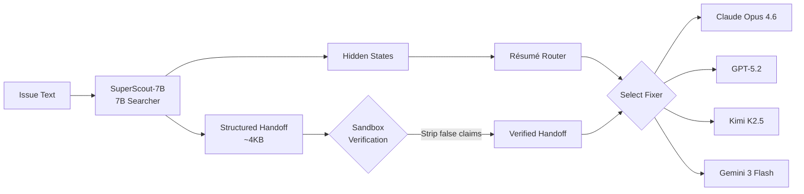

# Scrouting: What Cost-Aware Repository Scouting Means for Your Codex CLI Model Routing Strategy


---

Most developers pick a model and stick with it. That default costs them roughly five times more than it should. A paper published on 5 August 2026 — *Scrouting: Cost-Aware Routing of Coding Agents by Scouting the Repository First* — demonstrates that a tiny 7B searcher model can explore a repository, produce a structured handoff, and route the actual fix to whichever frontier model gives the best cost-adjusted outcome[^1]. The result: matching the top single model's solve rate on SWE-bench Pro at about a fifth of the cost per solve.

For Codex CLI practitioners already juggling Sol, Terra, and Luna tiers, the implications are immediate and practical.

## The Core Insight: Scout Before You Spend

Existing model routers choose a backend from the issue text alone — a few paragraphs of natural language describing a bug. Bhola, Krishnan, and NS argue that this is fundamentally insufficient. Repository structure, file interdependencies, and reproduction feasibility all carry signal that raw issue text cannot[^1].

SuperScout adds a scouting phase: a LoRA-fine-tuned Qwen2.5-Coder-7B (dubbed SuperScout-7B) explores the repository, identifies implicated files with line regions, attempts to produce a reproduction test specification, and records dead ends it already tried. The output is a compact ~4KB structured handoff[^1].



The searcher's GPU bill was \$1.13 across all 266 SWE-bench Pro Python evaluations — less than half a cent per task[^1]. That is the cost of a single frontier API call for many repositories.

## The Numbers That Matter

On the full Python slice of SWE-bench Pro (266 tasks) under the benchmark's official capped budget tier[^1]:

| System | Solves | Cost/Solve | Relative Cost |
|--------|--------|-----------|---------------|
| Claude Opus 4.6 (solo) | 158 | \$1.274 | 1.00× |
| SuperScout (routed) | 159 | \$0.230 | 0.18× |

SuperScout matches the best single model whilst spending 82% less per solve. The four frontier fixers in the routing pool — Claude Opus 4.6, GPT-5.2, Kimi K2.5, and Gemini 3 Flash — each bring different strengths, but the handoff itself drives the result rather than the routing decision[^1].

## Why Handoff Text Helps Fixers but Hurts Routers

One of the paper's most counterintuitive findings concerns what information benefits which stage. On a 99-task calibration set[^1]:

| Router Variant | Features | Cost Savings |
|----------------|----------|-------------|
| Task text only | Issue embedding | 30.5% |
| + Handoff text | Issue + handoff embedding | 8.0% |
| **+ Hidden states** | **Issue + searcher internals** | **34.3%** |
| + Both | All features | 9.4% |

Hidden states from the searcher's final layers improve routing. But adding the handoff *text* to the router actively degrades routing quality. The searcher's internal representation encodes difficulty and structure in ways that surface text does not — the handoff is optimised for the fixer's consumption, not the router's decision[^1].

This has a direct practical lesson: **the signal that tells you which model to use is not the same signal that helps the model do the work**.

## The Verification Problem: 80% of Reproduction Claims Are False

SuperScout-7B produces reproduction test specifications as part of its handoff. When these claims were sandbox-verified, only 50 of 249 (20%) were genuinely reproducible; 174 (70%) were demonstrably false[^1]. Spontaneous handoffs — where the searcher decided it had enough information — had 22% genuine claims. Forced handoffs, where the searcher hit a step limit, managed only 9%[^1].

The verify-then-strip gate removes false reproduction claims before they reach the fixer. Without this gate, false claims could actively mislead the downstream model. This finding reinforces what Codex CLI's auto-review architecture already assumes: **agent-generated assertions require independent verification**[^2].

## Mapping to Codex CLI's Three-Tier Model Architecture

Codex CLI ships with GPT-5.6 Sol, Terra, and Luna — a three-tier family designed for exactly the kind of task-aware routing that SuperScout formalises[^3]. The mapping is straightforward:

| SuperScout Role | Codex CLI Equivalent |
|----------------|---------------------|
| 7B Searcher (scouting) | Luna-tier exploration pass |
| Résumé Router (selection) | Named profiles + AGENTS.md routing rules |
| Frontier Fixer (resolution) | Sol or Terra, depending on complexity |
| Verify-then-strip gate | PostToolUse hooks + auto-review |

### A Practical Scouting Workflow

You can approximate SuperScout's architecture today using Codex CLI's named profiles and multi-agent capabilities. Create a scouting profile that uses Luna for cheap repository exploration:

```toml
# ~/.codex/scout.config.toml
model = "gpt-5.6-luna"
model_reasoning_effort = "low"

[instructions]
system_prompt = """
You are a repository scout. Your job is to:
1. Identify files implicated in the issue
2. Attempt to reproduce the bug
3. Record dead ends
4. Produce a structured handoff — do NOT fix the bug yourself.
"""
```

Then a fixer profile that uses Sol for complex resolutions:

```toml
# ~/.codex/fix-sol.config.toml
model = "gpt-5.6-sol"
model_reasoning_effort = "high"
```

Run the scout first:

```bash
codex --profile scout "Explore issue #427 and produce a handoff"
```

Then feed the handoff context to the fixer:

```bash
codex --profile fix-sol "Fix issue #427 using the scouting context above"
```

This two-pass approach mirrors SuperScout's architecture: Luna handles the cheap exploration (~80% less than Sol[^4]), and Sol receives a pre-narrowed context window.

### AGENTS.md Routing Rules

Encode the routing decision in your project's AGENTS.md:

```markdown
## Model Routing

- **Scouting tasks** (file identification, reproduction attempts, dead-end logging):
  Use `--profile scout` with Luna. Do not attempt fixes.
- **Standard fixes** (single-file bugs, test additions, documentation):
  Use `--profile fix-terra` with Terra.
- **Complex fixes** (multi-file refactors, architectural changes, security patches):
  Use `--profile fix-sol` with Sol.
```

This gives every team member — and every automated workflow — a consistent routing policy without requiring a trained router model[^5].

## The Extensibility Lesson

SuperScout's résumé router requires only 25–50 public per-task outcomes to onboard a new fixer model — no retraining needed[^1]. The router maintains two embedding centroids (solved/failed task means) plus a base solve rate per fixer, scoring candidates via logistic regression.

Codex CLI's named profile system achieves something analogous at the configuration layer. When a new model becomes available — as happened with GPT-5.6 Sol replacing GPT-5.5 in July 2026[^3] — you update a single TOML file rather than retraining infrastructure. The cost of switching models is measured in seconds, not GPU hours.

## What Scrouting Gets Wrong (and What Codex CLI Should Learn Anyway)

The paper's own ablation reveals an uncomfortable finding: a no-router ablation — Kimi K2.5 with handoff but no routing — achieves identical performance (159/266) at effectively the same cost (\$0.227 vs \$0.230 per solve)[^1]. The router collapses to cost allocation on this particular benchmark because solve sets are heavily nested (0.77–0.94 Jaccard overlap between fixers).

This does *not* mean routing is worthless. It means that on SWE-bench Pro's Python slice, the fixer pool is too homogeneous for routing to differentiate. In production, where cost differentials between Sol (\$15.00/M output tokens) and Luna (\$1.20/M output tokens[^4]) are 12.5×, routing carries genuine economic weight even when accuracy is similar.

The actionable takeaway: **invest in the handoff, not the router**. A structured scouting pass that narrows context before the expensive model sees the task delivers most of the value. The routing decision is secondary.

## Practical Recommendations for Codex CLI Teams

1. **Scout with Luna, fix with Sol/Terra.** SuperScout's entire premise validates this pattern. The scouting phase costs <0.5¢ per task; the savings compound across hundreds of issues per sprint.

2. **Verify reproduction claims.** If your AGENTS.md instructs the agent to write reproduction tests during scouting, add a PostToolUse hook that actually runs them before passing context to the fixer[^2].

3. **Use hidden signals, not surface text, for routing.** In Codex CLI terms, this means routing based on repository characteristics (file count, language mix, test coverage) rather than issue description alone. Encode these heuristics in your AGENTS.md.

4. **Keep routing extensible.** Named profiles mean you can swap models without touching workflow logic. When GPT-5.7 or the next frontier model ships, update one TOML file.

5. **Track cost per solve, not just solve rate.** SuperScout's metric is deliberately cost-adjusted. Configure Codex CLI's rollout token budgets[^6] to enforce per-task cost ceilings and monitor actual spend via OpenTelemetry traces.

## The Broader Trend

Scrouting joins a growing body of 2026 research — including MTRouter[^7], TwinRouterBench, and Fail-Fast Restart-Smart — arguing that the model selection problem for coding agents is better framed as cost engineering than accuracy chasing. When frontier models solve 0.77–0.94 of the same tasks, the question is not "which model is best?" but "which model is cheapest for *this* task?"

Codex CLI's three-tier architecture was designed for exactly this question. SuperScout provides the empirical evidence that a scouting phase can answer it at negligible additional cost.

---

## Citations

[^1]: Bhola, I., Krishnan, A., & NS, M. (2026). *Scrouting: Cost-Aware Routing of Coding Agents by Scouting the Repository First*. arXiv:2608.04804. [https://arxiv.org/abs/2608.04804](https://arxiv.org/abs/2608.04804)

[^2]: OpenAI. (2026). *Codex CLI Documentation: Hooks — PreToolUse and PostToolUse*. [https://developers.openai.com/codex/hooks](https://developers.openai.com/codex/hooks)

[^3]: OpenAI. (2026). *GPT-5.6 Sol, Terra, and Luna — Model Documentation*. [https://developers.openai.com/codex/models](https://developers.openai.com/codex/models)

[^4]: OpenAI. (2026). *GPT-5.6 Luna pricing reduced by 80%, Terra by 20%*. [https://x.com/OpenAI/status/2082878156483219672](https://x.com/OpenAI/status/2082878156483219672)

[^5]: OpenAI. (2026). *Codex CLI Documentation: AGENTS.md*. [https://developers.openai.com/codex/agents-md](https://developers.openai.com/codex/agents-md)

[^6]: OpenAI. (2026). *Codex CLI v0.147 Alpha: Rollout Token Budgets*. [https://github.com/openai/codex/releases](https://github.com/openai/codex/releases)

[^7]: Chen, Y., et al. (2026). *MTRouter: Cost-Aware Multi-Turn LLM Routing with History–Model Joint Embeddings*. arXiv:2604.23530. [https://arxiv.org/abs/2604.23530](https://arxiv.org/abs/2604.23530)
