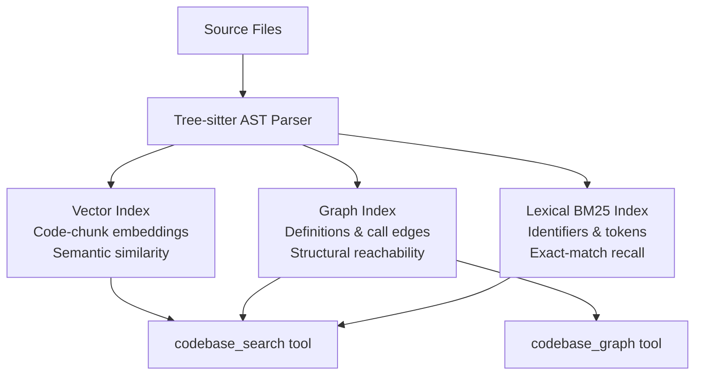
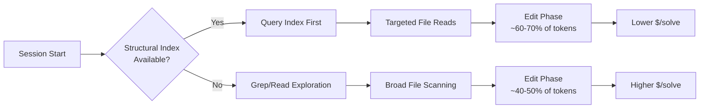

# Code Isn't Memory: What Structural Codebase Indexing Means for Your Codex CLI Exploration Costs


---

Repository exploration is the silent tax on every coding agent session. Before a single line of code is written, the agent must locate the relevant files, understand their relationships, and gather enough context to make an informed edit. A growing body of research — and a maturing ecosystem of graph-aware tools — now demonstrates that structural codebase indexing can slash that tax dramatically. This article examines the evidence and maps it to practical Codex CLI workflows.

## The Exploration Problem

When you point Codex CLI at an unfamiliar repository, the agent's first instinct is to explore: grepping for symbols, reading files, building a mental model of the codebase. This discovery phase burns tokens, consumes turns, and inflates API costs — all before any productive editing begins.

Bhola et al.'s "Code Isn't Memory" study (arXiv:2606.22417) [^1] quantified this precisely. Running Claude Opus 4.7 across 91 instances on SWE-PolyBench Verified and SWE-bench Pro, the team compared three experimental arms:

- **SC-ON**: A SuperCoder harness with a structural codebase index exposing `codebase_search` and `codebase_graph` tools
- **SC-OFF**: The identical harness with index tools removed — pure agentic grep
- **OpenCode**: An independent open-source harness using ripgrep-based retrieval

The results were unambiguous.

## The Numbers

| Metric | SC-ON (indexed) | SC-OFF (no index) | OpenCode (ripgrep) |
|--------|-----------------|--------------------|--------------------|
| Resolve % | 50.4 | 41.9 | 45.3 |
| Localisation acc@5 | 84.5% | 44.3% | 75.3% |
| $/solved | \$2.30 | \$2.84 | \$2.92 |
| $/cell mean | \$1.15 | \$1.19 | \$1.32 |
| Mean turns | 28.3 | 36.2 | 36.0 |
| Mean tokens | 10.1k | 11.1k | 14.0k |

The within-harness ablation (SC-ON vs SC-OFF, Wilcoxon paired tests, n=80) showed [^1]:

- **Localisation**: +39.6 percentage points (p<0.0001)
- **Resolve**: +7.9 percentage points (p=0.003)
- **Turns**: −8.3 fewer turns per task (p<0.0001)
- **Tokens**: −1.6k fewer tokens per task (p=0.027)
- **Per-cell cost**: no significant difference (p=0.73)

The structural index did not make tasks more expensive — it made them cheaper per solve because the agent found the right code faster and wasted fewer turns exploring dead ends.

## What the Index Contains

The structural index in the study comprised three components, all built via tree-sitter AST parsing with incremental Merkle-tree updates [^1]:



This three-pronged approach — semantic, structural, and lexical — means the agent can ask "what calls this function?" (graph), "what code looks similar to this pattern?" (vector), and "where is this exact identifier?" (lexical) without burning turns on speculative grep.

## Where It Matters Most

The study's most actionable finding is the workload dependency. Not every task benefits equally from structural indexing [^1]:

| Task complexity | SC-ON resolve % | SC-OFF resolve % | Δ |
|----------------|-----------------|-------------------|---|
| 1-file changes | 52.7 | 41.3 | +11.4 |
| 2-file changes | 55.6 | 51.0 | +4.6 |
| 3+ file changes | 42.0 | 36.2 | +5.8 |

The localisation gap widened dramatically for multi-file tasks: acc@5 of 91.3% vs 44.9% for 3+ file changes. This reframes the deployment question from "is indexing too expensive?" to "does your workload include multi-file changes?" — and in any non-trivial repository, the answer is almost certainly yes.

Language also mattered. Go tasks saw the largest resolve gain (+17.2 pp), whilst Python tasks showed a modest +2.1 pp [^1]. Statically typed languages with explicit import graphs give structural indexing more to work with.

## The Broader Landscape: LARGER and FastContext

The "Code Isn't Memory" findings sit within a broader convergence. Hu et al.'s LARGER framework (arXiv:2605.16352) [^2] takes a complementary approach: starting from lexical matches, aligning them to graph anchors, and performing confidence-filtered local expansion within the agent's existing search loop. LARGER improved file-level acc@5 on LocBench by +13.9 points with tuned hyperparameters and +11.8 points with fixed hyperparameters [^2].

Microsoft Research's FastContext (arXiv:2606.14066) [^3] attacks the same problem from the model side, delegating exploration to a purpose-trained 4B-parameter subagent that returns only file paths and line ranges. This cuts main-agent token consumption by up to 60% whilst lifting resolution rates by up to 5.5 percentage points [^3].

The message across all three papers is consistent: agents that explore structurally outperform agents that explore lexically, and the cost savings more than cover the indexing overhead.

## Practical Codex CLI Integration via MCP

Codex CLI already supports MCP (Model Context Protocol) tool servers, and the open-source ecosystem has responded with graph-aware indexing tools that plug directly into the agent loop.

### CodeGraph

CodeGraph [^4] is a local-first code intelligence MCP server built on tree-sitter and SQLite with FTS5. It exposes nine tools to the agent:

```toml
# codex.toml — register CodeGraph as an MCP server
[mcp_servers.codegraph]
command = "codegraph"
args = ["serve", "--mcp"]
env = { CODEGRAPH_ROOT = "." }
```

The available tools map directly to the structural index capabilities the research validates:

- `codegraph_search` — semantic + lexical symbol search
- `codegraph_callers` / `codegraph_callees` — call graph traversal
- `codegraph_impact` — change impact analysis
- `codegraph_context` — structural context for a symbol
- `codegraph_explore` — guided exploration from an entry point

Community benchmarks report a 59% reduction in token consumption, 70% fewer tool calls, and ~35% lower API cost across seven real-world codebases [^4].

### codebase-index

The `codebase-index` project [^5] takes a similar approach with hybrid FTS5 + tree-sitter + graph search, also exposed via MCP. It is fully offline and designed for privacy-sensitive workflows where sending code to embedding APIs is not acceptable.

### Wiring It Into AGENTS.md

Once an MCP indexing server is registered, you can direct the agent to prefer structural queries over raw grep:

```markdown
# AGENTS.md

## Exploration Rules

- Before grepping for symbols, check codegraph_search first
- For cross-file changes, use codegraph_impact to identify affected files
- Use codegraph_callers/codegraph_callees to trace call chains
  rather than reading entire files
- Limit raw file reads to files identified by structural queries
- Summarise discovered context before editing
```

This pattern mirrors the SC-ON configuration in the "Code Isn't Memory" study — the agent has the same grep tools available but is instructed to prefer the structural index, reducing speculative exploration.

## Exploration Budget Monitoring

Codex CLI's `/usage` command lets you track how much of each session is spent on exploration versus productive edits. The research suggests a practical heuristic: if exploration exceeds 40% of your token spend, your session needs tighter bounding [^3].



With Codex CLI's rollout token budgets (introduced in v0.146.0) [^6], you can set hard limits on exploration spend. Combined with a structural index that front-loads accurate localisation, the budget goes further — more tokens available for the actual fix, fewer wasted on wrong-file reads.

## When Not to Bother

Structural indexing is not free to set up. The tree-sitter parsing and index construction adds a one-time cost per repository (and incremental costs on file changes). For genuinely single-file tasks — quick scripts, configuration tweaks, isolated function edits — the overhead is not justified.

The research supports this: single-file tasks showed the smallest resolve delta (+11.4 pp) and Python tasks barely moved (+2.1 pp) [^1]. If your Codex CLI workflow is predominantly single-file edits in dynamically typed languages, a well-written `AGENTS.md` with exploration-bounding directives may be sufficient.

For everything else — multi-file refactors, cross-module feature work, large repository navigation — the evidence now strongly favours structural indexing as a default part of your agent toolchain.

## Key Takeaways

1. **Structural indexing delivers a 40 pp localisation gain** with no per-cell cost penalty and 19% lower cost per solve [^1]
2. **Multi-file tasks benefit most** — 3+ file changes see localisation accuracy jump from 44.9% to 91.3% [^1]
3. **MCP-based tools like CodeGraph** bring these gains to Codex CLI today, with reported 59% token reduction and 70% fewer tool calls [^4]
4. **AGENTS.md directives** should instruct agents to prefer structural queries over raw grep when an index is available
5. **Monitor exploration budgets** — if exploration exceeds 40% of session tokens, add structural indexing or tighten exploration bounds

## Citations

[^1]: Bhola, I., Krishnan, A., Kurmala, S. & NS, M. (2026). "Code Isn't Memory: A Structural Codebase Index Inside a Coding Agent." arXiv:2606.22417. [https://arxiv.org/abs/2606.22417](https://arxiv.org/abs/2606.22417)

[^2]: Hu, Y., Su, T., Zhao, L., Zhu, B. & Haque, H. (2026). "LARGER: Lexically Anchored Repository Graph Exploration and Retrieval." arXiv:2605.16352. [https://arxiv.org/abs/2605.16352](https://arxiv.org/abs/2605.16352)

[^3]: Microsoft Research (2026). "FastContext: Training Efficient Repository Explorer for Coding Agents." arXiv:2606.14066. [https://arxiv.org/abs/2606.14066](https://arxiv.org/abs/2606.14066)

[^4]: CodeGraph. "Pre-indexed code knowledge graph for Claude Code, Codex, Gemini, Cursor, OpenCode." GitHub. [https://github.com/colbymchenry/codegraph](https://github.com/colbymchenry/codegraph)

[^5]: codebase-index. "Local-first codebase indexing for Claude Code, Codex CLI, OpenCode & AI coding agents." GitHub. [https://github.com/denfry/codebase-index](https://github.com/denfry/codebase-index)

[^6]: OpenAI (2026). "Codex CLI v0.146.0 Release Notes." [https://www.havoptic.com/tools/openai-codex](https://www.havoptic.com/tools/openai-codex)
