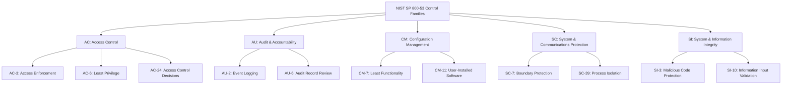

# The Hardened Agent Playbook: Mapping NIST SP 800-53 Controls to Your Codex CLI Enterprise Sandbox


---

Every coding agent benchmark runs with full permissions, unrestricted network access, and root-level filesystem control. Your production environment does not. The gap between benchmark performance and real-world results is not a mystery — it is a security policy.

Davidovich et al.'s *Permission Denied* study quantified this gap for the first time: under NIST-derived hardening policies, coding agents suffer up to 18.3 percentage-point success losses and 167.3% cost inflation [^1]. Meanwhile, NIST's COSAiS project is developing SP 800-53 control overlays specifically for single-agent and multi-agent AI deployments [^2]. The question is no longer whether to harden your coding agent — it is how to do it without grinding your token budget into dust.

This article maps NIST SP 800-53 controls to concrete Codex CLI configuration, drawing on the Permission Denied findings, NIST's emerging COSAiS framework, and Codex CLI v0.147.0's two-layer security model [^3].

## The Policy-Performance Gradient

The Permission Denied study evaluated 12 model-harness bundles on Terminal-Bench 2.1 across three nested policy levels [^1]:

| Policy Level | Description | Max Success Loss | Max Cost Inflation |
|---|---|---|---|
| **Control** | Unrestricted (benchmark default) | Baseline | Baseline |
| **Non-root** | Non-root user, scoped credentials, restricted egress | ~8pp | ~40% |
| **High (NIST-derived)** | Read-only filesystem, mandatory audit, network allowlisting | 18.3pp | 167.3% |

Two findings matter for enterprise planning. First, 82 of 89 tasks remain solvable under the strictest policy — the tasks are not inherently incompatible with hardening [^1]. Second, agents do not fail fast. They grind: 59% of failures are timeouts and 37% are wrong solutions, meaning your token budget absorbs the cost of futile retries rather than clean errors [^1].

The critical insight: **model ranking is policy-dependent**. The model that best preserves success rate under hardening is also the one that loses the most efficiency. You cannot pick a single model for all policy tiers — you need policy-aware model routing [^1].

## NIST SP 800-53 Controls That Matter for Coding Agents

NIST's COSAiS project defines five AI deployment use cases, two of which directly address agentic systems: "Using AI Agent Systems (Single Agent)" and "Using AI Agent Systems (Multi-Agent)" [^2]. While the full overlays are expected in late 2026, the annotated outline published in January 2026 identifies the control families most relevant to coding agents [^4].



The NCCoE concept paper (February 2026) highlights a fundamental identity problem: AI agents are neither human users nor static services, yet enterprise identity infrastructure assumes one or the other [^5]. An agent operating under a service account gets indefinite standing permissions with no task-scoping mechanism — precisely the gap Codex CLI's permission profiles address.

## The Three-Tier Sandbox Maturity Model

Codex CLI's two-layer security model — kernel-level sandbox enforcement plus approval policies — maps cleanly onto a three-tier maturity progression that aligns with increasing NIST compliance requirements [^3]:

### Tier 1: Developer Workstation (SOC 2 Type I Baseline)

```toml
# config.toml — Developer tier
default_permissions = ":workspace"
model = "o3"

[permissions.dev]
sandbox = "permissive"
approval_policy = "unless-allow-listed"
network.enabled = true
network.allowed_domains = ["api.openai.com", "registry.npmjs.org", "pypi.org"]
```

**NIST Controls Addressed:**
- **AC-6 (Least Privilege):** `:workspace` restricts writes to the project directory, preventing lateral filesystem access [^3].
- **SC-7 (Boundary Protection):** Domain allowlisting constrains network egress to known package registries and API endpoints.
- **CM-7 (Least Functionality):** `unless-allow-listed` approval policy gates tool executions not on the approved list.

### Tier 2: CI/CD Pipeline (SOC 2 Type II)

```toml
# config.toml — CI tier
default_permissions = ":read-only"
model = "o4-mini"

[permissions.ci-runner]
sandbox = "strict"
approval_policy = "on-failure"
network.enabled = true
network.allowed_domains = ["api.openai.com"]
network.allow_local_binding = false

[permissions.ci-runner.file_access]
read = ["${PROJECT_ROOT}/**"]
write = ["${PROJECT_ROOT}/build/**", "${PROJECT_ROOT}/dist/**"]
deny_read = ["**/.env", "**/*.pem", "**/credentials.*"]
```

**NIST Controls Addressed:**
- **AC-3 (Access Enforcement):** Explicit file access rules with deny patterns for sensitive files.
- **AU-2 (Event Logging):** `on-failure` approval policy creates an audit trail of all failed operations.
- **SC-39 (Process Isolation):** `strict` sandbox mode uses Bubblewrap + seccomp on Linux for kernel-level process isolation [^3].
- **SI-10 (Input Validation):** Deny-read rules prevent the agent from ingesting credentials or key material.

### Tier 3: Production/Regulated (ISO 27001 / NIST High)

```toml
# requirements.toml — Organisation-wide enforcement
# This file is managed by platform security; developers cannot override it

[policy]
allowed_sandbox_modes = ["strict"]
blocked_approval_policies = ["never"]
max_model_tier = "o4-mini"
require_audit_log = true

[policy.network]
enabled = false

[policy.file_access]
deny_read = ["**/.env*", "**/*.key", "**/*.pem", "**/secrets/**"]
deny_write = ["**/node_modules/**", "**/vendor/**", "**/.git/**"]
```

**NIST Controls Addressed:**
- **CM-11 (User-Installed Software):** `requirements.toml` provides an unbreakable ceiling that individual developers cannot override [^6].
- **AC-24 (Access Control Decisions):** Policy enforcement happens at the kernel level, not in the agent's reasoning — a compromised model cannot bypass sandbox restrictions [^3].
- **SI-3 (Malicious Code Protection):** Network disabled entirely; write access blocked to dependency directories prevents supply-chain injection.

## Policy-Dependent Model Routing

The Permission Denied findings demand that model selection accounts for the active policy tier [^1]. Codex CLI's named profiles make this straightforward:

```toml
# config.toml — Policy-aware model routing

[profiles.unrestricted]
model = "o3"
permissions = "dev"
# Best absolute performance, highest cost under hardening

[profiles.hardened]
model = "o4-mini"
permissions = "ci-runner"
# Better cost efficiency under restrictions, acceptable success rate

[profiles.audit]
model = "o4-mini"
permissions = ":read-only"
reasoning_effort = "low"
# Read-only analysis tasks — security reviews, compliance checks
```

Switching profiles at invocation:

```bash
# Development — full capability
codex --profile unrestricted "refactor the auth module"

# CI pipeline — hardened sandbox
codex --profile hardened "fix the failing integration tests"

# Security audit — read-only
codex --profile audit "review this PR for credential exposure"
```

## Token Budget Right-Sizing for Hardened Environments

The 167.3% cost inflation under NIST High policy is not inevitable — it stems from agents grinding against restrictions they do not understand [^1]. Three configuration levers reduce this waste:

### 1. PreToolUse Hooks for Early Denial Guidance

When an agent hits a permission boundary, it typically retries the same operation with minor variations, consuming tokens on each attempt. A PreToolUse hook can intercept denied operations and inject guidance:

```toml
# AGENTS.md directive
## Security Context
This repository runs under a hardened sandbox. You CANNOT:
- Write outside ${PROJECT_ROOT}/build/ and ${PROJECT_ROOT}/dist/
- Access .env files or credentials
- Make network requests except to api.openai.com

When a filesystem or network operation is denied, do NOT retry it.
Instead, explain what you need and ask for manual intervention.
```

### 2. Rollout Token Budgets

Cap the maximum tokens per task to prevent timeout-grinding:

```toml
[policy]
rollout_token_limit = 50000
tool_output_token_limit = 8192
```

### 3. Context Compaction Awareness

The *Agentic Coding in the Wild* study showed context compaction destroys 66.1% of cache hit rates [^7]. In hardened environments where denial-retry loops inflate context, compaction triggers more frequently. Set a conservative threshold:

```toml
model_auto_compact_limit = 0.85
# Only compact at 85% context window, preserving cache
```

## Compliance Mapping Quick Reference

| NIST SP 800-53 Control | Codex CLI Configuration | Maturity Tier |
|---|---|---|
| AC-3 Access Enforcement | `file_access.read/write/deny_*` | 2+ |
| AC-6 Least Privilege | `:read-only` / `:workspace` profiles | 1+ |
| AC-24 Access Control Decisions | Kernel-level sandbox (Bubblewrap/seccomp) | 2+ |
| AU-2 Event Logging | `approval_policy = "on-failure"` | 2+ |
| CM-7 Least Functionality | `approval_policy = "unless-allow-listed"` | 1+ |
| CM-11 User-Installed Software | `requirements.toml` admin ceiling | 3 |
| SC-7 Boundary Protection | `network.allowed_domains` | 1+ |
| SC-39 Process Isolation | `sandbox = "strict"` | 2+ |
| SI-3 Malicious Code Protection | `network.enabled = false` + write deny | 3 |
| SI-10 Input Validation | `deny_read` credential patterns | 2+ |

## What COSAiS Means for Your Roadmap

The COSAiS overlays for agentic AI systems are expected in late 2026 [^4]. Three emerging themes from the annotated outline are worth watching:

1. **Task-scoped permissions:** The NCCoE concept paper argues that agents need permissions scoped to specific tasks and time windows, not standing service account access [^5]. Codex CLI's profile-switching model is a reasonable approximation, but expect future requirements for finer-grained, per-invocation scoping.

2. **Adversarial data interaction controls:** Prompt injection is one of three CAISI-identified threat categories driving the overlays [^2]. The current sandbox model mitigates execution consequences but not the injection vector itself.

3. **Multi-agent coordination controls:** The multi-agent use case will likely require audit trails showing which agent authorised which action — a gap in current Codex CLI multi-agent workflows.

## Practical Recommendations

1. **Start at Tier 2.** Most teams can immediately deploy `:workspace` sandbox with domain-restricted networking and `on-failure` approval logging. The Permission Denied data shows Non-root policy costs roughly 40% more — a manageable budget increase for a significant security improvement [^1].

2. **Use `requirements.toml` for fleet enforcement.** Do not rely on individual developers choosing the correct profile. Platform security should own the requirements file and distribute it via configuration management [^6].

3. **Budget for hardening overhead.** Plan for 40-170% token cost increase depending on policy tier. This is not waste — it is the cost of running agents that would survive an audit [^1].

4. **Route models by policy.** Use named profiles to assign cost-efficient models (o4-mini) to hardened tiers and capability-maximising models (o3) to less restricted development work [^3].

5. **Watch COSAiS.** When the agentic overlays publish, you will need to demonstrate control coverage. The mapping table above gives you a head start [^4].

---

## Citations

[^1]: Davidovich, D. et al. (2026). "Permission Denied: Policy-Graded Evaluation of Coding Agents in Hardened Environments." arXiv:2608.02670. [https://arxiv.org/abs/2608.02670](https://arxiv.org/abs/2608.02670)

[^2]: NIST Computer Security Resource Center. "SP 800-53 Control Overlays for Securing AI Systems (COSAiS) — Use Cases." [https://csrc.nist.gov/Projects/cosais/use-cases](https://csrc.nist.gov/Projects/cosais/use-cases)

[^3]: Codex CLI Documentation. "Sandbox Concepts." OpenAI. [https://developers.openai.com/codex/concepts/sandboxing](https://developers.openai.com/codex/concepts/sandboxing)

[^4]: NIST Computer Security Resource Center. "SP 800-53 Control Overlays for Securing AI Systems (COSAiS) — FAQs." [https://csrc.nist.gov/Projects/cosais/faqs](https://csrc.nist.gov/Projects/cosais/faqs)

[^5]: NCCoE. (2026). "AI Agent Identity and Access Management Concept Paper." NIST National Cybersecurity Center of Excellence, February 2026. Referenced via Cloud Security Alliance analysis: [https://labs.cloudsecurityalliance.org/research/csa-research-note-nist-ai-agent-standards-federal-framework/](https://labs.cloudsecurityalliance.org/research/csa-research-note-nist-ai-agent-standards-federal-framework/)

[^6]: Codex CLI Documentation. "Enterprise Managed Configuration: requirements.toml, managed_config.toml, and Admin-Enforced Policies." [https://codex.danielvaughan.com/2026/04/27/codex-cli-enterprise-managed-configuration-requirements-toml-admin-policies/](https://codex.danielvaughan.com/2026/04/27/codex-cli-enterprise-managed-configuration-requirements-toml-admin-policies/)

[^7]: Liu, J. et al. (2026). "Agentic Coding in the Wild: What 13.5 Million Production Sessions Reveal." arXiv:2608.00101. [https://arxiv.org/abs/2608.00101](https://arxiv.org/abs/2608.00101)
