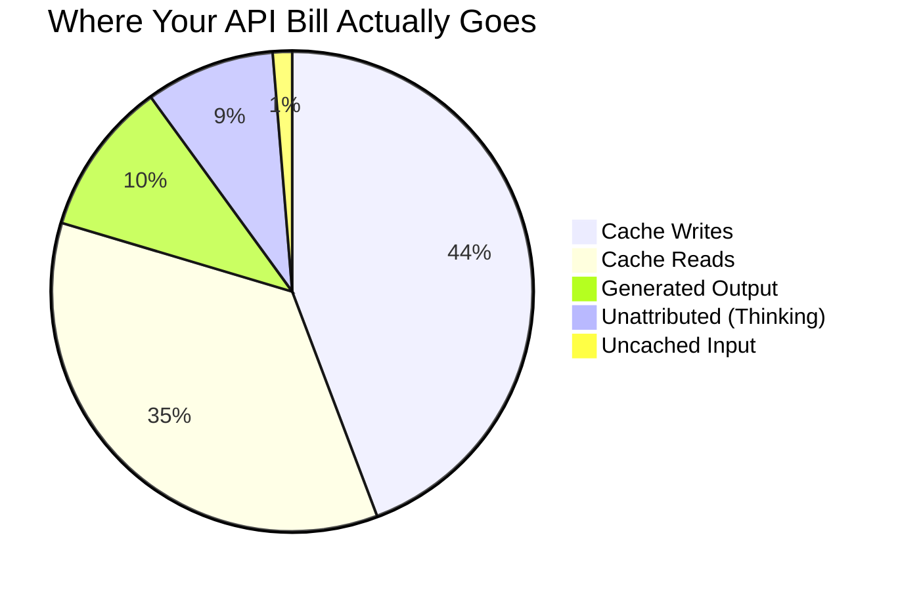
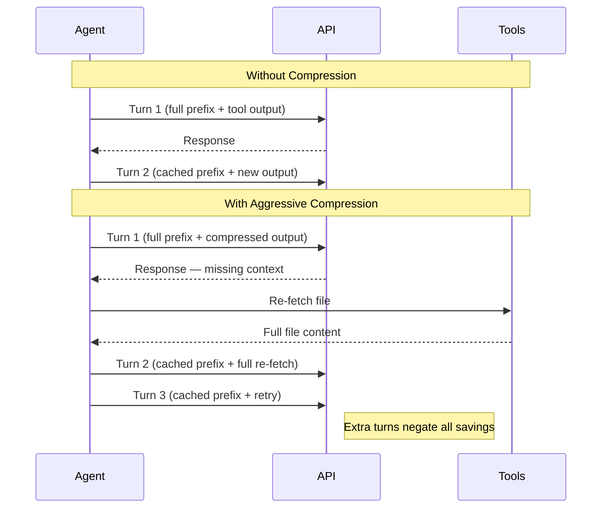
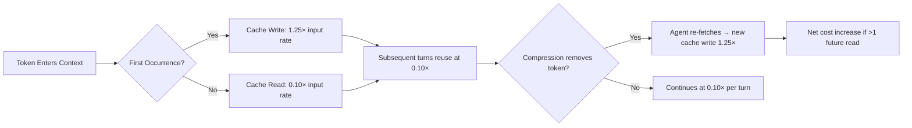

# Token Reduction Is Not Cost Reduction: What Prompt-Cache Economics Mean for Your Codex CLI Cost Strategy


---

Every Codex CLI practitioner has the same instinct: trim tool output, compress context, shave tokens — and watch costs fall. A rigorous empirical study published in July 2026 demonstrates that this instinct is wrong, and sometimes actively harmful.

Weinberger and Hozez's *Token Reduction Is Not Cost Reduction* analysed 2,908 provider-billed executions (2,848 Claude Code runs) across 103 tasks and seven repositories, discovering that removing 38.4% of tool-output tokens **increased** billed costs by 6.8% [^1]. The mechanism is prompt-cache pricing — and it reshapes how you should think about cost optimisation in Codex CLI.

## The Four-Component Cost Model

The study decomposed actual API bills into four components [^1]:

| Component | Share of Bill | Description |
|-----------|:---:|---|
| Cache creation (writes) | 44.3% | First transmission of prompt prefix |
| Cache reads | 35.4% | Reuse of cached prefix on subsequent turns |
| Generated output | 10.4% | Model-produced tokens |
| Uncached input | 1.3% | Novel prompt tokens |
| Unattributed residual | 8.7% | Thinking tokens on some models |

Cache creation and cache reads together account for roughly **87% of reconstructed cost** and approximately 80% of actual billing [^1]. The tokens you can see and manipulate — tool outputs, retrieved files, conversation history — represent about 6% of total input cost.



## Why Compression Backfires

The study tested three compression approaches against a baseline across multiple Claude models (Haiku 4.5, Sonnet 5, Opus 4.8/5) [^1]:

| System | Token Reduction | Cost Change | Success Change |
|--------|:-:|:-:|:-:|
| RTK (shipped compressor) | moderate | −2.7% | −0.2 pp |
| RTK-ML (all gates enabled) | −38.4% | **+6.8%** | +0.9 pp |
| Headroom v0.27.0 (open-source) | aggressive | **+48.4%** | +1.4 pp |

The correlation between per-task token reduction and cost change was negligible: Pearson r = 0.15, with the confidence interval crossing zero [^1].

Three mechanisms explain why aggressive compression increases costs:

### 1. Trajectory Extension

When compression removes context the agent needs, it issues additional tool calls to retrieve the missing information. Each extra turn retransmits the entire cached prefix. A single recovery turn can cost more than the tokens saved across all previous turns [^1].



### 2. Cache Pricing Asymmetry

Under GPT-5.6's pricing, cache reads cost 10% of the standard input rate [^2]. A token at turn 1 has a marginal cost of approximately 1.60× the input price when you account for all future cache reads; a token at turn N costs only 1.25× [^1]. Removing early-turn tokens saves very little on reads but still incurs the full write cost. The economics only work if you can guarantee no trajectory extension.

### 3. Anchor Destruction

The SWE-bench single-shot evaluation on Go tasks revealed the sharpest failure mode. Raw compression achieved 73% token reduction and 59% cost reduction — but patch application rates collapsed from 27/40 to 15/40 [^1]. The cause: SEARCH/REPLACE edit operations require verbatim code anchors, and compression rewrote or dropped these spans. The agent could identify the fix but could not apply it.

## The Accessibility Ceiling

Token attribution across agent components reveals why user-side optimisation has a hard ceiling [^1]:

| Surface | % of Input Cost | Accessible? |
|---------|:-:|:-:|
| System prompts and tool definitions | ~94% | No (locked) |
| Tool outputs | 3.3% | Yes |
| Tool arguments | 1.4% | Yes |
| Retrieved files | 0.8% | Yes |
| Conversation history | 0.5% | Yes |

The maximum theoretical saving from compressing all visible tokens is approximately **6%** — before engineering overhead, before trajectory-extension risk, and before anchor-destruction risk. RTK-ML's largest observed reduction reached only 1.3% of total input cost [^1].

## Mapping to Codex CLI Cost Strategy

These findings have direct implications for how you configure Codex CLI.

### Stop Optimising tool_output_token_limit for Cost

The `tool_output_token_limit` configuration parameter caps tokens stored per tool output [^3]. Many practitioners set this aggressively low (8,000–12,000 tokens) hoping to reduce costs. The PointFive study suggests this is counterproductive: if the cap forces additional retrieval turns, you pay more, not less. A conservative setting of 16,000–24,000 tokens reduces the risk of trajectory extension.

```toml
# codex.toml — conservative tool output limits
[model]
tool_output_token_limit = 20000   # avoid triggering re-fetch loops
```

### Protect Your Cache Hit Rate

The agentic-coding-in-the-wild production study of 13.5 million GitHub Copilot sessions found a "KV cache 10-minute cliff": hit rates exceed 95% under two minutes of idle time but collapse to 0–5% beyond ten minutes [^4]. Context compaction — triggered in 7.8% of sessions — consumed 22% of turn time and destroyed 66.1% of cache hits [^4].

For Codex CLI, this means the `model_auto_compact_limit` threshold should be set high enough to avoid unnecessary compaction:

```toml
[model]
model_auto_compact_limit = 200000   # delay compaction to preserve cache
```

If you must compact, use `/compact` manually at a natural task boundary rather than letting automatic compaction fire mid-flow [^3].

### Optimise Trajectories, Not Tokens

The study's core recommendation is to evaluate cost using **success-adjusted billed cost per execution** (CPS), not token counts [^1]. For Codex CLI practitioners, this translates to:

1. **Reduce unnecessary turns** — Write precise AGENTS.md directives that eliminate exploratory file reads. The Lulla et al. study showed well-crafted AGENTS.md files reduce median runtime by 28.64% and output tokens by 16.58% [^5].

2. **Front-load context** — Include relevant file paths and architectural context in your prompt rather than letting the agent discover them. Every discovery turn retransmits the entire cached prefix.

3. **Use named profiles for model routing** — Route simple tasks to GPT-5.6 Luna (\$0.20/M input, \$0.02/M cached) and reserve Sol (\$5.00/M input, \$0.50/M cached) for complex multi-file reasoning [^2]. The cost difference is 25×, which dwarfs any token-compression saving.

```toml
# Named profiles for cost-aware routing
[profiles.scout]
model = "gpt-5.6-luna"
# cheap exploration and file discovery

[profiles.fix]
model = "gpt-5.6-terra"
# main implementation work

[profiles.architect]
model = "gpt-5.6-sol"
# complex cross-module reasoning only
```

### GPT-5.6 Cache Write Pricing Changes

GPT-5.6 introduced a pricing change that amplifies the study's findings: cache writes are now billed at **1.25× the uncached input rate**, while reads retain the 90% discount [^2]. This means the cost of cache creation is higher than ever, making trajectory extension (which forces new cache-write segments) even more expensive.



## The Decision Framework

Before deploying any context-compression layer in your Codex CLI workflow, apply this checklist derived from the study's eight-layer evidence taxonomy [^1]:

1. **Measure billed cost, not token count.** Use `/usage` after sessions to track actual spend.
2. **Track trajectory length.** If your compression increases mean turns per task, it is likely increasing cost.
3. **Test on your actual task distribution.** The study found task-family heterogeneity: no single optimisation fits all workloads.
4. **Protect edit anchors.** If your workflow uses SEARCH/REPLACE or diff-based patching, any compression that alters source code spans will degrade patch application.
5. **Calculate the accessibility ceiling.** If 94% of your input tokens are locked system prompts, compressing the remaining 6% cannot deliver meaningful savings.

## Conclusion

The counterintuitive lesson from this research is clear: in agentic coding workflows, **the cheapest token is the one your cache already holds, not the one you deleted**. For Codex CLI practitioners, cost optimisation should focus on trajectory reduction (fewer turns), cache preservation (avoiding unnecessary compaction), and model routing (matching task complexity to model tier) — not on compressing the narrow sliver of tokens you can actually touch.

The PointFive study's recommended metric — cost per successful execution — should replace raw token counts as the primary efficiency measure for any Codex CLI deployment [^6].

## Citations

[^1]: Weinberger, S. and Hozez, A. (2026) "Token Reduction Is Not Cost Reduction: An Empirical Study of End-to-End Efficiency in API-Based Coding Agents", arXiv:2607.12161. Available at: [https://arxiv.org/abs/2607.12161](https://arxiv.org/abs/2607.12161)

[^2]: OpenAI (2026) "GPT-5.6 API Pricing — Sol, Terra, Luna token rates", OpenAI Platform. Available at: [https://www.morphllm.com/openai-api-pricing](https://www.morphllm.com/openai-api-pricing)

[^3]: OpenAI (2026) "Codex CLI Context Compaction: Architecture, Configuration, and Managing Long Sessions", Codex Documentation. Available at: [https://codex.danielvaughan.com/2026/03/31/codex-cli-context-compaction-architecture/](https://codex.danielvaughan.com/2026/03/31/codex-cli-context-compaction-architecture/)

[^4]: Liu, Y. et al. (2026) "Agentic Coding in the Wild: A Large-Scale Study of LLM Agent Workloads", arXiv:2608.00101. Available at: [https://arxiv.org/abs/2608.00101](https://arxiv.org/abs/2608.00101)

[^5]: Lulla, J.L., Mohsenimofidi, S., Galster, M., Zhang, J.M., Baltes, S. & Treude, C. (2026). "On the Impact of AGENTS.md Files on the Efficiency of AI Coding Agents." arXiv:2601.20404. [https://arxiv.org/abs/2601.20404](https://arxiv.org/abs/2601.20404)

[^6]: PointFive (2026) "PointFive Research Finds Cutting AI Tokens Can Actually Increase Costs", PR Newswire, August 2026. Available at: [https://www.prnewswire.com/news-releases/pointfive-research-finds-cutting-ai-tokens-can-actually-increase-costs-302844453.html](https://www.prnewswire.com/news-releases/pointfive-research-finds-cutting-ai-tokens-can-actually-increase-costs-302844453.html)
