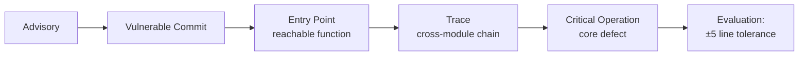
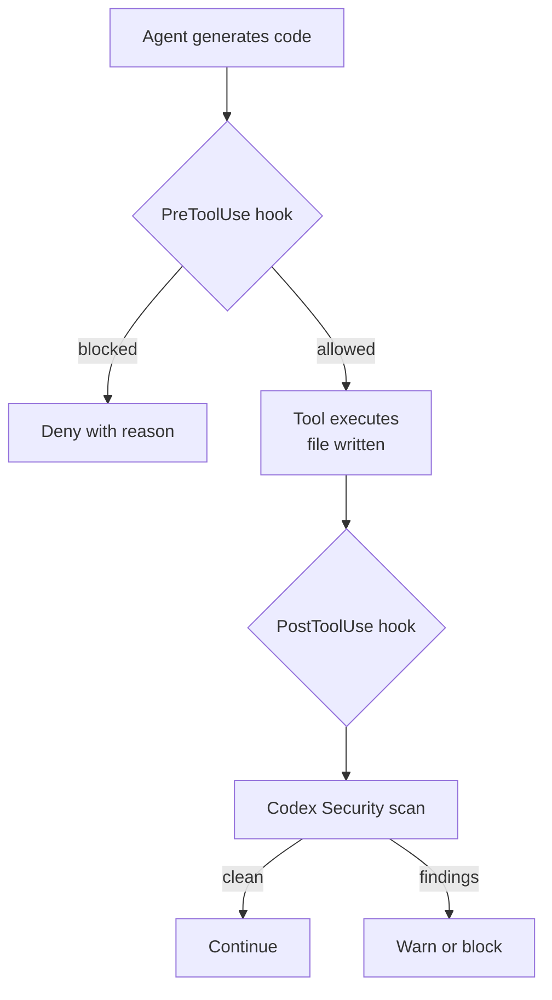
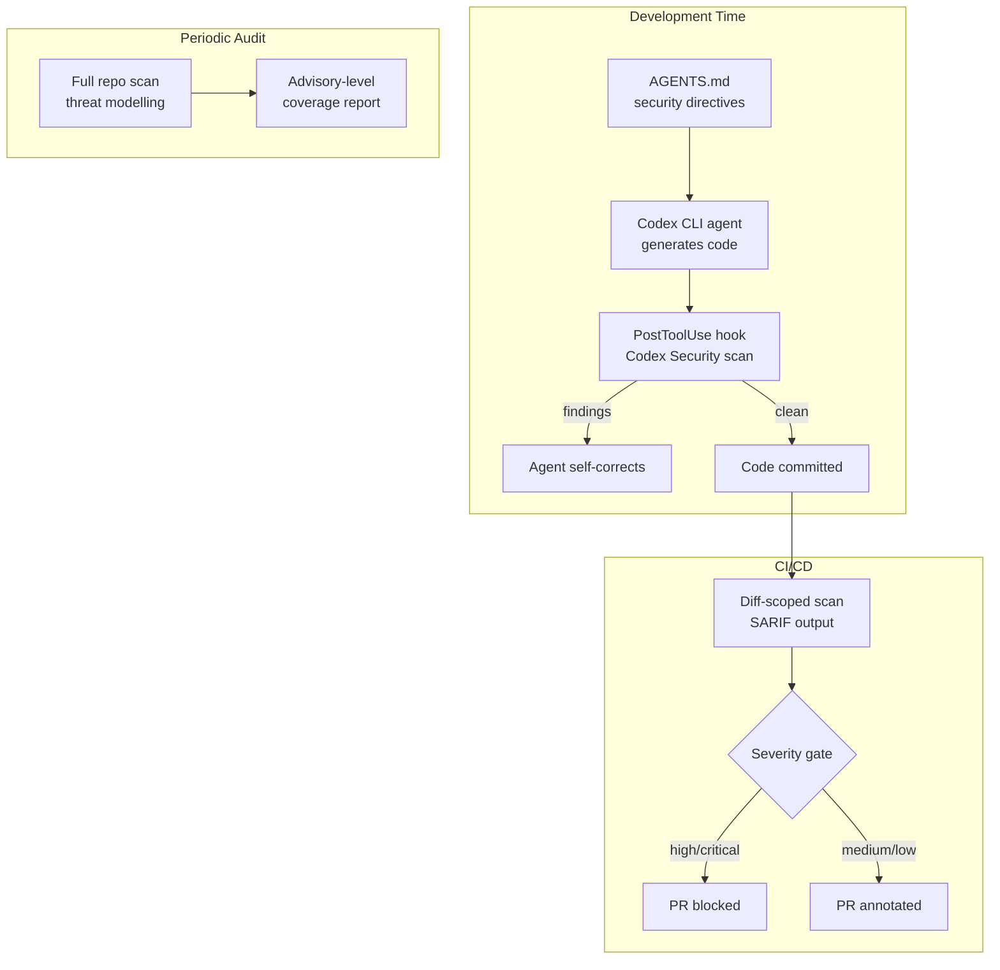

# VulnGym and the Business-Logic Blindspot: What Repository-Level Vulnerability Benchmarks Reveal About Coding Agent Security Scanning


---

Most vulnerability scanners — and most coding agents asked to "find security issues" — default to pattern-matching against a catalogue of known weakness classes: SQL injection, XSS, path traversal. The assumption is that if a tool can spot a `subprocess.call(user_input)`, the hard work is done. VulnGym, a new benchmark from Tencent's Wukong Code Security Team published on 3 August 2026 [^1], exposes why that assumption is dangerously incomplete. Across 184 GitHub advisories and 408 annotated vulnerability entries spanning 23 real-world repositories, 71.2% of the advisories describe **business-logic flaws** — broken authorisation, missing access control, privilege escalation, workflow violations — that no regex will catch [^2].

This article examines what VulnGym measures, where current coding agents fall short, and how Codex CLI's layered security tooling can be configured to address the gap.

## What VulnGym Measures

VulnGym is a project-level, white-box benchmark. Each sample is pinned to the exact vulnerable commit of a real repository, and ships with three human-reviewed annotations [^2]:

- **Entry point** — the reachable function or method that triggers the vulnerability.
- **Critical operation** — the precise location where the core defect executes.
- **Trace** — a cross-module reasoning chain linking the entry point to the critical operation.



The evaluation uses normalised path matching with a ±5 line tolerance on both entry point and critical operation [^2]. Two recall metrics are reported:

| Metric | Definition |
|--------|-----------|
| **Advisory-level recall** | Fraction of advisories with at least one matched entry |
| **Entry-level recall** | Fraction of all annotated entries successfully matched |

Crucially, the current evaluator measures coverage only — it cannot penalise over-reporting [^2]. An agent that flags every line as vulnerable would score perfectly on recall but be useless in practice. This design choice is deliberate: the benchmark isolates the _discovery_ problem from the _precision_ problem.

## The Business-Logic Dominance

The most striking finding is the vulnerability class distribution. Of 184 advisories [^2]:

| Category | Count | % |
|----------|------:|--:|
| Broken authorisation logic | 31 | 16.8% |
| Missing authorisation | 23 | 12.5% |
| AI/agent capability bypass | 20 | 10.9% |
| Privilege escalation | 13 | 7.1% |
| Authentication bypass | 11 | 6.0% |
| Other business-logic | 33 | 17.9% |
| **Business-logic subtotal** | **131** | **71.2%** |
| Traditional (injection, traversal, XSS, etc.) | 53 | 28.8% |

The "AI/agent capability bypass" sub-category (20 advisories) is particularly noteworthy. These are vulnerabilities in applications that themselves use LLM agents — sandbox escapes, prompt injection vectors, tool-call policy violations — where the defect is a logical gap in the governance layer rather than a memory-safety error [^2].

Business-logic flaws demand **cross-module code-semantic reasoning**: an agent must understand authentication middleware, authorisation decorators, route handlers, and data-access layers as a connected system. Pattern-matching tools see individual files; these vulnerabilities exist in the _relationships between_ files.

## Where Current Agents Struggle

The VulnGym paper (arXiv:2608.02001) reports that current coding agents remain limited in both end-to-end repository-level vulnerability detection and the construction of accurate supporting traces [^1]. Several capability gaps emerge:

### Shallow Exploration

Agents given an advisory description and a full repository often explore too few files. Repository-level vulnerability detection requires autonomous exploration rather than analysis of preselected functions [^1]. Agents that rely on keyword search or file-name heuristics miss the authorisation middleware buried three directories deep.

### Broken Trace Construction

Even when agents locate the correct files, they struggle to reconstruct the full trace — the chain of function calls, data transformations, and control-flow decisions linking an externally reachable entry point to the critical operation. The trace is what transforms a suspicion into a verifiable finding.

### Over-Reliance on Traditional Patterns

⚠️ While specific per-model recall scores from VulnGym are not yet published in the open benchmark (the GitHub README marks baseline results as "Coming soon" [^2]), related work from Semgrep's evaluation of Claude Code and Codex on modern web applications found true-positive rates of just 14% and 18% respectively, with false-positive rates exceeding 80% [^3]. These numbers reflect a broader pattern: agents default to flagging traditional vulnerability patterns and miss the business-logic defects that dominate real-world advisories.

## Mapping to Codex CLI Security Workflows

Codex CLI offers three complementary layers for vulnerability detection, each addressing a different part of the problem VulnGym exposes.

### Layer 1: Codex Security CLI

OpenAI open-sourced Codex Security (formerly Aardvark) under Apache-2.0 in July 2026 [^4]. Unlike pattern-matching static analysers, it uses model-driven contextual analysis: the tool first maps data flows, identifies trust boundaries, and determines what security controls _should_ exist before flagging where they are absent [^4].

```bash
# Full repository scan with threat modelling
npx @anthropic-ai/codex-security scan --repo .

# Diff-scoped scan for PR review
npx @anthropic-ai/codex-security scan --diff origin/main

# Pre-commit hook installation
npx @anthropic-ai/codex-security hook install
```

The diff-scoped mode is particularly valuable for CI/CD integration. It constrains the analysis surface to changed code whilst retaining awareness of the broader repository context, and outputs SARIF for integration with GitHub Advanced Security and similar dashboards [^4].


```bash
# CI pipeline with severity gating
OPENAI_API_KEY=${{ secrets.OPENAI_KEY }} \
  npx @anthropic-ai/codex-security scan \
    --diff origin/main \
    --format sarif \
    --severity-threshold high
```


### Layer 2: PreToolUse and PostToolUse Hooks

For teams running Codex CLI agents that generate code, the hook system provides runtime security gates [^5]. A PostToolUse hook can invoke Codex Security after every file write, catching vulnerabilities at generation time rather than in later review:

```toml
# .codex/hooks/post-tool-use-security.toml
[hook]
event = "PostToolUse"
tool = "write_file"

[hook.action]
command = "npx @anthropic-ai/codex-security scan --path $TOOL_OUTPUT_PATH --format json"
on_failure = "warn"  # or "block" for strict mode
```

A PreToolUse hook complements this by blocking dangerous operations before they execute — preventing `rm -rf`, writes to system directories, or attempts to read sensitive credential files [^5].



### Layer 3: AGENTS.md Security Directives

VulnGym's data shows that 71.2% of real vulnerabilities are business-logic flaws. No tool can fully automate their detection without domain knowledge. AGENTS.md lets teams encode that knowledge as natural-language directives that the model reads at the start of every session:

```markdown
## Security Requirements

### Authorisation
- Every API route handler MUST check user permissions via the `@requires_permission` decorator
- Direct database queries that bypass the ORM's row-level security are forbidden
- Multi-tenant data access MUST include a `tenant_id` filter at the query level

### Trust Boundaries
- Data crossing the browser→API boundary must be validated with Pydantic models
- Internal service-to-service calls must carry and verify the `X-Service-Auth` header
- File uploads must be stored outside the web root with randomised names
```

This is not a replacement for automated scanning — it is a specification layer that makes the business-logic constraints explicit, so both the model and any PostToolUse security hooks have a reference standard to check against.

## Building a VulnGym-Informed Scanning Pipeline

Combining all three layers produces a pipeline that addresses VulnGym's core finding — that the majority of real vulnerabilities require semantic reasoning, not pattern matching:



The periodic full-repository scan is the most expensive step but the most aligned with what VulnGym measures: can the tool, given an entire codebase, discover vulnerabilities that require cross-module reasoning?

## Practical Implications

VulnGym's contribution is not another leaderboard — it is a diagnostic framework. The three oracle subtasks (entry-point identification, critical-operation localisation, and trace construction) let teams pinpoint _where_ their security tooling fails rather than simply recording a pass/fail score [^1].

For Codex CLI users, the key takeaways are:

1. **Do not rely solely on pattern-matching tools.** Codex Security's model-driven analysis is better suited to the business-logic flaws that dominate real-world advisories, but it is not infallible.

2. **Encode domain-specific security invariants in AGENTS.md.** The model cannot infer your authorisation model from code alone — make it explicit.

3. **Layer defences at multiple points.** PostToolUse hooks catch issues at generation time; diff-scoped CI scans catch them at review time; periodic full-repo scans catch what both missed.

4. **Measure coverage, not just alerts.** VulnGym's advisory-level recall metric is a useful internal KPI: when you run your security tooling against known past vulnerabilities in your own codebase, what fraction does it find?

The gap between what coding agents can theoretically reason about and what they reliably detect in practice remains substantial. VulnGym gives us the measurement instrument to close it.

---

## Citations

[^1]: Ji, K., Liu, J., Hu, E., Gao, C., Lian, K., Liu, Y., Zhang, L., Dong, T., Chen, H., & Bin, W. (2026). "VulnGym: Benchmarking Coding Agents for Repository-Level Vulnerability Detection." arXiv:2608.02001. [https://arxiv.org/abs/2608.02001](https://arxiv.org/abs/2608.02001)

[^2]: Tencent Wukong Code Security Team. (2026). "VulnGym: A Real-World, Project-Level Vulnerability Benchmark for White-Box Vulnerability-Hunting Agents." GitHub/HuggingFace. [https://github.com/Tencent/VulnGym](https://github.com/Tencent/VulnGym) / [https://huggingface.co/datasets/tencent/VulnGym](https://huggingface.co/datasets/tencent/VulnGym)

[^3]: Semgrep. (2025). "Finding vulnerabilities in modern web apps using Claude Code and OpenAI Codex." [https://semgrep.dev/blog/2025/finding-vulnerabilities-in-modern-web-apps-using-claude-code-and-openai-codex/](https://semgrep.dev/blog/2025/finding-vulnerabilities-in-modern-web-apps-using-claude-code-and-openai-codex/)

[^4]: OpenAI. (2026). "Codex Security CLI." GitHub, Apache-2.0. [https://gbhackers.com/openai-open-sources-codex-security-cli-to-find-vulnerabilities/](https://gbhackers.com/openai-open-sources-codex-security-cli-to-find-vulnerabilities/)

[^5]: Knightli. (2026). "Codex Hooks Guide: Setup, Events, Privacy Checks, and Logging." [https://knightli.com/en/2026/06/11/codex-hooks-advanced-usage/](https://knightli.com/en/2026/06/11/codex-hooks-advanced-usage/)
