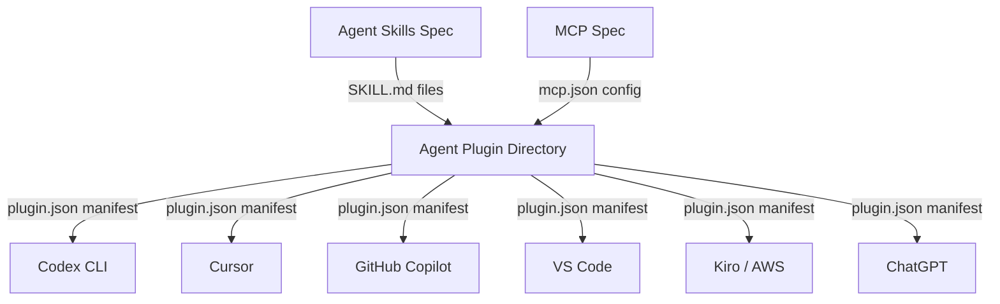

# Agent Plugins 1.0: What the New Open Standard Means for Your Codex CLI Plugin Strategy


---

On 6 August 2026, OpenAI, Microsoft, Amazon Web Services, Anysphere (Cursor), and Vercel published **Agent Plugins 1.0.0** — a vendor-neutral specification for packaging Agent Skills and MCP server configurations into distributable plugin directories that any conformant client can discover and load[^1]. At launch, six clients already support it: ChatGPT, Codex CLI, Cursor, GitHub Copilot, VS Code, and Kiro (AWS)[^2]. Codex CLI v0.147.0, released the following day, ships with full Agent Plugin installation, search across four catalogue scopes, and runtime boundary enforcement[^3].

This article explains the specification's architecture, walks through building a plugin that works across all six launch clients, and maps the practical implications for Codex CLI workflows.

## Why Another Standard?

Agent Skills (the SKILL.md format) already define reusable procedural knowledge. MCP already standardises runtime tool connections. The gap was **distribution**: how do you bundle both into a single artefact that Codex CLI, Cursor, and Copilot all load identically?

Agent Plugins solves precisely this. It does not replace Agent Skills or MCP — it wraps them in a portable directory structure with a closed-schema manifest[^4]. Think of it as the `package.json` for agent extensions: a minimal contract that clients validate before discovering components.



## Plugin Anatomy

A plugin is a **directory**, not an archive. This is a deliberate design choice — you can inspect it with `ls`, `cat`, and `git diff` before loading it[^5].

```bash
my-plugin/
├── plugin.json          # Manifest (required)
├── skills/
│   └── lint-config/
│       ├── SKILL.md     # Agent Skill definition
│       ├── scripts/
│       └── references/
├── mcp.json             # MCP server configuration (optional)
└── com.cursor.ide/      # Client-specific extensions (optional)
```

### plugin.json — The Manifest

The schema permits exactly ten top-level fields. Only two are required[^1]:

```json
{
  "$schema": "https://agent-plugins.org/schemas/1.0.0/plugin.schema.json",
  "name": "lint-config",
  "version": "1.0.0",
  "description": "ESLint and Prettier configuration skill with MCP formatting server",
  "author": {
    "name": "Your Team",
    "url": "https://github.com/your-org/lint-config"
  },
  "license": "MIT",
  "keywords": ["eslint", "prettier", "formatting"]
}
```

Plugin names must be 1–64 characters, lowercase alphanumeric with hyphens and periods, no consecutive separators (`--` or `..`), and must start and end with an alphanumeric character[^1].

### Skills Discovery

Clients that support Agent Skills scan `skills/` for immediate child directories containing a `SKILL.md` file. There is no recursive search — only first-level subdirectories are recognised[^1]. Each skill conforms to the existing Agent Skills specification; Agent Plugins adds no new frontmatter fields.

### MCP Configuration via mcp.json

Three transports are defined: `stdio`, `streamable-http`, and legacy `sse`[^1]. Conformant clients must support at least one of `stdio` or `streamable-http`; `sse` support is optional.

```json
{
  "$schema": "https://agent-plugins.org/schemas/1.0.0/mcp.schema.json",
  "mcpServers": {
    "format-server": {
      "type": "stdio",
      "command": "./bin/format-server",
      "args": ["--config", "${PLUGIN_ROOT}/config.json"],
      "env": {
        "DATA_DIR": "${PLUGIN_DATA}/cache"
      }
    },
    "remote-lint": {
      "type": "streamable-http",
      "url": "https://lint.example.com/mcp",
      "headers": {
        "X-Plugin-Version": "1.0.0"
      }
    }
  }
}
```

Two reserved environment variables are available for variable expansion[^1]:

| Variable | Resolves To |
|---|---|
| `${PLUGIN_ROOT}` | Absolute path to the plugin's root directory |
| `${PLUGIN_DATA}` | Client-managed persistent, writable directory |

Expansion is single-pass and applies only to `args`, `env` values, and `cwd` — never to `command`, `env` keys, or remote URLs.

## Path Containment and Security

Every file path supplied by a plugin must resolve **within the plugin root** after filesystem resolution. Symlinks pointing outside the root are rejected. This containment rule limits the blast radius of a misbehaving plugin — but it does not sandbox the subprocess itself[^5].

The specification is transparent about what v1.0.0 does **not** address[^5]:

- No permission or approval UX
- No provenance verification or code signing
- No secret handling mechanism
- No dependency resolution (plugins cannot depend on other plugins)
- No sandboxing requirements
- No enterprise audit trail

These are listed as future work. In practice, treat third-party plugins with the same caution you apply to any code dependency — review the directory contents before installation.

## Codex CLI Integration: v0.147.0

Codex CLI v0.147.0 implements the full Agent Plugins client contract with several Codex-specific additions[^3]:

### Four Catalogue Scopes

Plugin search resolves across four scopes, in precedence order:


Local plugins shadow personal ones; personal shadows workspace; workspace shadows remote. This mirrors `config.toml` resolution and gives project-level overrides priority.

### Runtime Boundaries

Codex CLI enforces runtime isolation beyond the specification's path containment[^3]:

- **Capability filtering**: plugins declare required capabilities; Codex exposes only the MCP tools that match
- **MCP data isolation**: each plugin's MCP servers run in separate contexts
- **Instruction caps**: plugin-supplied prompts are bounded to prevent context flooding
- **Symlink rejection**: symlinks are explicitly skipped during installation

### Practical Commands

```bash
# Search across all four catalogue scopes
codex plugins search "database migration"

# Install a plugin from the remote catalogue
codex plugins install db-migrate

# Install from a local directory
codex plugins install ./my-plugins/lint-config

# List installed plugins with scope indicators
codex plugins list

# Remove a plugin
codex plugins remove db-migrate
```

## Building a Cross-Client Plugin: Step by Step

Here is a minimal but complete plugin that provides a code-review skill and an MCP formatting server. This plugin works identically in Codex CLI, Cursor, and Copilot.

### 1. Create the Directory Structure

```bash
mkdir -p review-plugin/skills/code-review/references
mkdir -p review-plugin/bin
```

### 2. Write plugin.json

```json
{
  "$schema": "https://agent-plugins.org/schemas/1.0.0/plugin.schema.json",
  "name": "code-review",
  "version": "0.1.0",
  "description": "Opinionated code review skill with formatting MCP server",
  "keywords": ["review", "formatting", "lint"],
  "license": "MIT"
}
```

### 3. Write the Skill

Create `skills/code-review/SKILL.md` following the Agent Skills specification — the YAML frontmatter defines triggers, and the body contains the procedural instructions.

### 4. Add MCP Configuration

```json
{
  "$schema": "https://agent-plugins.org/schemas/1.0.0/mcp.schema.json",
  "mcpServers": {
    "formatter": {
      "type": "stdio",
      "command": "./bin/formatter",
      "args": ["--root", "${PLUGIN_ROOT}"],
      "env": {
        "CACHE": "${PLUGIN_DATA}/fmt-cache"
      }
    }
  }
}
```

### 5. Install and Test in Codex CLI

```bash
codex plugins install ./review-plugin
codex --prompt "Review the authentication module for security issues"
```

The skill triggers from the prompt, and the MCP formatting server is available for tool calls.

## What the Specification Gets Right

**Failure isolation** is the standout design decision. One broken MCP server does not disable unrelated skills. An invalid skill is skipped rather than crashing the plugin load. This mirrors how robust package managers handle partial failures and makes plugins viable in production workflows.

**Inspectability** is another strength. Because plugins are directories rather than opaque archives, `git diff` works on plugin updates. Code review processes apply unchanged.

## What to Watch

The seven deferred areas — particularly provenance verification and secret handling — are the obvious gaps. Without code signing, there is no way to verify that a plugin you downloaded is the one the author published. Without a secrets mechanism, MCP servers that need API keys must rely on client-specific credential stores, which undermines portability[^5].

The governance model is also worth monitoring. The Technical Steering Committee includes core maintainers from AWS, Cursor, Microsoft, OpenAI, and Vercel[^2]. The specification is developed in public on GitHub[^6], but the Agentic AI Foundation (AAIF) has clarified that Agent Plugins is not an AAIF project and has not submitted a proposal to become one[^4].

## Recommendations for Codex CLI Users

1. **Start publishing plugins now.** The format is trivially adoptable — if you already have SKILL.md files or MCP configs, wrapping them in `plugin.json` takes minutes and gives you reach across six clients.

2. **Use local scope for development.** Place plugins in `.codex/plugins/` during iteration. Promote to personal (`~/.config/codex/plugins/`) once stable.

3. **Pin specification versions.** Both `plugin.json` and `mcp.json` carry `$schema` references. Pin to `1.0.0` explicitly — version mismatches between the two files make MCP configuration invalid.

4. **Audit before installing third-party plugins.** Without provenance verification, review the directory contents. The directory-based format makes this straightforward.

5. **Leverage runtime boundaries.** Codex CLI's capability filtering and data isolation mean plugins cannot silently access tools or data beyond their declared scope — use this as a defence layer alongside manual review.

## Citations

[^1]: Agent Plugins Specification v1.0.0, [agent-plugins.org/specification](https://agent-plugins.org/specification), accessed 8 August 2026.
[^2]: Vercel, "Introducing Agent Plugins", [vercel.com/blog/introducing-agent-plugins](https://vercel.com/blog/introducing-agent-plugins), 6 August 2026.
[^3]: OpenAI, "Codex CLI v0.147.0 Release Notes", [github.com/openai/codex/releases/tag/rust-v0.147.0](https://github.com/openai/codex/releases/tag/rust-v0.147.0), 7 August 2026.
[^4]: Agentic AI Foundation, "Agent Plugins 1.0: Portable Package Format for AI Skills", [aaif.io/blog/from-skills-and-tools-to-portable-agent-plugins](https://aaif.io/blog/from-skills-and-tools-to-portable-agent-plugins), August 2026.
[^5]: Digital Applied, "Agent Plugins 1.0: What the Standard Actually Fixes", [digitalapplied.com/blog/agent-plugins-1-0-open-standard-portable-ai-skills](https://www.digitalapplied.com/blog/agent-plugins-1-0-open-standard-portable-ai-skills), August 2026.
[^6]: Agent Plugins Specification Repository, [github.com/agentplugins/agent-plugins-spec](https://github.com/agentplugins/agent-plugins-spec), accessed 8 August 2026.
