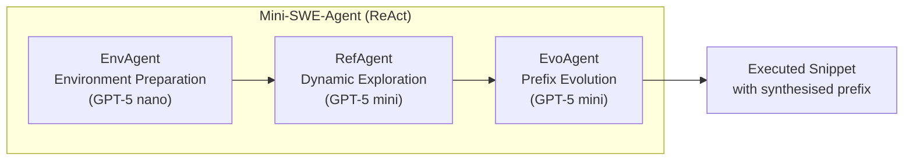
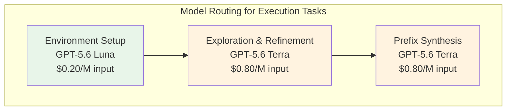

# AgentExecutor and the Missing Context Problem: What Multi-Agent Partial Code Execution Means for Your Codex CLI Sandbox Strategy


---

Every developer who has pasted a Stack Overflow snippet into a REPL knows the ritual: hunt for the missing import, fabricate a placeholder object, satisfy the type checker, pray. The snippet was never meant to run in isolation — but you need it to. A new paper accepted at ASE 2026, *AgentExecutor: Partial Code Execution via Agentic Context Generation*, formalises this problem and solves it with a three-agent pipeline that reconstructs the missing execution context automatically [^1]. The results — 94% statement coverage on Stack Overflow snippets, 80% time reduction over the previous state of the art — have direct implications for anyone running code through Codex CLI's sandbox.

## The Partial Code Execution Problem

Code snippets extracted from documentation, issue trackers, pull request descriptions, and Q&A sites are inherently incomplete. They reference variables that were defined three scroll-lengths above the answer; they import libraries that the author assumed you already had; they call functions that exist only in the author's repository. Chen et al. define *partial code execution* as the task of executing an arbitrary code fragment by synthesising the minimal prefix — imports, variable definitions, resource files — required to make it run [^1].

Previous approaches, notably Treefix, used a fixed ten-invocation pipeline with a constrained action space limited to generating import statements and variable definitions [^2]. AgentExecutor breaks this open.

## The Three-Agent Architecture

AgentExecutor decomposes the problem into three sequential agents, each with a distinct responsibility:



### Phase 1 — EnvAgent: Environment Preparation

The EnvAgent initialises an isolated virtual environment using `uv`, pre-installs common libraries, and attempts a preliminary execution to identify missing dependencies [^1]. This is the *infrastructure* phase — not code generation, but environment generation. The agent can execute arbitrary bash commands: creating resource files, resolving environment configuration, installing packages.

### Phase 2 — RefAgent: Dynamic Exploration with Iterative Refinement

The RefAgent iteratively generates and tests code prefixes. It receives *agent-friendly feedback* that highlights undefined variables and execution errors, then refines its approach. A critical innovation is **coverage-aware dynamic pruning**: when exploration stalls, unhelpful historical context is removed from the agent's working memory, maintaining focus and reducing token consumption [^1].

This addresses the same problem Codex CLI's `model_auto_compact_limit` solves — an agent drowning in its own failed attempts.

### Phase 3 — EvoAgent: Prefix Evolution via Program Synthesis

The EvoAgent synthesises *generator programs* that systematically iterate through variable combinations from high-value seed prefixes selected via coverage maximisation algorithms [^1]. Rather than relying solely on LLM generation for each variant, it produces code that produces prefixes — a meta-programming approach that dramatically reduces LLM invocations.

## The Numbers

The results on two standard datasets tell a compelling story:

| Metric | Stack Overflow (462 snippets) | Open-Source (1,000 functions) |
|--------|-------------------------------|-------------------------------|
| Statement Coverage | 94% (+19.9% vs Treefix) | 90% (+13.8% vs Treefix) |
| Class Coverage | 95% (+20.2%) | 93% (+8.2%) |
| Full Execution Rate | 91% (+36.1%) | 80% (+18.1%) |
| Execution Time | — | 221.6s vs 1,124.0s (−80.3%) |
| Cost Reduction | — | −56.6% |
| LLM Invocations | — | −52.1% |

The open-source dataset drew functions from black, tensorflow, scrapy, flask, and pandas — real production code, not toy examples [^1]. The 80.3% time reduction comes primarily from the pruning mechanism and the evolutionary synthesis phase, which replaces expensive LLM calls with deterministic program execution [^1].

## What This Means for Codex CLI

### The Sandbox Is Already an Execution Environment

Codex CLI's sandbox architecture — Seatbelt on macOS, Landlock + seccomp on Linux — provides exactly the kind of isolated execution environment that AgentExecutor's EnvAgent assumes [^3]. When you run `codex exec`, the agent already operates within a constrained filesystem and network boundary. The question is: how well does it handle code that arrives without its context?

### codex exec and the Missing Prefix

Consider a common Codex CLI workflow: you paste a code snippet from a GitHub issue into a prompt and ask the agent to run it. Today, Codex CLI will attempt execution, encounter undefined variables or missing imports, and iterate — but it does so within a single agent loop without the structured decomposition AgentExecutor proposes.

The three-phase separation suggests a more principled approach:

```toml
# codex.toml — execution profile for snippet testing
[profile.snippet-test]
model = "gpt-5.6-luna"
approval_mode = "unless-allow-listed"
sandbox = "workspace-write"

# Pre-execution environment setup
[profile.snippet-test.environment]
package_manager = "uv"
pre_install = ["pytest", "requests", "pandas", "numpy"]
```

### Coverage-Aware Pruning Maps to Compaction Strategy

AgentExecutor's dynamic pruning — removing unhelpful historical attempts from the agent's context — mirrors Codex CLI's context compaction challenge. The paper found that pruning maintained or improved coverage in 98.5% of cases [^1]. For Codex CLI users, this validates an aggressive compaction threshold when running iterative code execution tasks:

```toml
# Aggressive compaction for iterative execution loops
[profile.snippet-test]
model_auto_compact_limit = 0.5
tool_output_token_limit = 8192
```

### PostToolUse Hooks for Execution Feedback

AgentExecutor's agent-friendly feedback — structured error reports highlighting undefined variables rather than raw tracebacks — can be implemented via Codex CLI's PostToolUse hooks. A hook that parses execution failures and surfaces the specific missing context would bring the RefAgent's advantage to standard Codex sessions:

```markdown
<!-- AGENTS.md -->
## Execution Failure Handling

When a code snippet fails to execute:
1. Parse the traceback for NameError, ImportError, and ModuleNotFoundError
2. List all undefined names and missing modules explicitly
3. Attempt to resolve imports before generating variable definitions
4. Track which resolution attempts have already failed — do not retry them
```

### The Model Routing Insight

AgentExecutor uses GPT-5 nano for environment preparation and GPT-5 mini for the reasoning-heavy exploration and evolution phases [^1]. This maps directly to Codex CLI's Sol/Terra/Luna tiered architecture:



Environment preparation is a cheap, mechanical task — perfect for Luna. The exploration and synthesis phases demand reasoning and should route to Terra [^4]. The 56.6% cost reduction AgentExecutor achieved over Treefix came partly from this kind of task-appropriate model selection [^1].

## The Broader Pattern: Execution as Exploration

The most important insight from AgentExecutor is not the specific architecture — it is the framing. Partial code execution is not a compilation problem; it is an *exploration* problem. The agent must explore the space of possible contexts that make the code run.

This connects to the broader exploration research. SWE-Explore demonstrated that coding agents achieve 65%+ file-level hit rates but only 14-19% line-level recall when navigating repositories [^5]. AgentExecutor faces the same challenge in a different domain: the agent needs to find the specific variables, types, and configurations that constitute the missing context, not just the right files.

For Codex CLI users working with unfamiliar codebases, the lesson is clear: execution failures are exploration signals. When `codex exec` fails on a snippet, the structured response should not be "fix the error" but "what context is this code assuming exists?"

## Practical Recommendations

1. **Separate environment preparation from code generation** — Use a dedicated prompt or AGENTS.md section for dependency resolution before attempting execution
2. **Track failed resolution attempts** — AgentExecutor's pruning works because it remembers what did not work; configure your AGENTS.md to enforce the same discipline
3. **Route environment tasks to Luna** — Package installation and virtual environment setup do not need frontier reasoning; the August 2026 Luna price cut to \$0.20/M input makes this nearly free [^4]
4. **Use `codex exec` with `--sandbox workspace-write`** — The deprecated `--full-auto` flag is gone as of v0.147.0; `workspace-write` provides the isolation AgentExecutor assumes without the security exposure [^6]
5. **Set aggressive compaction for execution loops** — If the agent is iterating on a failing snippet, old failed attempts actively harm context quality; compact early

## Citations

[^1]: Chen, J., Yang, C., Hu, X., Li, Z., Xia, X. & Lo, D. (2026). "AgentExecutor: Partial Code Execution via Agentic Context Generation." Accepted at ASE 2026. arXiv:2608.05959. [https://arxiv.org/abs/2608.05959](https://arxiv.org/abs/2608.05959)

[^2]: Chen, J., Hu, X., Li, Z. & Lo, D. (2024). "Treefix: Enabling Execution of Arbitrary Code Snippets." Prior work establishing the partial code execution baseline referenced by AgentExecutor. ⚠️ Exact citation details inferred from AgentExecutor paper references.

[^3]: OpenAI. (2026). Codex CLI Sandbox Architecture — Seatbelt (macOS) and Landlock + seccomp (Linux) isolation. [https://github.com/openai/codex](https://github.com/openai/codex)

[^4]: OpenAI. (2026). GPT-5.6 Luna pricing: \$0.20/M input, \$1.20/M output (post 30 July 2026 price reduction). [https://x.com/OpenAI/status/2082878180478910571](https://x.com/OpenAI/status/2082878180478910571)

[^5]: Zhang, S. et al. (2026). "SWE-Explore: Benchmarking How Coding Agents Explore Repositories." 848 instances, 10 languages, 203 repositories. arXiv:2606.07297. [https://arxiv.org/abs/2606.07297](https://arxiv.org/abs/2606.07297)

[^6]: OpenAI. (2026). Codex CLI v0.147.0 Release Notes — removal of deprecated `--full-auto` flag, migration to `--sandbox workspace-write`. [https://github.com/openai/codex/releases](https://github.com/openai/codex/releases)
