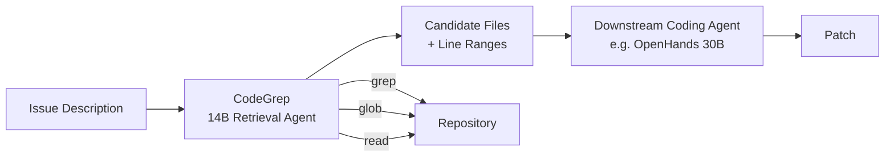
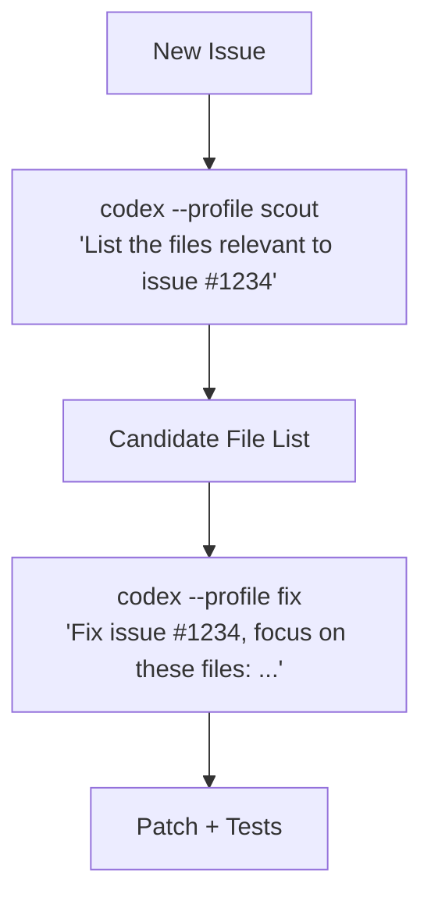

# CodeGrep and the File Discovery Tax: What an RL-Trained Retrieval Agent Reveals About Your Codex CLI Token Budget


---

Most coding agent discussions focus on reasoning quality — can the model understand the bug, plan the fix, write the patch? But a growing body of evidence suggests the real bottleneck is elsewhere: *finding the files in the first place*. CodeGrep, published on 6 August 2026 by Chen et al., puts hard numbers on the problem and surfaces a non-obvious precision threshold that determines whether retrieval helps or hurts your downstream agent [^1].

This article examines what CodeGrep's findings mean for Codex CLI developers and how to configure your file discovery stack to stay on the right side of that threshold.

## The File Discovery Tax

On SWE-bench Verified, a 30B OpenHands agent averages 23 rounds and 631,000 tokens per resolved issue [^1]. The majority of those tokens are consumed not by reasoning or patching but by exploratory `grep`, `glob`, and `view_file` calls — the agent hunting for target files across the repository. This is the file discovery tax: the token cost of orientation before productive work begins.

The CodeGrep paper demonstrates this with a concrete case study. On Django issue #15278, the baseline agent spent 74 actions and 3.2 million tokens searching for "oauth2" — a third-party term that appears in the issue description but is absent from the Django codebase itself. It inspected 13 files in wrong directories before timing out without a resolution [^1].

With CodeGrep injected as a retrieval front-end, the same issue resolved in 15 actions and 307,000 tokens. The retriever compressed the exploratory prefix, not the fix itself — the agent still grepped for exact definitions but skipped the unproductive repository-wide search [^1].

## How CodeGrep Works

CodeGrep is a 14-billion-parameter retrieval agent built on Qwen3-14B-Instruct and trained with Group Relative Policy Optimization (GRPO) [^1]. It operates with three read-only tools — grep, glob, and read — mirroring a developer's file discovery workflow. Each turn allows up to eight parallel tool calls across a maximum of four turns (three exploration rounds plus one answer round).



### Training Pipeline

The training data comes from a pipeline called CATM (Contextual Agent Trajectory Mining), which mines relevance labels from 67,074 open-source OpenHands trajectories without human annotation [^1]:

1. **Mining**: extract file-read operations, normalise paths, record post-reasoning text
2. **Judge filtering**: a separate model classifies reasoning as RELEVANT or NOT_RELEVANT with conservative bias
3. **Intensity weighting**: exponential-saturation scoring based on reasoning length, normalised to mean ≈ 1 across issues

This produces 31,977 effective training samples — a 47.7% retention rate. The RL environment uses a Git worktree architecture rather than Docker, reducing per-rollout setup from minutes to milliseconds on a single 8×B200 node [^1].

### Reward Design: The Advantage-Layer Insight

The paper iterates through three reward designs, and the evolution is instructive for anyone designing agent training loops:

| Version | Reward Structure | KL Drift | Inference Turns | Downstream Token Savings |
|---------|-----------------|----------|-----------------|--------------------------|
| v1 | Reward-layer efficiency scaling | 0.31 | 3.8 | −0.6% |
| v2 | Advantage-layer scaling | 0.09 | 2.9 | −7.4% |
| v3 | Advantage-layer, file-only objective | 0.09 | 2.3 | −19% |

The key finding: multiplicative efficiency scaling in the reward layer distorts group-relative advantage estimates and triples policy drift. Moving the same signal to the advantage layer produces 3.4× lower KL divergence while delivering the actual downstream efficiency gains [^1].

## The Precision Threshold

CodeGrep's most practically useful finding is the **precision threshold** governing when retrieval helps a downstream coding agent:

| Retriever | Precision | Resolve Rate | Token Change |
|-----------|-----------|--------------|--------------|
| BM25 | 0.375 | 25.2% (−0.6pp) | +21% |
| Jina-1.5B | 0.445 | 25.8% (±0pp) | −7% |
| CodeGrep v3 | 0.677 | 27.0% (+1.2pp) | −19% |

Below the threshold (BM25 at 0.375 precision), retrieval actively hurts — false positives pollute the agent's context window, increasing token consumption by 21% whilst reducing resolve rate [^1]. At the threshold (Jina at 0.445), retrieval is neutral. Above it (CodeGrep at 0.677), retrieval compresses exploration rounds by 15% and tokens by 19% on resolved instances.

This is the critical insight: **marginal precision gains above the threshold compress rollouts rather than expanding the resolvable set**. File localisation is not the binding constraint on most unsolvable issues — reasoning quality and patch correctness are [^1].

## What This Means for Codex CLI

Codex CLI does not embed CodeGrep, but its architecture includes several features that address the same file discovery bottleneck. The question is whether your configuration keeps you above or below the precision threshold.

### MCP-Based Codebase Indexing

Codex CLI's MCP integration supports structural codebase indexing tools like CodeGraph [^2], which exposes nine query tools — `codegraph_search`, `codegraph_context`, `codegraph_callers`, `codegraph_callees`, and others — over the Model Context Protocol [^3]. These provide pre-built AST-indexed answers rather than ad-hoc grep traversal.

The "Code Isn't Memory" study (Bhola et al., June 2026) demonstrated that tree-sitter AST + vector + graph + BM25 indexing yielded +39.6 percentage points localisation accuracy and +7.9pp resolve rate on SWE-PolyBench/SWE-bench Pro, at \$2.30 per solved task versus \$2.92 for unindexed approaches [^4]. Multi-file tasks showed the largest gain: 91.3% versus 44.9% acc@5.

Configure MCP codebase indexing in `config.toml`:

```toml
[mcp_servers.codegraph]
command = "npx"
args = ["-y", "@anthropic-ai/codegraph-mcp"]
enabled = true
```

### Tool Search and Deferred Loading

Since v0.142.2, Codex CLI defaults to MCP tool search with deferred loading [^5]. This means the agent discovers tools on demand rather than loading all tool schemas into context upfront. The SING framework (Xiao et al., June 2026) showed this approach yields +59.8% Global Recall@5 and +28.9% success rate whilst reducing schema exposure by 99.8% [^5].

The parallel applies directly to file discovery: lazy, targeted retrieval outperforms eager, exhaustive scanning — precisely the CodeGrep finding.

### Token Budget Controls

CodeGrep's 19% token saving on resolved instances maps to concrete Codex CLI configuration:

```toml
[features.rollout_budget]
enabled = true
limit_tokens = 500000
reminder_interval_tokens = 50000
```

Rollout token budgets (available since v0.147.0) track usage across agent threads, issue remaining-budget reminders, and abort turns when exhausted [^6]. If your agent is burning tokens on file discovery, the budget reminders surface this before the context window fills.

For controlling tool output specifically:

```toml
tool_output_token_limit = 16384
```

This caps the tokens returned per tool call, preventing a single `grep` over a large repository from flooding context with irrelevant matches — the exact failure mode that pushes BM25 below the precision threshold [^6].

### AGENTS.md Exploration Directives

CodeGrep demonstrates that compressing the exploratory prefix is the high-leverage intervention. You can achieve a similar effect through AGENTS.md directives that constrain exploration:

```markdown
## File Discovery

- Before grepping the full repository, check ARCHITECTURE.md or the project's
  module structure to identify the likely target directory.
- Never grep for terms that appear only in the issue description and not in the
  codebase (e.g., third-party library names, user-facing error messages).
- Limit exploratory grep to 3 rounds before narrowing the search directory.
- When multiple files match, prefer files in the same module as the test file
  referenced in the issue.
```

The JAWs efficiency study (ICSE 2026) showed that well-structured AGENTS.md files reduce median runtime by 28.64% and output tokens by 16.58% [^7] — gains that align with CodeGrep's compression of the exploratory prefix.

### Named Profiles for Scout/Fix Workflows

The Scrouting paper (Bhola et al., August 2026) takes a similar two-phase approach to CodeGrep: a small model scouts the repository, then a larger model fixes the issue. Their SuperScout-7B searcher reduced cost per solve by 82% (\$0.230 versus \$1.274) on SWE-bench Pro Python [^8].

Codex CLI's named profiles support this pattern natively:

```toml
[profile.scout]
model = "gpt-5.6-luna"
approval_policy = "unless-allow-listed"
# Low-cost model for file discovery and orientation

[profile.fix]
model = "gpt-5.6-terra"
approval_policy = "on-failure"
# Higher-capability model for patch generation
```



The scout phase uses Luna tier (cheapest) for file discovery, then the fix phase uses Terra tier for reasoning and patching. This mirrors CodeGrep's architecture — a specialised retrieval front-end feeding a general-purpose coding agent — without requiring a separate 14B model.

## The Precision Threshold in Practice

CodeGrep's precision threshold has immediate implications for how you configure retrieval in Codex CLI:

| Configuration | Likely Precision | Risk |
|---------------|-----------------|------|
| Raw `grep` across entire repo | Low (~0.3–0.4) | Context pollution, token waste |
| BM25 retriever via MCP | Medium (~0.4–0.5) | Neutral to slightly harmful |
| AST-indexed retriever (CodeGraph) | High (~0.6–0.7) | Above threshold, net beneficial |
| Scout profile + AGENTS.md constraints | High (~0.6+) | Compressed exploration prefix |

The takeaway: **if your retrieval precision sits below ~0.45, you are better off without retrieval at all**. False positives consume context budget that the agent would otherwise use for reasoning. Above ~0.5, each precision point buys you token savings rather than resolve-rate gains ⚠️ (the precise threshold likely varies by downstream model and task distribution).

## Limitations

CodeGrep evaluates against a single downstream agent (OpenHands 30B) on SWE-bench Verified. The precision threshold may shift for agents with different tool interfaces or exploration strategies [^1]. The resolve-rate gain is modest (+1.2 percentage points) — the primary benefit is efficiency, not capability expansion. For Codex CLI users, the practical question is whether your existing MCP indexing tools already exceed the threshold, making a dedicated retrieval agent unnecessary.

## Citations

[^1]: Chen, W., Yang, Y., Cao, Y. & Lin, Y. (2026). "CodeGrep: An RL-Trained Retrieval Agent for LLM Coding Agents." *arXiv:2608.05886*. [https://arxiv.org/abs/2608.05886](https://arxiv.org/abs/2608.05886)

[^2]: CodeGraphContext. (2026). "An MCP server plus a CLI tool that indexes local code into a graph database to provide context to AI assistants." *GitHub*. [https://github.com/CodeGraphContext/CodeGraphContext](https://github.com/CodeGraphContext/CodeGraphContext)

[^3]: McHenry, C. (2026). "CodeGraph: Introduction." *GitHub Pages*. [https://colbymchenry.github.io/codegraph/getting-started/introduction/](https://colbymchenry.github.io/codegraph/getting-started/introduction/)

[^4]: Bhola, A., Krishnan, A. & NS, S. (2026). "Code Isn't Memory: A Structural Codebase Index Inside a Coding Agent." *arXiv:2606.22417*. [https://arxiv.org/abs/2606.22417](https://arxiv.org/abs/2606.22417)

[^5]: Xiao, S. et al. (2026). "SING: Intention-Aware Active Tool Discovery for LLM Agents." *arXiv:2606.16591*. [https://arxiv.org/abs/2606.16591](https://arxiv.org/abs/2606.16591)

[^6]: OpenAI. (2026). "Codex CLI v0.147.0 Release Notes." *GitHub*. [https://github.com/openai/codex/releases/tag/rust-v0.147.0](https://github.com/openai/codex/releases/tag/rust-v0.147.0)

[^7]: Lulla, J. et al. (2026). "JAWs: Just Another Workflow — How AGENTS.md Files Improve Agentic Efficiency." *ICSE 2026*. *arXiv:2601.20404*. [https://arxiv.org/abs/2601.20404](https://arxiv.org/abs/2601.20404)

[^8]: Bhola, A., Krishnan, A. & NS, S. (2026). "Scrouting: Cost-Aware Routing of Coding Agents by Scouting the Repository First." *arXiv:2608.04804*. [https://arxiv.org/abs/2608.04804](https://arxiv.org/abs/2608.04804)
