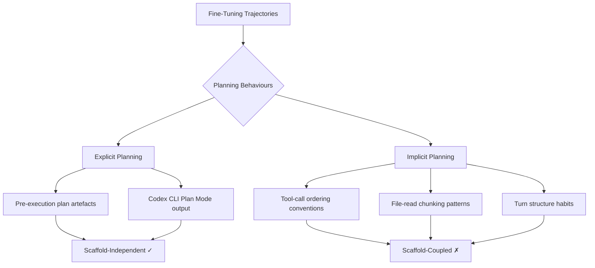
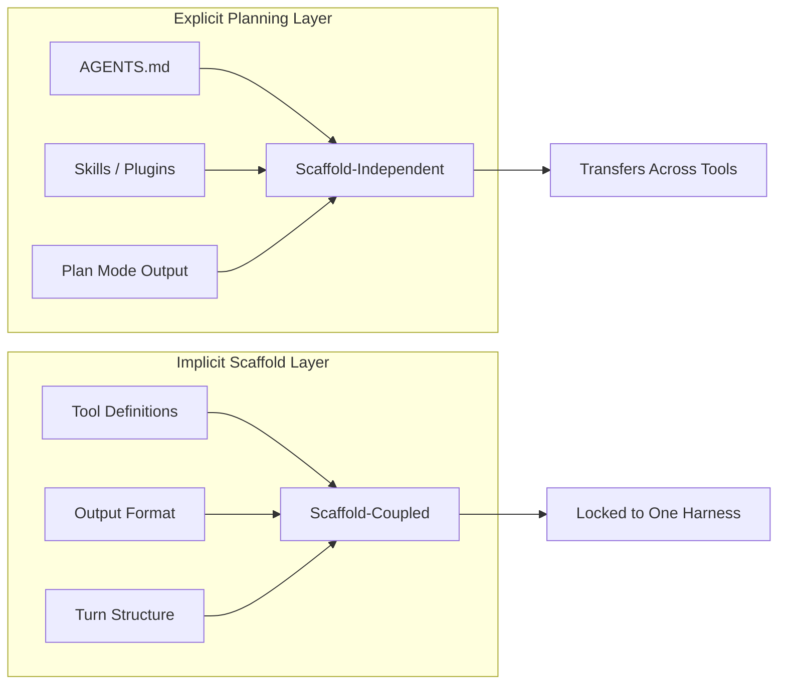

# DCAS and the Scaffold Lock-In Problem: Why Your Fine-Tuned Coding Agent Forgets How to Plan When You Change Tools — and What Codex CLI's Architecture Does About It


---

You fine-tune a model on thousands of OpenHands trajectories. It scores brilliantly — under OpenHands. Deploy the same model under SWE-Agent, Codex CLI, or Claude Code and watch the numbers crater. The model hasn't lost its coding ability. It has lost its *planning* ability, because planning was never in the model — it was in the scaffold.

That is the central finding of DCAS (Decoupling CLI Agent Scaffolding), a new framework from Thangarajah, Chen, and Hassan at Queen's University[^1], and it has immediate consequences for how you choose, configure, and upgrade your Codex CLI environment.

## The Problem: Scaffold-Specific Planning Is Baked into Fine-Tuning Data

When a coding agent resolves an issue on SWE-bench, the trajectory it produces is inseparable from the scaffold that orchestrated it. The system prompt, tool definitions, output format constraints, and iterative reasoning loops all constitute what the DCAS authors call the **agent harness** — the middleware layer sitting between the language model and the execution environment[^1].

Fine-tune on trajectories collected under one scaffold and the model learns two things simultaneously:

1. **How to solve the engineering problem** — the generalisable skill.
2. **How to plan within that scaffold's conventions** — the non-generalisable coupling.

The DCAS study demonstrates that untrained base models show no significant performance divergence across scaffolds[^1]. The gap is fine-tuning-induced. The model hasn't learned to plan; it has learned to plan *in OpenHands syntax*.

## Two Kinds of Planning You Didn't Know You Were Training

DCAS introduces a distinction that reframes how we think about agent planning:

**Explicit planning** — a pre-execution plan produced as a first-class artefact. Think of a numbered step list emitted before any tool calls. In Codex CLI, this maps directly to Plan Mode output: the agent reads files, searches the codebase, and proposes a structured plan before touching anything[^2].

**Implicit planning** — the structural conventions embedded throughout the agent loop. The order in which the agent reads files, the pattern of tool calls it favours, the way it chunks work across turns. These are invisible to the user but deeply scaffold-specific.



The DCAS finding that these two dimensions are "empirically separable in training data"[^1] is the critical insight. You can train for explicit planning without inheriting implicit scaffold coupling — if you collect the right trajectories.

## The DCAS Architecture: An Interception Layer for Scaffold-Agnostic Training

DCAS is implemented as a backend substitution interception layer that routes API traffic between any CLI scaffold and any backend model without modifying the scaffold itself[^1]. This enables three capabilities that were previously impossible:

1. **Cross-scaffold evaluation** — run the same fine-tuned model under OpenHands, SWE-Agent, and Codex CLI without adapting prompts or tool definitions.
2. **Planning-aware trajectory collection** — tag which parts of a trajectory constitute explicit planning versus implicit scaffold conventions.
3. **Scaffold-neutral fine-tuning data** — train models on trajectories where planning is separated from scaffold-specific boilerplate.

The key experimental result: models fine-tuned on small DCAS-collected planning-aware trajectory sets showed "consistently improved performance across non-training scaffolds"[^1]. Planning quality emerged as a "high-leverage component, with gains exceeding the cross-scaffold drops" observed in models trained on scaffold-coupled data.

## Parallel Evidence: Scaffold-Mediated Post-Training

DCAS is not alone in identifying this coupling problem. Ding et al.'s Scaffold-Mediated Post-Training work from Alibaba and Tsinghua proposes a complementary approach: organising procedural scaffolds into an evolvable graph structure that co-evolves with model parameters through discovery, distillation, and dynamic recompilation[^3].

Their results on FeatureBench are instructive:

| Metric | Value |
|--------|-------|
| Skill-augmented improvement | +8.1 pp passed rate |
| Post-distillation (no scaffold) | 27.7% passed rate |
| Distillation retention rate | 85.2% |

The 85.2% distillation retention rate means that after training the model to internalise scaffold-discovered skills, it retains most of the benefit even when the scaffold is removed entirely[^3]. The scaffold becomes a training-time discovery mechanism rather than a runtime dependency.

## What This Means for Codex CLI Users

### Plan Mode as Explicit Planning Infrastructure

Codex CLI's Plan Mode is, architecturally, an explicit planning mechanism. When you press `Shift+Tab` to cycle to Plan mode or type `/plan`, you're instructing the agent to produce a pre-execution plan as a first-class artefact — exactly the kind of planning that DCAS shows transfers across scaffolds[^2].

The `plan_mode_reasoning_effort` configuration key in `~/.codex/config.toml` controls reasoning depth independently of the global default[^2]:

```toml
[plan_mode]
reasoning_effort = "high"    # none | minimal | low | medium | high | xhigh
```

Setting this higher than your execution-mode reasoning effort is now empirically justified: explicit planning is the high-leverage component. Invest tokens where they transfer.

### AGENTS.md as Scaffold-Independent Instruction

Your `AGENTS.md` file constitutes explicit, declarative planning guidance — it tells the model *what* to do and *how* to approach problems, independent of which scaffold executes the instructions. Research on AGENTS.md files confirms they measurably improve agent efficiency[^4], and the DCAS framework explains *why*: they inject explicit planning that doesn't couple to scaffold-specific conventions.

```markdown
<!-- AGENTS.md — scaffold-independent planning directives -->

## Planning Protocol
- Before modifying any file, produce a numbered plan covering:
  1. Files to read and why
  2. Changes required and their dependencies
  3. Verification steps (tests, lint, type-check)
- Do NOT proceed to implementation until the plan is complete.

## Architecture Constraints
- All new modules must follow the hexagonal port/adapter pattern.
- Database access only through repository interfaces.
```

These directives work identically whether the underlying model was fine-tuned on OpenHands trajectories, SWE-Agent data, or Codex CLI's own format — because they operate at the explicit planning layer.

### Named Profiles for Scaffold-Aware Model Routing

Codex CLI v0.147.0 supports model selection across the GPT-5.6 family — Sol, Terra, and Luna tiers[^5]. The DCAS insight suggests a model-routing strategy based on scaffold coupling:

```toml
# Profile for exploration and planning — use the strongest planner
[profiles.architect]
model = "gpt-5.6-sol"
plan_mode_reasoning_effort = "xhigh"

# Profile for execution — scaffold-specific conventions matter less
[profiles.executor]
model = "gpt-5.6-terra"
reasoning_effort = "medium"
```

Sol-tier models, with their larger parameter counts and broader training distributions, are less likely to exhibit scaffold-specific coupling in planning. Terra-tier models are more cost-effective for execution where the scaffold's tool definitions and output formats provide sufficient structure.

### Skills and Plugins as Portable Planning Artefacts

Codex CLI v0.147.0's Agent Plugins system[^5] — with its four catalogue scopes (local, personal, workspace, remote) — is functionally a mechanism for distributing explicit planning artefacts across scaffold boundaries. A skill file that encodes testing conventions, architectural patterns, or deployment workflows operates at the explicit planning layer and transfers with the user across tools.



## Practical Implications

**When upgrading Codex CLI versions**: harness changes between versions (e.g., the removal of `codex exec --full-auto` in favour of `--sandbox workspace-write`[^5]) alter the implicit planning layer. If you've been relying on implicit conventions — specific tool-call patterns, file-read orderings — expect temporary regressions. Your AGENTS.md and skills will transfer cleanly.

**When switching between coding agents**: moving between Codex CLI, Claude Code, and Cursor means changing scaffolds. Your explicit planning artefacts (AGENTS.md, skills, documented workflows) survive. Your muscle memory of how the agent structures its turns does not.

**When evaluating fine-tuned models**: if a model scores well on SWE-bench under one scaffold, demand cross-scaffold numbers before trusting the result. The DCAS work shows that scaffold-specific training inflates benchmark scores in ways that don't predict real-world deployment performance[^1].

## The Architectural Lesson

The scaffold lock-in problem is not a bug in fine-tuning — it's a consequence of conflating two distinct capabilities in training data. DCAS demonstrates that separating explicit planning from implicit scaffold conventions produces models that plan better *everywhere*, not just in their training environment.

For Codex CLI practitioners, the implication is clear: invest in the explicit planning layer. Write thorough AGENTS.md files. Use Plan Mode before executing. Build skills that encode *what* to do rather than *how the tool should call its APIs*. These are the artefacts that survive scaffold transitions, version upgrades, and the inevitable next paradigm shift in agent tooling.

The scaffold is temporary. The plan is portable.

## Citations

[^1]: Thangarajah, K., Chen, B., & Hassan, A. E. (2026). "DCAS: Decoupling CLI Agent Scaffolding to Internalize Planning across Scaffolds." arXiv:2608.06113. [https://arxiv.org/abs/2608.06113](https://arxiv.org/abs/2608.06113)

[^2]: OpenAI. (2026). "Plan / Spec Mode." GitHub Discussion #7355, openai/codex. [https://github.com/openai/codex/discussions/7355](https://github.com/openai/codex/discussions/7355)

[^3]: Ding, F., Zhang, Y., Liu, R., Liao, Y., Zeng, Z., & Yang, H. (2026). "Scaffold-Mediated Post-Training: Co-Evolving Model Parameters and Procedural Scaffold Graphs." arXiv:2608.05156. [https://arxiv.org/abs/2608.05156](https://arxiv.org/abs/2608.05156)

[^4]: Impact of AGENTS.md Files on the Efficiency of AI Coding Agents. (2026). arXiv:2601.20404. [https://arxiv.org/abs/2601.20404](https://arxiv.org/abs/2601.20404)

[^5]: OpenAI. (2026). "Codex CLI v0.147.0 Release Notes." GitHub Releases, openai/codex. [https://github.com/openai/codex/releases/tag/rust-v0.147.0](https://github.com/openai/codex/releases/tag/rust-v0.147.0)

[^6]: Ben Sghaier, O., Li, H., Adams, B., & Hassan, A. E. (2026). "Don't Blame the Large Language Model: How Agent Harness Evolution Shapes Coding Agent Quality." arXiv:2607.03691. [https://arxiv.org/abs/2607.03691](https://arxiv.org/abs/2607.03691)
