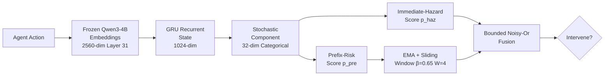
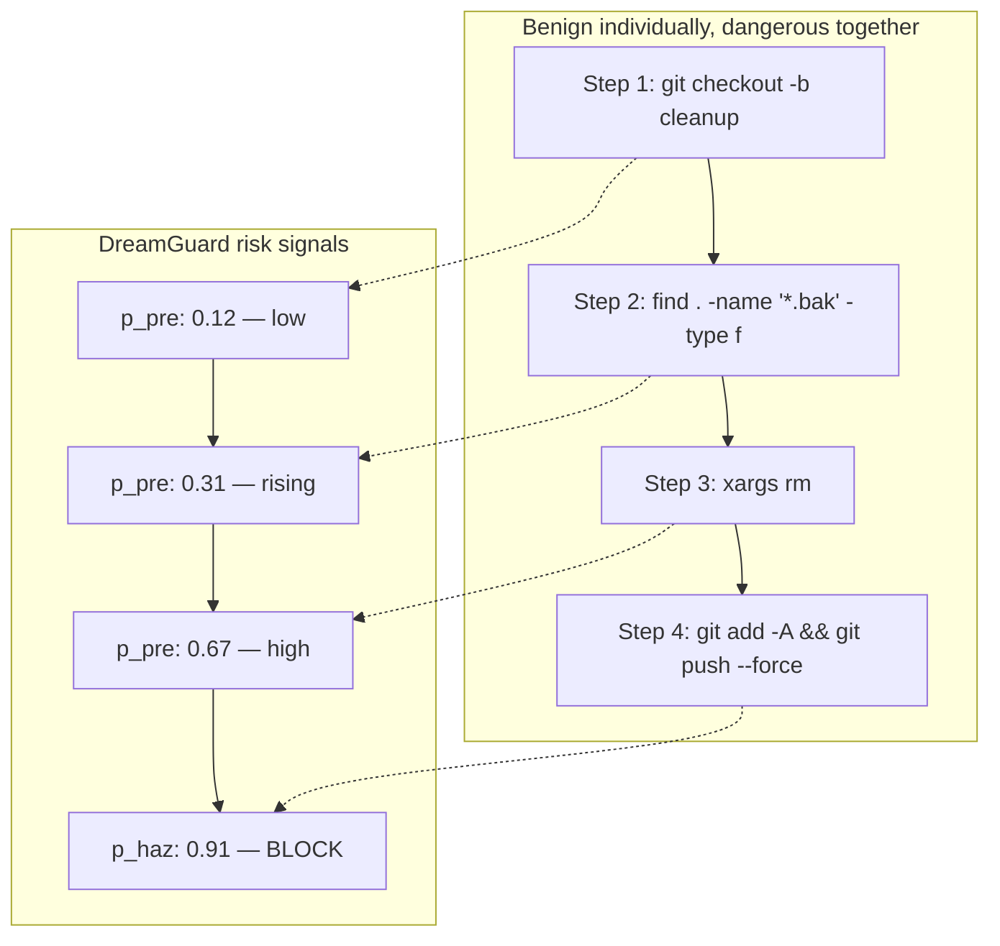

# DreamGuard and the Trajectory Blind Spot: Why Your Per-Action Guardrails Miss Long-Horizon Risks — and What a Risk-Aware World Model Means for Codex CLI Safety


---

Your Codex CLI `PreToolUse` hook blocks `rm -rf /`. Good. But what about the three-step sequence where the agent first changes directory to `/`, then sets a variable to `*`, then passes that variable to `rm`? Each action looks benign in isolation. Together they are catastrophic. This is the trajectory blind spot, and a new paper from Lin et al. quantifies exactly how badly current guardrails miss it — and proposes a fix that runs in 25 milliseconds [^1].

## The Problem: Reactive Guardrails See One Step at a Time

Codex CLI's hook system — `PreToolUse` and `PostToolUse` — evaluates each tool call independently [^2]. A `PreToolUse` hook receives a JSON payload describing the command about to execute, matches it against patterns, and returns `approve` or `deny`. This works well for obviously dangerous operations:

```json
{
  "hooks": {
    "PreToolUse": [
      {
        "matcher": "bash",
        "command": "python3 guard.py",
        "timeout_ms": 5000
      }
    ]
  }
}
```

The limitation is architectural: the hook sees the current action, not the trajectory. It has no memory of what preceded this step and no model of where the sequence is heading.

Research bears this out. The DreamGuard paper tested four categories of guardrail — generic (Llama-Guard-4-12B), reactive (PolicyGuard, GuardAgent, AgentDoG-1.5), proactive (SafePred, TRACES), and their own trajectory-aware approach — across four agent safety benchmarks [^1]. On SafetyDrift, a benchmark specifically designed around cumulative risk trajectories, reactive guardrails showed sharp performance degradation compared to DreamGuard's 96.4% F1 score [^1].

## DreamGuard's Architecture: A World Model for Risk

DreamGuard replaces per-action classification with a **Recurrent State-Space Model (RSSM)** that maintains a latent representation of the agent's trajectory [^1]. The architecture has three core components:



The model derives two distinct risk signals from the latent state:

1. **Immediate-hazard score** (`p_haz`): detects actions that directly trigger unsafe outcomes at the current step.
2. **Prefix-risk score** (`p_pre`): identifies long-horizon risk accumulation using an exponential decay function with temperature ρ=1.5 and lookahead horizon K=3 steps [^1].

These signals are fused through a combination of exponential moving average (β=0.65), sliding window average (W=4 steps), and bounded Noisy-Or aggregation [^1]. The result is a calibrated intervention decision that balances immediate danger against cumulative drift.

## The Numbers That Matter

The benchmark results tell a clear story about where reactive guardrails fall short:

| Benchmark | DreamGuard F1 | Safety Rate | FPR | Latency |
|-----------|--------------|-------------|-----|---------|
| SafetyDrift | 96.4% | 96.3% | 3.7% | 27 ms |
| AgentDojo | 74.9% | 76.9% | 29.4% | 34 ms |
| ASB | 82.1% | 74.2% | 13.6% | 23 ms |
| ASSE-Security | 82.9% | 77.2% | 9.8% | 16 ms |

The latency column is the headline for practical deployment: 25 ms average end-to-end, which is 250.6× faster than GuardAgent and 3.3× faster than TRACES [^1]. That puts trajectory-aware guardrailing within the budget of a `PreToolUse` hook timeout.

The ablation study on ASSE-Security confirms that the recurrent world model is not optional decoration. Removing it drops F1 from 82.9% to 74.7% and inflates the false-positive rate to 73.7% [^1]. Removing the immediate-hazard predictor is even worse — F1 collapses to 52.1% and Pre-Hazard Intervention Recall (PHIR) falls to 13.0% [^1].

## Why This Matters for Codex CLI

Codex CLI already has the right hook points. The problem is what sits behind them.

### The Current Defence Stack

Today's Codex CLI safety architecture layers three mechanisms [^2] [^3]:

1. **Sandbox boundaries**: Seatbelt (macOS) and Landlock+seccomp (Linux) enforce OS-level containment.
2. **Permission profiles**: `:read-only`, `:workspace`, and `:danger-full-access` set coarse-grained capability levels.
3. **PreToolUse hooks**: Pattern-matching guardrails that block individual commands.

This stack is excellent at preventing known-dangerous single actions. It is structurally blind to multi-step risk accumulation.

### Where DreamGuard Maps to Codex CLI

A DreamGuard-style trajectory guardrail would slot into the existing `PreToolUse` architecture as a stateful hook process. Rather than spawning a fresh process per action, it would run as a long-lived sidecar that accumulates latent state across the session:

```toml
# config.toml — hypothetical trajectory-aware hook
[hooks.PreToolUse.trajectory_guard]
command = "dreamguard-sidecar --decay 1.5 --horizon 3"
timeout_ms = 100
persistent = true
```

The 25 ms latency means the guardrail would add negligible overhead to Codex CLI's tool-call cycle, well within even a conservative 100 ms timeout budget [^1].

### Practical Risk Scenarios

Consider the sequences that per-action hooks miss:



A reactive hook would approve each of steps 1–3 because none matches a dangerous pattern. By step 4, the force-push might be caught — but the destructive deletion has already happened. A trajectory-aware guardrail would flag the escalating prefix-risk and intervene before step 3 executes.

### The AGENTS.md Connection

DreamGuard's risk model also has implications for how you structure AGENTS.md directives. Rather than listing prohibited actions (which the agent can circumvent through equivalent multi-step sequences), directives should describe prohibited *outcomes*:

```markdown
## Safety Constraints
- Never delete files outside the working directory tree
- Never force-push to protected branches
- Never accumulate filesystem changes exceeding 50 files without explicit approval
```

Outcome-oriented constraints map naturally to trajectory-aware monitoring, because the guardrail evaluates whether the *sequence* is trending toward the prohibited state, not whether any single step matches a forbidden pattern [^4].

## The Broader Context: Converging Research

DreamGuard is not the only trajectory-aware safety system emerging in 2026. TRACES introduced trajectory risk-aware compression for long-horizon agent safety [^5], and SafeMCP proposed environment-grounded look-ahead reasoning for MCP-connected agents [^6]. The convergence is clear: the research community has identified per-action guardrails as insufficient, and the replacement architectures are fast enough for production use.

For Codex CLI users, the practical takeaway is threefold:

1. **Pattern-matching hooks are necessary but not sufficient.** Keep your `PreToolUse` patterns for known-dangerous commands, but recognise them as the first layer, not the complete defence.
2. **Stateful hook processes are the next evolution.** The persistent sidecar pattern — where a guardrail process accumulates trajectory state across the session — fits cleanly into Codex CLI's existing hook architecture.
3. **25 ms is fast enough.** The latency concern that previously made trajectory-aware monitoring impractical has been resolved. There is no performance excuse for single-step-only guardrails.

## What to Do Today

While DreamGuard is not yet packaged as a Codex CLI plugin, you can approximate trajectory-aware monitoring with current tools:

1. **Use a stateful PreToolUse hook** that logs the last N tool calls to a local file and applies heuristic escalation rules:

```bash
#!/usr/bin/env bash
# trajectory-guard.sh — simple stateful PreToolUse hook
HISTORY_FILE="/tmp/codex-trajectory-$$"
# Append current action
cat >> "$HISTORY_FILE"
# Count destructive-leaning operations in the last 10 actions
RISK_COUNT=$(tail -10 "$HISTORY_FILE" | grep -cE '"(rm|mv|chmod|git push)"')
if [ "$RISK_COUNT" -ge 3 ]; then
  echo '{"permission":"deny","reason":"Trajectory risk: multiple destructive operations in sequence"}'
  exit 0
fi
echo '{"permission":"approve"}'
```

2. **Set `model_auto_compact_limit`** conservatively so that the agent's own context includes recent history, giving the model itself a chance to notice escalating patterns.

3. **Write outcome-oriented AGENTS.md constraints** rather than action-lists, so the model reasons about trajectory consequences rather than pattern-matching individual commands.

The gap between per-action and trajectory-aware guardrails is empirically measured. DreamGuard quantifies it at up to 22 percentage points of F1 improvement on cumulative-risk benchmarks [^1]. For any Codex CLI deployment running in `:danger-full-access` or `--approve-for-me` mode, that gap is the difference between a guardrail that works and one that merely appears to.

## Citations

[^1]: Lin, W., Yu, C., Lin, X., Cao, S., Chen, X., Xue, L., Yu, L., Sha, L. & Wu, C. (2026). "DreamGuard: Efficient Runtime Guardrail for LLM Agents via Risk-Aware World Model." arXiv:2608.05695. [https://arxiv.org/abs/2608.05695](https://arxiv.org/abs/2608.05695)

[^2]: OpenAI. (2026). "Codex CLI Hooks Reference — hooks.json, PreToolUse & PostToolUse." OpenAI Developers. [https://developers.openai.com/codex/cli/hooks](https://developers.openai.com/codex/cli/hooks)

[^3]: OpenAI. (2026). "Codex CLI v0.147.0 Release Notes." GitHub. [https://github.com/openai/codex/releases/tag/rust-v0.147.0](https://github.com/openai/codex/releases/tag/rust-v0.147.0)

[^4]: Yang, R., Fu, M., Tantithamthavorn, K., Arora, C. & Chua, J. (2026). "Towards a Risk Assessment of Malicious Skill Files in Coding Agents." arXiv:2608.05223. [https://arxiv.org/abs/2608.05223](https://arxiv.org/abs/2608.05223)

[^5]: TRACE Authors. (2026). "TRACE: Trajectory Risk-Aware Compression for Long-Horizon Agent Safety." arXiv:2606.00611. [https://arxiv.org/abs/2606.00611](https://arxiv.org/abs/2606.00611)

[^6]: SafeMCP Authors. (2026). "SafeMCP: Proactive Power Regulation for LLM Agent Defense via Environment-Grounded Look-Ahead Reasoning." arXiv:2606.01991. [https://arxiv.org/abs/2606.01991](https://arxiv.org/abs/2606.01991)
