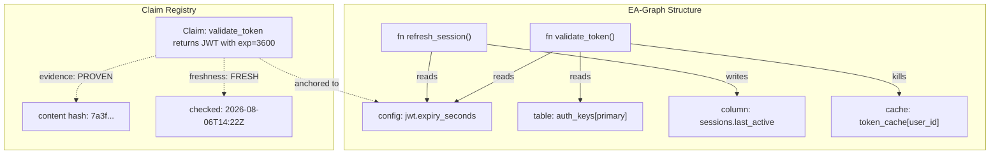
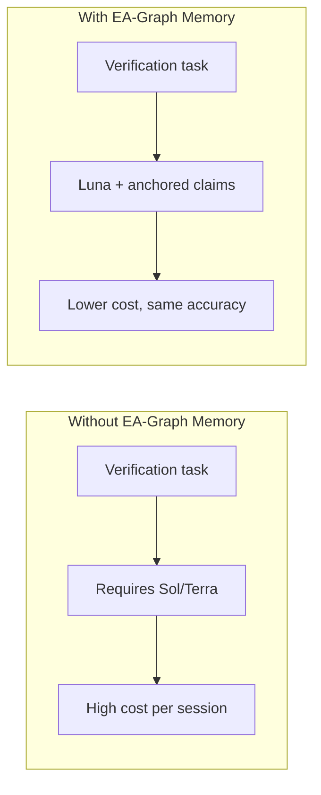

# EA-Graph and the Upstream Drift Problem: Why Your Coding Agent's Memories Go Stale — and How Artifact-Anchored Verification Fixes Cross-Session Trust


---

Your coding agent verified a behaviour last Tuesday. The dependency it verified against shipped a breaking change on Wednesday. On Thursday, your agent injects Tuesday's verification claim into its context and confidently declares the integration "already tested." The build breaks. You lose an hour.

This is the **upstream drift problem**, and a new paper from Hsu, Chi, and Everett — *EA-Graph: Artifact-Anchored Verification Memory for Coding Agents under Upstream Drift* [^1] — formalises what many of us have felt: prose-based session memories are structurally incapable of surviving dependency changes. Their solution is a tripartite graph that anchors every verification claim to the specific code content that established it, tracks freshness separately from evidence strength, and refuses to answer when the ground truth has shifted.

The implications for Codex CLI's memory system are immediate and practical.

## The Prose Memory Failure Mode

Every major coding agent — Codex CLI included — now ships some form of cross-session memory [^2]. The pattern is broadly the same: extract observations from a completed session, persist them, inject them into the system prompt next time. Codex CLI's native memories pipeline uses a two-phase extraction-and-consolidation flow backed by SQLite [^3].

The problem is that these memories are **prose strings**. A memory like "the `auth.validate()` function returns a JWT with `exp` set to 3600 seconds" captures a conclusion without anchoring it to the code version that made it true. When `auth.validate()` changes its return shape — upstream drift — the memory becomes silently wrong.

EA-Graph's evaluation quantifies the damage. In their testbed of 96 behaviours across 12 modules, **file-level invalidation analysis marks roughly 88 of 96 behaviours as suspect when only about 17 are actually affected** [^1]. The granularity mismatch means either you invalidate almost everything (expensive) or you trust stale claims (dangerous).

## How EA-Graph Works

The system models code verification as a tripartite graph **G = (V, A, OPS)** [^1]:

- **V** — Code nodes at function-level granularity
- **A** — Artifact nodes: configuration keys, database columns, lookup tables, asset GUIDs, re-exported constants
- **OPS** — Labelled effect relations: read, write, kill



### Canonical Identity: The Sub-Path Triple

Each artifact is identified by a **(store, path, subpath)** triple [^1]. This distinction matters: a lookup table entry is not the same artifact as its containing file. Without sub-path granularity, changing one entry in a 200-row configuration table invalidates claims about all 200 entries.

### Alias Resolution

Before assigning identity, EA-Graph normalises indirection chains — re-exports, registry bindings, type aliases — to their **leaf definitions** [^1]. Without this step, a single artifact acquires multiple identities, subsumption breaks, and a leaf change becomes invisible to claims anchored through an alias.

### Two Independent Lattices

EA-Graph tracks two dimensions separately:

| Dimension | Levels | Meaning |
|-----------|--------|---------|
| **Evidence** | UNKNOWN < PARTIAL < PROVEN | How the claim was established |
| **Freshness** | FRESH or STALE | Whether the anchored content has changed |

Evidence grade is set at claim creation: deterministic extraction yields PROVEN; all LLM proposals enter at PARTIAL [^1]. Freshness is computed via **content hash over the anchored spans** — not whole files. The refusal rule is strict: "If any fact on the path is STALE, the query is refused" [^1].

This is the critical design decision. Freshness is not a caveat the agent attaches to an answer it plans to use anyway. It is a hard gate.

### Unprovability as a Terminal State

When a required artifact has changed and its new content is unavailable, the claim transitions to **UNPROVABLE** — distinct from low confidence [^1]. An unprovable claim is not necessarily wrong; it is unverifiable. The system refuses to speculate.

## The Evaluation: Haiku Needs Structure, Sonnet Less So

EA-Graph was evaluated across 42 sessions: 7 synthetic worlds × 2 model tiers (Claude Haiku 4.5 and Claude Sonnet 5) × 3 memory conditions (artifact-anchored, prose notes, no memory) [^1].

Three drift types were injected between session phases:

- **Data drift**: ~18 definitions change values (table entries added, scan orders reversed, padding widths changed)
- **Logic drift**: two adjacent operations of the same type class are transposed
- **Partial delivery**: three definitions replaced with explicit `_withheld_` markers, making dependent behaviours unprovable by construction

### Results

**Haiku** — the smaller, cheaper model — showed dramatic improvement with artifact anchoring:

| Condition | Median F1 (not-OK set) |
|-----------|----------------------|
| ANCHOR | **1.000** |
| PROSE | 0.270 |
| NONE | 0.286 |

ANCHOR won in all 7 worlds (*p* = 0.0156 via exact paired Wilcoxon) [^1]. Prose notes performed no better than no memory at all (*p* = 1.000).

**Sonnet** achieved near-perfect scores across all conditions, with ceiling effects preventing statistical separation. ANCHOR median was 1.000; PROSE median was 0.971; NONE median was 1.000 [^1].

The most striking exploratory finding: **ANCHOR·Haiku matched NONE·Sonnet** across shared worlds (3 wins, 1 loss, 3 ties, *p* = 0.75) [^1]. Structured memory may externalise the artifact re-derivation that larger models perform internally — allowing a cheaper model to punch above its weight.

### The Repair Gap

Classification accuracy diverged sharply from repair rates. ANCHOR·Haiku achieved perfect withdrawal classification but only 10.0% median repair. All Sonnet conditions repaired 76–85% despite ceiling effects on classification [^1]. One Haiku session achieved perfect F1 classification and then destroyed the port it was testing, dropping the functional score from 520 to 0 out of 576.

Knowing what is stale is necessary but not sufficient. Fixing it is a separate capability.

## What This Means for Codex CLI

### 1. Memory Anchoring with Content Hashes

Codex CLI's memories system currently stores prose observations [^2][^3]. EA-Graph suggests augmenting each memory with a content hash of the code span that established it. On session start, the memory injection phase could hash-check anchored spans and tag stale memories before they enter the model's context window.

```toml
# Hypothetical config.toml extension
[memory]
anchor_verification = true        # hash-check memories against current code
stale_action = "exclude"           # "exclude" | "warn" | "inject-with-caveat"
granularity = "function"           # "file" | "function" | "subpath"
```

### 2. Model Routing by Memory Capability

The ANCHOR·Haiku ≈ NONE·Sonnet finding has direct implications for Codex CLI's named profile system and GPT-5.6 model tiers [^4]. If structured memory narrows the capability gap:

- **Luna** (the fast, cheap tier) with artifact-anchored memories could handle verification tasks currently requiring **Terra**
- **Terra** with anchored memories could match **Sol** on cross-session continuity tasks
- Cost savings compound across multi-session workflows where the same repository is revisited daily



### 3. AGENTS.md Verification Directives

The repair gap — perfect classification but 10% repair — suggests that AGENTS.md should separate verification from remediation:

```markdown
## Verification Protocol

When resuming work on this repository:
1. Check memory freshness before acting on prior claims
2. If a dependency has changed since last session, re-verify affected claims
3. Do NOT attempt to fix stale integrations in the same turn as discovery
4. Report unprovable claims as blockers, not as failures to fix
```

This maps to EA-Graph's core insight: unprovability is a valid terminal state, not a prompt to guess.

### 4. PostToolUse Hooks for Drift Detection

Codex CLI's hook system [^5] could implement lightweight drift detection. A `PostToolUse` hook on file reads could compare content hashes against anchored memories and surface warnings before the agent acts on stale context:

```bash
# .codex/hooks/post-read-drift-check.sh
#!/bin/bash
# Compare read file hash against memory anchors
FILE_HASH=$(sha256sum "$CODEX_READ_PATH" | cut -d' ' -f1)
ANCHOR_HASH=$(codex memory query --path "$CODEX_READ_PATH" --field anchor_hash)
if [ "$FILE_HASH" != "$ANCHOR_HASH" ] && [ -n "$ANCHOR_HASH" ]; then
  echo "DRIFT_DETECTED: $CODEX_READ_PATH has changed since last verification"
fi
```

### 5. The File-Granularity Tax

EA-Graph's finding that file-level invalidation marks 88 of 96 behaviours as suspect when only 17 are affected [^1] applies directly to Codex CLI's `codex exec` workflows. Teams running nightly verification pipelines waste compute re-verifying behaviours that haven't drifted. Sub-path granularity — tracking claims at the function or constant level rather than the file level — would reduce re-verification scope by roughly 80%.

## Limitations

The authors are explicit about scope: "a bounded claim: artifact-anchored memory improved the smaller model's provability judgments in this testbed" [^1]. The synthetic worlds contain 96 behaviours across 12 modules — far smaller than production repositories. The repair gap (10% for Haiku) suggests that verification memory alone does not make weaker models competent at fixing drift, only at detecting it.

No session fabricated withheld content across all 42 sessions [^1], which is encouraging for the unprovability mechanism. But the testbed deliberately withheld content — real-world drift is messier, with partial changes, gradual deprecation, and silent behavioural shifts that content hashing alone may not catch.

## The Takeaway

EA-Graph demonstrates that the way coding agents remember matters more than how much they remember. Prose memories degrade to noise under upstream drift — literally no better than no memory at all for smaller models. Artifact-anchored claims with content-hash freshness tracking and hard refusal on staleness transform a cheap model's cross-session accuracy from 0.270 to 1.000 median F1.

For Codex CLI users running multi-session workflows — and that is most of us — the implication is clear: your memories pipeline needs a verification layer, your AGENTS.md needs separation between detection and repair, and your model routing should account for the capability boost that structured memory provides to cheaper tiers.

The upstream drift problem is not going away. Dependencies change. APIs evolve. Your agent's memories should know when they have gone stale — and refuse to pretend otherwise.

## Citations

[^1]: Hsu, H.-J., Chi, C.-J., & Everett, H. (2026). EA-Graph: Artifact-Anchored Verification Memory for Coding Agents under Upstream Drift. *arXiv:2608.04278*. [https://arxiv.org/abs/2608.04278](https://arxiv.org/abs/2608.04278)

[^2]: OpenAI. (2026). Codex CLI Memories Documentation. [https://codex.danielvaughan.com/2026/05/01/codex-cli-memories-persistent-context-session-memory-ecosystem/](https://codex.danielvaughan.com/2026/05/01/codex-cli-memories-persistent-context-session-memory-ecosystem/)

[^3]: Vaughan, D. (2026). Codex CLI Memory Internals: Pipelines, Secret Sanitisation and Intelligent Forgetting. *Codex Knowledge Base*. [https://codex.danielvaughan.com/2026/04/08/codex-cli-memory-internals/](https://codex.danielvaughan.com/2026/04/08/codex-cli-memory-internals/)

[^4]: Vaughan, D. (2026). GPT-5.6 Sol, Terra, and Luna: What the Three-Tier Model Preview Means for Codex CLI Developers. *Codex Knowledge Base*. [https://codex.danielvaughan.com/2026/06/26/gpt-5-6-sol-terra-luna-preview-codex-cli-model-tiers-pricing-ultra-mode-configuration/](https://codex.danielvaughan.com/2026/06/26/gpt-5-6-sol-terra-luna-preview-codex-cli-model-tiers-pricing-ultra-mode-configuration/)

[^5]: OpenAI. (2026). Codex CLI Hooks Documentation. *Codex CLI v0.147.0 Release Notes*. [https://releasebot.io/updates/openai/codex](https://releasebot.io/updates/openai/codex)

[^6]: Vaughan, D. (2026). Memory Lifecycle Management: Create, Consolidate, Clean, Delete in Codex CLI. *Codex Knowledge Base*. [https://codex.danielvaughan.com/2026/04/15/memory-lifecycle-management-codex-cli/](https://codex.danielvaughan.com/2026/04/15/memory-lifecycle-management-codex-cli/)
