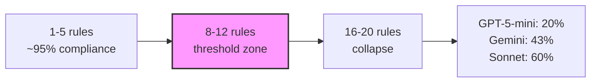
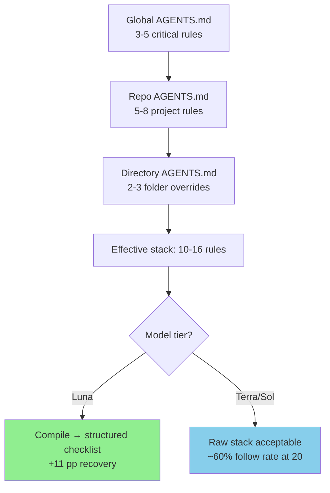

# Instruction Stacking Collapse: Why Your AGENTS.md Rules Fight Each Other — and How Prompt Compilation Helps Weaker Models Survive


---

Every Codex CLI session ships with a towering stack of instructions. The system prompt sets baseline behaviour. Global `AGENTS.md` rules layer on organisation-wide conventions. Repository-level files add project norms. Directory-scoped overrides inject folder-specific constraints. User prompts pile on task requirements. And if you have activated plugins or MCP servers, their tool descriptions add yet more directives.

The assumption underpinning all of this is that models follow instructions linearly: add another rule, get another constraint obeyed. A new paper — *Instruction Stacking Collapse* by Anand and Chattaraj (arXiv:2608.02639, July 31 2026) [^1] — demonstrates that this assumption is dangerously wrong. Instruction-following performance degrades sigmoidally as constraints accumulate, certain instruction pairs create silent conflicts that suppress each other, and the degradation is **capability-dependent**: cheaper models collapse far harder than frontier ones.

For Codex CLI practitioners managing `AGENTS.md` hierarchies, config.toml rules, and multi-surface instruction chains, the implications are immediate.

## The Benchmark: 22 Deterministic Instructions

The researchers assembled 24 instructions across six categories — format, length, lexical, structural, reasoning, and content — then excluded two that required LLM judgement, leaving 22 deterministic, verifier-checked constraints [^1]. Examples include "output valid JSON", "use at least 150 words", "avoid the word 'however'", and "include a `## Assumptions` section with at least two items".

Each instruction was verified by automated checkers audited against ~500 human labels, achieving 100% agreement on 18 of 19 verifiers [^1]. The experimental grid tested three production-tier models — Claude Sonnet 4.6, GPT-5-mini, and Gemini 2.5 Flash — across stack sizes of 1, 3, 5, 8, 12, 16, and 20 instructions, with 30 random stacks × 10 items per size, all at temperature 0 [^1].

## The Collapse Curve

At a single instruction, all three models follow at ~96%. Stack 20 constraints and the picture fractures [^1]:

| Model | Follow rate (stack=1) | Follow rate (stack=20) | Absolute drop |
|---|---|---|---|
| Claude Sonnet 4.6 | 96.4% | 60.4% | −36.0 pp |
| Gemini 2.5 Flash | 95.9% | 43.3% | −52.6 pp |
| GPT-5-mini | 96.4% | 20.1% | −76.3 pp |

The degradation is not linear. Bootstrap model-selection tests confirm a **sigmoidal** fit for Sonnet (93% of refits) and GPT-5-mini (100% of refits), meaning there is a critical threshold — somewhere between 8 and 12 stacked instructions — beyond which compliance drops precipitously [^1]. Gemini follows a linear-to-exponential curve, suggesting a different internal attention allocation strategy.



## Why Instructions Fight: Pairwise Conflicts

Not all instruction combinations degrade equally. The paper analysed all 231 pairwise combinations and found that approximately 12% of satisfiable pairs exhibit statistically significant **behavioural conflicts** (95% CI [4.6%, 11.6%], FDR-corrected at 0.05) [^1]. Fifteen pairs are logically impossible — "output valid JSON" versus "include markdown `##` headers", for instance.

The dominant conflict hub is the **JSON format constraint (F1)**, which silently suppresses nine other instructions [^1]. When a model commits to JSON output, it cannot simultaneously produce a "Summary:" trailing line, markdown headers, all-lowercase text, or length-constrained titles. The model does not report the conflict — it simply drops whichever instruction loses the internal priority race.

This has direct relevance to Codex CLI. Consider an `AGENTS.md` that mandates structured JSON tool-call output alongside human-readable markdown summaries. Or one that requires both concise responses and detailed reasoning sections. These are the kinds of conflicts that accumulate silently across the instruction hierarchy.

### Cross-Model Conflict Topology

Critically, conflict patterns **correlate across models** (Spearman ρ = +0.23 to +0.28, p<0.001) and even across tasks (advice↔maths: ρ = +0.44) [^1]. This means a pair of instructions that conflict on Sonnet will likely also conflict on GPT-5-mini and Gemini. The conflict topology is partly inherent to the instruction semantics, not merely a model-specific quirk.

## The Instruction Compiler: A Training-Free Remedy

The paper proposes an **instruction compiler** — a single zero-shot LLM call (using Sonnet 4.6) that rewrites a stacked prompt into a structured, conflict-aware checklist [^1]. The algorithm:

1. **Cluster and merge** instructions by category (reasoning → content → structural → lexical → length → format)
2. **Insert precedence notes** where conflicts are detected
3. **Reformat** as a numbered checklist with category headers and a verification reminder

The compiled prompt is computed once and reused across all queries — no per-query overhead.

### Recovery Is Capability-Graded

The compiler's benefit depends entirely on model strength. Pooled across stack sizes 8–20 [^1]:

| Model | Recovery | Effect size (Cohen's d) | Significance |
|---|---|---|---|
| GPT-5-mini | +11.0 pp | +0.43 | p<0.001 |
| Gemini 2.5 Flash | +3.3 pp | +0.20 | p=0.001 |
| Claude Sonnet 4.6 | −1.2 pp | −0.06 | n.s. |

Stronger models already internalise the structural consistency that compilation makes explicit; weaker models genuinely benefit from having conflicts surfaced and precedence declared. The within-family scaling ladder reinforces this: Haiku gains +9.0 pp, Sonnet loses −6.7 pp; Nano gains +6.0 pp, GPT-5.5 gains only +4.0 pp [^1].

The Spearman correlation between raw follow rate and compiler recovery is **ρ = −0.85** (p=0.004) — the worse a model is at raw instruction-following, the more it benefits from compilation [^1].

## Mapping to Codex CLI: Your Instruction Budget

Codex CLI builds its instruction chain by walking from global scope (`~/.codex/`) through the repository root to the current directory, concatenating `AGENTS.md` and `AGENTS.override.md` files in root-first, leaf-last order [^2]. Add config.toml rules, plugin descriptions, MCP tool schemas, and the user prompt, and a typical enterprise session easily stacks 15–25 distinct directives.

The stacking collapse research suggests three practical responses.

### 1. Audit Your Instruction Count

Count the distinct behavioural constraints in your effective instruction chain. If you are running GPT-5.6 Luna (the successor to GPT-5-mini [^3]) with 15+ stacked rules, expect significant compliance degradation. The sigmoid threshold means that going from 10 to 15 rules may cost you more compliance than going from 1 to 10.

```bash
# Quick audit: count directive-like lines across all AGENTS.md files
find . -name "AGENTS*.md" -exec grep -cE '^[-*]|^[0-9]+\.' {} + \
  | awk -F: '{sum+=$2} END {print "Total directives:", sum}'
```

### 2. Compile Instructions for Cheaper Models

If you run mixed-model workflows — Luna for routine edits, Terra or Sol for complex reasoning [^3] — consider pre-compiling your `AGENTS.md` hierarchy for the Luna tier. The compiler pattern from the paper translates directly:

```toml
# config.toml — model-specific instruction profiles
[profile.luna]
model = "gpt-5.6-luna"
# Point to a pre-compiled, conflict-resolved AGENTS.md
# with explicit precedence notes and category grouping
system_prompt_suffix = "file:///path/to/.codex/compiled-agents-luna.md"

[profile.terra]
model = "gpt-5.6-terra"
# Terra handles raw stacked instructions without degradation
```

The compilation itself can be a one-time `codex exec` task:

```bash
codex exec "Read all AGENTS.md files in this repository. \
  Identify conflicting instructions. Rewrite as a single \
  numbered checklist grouped by category, with explicit \
  precedence notes where conflicts exist. Output to \
  .codex/compiled-agents-luna.md"
```

### 3. Use Precedence, Not Volume

The Codex CLI instruction hierarchy already provides a precedence mechanism: directory-scoped files override repository-level ones, and `AGENTS.override.md` takes priority over `AGENTS.md` [^2]. But the stacking collapse data shows that **precedence alone is insufficient** — the model still sees all instructions in its context window and must resolve them internally.

The more effective strategy is **instruction pruning**: keep your `AGENTS.md` files focused on 5–8 critical directives per scope level, and move secondary guidance into tool descriptions or MCP server metadata where it activates only when relevant.



## The JSON Trap in Tool Definitions

The paper's finding that JSON output formatting conflicts with nine other instructions [^1] deserves special attention. Codex CLI's tool-call interface inherently requires structured output — the agent must produce valid JSON for function calls. If your `AGENTS.md` simultaneously demands markdown-formatted explanations, specific heading structures, or particular output lengths, you are creating exactly the conflict pattern the paper identifies.

The defence is to separate **tool-call instructions** (which are inherently format-constrained) from **natural-language output instructions** (which govern the conversational turns between tool calls). Codex CLI's `PostToolUse` hooks [^4] provide a natural boundary: constrain tool-call formatting in the system prompt, and constrain human-readable output in `AGENTS.md`.

## Category Survival Rates

The paper found that different instruction categories degrade at different rates [^1]:

- **Lexical constraints** (word inclusion/exclusion): most resilient
- **Reasoning and content** constraints: intermediate
- **Format and length** constraints: collapse fastest

This maps to a practical priority order for `AGENTS.md` authoring: lexical rules ("always use British English", "never say 'utilize'") survive stacking well. Structural format rules ("always output a `## Summary` section") are the first casualties. If you must choose what to keep when pruning, preserve the lexical and reasoning directives.

## Cross-Task Transfer: Rules Survive Context Switches

One of the paper's most useful findings is that conflict topology transfers across tasks (ρ = +0.44 between advice and mathematics tasks) [^1]. This means that if two instructions conflict on a code-generation task, they will likely also conflict on a documentation task, a review task, or a debugging task.

For Codex CLI practitioners, this is reassuring: you can audit your instruction conflicts on one task type and expect the findings to generalise across your workflow.

## What This Means for `config.toml` Rules

Beyond `AGENTS.md`, Codex CLI's `config.toml` can encode approval policies, model-selection rules, permission boundaries, and sandbox constraints [^5]. Each of these adds to the effective instruction stack. The stacking collapse data suggests that **config.toml rules should be kept orthogonal to `AGENTS.md` directives** — they should govern different behavioural dimensions (security, permissions, model routing) rather than duplicating or contradicting the coding-style constraints in `AGENTS.md`.

## Limitations and Open Questions

The paper tested on advice, mathematics, and code generation tasks but used relatively simple instruction types. Production `AGENTS.md` files contain nuanced, domain-specific constraints ("when modifying database migrations, always create a reversible migration") that may degrade differently from generic format rules. The authors acknowledge that "effects on complex, domain-specific instruction chains remain under-explored" [^1].

The compiler was also built using Sonnet 4.6 — the strongest model tested. Whether a weaker model can reliably compile instructions for itself is untested. For Codex CLI users, this suggests using your strongest available model (Sol or Terra) as the compiler, even if the compiled output is destined for Luna.

⚠️ The paper's models (Sonnet 4.6, GPT-5-mini, Gemini 2.5 Flash) are not identical to the current Codex CLI defaults (GPT-5.6 Luna/Terra/Sol), though the capability-graded findings should transfer to models of similar relative strength.

## Practical Takeaways

1. **Count your instruction stack.** If it exceeds 12 directives, you are likely past the sigmoid inflection point for cheaper models.
2. **Compile for Luna.** A one-time instruction compilation step can recover +11 pp compliance for weaker models at zero per-query cost.
3. **Watch for JSON conflicts.** Any `AGENTS.md` rule that requires markdown formatting while the agent is producing tool calls creates a structural conflict.
4. **Prune by category.** Format and length rules collapse first; lexical and reasoning rules survive longest. Prioritise accordingly.
5. **Keep `config.toml` orthogonal.** Security and permission rules should not duplicate or conflict with coding-style directives in `AGENTS.md`.

The instruction budget is real. Treat it like a token budget — finite, measurable, and worth optimising.

## Citations

[^1]: Anand, A. and Chattaraj, S. (2026) "Instruction Stacking Collapse: A Benchmark and the Capability-Dependent Value of Prompt Compilation", arXiv:2608.02639. Available at: [https://arxiv.org/abs/2608.02639](https://arxiv.org/abs/2608.02639)

[^2]: OpenAI (2026) "AGENTS.md — Agent Instruction Files", Codex CLI Documentation. Available at: [https://learn.chatgpt.com/docs/codex/cli](https://learn.chatgpt.com/docs/codex/cli)

[^3]: OpenAI (2026) "GPT-5.6 Model Tiers: Sol, Terra, Luna", Release Notes. Available at: [https://openai.com/products/release-notes/](https://openai.com/products/release-notes/)

[^4]: OpenAI (2026) "Codex CLI Hooks: PreToolUse and PostToolUse", Codex CLI Documentation. Available at: [https://learn.chatgpt.com/docs/codex/cli](https://learn.chatgpt.com/docs/codex/cli)

[^5]: OpenAI (2026) "Codex CLI Configuration Reference", Codex CLI Documentation. Available at: [https://learn.chatgpt.com/docs/codex/cli](https://learn.chatgpt.com/docs/codex/cli)

<!-- [^6] removed: orphan citation — not referenced in article body -->
<!-- [^6]: OpenAI (2026) "Codex CLI v0.147.0 Release Notes", GitHub Releases. Available at: https://github.com/openai/codex/releases/tag/rust-v0.147.0 -->
