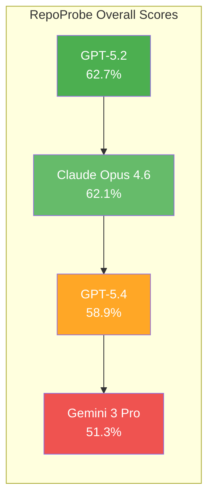
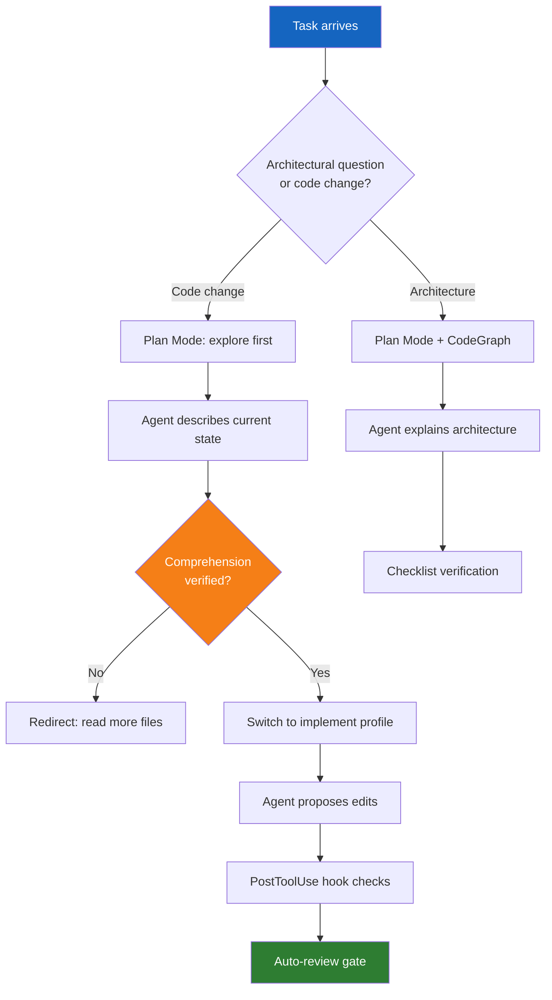

# RepoProbe and Edit Bias: Why Your Coding Agent Reaches for the Keyboard Before It Understands the Architecture — and How Codex CLI's Exploration Stack Fights Back


---

Every senior developer has watched it happen: you paste a question about a module's data flow into your coding agent, and instead of tracing the architecture, it immediately proposes a diff. The agent found relevant files, perhaps even the right function — but it skipped the step where understanding happens. Yang et al. have now given this failure mode a name, a benchmark, and hard numbers. Their paper *RepoProbe: Benchmarking Architecture-Aware Repository Comprehension with Checklists*, accepted at ASE 2026, reveals that even the best frontier models achieve only 62.7% on open-ended architectural questions, and that **Edit Bias** — the tendency to generate code changes instead of answering the question — accounts for 10.4% to 24.0% of failures depending on the model [^1].

This article unpacks the findings, explains why traditional benchmarks masked the problem, and maps RepoProbe's failure taxonomy onto Codex CLI's exploration and planning stack.

## Why Issue-Based Benchmarks Hide the Problem

SWE-bench and its derivatives frame every task as a defect to resolve. The agent receives an issue, a stack trace, and a test harness, then produces a patch. Success is binary: the patch applies and tests pass, or it does not [^2]. This structure inadvertently rewards Edit Bias because the *correct* response is always a code change. An agent that compulsively edits will occasionally stumble into the right fix, and its failures are recorded simply as "unresolved."

RepoProbe breaks this pattern by sourcing 500 validated question-answer pairs from GitHub Discussions across 50 repositories and 15 programming languages [^1]. The questions demand semantic mapping — understanding why a module exists, how data flows between components, which configuration paths are exercised at runtime — rather than defect localisation. When the correct answer is an explanation, not a patch, Edit Bias becomes visible.

## The Five Failure Modes

RepoProbe's analysis of low-scoring responses (below 60%) identifies five distinct failure patterns [^1]:

| Failure Mode | Share | Description |
|---|---|---|
| Misinterpretation | 32.7% | Locates relevant code but analyses it incorrectly |
| Shallow Explanation | 28.2% | Provides vague or surface-level technical detail |
| Context Miss | 18.9% | Fails to retrieve the relevant files at all |
| Edit Bias | 15.8% | Proposes code changes instead of answering |
| Hallucination | 3.7% | References non-existent entities |

Two observations stand out. First, **Misinterpretation** dominates: the agent finds the code but draws the wrong conclusions. This is not a retrieval failure — it is a reasoning failure under insufficient architectural context. Second, **Edit Bias** at 15.8% of failures represents a systematic mode collapse rather than an occasional glitch. The models were explicitly asked to explain, not edit, yet roughly one in six bad answers contained unsolicited diffs.

## Model Performance: The Ceiling Is Low



Twenty models were evaluated. The best, GPT-5.2, achieved 62.7% overall with a 26.0% perfect-solve rate. Claude Opus 4.6 followed closely at 62.1% [^1]. These are frontier models running against questions that any competent human maintainer could answer. The gap between knowledge and clarity scores is revealing: GPT-5.2 scored 60.3% on knowledge but 84.7% on clarity [^1]. The models write beautifully about things they do not fully understand.

Performance also varies sharply by category. Business Logic questions — requiring causal reasoning about *why* code behaves as it does — saw the lowest perfect-solve rate at 15.8%, compared to 19.2% for Project Architecture and 17.6% for Implementation Details [^1]. The implication for Codex CLI users: if your prompt involves "why does this module..." rather than "where is this function...", expect the agent to struggle.

## The Checklist Verification Protocol

RepoProbe's evaluation methodology deserves attention in its own right because it exposes a problem with how we typically judge agent output. Traditional scalar scoring (e.g. "rate this answer 1–10") exhibited interpretation drift: identical answers received scores ranging 40 percentage points apart across evaluation runs [^1]. The standard deviation was 2.9–3.5%.

The Checklist-Based Verification Protocol decomposes each answer into atomic, verifiable facts with integer-weighted rubrics. This reduced standard deviation to 1.5–2.4% and narrowed score ranges from 6.9–8.3% down to 3.2–5.2% [^1]. For teams building their own evaluation harnesses — whether for PostToolUse verification hooks or auto-review policies — this approach offers a more reliable alternative to asking a judge model for a single number.

## Mapping RepoProbe to Codex CLI

RepoProbe's findings translate into concrete Codex CLI configuration and workflow patterns. The goal: reduce Edit Bias, improve architectural comprehension, and catch reasoning failures before they become committed code.

### 1. Plan Mode as an Edit-Bias Circuit Breaker

Codex CLI's Plan Mode (`/plan` or `Shift+Tab`) enforces a read-only exploration phase. The model gathers context, asks clarifying questions, and builds a plan before writing any code [^3]. Files are not written to disc while Plan Mode is active. This directly counters Edit Bias by architecturally separating comprehension from modification.

For tasks touching more than three files or involving unfamiliar modules, start in Plan Mode:

```bash
codex --model gpt-5.6-terra
# Then inside the session:
/plan Trace the data flow from API ingestion to the reporting module
```

The plan output becomes a comprehension checkpoint. If the agent's architectural understanding is wrong, you catch it before any edits land.

### 2. AGENTS.md Exploration Directives

RepoProbe's Misinterpretation failure (32.7%) stems from agents drawing conclusions without sufficient cross-file context. AGENTS.md can encode exploration-first directives that force the agent to gather evidence before reasoning [^4]:

```markdown
# AGENTS.md

## Exploration Protocol
- Before modifying any file, read all files in the same package/module directory
- For cross-module changes, trace import chains to understand data flow
- Never propose architectural changes without first describing the current architecture
- When asked "why does X happen?", locate the call chain before answering

## Architecture
- API layer: src/api/ — all routes, middleware, auth
- Domain logic: src/domain/ — pure business rules, no I/O
- Persistence: src/persistence/ — database access, migrations
- The domain layer MUST NOT import from api/ or persistence/
```

This exploits the JAWs study finding that AGENTS.md directives yield a 28.64% median runtime reduction by cutting the exploration tax — the agent wastes fewer tokens wandering aimlessly when it has a map [^5].

### 3. CodeGraph MCP for Structural Context

RepoProbe's Context Miss failure (18.9%) occurs when the agent cannot find the relevant files. CodeGraph, a tree-sitter-powered MCP server, builds a persistent knowledge graph of your codebase — symbols, edges, call chains, inheritance hierarchies — and exposes it as queryable tools [^6]. Benchmarks show a 59% reduction in token consumption and 70% fewer tool calls when agents have structural index access [^6].

Configure CodeGraph in your `config.toml`:

```toml
[mcp_servers.codegraph]
command = "codegraph"
args = ["serve", "--db", ".codegraph/index.db"]
```

When the agent needs to understand architecture, it queries the graph rather than scanning files sequentially. This shifts the exploration from O(n) file reads to targeted graph traversals.

### 4. PostToolUse Hooks for Comprehension Verification

RepoProbe's checklist protocol can be adapted into PostToolUse hooks that verify the agent's understanding before allowing edits. A hook can intercept file-write operations and check whether the agent has demonstrated comprehension of the affected module:

```toml
# config.toml
[[sandbox.hooks.post_tool_use]]
trigger = "file_write"
script = "scripts/verify-comprehension.sh"
```

The verification script can check whether the agent's conversation history includes evidence of reading related files, tracing imports, or describing the current architecture before proposing changes — a programmatic Edit Bias detector.

### 5. Named Profiles for Exploration vs Implementation

Codex CLI's named profiles allow separate configurations for different workflow phases [^3]. An exploration profile might use a higher-capability model with read-only permissions, whilst an implementation profile uses a cost-efficient model with write access:

```toml
# ~/.codex/profiles/explore.toml
model = "gpt-5.6-sol"
approval_policy = "on-request"
sandbox = "read-only"

# ~/.codex/profiles/implement.toml
model = "gpt-5.6-terra"
approval_policy = "auto-review"
sandbox = "workspace-write"
```

```bash
# Explore first
codex --profile explore "Trace the authentication flow from login to token refresh"

# Then implement
codex --profile implement "Refactor the token refresh to use rotating keys"
```

This mirrors RepoProbe's finding that comprehension and code generation are separate capabilities with different failure modes [^1].

## The Exploration Workflow

Putting these patterns together yields a structured workflow that addresses each of RepoProbe's five failure modes:



## What RepoProbe Does Not Tell You

The benchmark has limitations worth noting. All 500 questions were sourced from GitHub Discussions, which skew towards well-maintained projects with active communities [^1]. Performance on proprietary codebases with sparse documentation may differ. The evaluation also tested models in isolation rather than within agent scaffolds — a model running inside Codex CLI with CodeGraph and AGENTS.md would likely score higher than the same model answering from raw repository access alone.

⚠️ RepoProbe's perfect-solve rates (15.8–27.5%) should be interpreted cautiously. The checklist protocol is strict: partial credit is possible, but a perfect score requires every atomic fact to be correct. Real-world architectural discussions often tolerate reasonable approximations.

## Conclusion

RepoProbe makes a simple but consequential argument: we have been measuring coding agents by their ability to write patches, not by their ability to understand code. The 62.7% ceiling on frontier models and the 15.8% Edit Bias failure rate suggest that the next meaningful improvements will come not from larger models but from better exploration scaffolding — exactly the territory that Plan Mode, AGENTS.md directives, and structural codebase indexes occupy.

For Codex CLI users, the practical takeaway is straightforward: separate exploration from implementation. Use Plan Mode for comprehension. Use CodeGraph for structural context. Use AGENTS.md to encode your architecture. And use PostToolUse hooks to verify that the agent understood the code before it changed it.

---

## Citations

[^1]: Yang, Y., Wu, A., Luo, J., Xuan, R., Hu, Z., Liu, Y. & Qin, Z. (2026). *RepoProbe: Benchmarking Architecture-Aware Repository Comprehension with Checklists*. arXiv:2608.04783. Accepted at ASE 2026. [https://arxiv.org/abs/2608.04783](https://arxiv.org/abs/2608.04783)

[^2]: Jimenez, C. E., Yang, J., Wettig, A., Yao, S., Pei, K., Press, O. & Narasimhan, K. (2024). *SWE-bench: Can Language Models Resolve Real-World GitHub Issues?*. ICLR 2024. [https://arxiv.org/abs/2310.06770](https://arxiv.org/abs/2310.06770)

[^3]: OpenAI. (2026). *Codex CLI Features and Configuration*. [https://developers.openai.com/codex/cli/features](https://developers.openai.com/codex/cli/features)

[^4]: OpenAI. (2026). *AGENTS.md Configuration Guide*. [https://developers.openai.com/codex/cli/agents-md](https://developers.openai.com/codex/cli/agents-md)

[^5]: Lulla, J. L., Thangarajah, K., Chen, B. & Hassan, A. E. (2026). *JAWs: Just AGENTS.md Works — The Effect of AGENTS.md on LLM-Based Coding Agents*. ICSE 2026. arXiv:2601.20404. [https://arxiv.org/abs/2601.20404](https://arxiv.org/abs/2601.20404)

[^6]: Kocar, S. (2026). *CodeGraph: Codebase Intelligence MCP Server — Semantic Code Graph with Vector Search*. [https://github.com/suatkocar/codegraph](https://github.com/suatkocar/codegraph)
