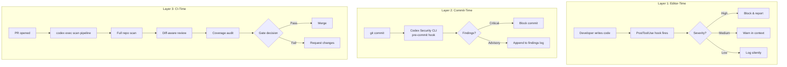
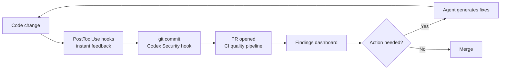

# The Proactive Quality Agent: Building a Unified Scanning Architecture in Codex CLI


---

## The Shift from Reactive to Proactive

Every mainstream coding agent — Codex CLI included — was designed to react. A developer files an issue, the agent reads it, patches the code, and opens a PR. But real-world codebases do not wait for someone to notice a problem before the problem matters.

Two recent benchmarks have quantified how poorly current agents perform when the issue report is taken away. Active-SWE, published August 2026, evaluated state-of-the-art agents across 1,663 tasks spanning six bug categories and eight programming languages and found that most "struggle with proactive bug-fixing tasks," particularly when handling multiple bugs simultaneously or discovering potential issues without explicit guidance [^1]. VulnGym, from Tencent's Wukong Code Security Team, went further: across 184 advisories and 408 vulnerability entries in 23 real repositories, agents failed at both end-to-end repository-level vulnerability detection and the construction of accurate supporting traces — with 71.2% of the benchmark comprising business-logic flaws that demand cross-module reasoning [^2].

Meanwhile, the "Coding Agents as Test-Suite Auditors" paper (arXiv:2608.01715) demonstrated that agents can identify 589 verified accepted-but-buggy submissions among 20,375 audited AtCoder submissions that official test suites missed entirely [^3]. The capability exists — it simply is not wired into standard development workflows.

This article converges those research findings into a practical architecture: a proactive quality agent built on Codex CLI's hook system, MCP integrations, and CI pipeline automation.

---

## Architecture Overview

The proactive quality agent comprises three layers, each operating at a different point in the development lifecycle:



Each layer catches different categories of defect. Editor-time hooks catch obvious mistakes before they reach version control. Commit-time gates handle security vulnerabilities that require deeper analysis. CI-time scans perform the comprehensive, repository-level audits that VulnGym showed agents currently struggle with — but that structured tooling can substantially improve.

---

## Layer 1: PostToolUse Verification Gates

Codex CLI's hook system, stable since v0.124.0, fires `PreToolUse` and `PostToolUse` events for every tool invocation [^4]. A PostToolUse hook can inspect the output of a file write, a shell command, or an MCP tool call and decide whether to allow, warn, or block.

A proactive quality hook examines each code change as it happens:

```toml
# ~/.codex/hooks.toml — proactive quality PostToolUse hook

[[hooks]]
event = "PostToolUse"
tool = "write_file"
command = ["python3", "/opt/quality-hooks/post_write_check.py"]
timeout_ms = 10000
on_failure = "warn"
```

The hook script receives the written file path and content via stdin. A minimal implementation delegates to three checkers:

```bash
#!/usr/bin/env bash
# /opt/quality-hooks/post_write_check.sh
FILE_PATH="$1"

# 1. Static analysis via MCP-connected Semgrep
codex mcp call semgrep-server scan --target "$FILE_PATH" --severity ERROR 2>/dev/null

# 2. Type-check (language-aware)
case "$FILE_PATH" in
  *.py)  mypy --no-error-summary "$FILE_PATH" 2>/dev/null ;;
  *.ts)  npx tsc --noEmit "$FILE_PATH" 2>/dev/null ;;
esac

# 3. Security pattern scan
codex-security scan --target "$FILE_PATH" --format json 2>/dev/null
```

The key design decision is `on_failure = "warn"` rather than `"block"`. During active development, hard blocks on every PostToolUse invocation create friction that kills agent throughput. Reserve blocking for commit-time and CI-time layers.

---

## Layer 2: Codex Security CLI at the Commit Gate

OpenAI open-sourced the Codex Security CLI under Apache 2.0 on 29 July 2026 [^5]. Unlike traditional static analysis tools that rely on pattern matching, it uses frontier models to read code contextually — better at multi-file attack paths and reachability analysis, though findings still require human review.

The CLI provides three commands relevant to the proactive quality architecture:

- **`codex-security scan`** — full repository scan with finding deduplication across runs
- **`codex-security diff`** — scan only changed files against a base branch
- **`codex-security hook`** — install a pre-commit hook that blocks on high-severity findings

Install the commit gate:

```bash
# Install the pre-commit hook
codex-security hook install

# Configure severity threshold
cat >> .codex-security.toml << 'EOF'
[hook]
block_on = ["critical", "high"]
allow_on = ["medium", "low", "info"]
budget_limit_usd = 0.50
EOF
```

The `budget_limit_usd` setting is critical for cost control. Each scan invokes an LLM, and the Codex Security CLI documentation warns that "AI scans can produce different results even when the configuration remains unchanged" [^5]. Set a sensible per-commit budget and monitor actual spend.

For the proactive quality agent, the diff command is more useful than a full scan at commit time:

```bash
# In the pre-commit hook, scan only staged changes
codex-security diff --base HEAD --format sarif --output .security/latest.sarif
```

SARIF output integrates directly with GitHub's code scanning alerts, providing a unified view of findings across commits.

---

## Layer 3: CI Pipeline Scanning with `codex exec`

The CI layer is where the proactive agent earns its name. Rather than waiting for a developer to request a review, it runs automatically on every PR.

```yaml
# .github/workflows/proactive-quality.yml
name: Proactive Quality Agent
on:
  pull_request:
    types: [opened, synchronize]

jobs:
  quality-scan:
    runs-on: ubuntu-latest
    steps:
      - uses: actions/checkout@v4
        with:
          fetch-depth: 0

      - name: Full security scan
        run: |
          codex-security scan \
            --format sarif \
            --output security-findings.sarif \
            --budget-limit 2.00

      - name: Diff-aware code review
        run: |
          codex exec "Review the changes in this PR for:
            1. Business-logic vulnerabilities (authorisation bypass, missing access control)
            2. Error handling gaps
            3. Test coverage for new code paths
            4. API contract violations
            Output findings as structured JSON." \
            --approval-mode suggest \
            --model o3

      - name: Test coverage audit
        run: |
          codex exec "Analyse the test suite for this repository.
            Identify:
            1. Code paths with no test coverage
            2. Tests that pass but do not actually verify behaviour
            3. Missing edge cases for the changed files
            Generate new test cases for any gaps found." \
            --approval-mode suggest \
            --model o3

      - name: Upload SARIF
        uses: github/codeql-action/upload-sarif@v3
        with:
          sarif_file: security-findings.sarif
```

The test coverage audit step directly applies the findings from the Test-Suite Auditors paper: agents can effectively discover what official test suites miss, maintaining performance within 1.7 percentage points of official suite coverage for logic bugs [^3].

---

## AGENTS.md Proactive Directives

The AGENTS.md file shapes agent behaviour before any hook fires. For a proactive quality agent, the directives must explicitly instruct the agent to look for problems rather than wait for them:

```markdown
# AGENTS.md — Proactive Quality Directives

## Security Review
Before completing any task, scan changed files for:
- Authorisation and authentication gaps
- Input validation omissions
- Secrets or credentials in code or configuration
- SQL injection, XSS, and path traversal patterns

## Test Coverage
When modifying any function, verify:
- Existing tests still pass
- New code paths have corresponding test cases
- Edge cases (null, empty, boundary values) are covered

## Business Logic
For any change touching access control, payments, or data handling:
- Trace the full request path from entry point to data store
- Verify authorisation checks at every layer
- Check for time-of-check-to-time-of-use (TOCTOU) races

## Quality Gates
Do NOT mark a task as complete until:
1. All static analysis findings are addressed or explicitly acknowledged
2. Test coverage for changed files meets or exceeds the repository baseline
3. No high-severity security findings remain unresolved
```

The Lulla et al. study demonstrated that well-structured AGENTS.md files reduce median runtime by 28.64% and output tokens by 16.58% [^6]. Proactive directives add marginal token cost but prevent the far more expensive scenario of discovering defects after merge.

---

## MCP Static Analysis Integration

The MCP protocol enables Codex CLI to call external analysis tools as first-class tool invocations. A proactive quality architecture should wire up at least two MCP servers:

```toml
# ~/.codex/config.toml — MCP server configuration

[mcp_servers.semgrep]
command = "semgrep-mcp-server"
args = ["--rules", "p/default", "--rules", "p/security-audit"]

[mcp_servers.codebase-index]
command = "codegraph-mcp"
args = ["--root", "."]
```

Semgrep via MCP provides sub-second static analysis that complements the deeper but slower Codex Security CLI scans [^7]. The CodeGraph MCP server provides structural codebase indexing — critical for the cross-module trace construction that VulnGym showed agents currently lack.

The combination matters: Semgrep catches known vulnerability patterns deterministically, while the LLM-powered Codex Security CLI reasons about novel business-logic flaws. Neither alone covers the full spectrum.

---

## Coverage Metrics Dashboard

A proactive quality agent generates data. Without a dashboard, that data rots in CI logs.

Track these metrics per repository:

| Metric | Source | Target |
|--------|--------|--------|
| Security findings per PR | Codex Security CLI SARIF | Trending downward |
| Mean time to remediation | Finding timestamps vs fix commits | < 48 hours |
| Test coverage delta per PR | Coverage reports | ≥ 0% (never decrease) |
| PostToolUse hook trigger rate | Hook logs | Monitor for anomalies |
| Scan cost per PR | Codex Security CLI budget reports | < \$3.00 |
| False positive rate | Developer feedback on findings | < 20% |

The false positive rate is the metric that determines whether developers trust or ignore the system. The Codex Security CLI documentation explicitly acknowledges non-deterministic results [^5]. Track false positives aggressively and tune severity thresholds accordingly.

---

## Putting It Together: The Proactive Quality Loop



The loop is self-reinforcing. PostToolUse hooks catch the obvious issues early, reducing the load on commit-time and CI-time scanners. The CI pipeline catches what hooks miss. The dashboard reveals systemic patterns — recurring vulnerability categories, undertested modules, consistently problematic code paths — that feed back into AGENTS.md directives and hook configuration.

Active-SWE showed that agents struggle with proactive discovery [^1]. This architecture does not ask the agent to discover problems unaided. Instead, it structures the discovery process: hooks provide immediate signals, static analysis provides deterministic coverage, LLM-powered scanning provides contextual depth, and CI automation ensures nothing is skipped.

---

## What This Does Not Solve

Honesty demands acknowledging the gaps:

- **Business-logic flaws remain hard.** VulnGym's 71.2% business-logic composition exists precisely because these flaws require understanding intent, not just code structure [^2]. No amount of tooling substitutes for architectural review by someone who understands the domain.
- **Non-deterministic scanning.** LLM-powered security scans can produce different results on identical code. The architecture mitigates this with deterministic Semgrep as a baseline, but the Codex Security CLI layer inherently varies between runs.
- **Cost scales with activity.** Each PostToolUse hook invocation, each commit scan, and each CI pipeline run costs tokens. Budget limits are essential, not optional.
- ⚠️ **FixedBench results.** The backlog references a "FixedBench" benchmark rated 5.0, but I was unable to locate a published benchmark by that exact name. The Test-Suite Auditors paper (arXiv:2608.01715) covers adjacent ground — agent-generated test suites that catch what official suites miss — and is cited accordingly.

---

## Citations

[^1]: Li, H., Deng, P., Qian, W., Jiang, L., Huang, Z., Yang, M. & Peng, X. (2026). "Active-SWE: Benchmarking Coding Agents for Proactive Bug Fixing without Issue Reports." arXiv:2608.04682. [https://arxiv.org/abs/2608.04682](https://arxiv.org/abs/2608.04682)

[^2]: Ji, K., Liu, J., Hu, E., Gao, C., Lian, K., Liu, Y., Zhang, L., Dong, T., Chen, H. & Bin, W. (2026). "VulnGym: Benchmarking Coding Agents for Repository-Level Vulnerability Detection." arXiv:2608.02001. [https://arxiv.org/abs/2608.02001](https://arxiv.org/abs/2608.02001)

[^3]: Xie, S., Xie, S., Zhu, F., Ji, Y. & Zuo, W. (2026). "Coding Agents as Test-Suite Auditors: Finding What Official Suites Miss While Approaching What They Catch." arXiv:2608.01715. [https://arxiv.org/abs/2608.01715](https://arxiv.org/abs/2608.01715)

[^4]: Codex CLI Hooks Reference. "PreToolUse & PostToolUse hook events." [https://agenticcontrolplane.com/blog/codex-cli-hooks-reference](https://agenticcontrolplane.com/blog/codex-cli-hooks-reference)

[^5]: OpenAI. (2026). "Codex Security CLI — Open Source Release." GitHub: openai/codex-security. [https://github.com/openai/codex-security](https://github.com/openai/codex-security)

[^6]: Lulla, J.L., Mohsenimofidi, S., Galster, M., Zhang, J.M., Baltes, S. & Treude, C. (2026). "On the Impact of AGENTS.md Files on the Efficiency of AI Coding Agents." arXiv:2601.20404. [https://arxiv.org/abs/2601.20404](https://arxiv.org/abs/2601.20404)

[^7]: Semgrep MCP Server. "Integrate Static Code Analysis Seamlessly." [https://mcpmarket.com/server/semgrep](https://mcpmarket.com/server/semgrep)
