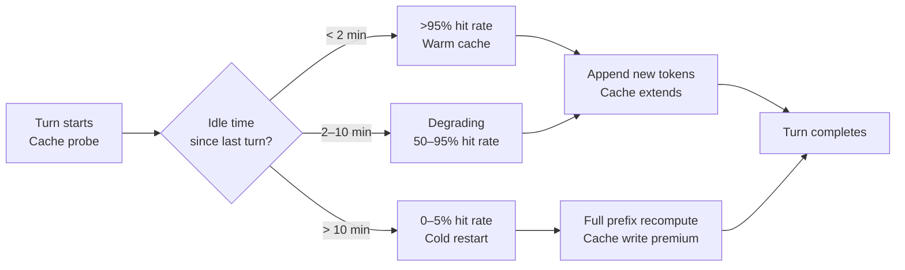
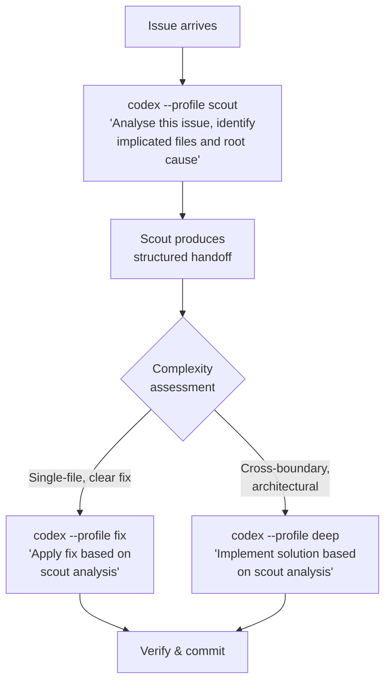
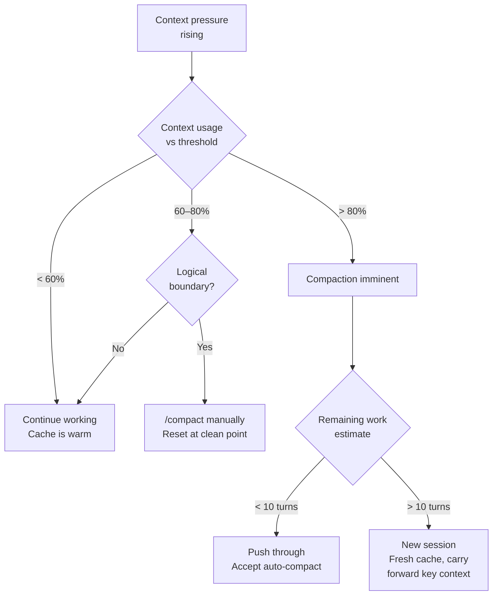

# The Session Economics Masterclass: KV Cache Lifecycle, Named Profiles, and Cost-Per-Solve Budgeting for Codex CLI


---

Every Codex CLI session is a financial instrument. Each turn either compounds cached prefix value or destroys it. Four recent studies — the 13.5-million-session GitHub Copilot telemetry analysis[^1], the Scrouting cost-aware routing framework[^2], the "Token Reduction Is Not Cost Reduction" empirical campaign[^3], and the context compaction architecture analysis[^4] — collectively reveal a session cost model that most teams get wrong. This article synthesises their findings into a unified economics framework, complete with named profile templates, KV cache lifecycle strategies, and a cost-per-solve budgeting methodology you can deploy today.

## The Four-Component Cost Model

Before optimising anything, understand what you are actually paying for. Under GPT-5.6's pricing structure (post-July 30 2026 cuts), every API call incurs four cost components[^3]:

| Component | Sol | Terra | Luna |
|-----------|-----|-------|------|
| Uncached input | \$5.00/M | \$2.00/M | \$0.20/M |
| Cached input (read) | \$0.50/M | \$0.20/M | \$0.02/M |
| Cache write premium | \$6.25/M (1.25×) | \$2.50/M (1.25×) | \$0.25/M (1.25×) |
| Output | \$30.00/M | \$12.00/M | \$1.20/M |

The Weinberger & Hozez study demonstrated that prompt-cache traffic accounts for approximately 87% of reconstructed cost — roughly 80% of the actual bill[^3]. This means the dominant cost lever is not *reducing tokens* but *maximising cache hits*. Their compression experiments across 2,908 Claude Code runs showed that a 38.4% tool-output token reduction actually *increased* billed cost by 6.8%, because compression destroyed the exact-prefix match that caching requires.

## The KV Cache Lifecycle

The Liu et al. production telemetry from 13.5 million GitHub Copilot sessions quantified what practitioners suspected but could not measure[^1]:



Three critical thresholds emerge:

1. **The two-minute sweet spot.** Within two minutes of the previous turn, hit rates exceed 95%. This is the optimal cadence for iterative development — rapid-fire turns that keep extending the cached prefix.

2. **The ten-minute cliff.** Beyond ten minutes of idle time, cache hit rates collapse to near zero[^1]. A developer who steps away for a coffee break returns to a cold session. The next turn pays the full uncached input rate on the entire conversation history, plus the 1.25× cache write premium to re-establish the prefix[^5].

3. **The compaction trap.** Context compaction — triggered when usage exceeds `model_auto_compact_token_limit` (default: 80% of the 272k window) — summarises the conversation but produces a *new* prefix that shares nothing with the previous one[^4]. A single compaction on a 125,000-token context costs approximately \$0.40 at Terra rates, equivalent to roughly 21 follow-up turns at cached rates[^4]. Worse, it can trigger a compaction spiral: summarised context → more work → threshold hit again → another compaction.

### Practical Cache Management

The goal is to maximise the ratio of cached-to-uncached input tokens across a session. Three configuration levers control this:

```toml
# ~/.codex/config.toml

# Keep tool outputs lean to stay within cacheable prefix window
tool_output_token_limit = 12000

# Delay compaction — higher threshold means more turns before trigger
model_auto_compact_token_limit = 200000

# Context window (post-July 2026 default)
model_context_window = 272000
```

The `tool_output_token_limit` setting forces Codex to work with summarised tool outputs, keeping each turn's new token contribution small relative to the cached prefix[^6]. Setting `model_auto_compact_token_limit` to 200,000 (approximately 73% of the 272k window) gives you headroom for 30–50 turns before compaction becomes necessary on typical workflows.

When compaction is inevitable, trigger it manually with `/compact` at a logical work boundary — between features, after a commit, or when switching context. This converts an uncontrolled cost spike into a planned cache reset.

## Archetype-Aware Named Profiles

The Copilot telemetry study identified five user archetypes spanning a 50× token-cost range[^1]. Not every session deserves the same model. Codex CLI's named profiles let you match model tier to task economics.

Create profile files at `~/.codex/<name>.config.toml` and invoke with `--profile <name>`:

### Scout Profile — Repository Exploration

The Scrouting study demonstrated that a lightweight searcher model produces a ~4KB structured handoff containing implicated files, reproduction specifications, and dead ends[^2]. This scouting phase costs less than \$0.005 per task on a fine-tuned 7B model — but using Codex CLI, Luna serves the same purpose:

```toml
# ~/.codex/scout.config.toml
model = "gpt-5.6-luna"
model_reasoning_effort = "low"
tool_output_token_limit = 8000
model_auto_compact_token_limit = 100000
```

Use this for initial bug triage, codebase exploration, and issue analysis. Luna at \$0.20/M input means a 50,000-token scouting session costs roughly \$0.01 uncached, or \$0.001 cached.

### Fix Profile — Implementation

Once the scout has localised the problem, switch to a heavier model for the actual fix:

```toml
# ~/.codex/fix.config.toml
model = "gpt-5.6-terra"
model_reasoning_effort = "high"
tool_output_token_limit = 16000
model_auto_compact_token_limit = 200000
```

Terra at \$2.00/M input delivers strong code generation at 10× Luna's cost but 2.5× cheaper than Sol. For most implementation tasks, Terra offers the optimal cost-quality trade-off.

### Deep Profile — Complex Cross-Boundary Work

Reserve Sol for tasks requiring cross-abstraction-boundary reasoning — the kind of work where the Scrouting study showed cheaper models fail[^2]:

```toml
# ~/.codex/deep.config.toml
model = "gpt-5.6-sol"
model_reasoning_effort = "high"
tool_output_token_limit = 20000
model_auto_compact_token_limit = 220000
```

Sol at \$5.00/M input is justified only when the task's complexity demands it — architectural refactoring, multi-module dependency changes, or security-critical modifications.

### The Scout/Fix Workflow

Combining profiles into a two-phase workflow maps directly to the Scrouting paper's finding that structured handoffs from a cheap searcher to an expensive fixer reduced cost-per-solve by 82% (from \$1.274 to \$0.230 on SWE-bench Pro Python)[^2]:



Pass the scout's output as context to the fix session. This avoids paying Sol rates for the exploration phase whilst ensuring the implementation model has precise localisation data.

## Cost-Per-Solve: The Decision-Grade Metric

Raw token costs are meaningless without a success denominator. The metric that matters is **cost per successful execution (CPS)** — the total spend divided by the number of tasks actually resolved[^3].

Consider two configurations solving 100 tasks:

| Configuration | Token cost | Tasks solved | CPS |
|---------------|-----------|-------------|-----|
| Sol for everything | \$127.40 | 85 | \$1.50 |
| Scout(Luna) + Fix(Terra) | \$52.00 | 78 | \$0.67 |
| Scout(Luna) + Deep(Sol) for hard tasks only | \$71.00 | 83 | \$0.86 |

The scout/fix workflow achieves 55% lower CPS despite solving fewer tasks in absolute terms. Adding Sol only for tasks the scout flags as complex recovers most of the solve rate at a fraction of the cost.

### Calculating Your CPS

Track CPS across your team using Codex CLI's `/usage` command and your task tracker:

```bash
# After each session, log the cost
codex --profile fix -q "What was the total token cost for this session?" \
  >> ~/codex-costs.log

# Weekly CPS calculation
total_cost=$(awk '{sum+=$1} END {print sum}' ~/codex-costs.log)
tasks_solved=$(gh issue list --state closed --since "1 week ago" | wc -l)
echo "CPS: $(echo "$total_cost / $tasks_solved" | bc -l)"
```

## Enterprise Budgeting Framework

For teams running Codex CLI at scale, session economics compound. A five-developer team running 40 sessions per day faces materially different costs depending on profile discipline:

| Strategy | Daily cost (est.) | Monthly cost (est.) | Annual cost (est.) |
|----------|-------------------|--------------------|--------------------|
| Sol for all sessions | \$200–\$400 | \$4,000–\$8,000 | \$48,000–\$96,000 |
| Terra default | \$40–\$100 | \$800–\$2,000 | \$9,600–\$24,000 |
| Scout/Fix routing | \$20–\$60 | \$400–\$1,200 | \$4,800–\$14,400 |

These estimates assume average session lengths from the Copilot telemetry data[^1] and post-July 2026 GPT-5.6 pricing[^5]. Actual costs vary with codebase size, task complexity, and cache hit rates.

### Budget Controls in config.toml

⚠️ Codex CLI does not currently offer hard spend caps, but you can constrain token consumption:

```toml
# Limit rollout token budget per session
# (prevents runaway sessions)
rollout_token_limit = 500000

# Constrain tool output to keep cache pressure manageable
tool_output_token_limit = 12000
```

For fleet-wide enforcement, use `requirements.toml` at the repository root to set per-project constraints that override user configuration.

## The Compaction-vs-Cache Decision Matrix

When should you compact versus start a fresh session? The answer depends on where you are in the cache lifecycle:



The rule of thumb: if you have fewer than ten turns remaining, let auto-compaction handle it. If you have substantial work ahead, a fresh session with a clean cache prefix is cheaper than repeatedly compacting within the same session.

## Key Takeaways

1. **Cache hit rate is the primary cost lever.** Prompt-cache traffic dominates 80–87% of your bill. Optimise for prefix stability, not token count[^3].

2. **Respect the ten-minute cliff.** KV cache hit rates collapse after ten minutes of idle time. If you step away, consider starting a fresh session rather than paying cold-restart rates on a stale prefix[^1].

3. **Route by task, not by habit.** Luna for scouting, Terra for fixes, Sol for deep reasoning. The scout/fix workflow can cut CPS by 55% or more[^2].

4. **Compact deliberately, not reactively.** Manual `/compact` at logical boundaries prevents the compaction spiral. Each unplanned compaction costs the equivalent of ~21 cached turns[^4].

5. **Measure CPS, not token cost.** Cost per successful execution is the metric that connects session economics to business outcomes[^3].

---

## Citations

[^1]: Liu, B., Qiu, H., Goiri, Í., Fonseca, R., Bianchini, R. & Choukse, E. (2026). "Agentic Coding in the Wild: Characterizing GitHub Copilot Traces at Production Scale." arXiv:2608.00101. [https://arxiv.org/abs/2608.00101](https://arxiv.org/abs/2608.00101)

[^2]: Bhola, I., Krishnan, A. & NS, M. (2026). "Scrouting: Cost-Aware Routing of Coding Agents by Scouting the Repository First." arXiv:2608.04804. [https://arxiv.org/abs/2608.04804](https://arxiv.org/abs/2608.04804)

[^3]: Weinberger, S. & Hozez, A. (2026). "Token Reduction Is Not Cost Reduction: An Empirical Study of End-to-End Efficiency in API-Based Coding Agents." arXiv:2607.12161. [https://arxiv.org/abs/2607.12161](https://arxiv.org/abs/2607.12161)

[^4]: "Codex CLI Context Compaction: Architecture, Configuration, and Managing Long Sessions." Codex Knowledge Base, March 2026. [https://codex.danielvaughan.com/2026/03/31/codex-cli-context-compaction-architecture/](https://codex.danielvaughan.com/2026/03/31/codex-cli-context-compaction-architecture/)

[^5]: "GPT-5.6 Pricing Guide: Sol, Terra & Luna API Costs (2026)." TechJack Solutions, August 2026. [https://techjacksolutions.com/ai-tools/chatgpt/gpt-5-6-pricing/](https://techjacksolutions.com/ai-tools/chatgpt/gpt-5-6-pricing/)

[^6]: "Prompt Caching in Codex CLI: How the Agent Loop Stays Linear and How to Maximise Cache Hits." Codex Knowledge Base, April 2026. [https://codex.danielvaughan.com/2026/04/21/codex-cli-prompt-caching-maximise-cache-hits-cost-reduction/](https://codex.danielvaughan.com/2026/04/21/codex-cli-prompt-caching-maximise-cache-hits-cost-reduction/)
