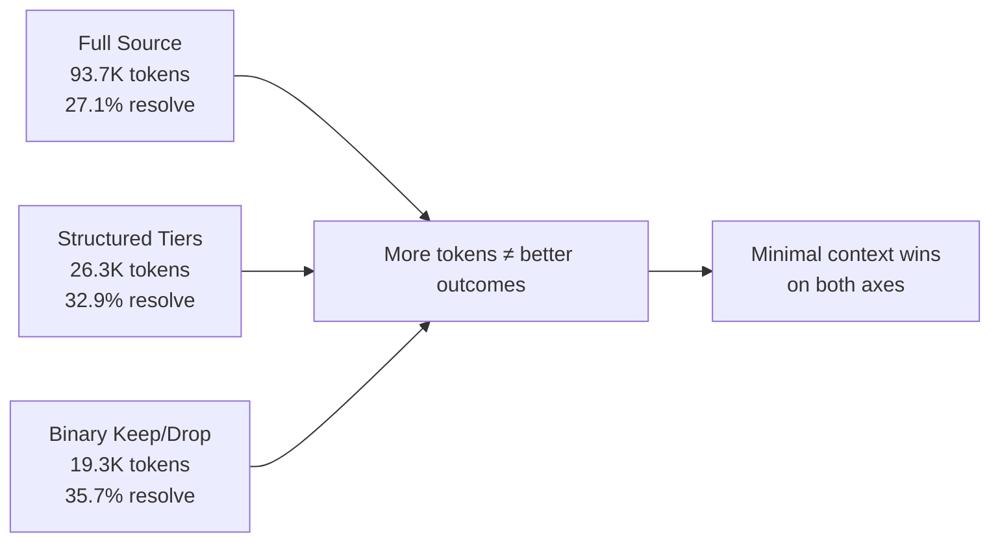
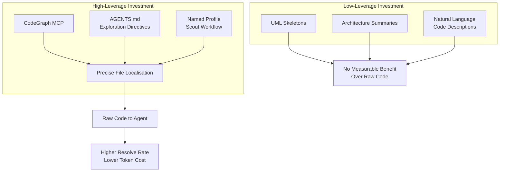

# What Context Does a Coding Agent Actually Need to Act? Why Less Beats More — and How to Configure Codex CLI Accordingly


---

The instinct when configuring a coding agent is to feed it everything: full source files, surrounding modules, project-wide type hierarchies, architectural summaries. More context means better decisions, surely. A recent empirical study says otherwise — and the numbers are stark enough to reshape how you configure Codex CLI's context pipeline.

## The Paper: Isolating "Find" from "Act"

Brian Sam-Bodden's "What Context Does a Coding Agent Actually Need to Act?" (arXiv:2607.09691, June 2026) [^1] does something most coding-agent studies skip: it holds file localisation fixed with an oracle and varies only the *representation* of the code the agent receives. The question isn't "can the agent find the right files?" — that's the retrieval problem — but "given the right files, what does the agent actually need to see?"

The study uses SWE-bench Verified's 70 validated multi-file instances [^2], running Claude Sonnet 4.6 at temperature zero in a single-shot regime. Every gold edit was verified to remain expressible across all context arms, eliminating confounds from information loss.

## The Findings: Source Code Is the Signal

Three context arms were tested against actual issue resolution:

| Representation | Resolved | Rate | Tokens per resolve |
|---|---|---|---|
| Full source files | 19/70 | 27.1% | ~93,700 |
| Structured tiers (UML skeletons, signatures) | 23/70 | 32.9% | ~26,300 |
| Binary keep/drop | 25/70 | 35.7% | ~19,300 |

The pre-registered hypothesis that structured tiers would outperform binary keep/drop *failed* (exact McNemar p = 0.754) [^1]. The minimal representation — simply including or excluding code sections — matched or exceeded the full-file approach at roughly one-fifth the token cost.



## Natural Language Summaries Are Nearly Useless

The study's behavioural probe experiment drives the point home. Across 45 held-out test cases from three Python repositories, the researchers asked whether each context representation could answer behavioural questions about the code:

- **Full source code:** 60% accuracy (27/45)
- **Frontier-model summaries:** 8.9% (4/45)
- **3B-model summaries:** 8.9% (4/45)
- **Signature + docstring:** 13.3% (6/45)

The identical scores for frontier and small-model summaries reveal something important: the gap is a *representation class* problem, not a summariser quality problem [^1]. No amount of model capability rescues natural-language descriptions of code when the agent needs to reason about behaviour.

## The Temperature-Zero Noise Floor

A methodological finding worth internalising: temperature-zero API inference flipped approximately 9% of per-instance outcomes between byte-identical runs [^1]. This establishes a noise floor that should make you sceptical of any benchmark improvement below ~10% — and explains why many "context engineering" optimisations show inconsistent gains.

## What This Means for Codex CLI Configuration

The paper's findings map directly to several Codex CLI configuration decisions that most teams get wrong.

### 1. `tool_output_token_limit` Is Your Most Important Context Lever

Codex CLI caps individual tool output at 16,000 tokens by default [^3]. The instinct is to raise this limit — "the model needs to see more of the file." The Sam-Bodden results suggest the opposite: you're better off keeping it tight or even lowering it for well-localised tasks.

```toml
# config.toml — profiles tuned by context insight

[profiles.surgical]
# For targeted fixes where localisation is confident
model = "gpt-5.6-terra"
tool_output_token_limit = 8000

[profiles.exploration]
# For discovery tasks where you genuinely need breadth
model = "gpt-5.6-sol"
tool_output_token_limit = 24000
```

The key distinction: separate your *exploration* profile (where broad context helps the agent *find* the right code) from your *surgical* profile (where the agent already knows what to edit and excess context is noise).

### 2. Compaction Strategy: Preserve Code, Discard Prose

Codex CLI's auto-compaction triggers at `model_auto_compact_limit` (default ~200K tokens, clamped to 90% of the context window) [^4]. When compaction fires, it summarises older conversation history. The Sam-Bodden findings suggest your `compact_prompt` should aggressively preserve raw code fragments while discarding natural-language discussion:

```toml
# Tuned compact_prompt for code-preserving compaction
compact_prompt = """Summarise this conversation for continuation.
CRITICAL: Preserve all code snippets, function signatures, and file paths verbatim.
Discard natural-language explanations of what the code does — the model can re-derive
those from the code itself. Keep error messages and stack traces verbatim."""
```

This inverts the common instinct of keeping the "explanation" and discarding the code.

### 3. AGENTS.md: Direct the Agent to Read Code, Not Describe It

Many AGENTS.md files instruct the agent to "summarise the codebase before making changes" or "describe the architecture first." The research shows this intermediate summarisation step actively harms downstream resolution — the model performs better working directly with source code than with its own summaries of that code.

```markdown
<!-- AGENTS.md — exploration directives informed by context research -->

## Exploration Rules
- Read source files directly with the Read tool. Do NOT generate
  natural-language summaries of code before editing.
- When investigating a bug, read the failing function's full body
  and its immediate callers. Skip architectural overviews.
- Prefer reading 3 targeted functions over skimming 1 entire file.
```

### 4. MCP and CodeGraph: Localisation Is the Real Bottleneck

The paper's oracle-localisation design highlights that the *find* step — identifying which files need editing — is where agents actually struggle. Once localisation is solved, context representation barely matters beyond "include the raw code."

This validates Codex CLI's investment in CodeGraph MCP for structural codebase indexing [^5]. The practical takeaway: spend your configuration effort on improving localisation (better MCP servers, richer codebase indexing, targeted `codex exec` search workflows) rather than on enriching the context representation of already-localised files.



### 5. Post-Compaction File Re-Read: Already Correct

After compaction, Codex CLI automatically re-reads up to five recently edited files (budgeted at 50,000 tokens) and injects a lead-in message [^4]. The Sam-Bodden results confirm this design choice is sound: re-injecting raw source code is precisely the high-value context type, whilst the summarised conversation history (which compaction produces from prose) is the low-value type the agent can afford to lose.

## The Counterargument: When Broad Context Matters

The study has acknowledged limitations. It uses a single-shot regime without execution feedback, covers Python only, and tests one model family [^1]. In iterative, multi-turn Codex CLI sessions with sandbox execution, broader context may help the agent recover from initial failures. The binary keep/drop arm also asymmetrically encodes gold-edit locations — the agent knows which sections matter because they're the ones included.

For practical Codex CLI usage, this means:

- **First-pass edits** (especially via `codex exec` one-shot pipelines): lean context wins.
- **Interactive debugging sessions** with execution feedback: broader context may justify its token cost.
- **Cross-language or multi-repository tasks**: the Python-only finding may not generalise.

## The Token Economics

At GPT-5.6's current pricing [^6], the difference between 93.7K context tokens per resolve and 19.3K is roughly a 4.8× cost reduction per successful edit. Across a team running hundreds of Codex CLI sessions daily, this compounds into meaningful infrastructure savings — without sacrificing (and possibly improving) resolution rates.

The deeper lesson: context engineering for coding agents is not about maximising information density. It's about matching context type to task phase. Localisation needs breadth. Editing needs the raw code itself, and nothing more.

## Citations

[^1]: Sam-Bodden, B. (2026). "What Context Does a Coding Agent Actually Need to Act?" arXiv:2607.09691. [https://arxiv.org/abs/2607.09691](https://arxiv.org/abs/2607.09691)

[^2]: Jimenez, C.E. et al. (2024). "SWE-bench: Can Language Models Resolve Real-World GitHub Issues?" ICLR 2024. [https://www.swebench.com/](https://www.swebench.com/)

[^3]: OpenAI. (2026). "Codex CLI Configuration Reference — tool_output_token_limit." [https://developers.openai.com/codex/configuration](https://developers.openai.com/codex/configuration)

[^4]: Vaughan, D. (2026). "Codex CLI Context Compaction: Architecture, Configuration, and Managing Long Sessions." [https://codex.danielvaughan.com/2026/03/31/codex-cli-context-compaction-architecture/](https://codex.danielvaughan.com/2026/03/31/codex-cli-context-compaction-architecture/)

[^5]: OpenAI. (2026). "Codex CLI MCP Integration — CodeGraph Codebase Indexing." [https://developers.openai.com/codex/mcp](https://developers.openai.com/codex/mcp)

[^6]: OpenAI. (2026). "GPT-5.6 Pricing." [https://openai.com/api/pricing/](https://openai.com/api/pricing/)
